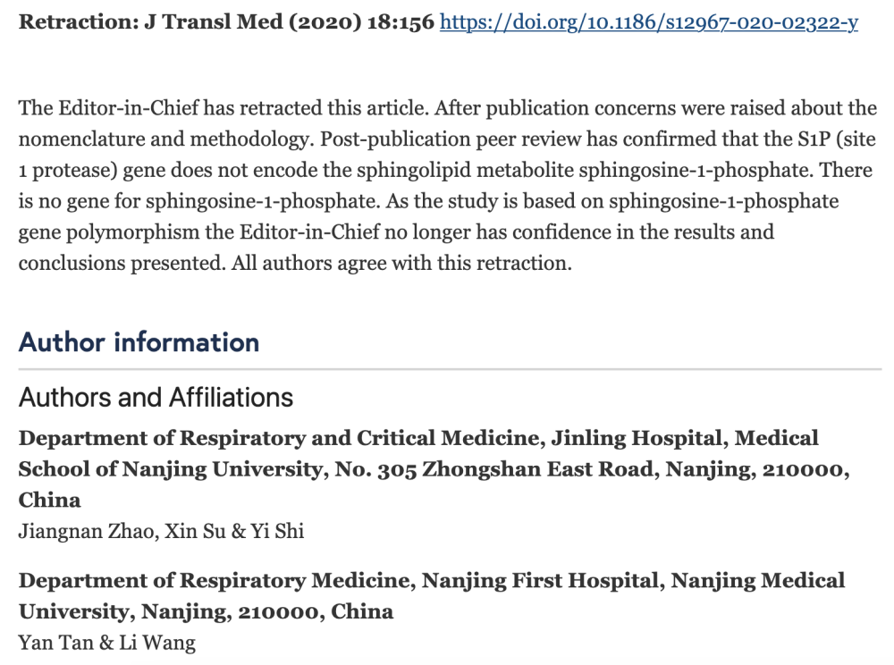
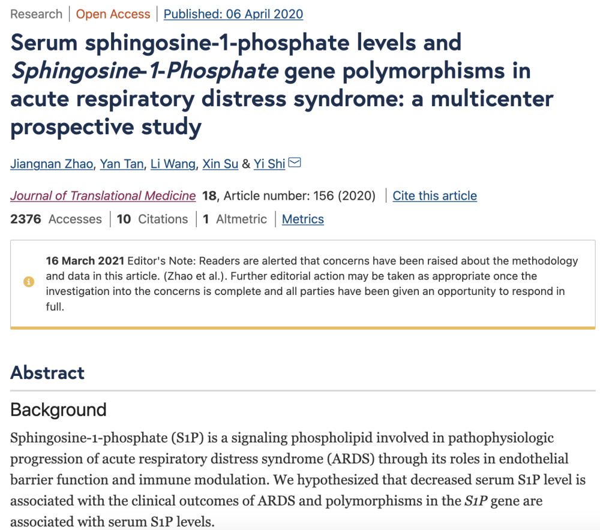

# 南京大学医学院一论文被撤回：研究了一个“不存在”的基因

2022年12月21日，国际学术期刊《转化医学期刊》（Journal of Translational
Medicine）在线发表撤稿说明称，撤回一篇论文，因为涉事论文中研究的基因不存在。

涉事论文的通讯作者是南京大学医学院附属金陵医院呼吸与危重症医学科的Yi Shi。

一个不存在的基因，在人群中还存在基因多态性？

但目前尚不清楚，是否是因为研究人员对基因的命名问题引发了误解并导致撤稿。

涉事论文称，论文中的研究得到了 “编号81470206”国家自然科学基金和“编号81670073”国家自然科学基金的支持。

_《转化医学期刊》2022年12月21日在线发表的撤稿说明。_

该论文的署名作者有Jiangnan Zhao、Yan Tan、Li Wang、Xin Su和Yi Shi。其中，Yan Tan、Li
Wang的署名单位是南京市第一医院（南京医科大学附属南京医院）呼吸内科（Department of Respiratory
Medicine），Jiangnan Zhao、Xin Su和Yi Shi的署名单位是南京大学医学院附属金陵医院呼吸与危重症医学科。

涉事论文的标题是《急性呼吸窘迫综合征患者的血清1-磷酸鞘氨醇水平和 1-磷酸鞘氨醇基因多态性：一项多中心前瞻性研究》（Serum
sphingosine-1-phosphate levels and Sphingosine-1-Phosphate gene polymorphisms
in acute respiratory distress syndrome: a multicenter prospective
study），于2020年4月6日在线发表。

涉事论文称，假设血清S1P（1-磷酸鞘氨醇，或鞘氨醇-1-磷酸，Sphingosine-1-phosphate）水平降低与ARDS（急性呼吸窘迫综合征）的临床结果相关，并且S1P基因的多态性与血清S1P水平相关。该研究共招募了121名ARDS患者和100名健康人。研究结论称，ARDS患者的血清S1P水平显著降低。
S1P水平降低与较差的临床结果相关。S1P rs3743631、rs907045基因多态性与ARDS易感性之间存在显着关联。

《转化医学期刊》的撤稿说明称，“不存在1-磷酸鞘氨醇（S1P）基因。”

实际上，S1P是细胞的一种代谢产物。

哈尔滨医科大学附属第一医院风湿免疫科张志毅等人2018年在《中华内科学》发表的论文称，S1P是神经鞘磷脂的一种生物活性代谢物。神经鞘磷脂是细胞膜上主要的神经鞘脂类，能被神经磷脂酶催化生成神经酰胺，神经酰胺很快被催化水解生成鞘氨醇，后者再在鞘氨醇激酶作用下磷酸化，产生1-磷酸鞘氨醇（S1P）。作为一种代谢物，S1P既可在细胞内作为第二信使激活下游信号通路，影响细胞代谢和功能，也可通过三磷酸腺苷结合盒转运蛋白超家族和Spns2转运体转运至细胞外与其受体结合。

_撤稿说明称，不存在1-磷酸鞘氨醇（S1P）基因。_

撤稿说明称，《转化医学期刊》的主编已撤回这篇文章。 涉事论文发表后，人们对文中的命名和方法提出了担忧。发表后同行评审已确认，S1P（位点1蛋白酶，site
1
protease）基因不编码鞘脂代谢物1-磷酸鞘氨醇。不存在1-磷酸鞘氨醇基因。但涉事论文的研究基于1-磷酸鞘氨醇基因多态性，因此，主编对该论文提供的结果和结论不再有信心。涉事论文的所有署名作者都同意这一撤回。

_该论文称，相关研究得到了
“编号81470206”国家自然科学基金和“编号81670073”国家自然科学基金的支持。_

面向医生的综合互联网平台梅斯医学和数据科技公司青塔相关网站的检索结果均显示，“编号81470206”国家自然科学基金资助的项目是“肺内皮细胞S1PR1受体在流感病毒所致ARDS中的作用”，项目负责人是施毅，资助金额为75.0万元，2014年立项。

而“编号81670073”国家自然科学基金资助的项目是“HuR和miR-890竞争调控ARDS关键始动因子HMGB1表达的机制研究”，项目负责人是苏欣，资助金额为53.0万元，2016年立项。

