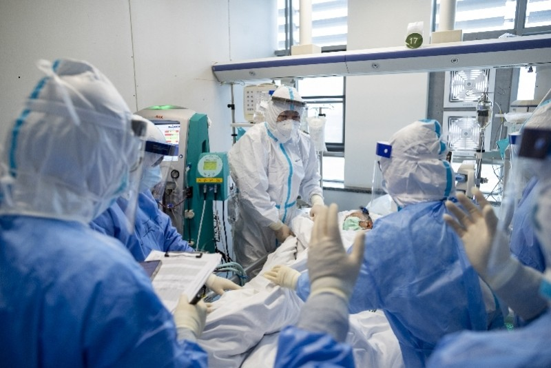

# 多地感染高峰将至，一线专家：各地应尽快披露重症患者数据

近日，海南省、江西省、安徽省、浙江省等多地疫情防控负责人透露：第一波疫情高峰将至，预测峰值在12月底到1月。12月22日，成都市卫健委副主任黄辉在发布会上表示，成都市疫情防控工作已进入新阶段，“保健康，防重症”成为防控工作的主要内容。

随着各地感染人数增加、医护感染率上升，更多专业人士呼吁要把重症的预防与救治摆在疫情防控首位。北京大学第一医院呼吸和危重症医学科主任王广发教授在接受“医学界”采访时指出，随着感染高峰的到来，重症高峰也将抵达。

对此，浙江大学医学院附属第二医院副院长、第十三届全国人大代表、全球首例COVID-19双肺移植主刀陈静瑜教授强调，目前最重要的是加强对新冠重症的救治，减少因重症导致的死亡。

如何实现这一目标？更多、更全面的数据亟待披露。面对这场持久战，陈静瑜呼吁要“改变我们的就医习惯”，通过分级诊疗、医护轮班等方式保护好医护，避免未来医疗资源更加紧张。

_12月15日，在中国医科大学附属盛京医院南湖院区发热门诊，值班医生在询问病情。12月以来，中国医科大学附属盛京医院南湖院区发热门诊每天收治包括孕产妇和急重症发热患者200余名。未来一段时间，到院新冠患者数量仍会在高位运行，盛京医院采取合并医疗单元，集中其他科室医护人员支援急诊、发热门诊、阳性病房等措施，确保急重症患者得到及时救治。
新华社发_

**一线专家陈静瑜**

**要保护好医务人员，“带病坚持工作”将引发一系列问题**

在此前的国务院联防联控机制发布会上，国家卫健委医疗应急司司长郭燕红曾提出：一旦医护人员感染新冠病毒，也应当遵循“新十条”要求，按情况选择居家或集中隔离。尽管如此，随着各地感染人数迅速增加，医疗机构面临巨大压力，不少医院发文倡导医护“轻伤不下火线”、“带病坚持”。

12月13日，河南某县医院医生在接受健康界锋报采访时说，医院要求医护感染后不严重或初愈就要上班。12月17日，湖北省麻城市妇幼保健院在公众号发文，倡议医务人员有发热症状的原则上休息3天，建议最长不超过5天。同时不建议症状严重的人员带病上岗。12月18日，重庆市潼南区人民医院发布《倡议书》，提倡全体潼医人“轻伤不下火线，带头在症状好转后及时返岗”。

除上述几家医院外，还有不少医疗机构的医务工作者被建议症状轻微即返岗，也有很多医务人员主动带病工作，以应对感染人数陡增带来的挑战。

对此，陈静瑜近日在接受媒体采访时表达了担忧。他说：“都号召医生没有体温了（不发烧），就应该去上班，这不太妥当。”

新冠病毒可能造成“炎症风暴”。相关研究表明，新冠病毒对心肌、肝肾功能、胃肠道等都可能带来损伤，对免疫系统也会造成损伤。陈静瑜认为，新冠感染“不是一个普通的感冒”，加上医院环境复杂，存在较高的细菌、病毒交叉感染风险，让医护人员刚退烧就返岗将引发一系列问题。

对抗新冠病毒是一项持久、长期的工作。陈静瑜表达了担忧：“如果很多医护人员在一场疫情后倒下去，社会医疗资源将会更紧张。”

如何在保护医护的同时，满足感染高峰到来时的医疗需求？陈静瑜认为，分级诊疗、关注重症预防救治是关键。

在他看来，目前最重要的是加强对新冠重症的救治，减少因重症导致的死亡。

近日，广州、山东等地采取将核酸采样点转变为“发热哨点诊室”，北京把体育馆改造为发热门诊，无症状、轻症患者能够分流至此进行问诊、开药。陈静瑜呼吁广泛推行类似举措，他认为要大力发展网络医院、社区医院等，通过分级诊疗纾解压力。

与此同时，陈静瑜也建议普通人“改变就医习惯”，无症状、轻症感染者不去医院。一方面能够让有限的医疗资源集中在重症患者的救治上，另一方面也能减少患者交叉感染的可能性。

如何判断自己是轻症还是重症？在实践中，北京天坛医院等医疗机构将血氧值作为判断患者病情轻重的指标之一。天坛医院急诊划分血氧低于80%为一级，低于90%为二级。一级患者立即进入抢救室，二级患者在十分钟之内完成看诊。陈静瑜也建议，普通人可以通过监测血氧来判断自己是否需要就医。感染后，患者可以使用指夹血氧仪自行监测血氧，如果血氧低于90%需要及时就医。

_在华中科技大学同济医学院附属同济医院中法新城院区ICU病房，医疗团队查看一名新冠肺炎危重症患者情况。新华社资料图_

**哪些数据亟待披露？**

**重症率、死亡情况、ECMO使用情况等重症患者数据亟待披露**

据国家卫健委官网最新消息，12月25日起，国家卫健委不再发布每日疫情信息，将由中国疾控中心发布相关疫情信息，供参考和研究使用。不少网友对此表示认可，期待看到中疾控发布的更多真实、有效的数据。

新冠大流行以来，疫情相关数据在各个层面上都受到了不同角度的解读和关注。当下的疫情防控以及患者救治，都需要真实、有效、可靠、丰富的数据。

哪些数据亟待披露？

陈静瑜认为，应加强对住院患者特别是重症患者相关数据的统计力度，并及时对外界披露。“把重症病人的数据统计起来，这个数据对我们抗击新冠才是有真正意义的。”陈静瑜说。

“我是非常希望国家和各地能公布很多数据，”陈静瑜在接受采访时谈到，比如北京等感染率较高的地区，应当尽快总结并向全社会告知重症率、呼吸机使用情况、ECMO使用情况、患者死亡情况、并发症导致的死亡等相关数据，供其他城市借鉴，及时采取有效措施。

据南都此前报道，多国卫生行政部门官网都公布了ICU床位使用率、药物供应情况等数据，让公众及时了解医疗资源使用情况。

例如，日本厚生劳动省官网有一专题页面呈现各地医疗资源供应情况，包括就医人数、住院人数、重症人数、所有病房及ICU的床位数量及其使用率。澳大利亚则公布一组名为“新冠病毒对医院的冲击”的数据。其指标包括，每周住院患者变化值（率），每周ICU患者数量及变化率，住院患者中使用有创通气的数量和比例等。多组数据还会更新到州一级，便于查询。（详见：追踪新冠动向：非必要不核酸后，哪些防疫数据披露尤为关键？）

南都记者关注到，近期多位专家在接受采访时也都谈到，监测数据与实际情况间可能存在滞后性，应加强数据监测，追踪疫情态势。

德国埃森大学病毒所教授陆蒙吉接受澎湃新闻采访时谈到，新冠疫情的特殊性在于，从感染到发生重症、死亡有时间差，在医院一侧监控重症和死亡数据可能是滞后的，通常当这个数值很大时，重症和死亡波会在两周内直线上升。华中科技大学同济医学院附属同济医院感染科副主任医师郭威在接受中国新闻周刊采访时也强调，对病毒性肺炎的监测直接关系到今后医院需要多少重症资源，因为肺部感染后可能造成呼吸衰竭，这也是一个提前预判重症高峰、死亡高峰的重要信号，“而不是等到病人都进了ICU，再去看需要多少张ICU床位，这时候肯定来不及。”

采写：见习记者 赵霖萱 记者 宋承翰 发自北京

