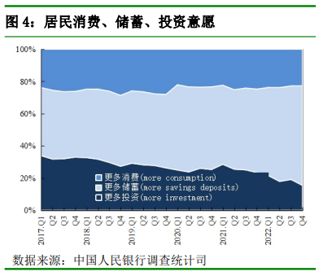
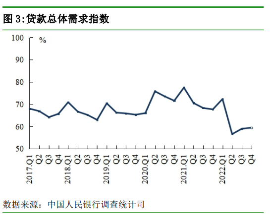

# 央行最新调查：预期物价上涨的人在变多，只有14％的人预期房价上涨

中国基金报记者 南深

2022年12月27日，中国人民银行调查统计司发布了“2022年第四季度城镇储户问卷调查报告”“2022年第四季度企业家问卷调查报告”和“2022年第四季度银行家问卷调查报告”。

调查显示，本季居民收入信心指数为44.4%，比上季下降2.1个百分点；倾向于“更多储蓄”的居民占61.8％，比上季增加3.7个百分点；对下季房价，只有14％的居民预期“上涨”。

此外，53.7%的企业家认为宏观经济“偏冷”，45.5%认为“正常”，0.8%认为“偏热”。有38％的银行家认为货币政策“宽松”，比上季减少7.9个百分点，60％的银行家认为货币政策“适度”，比上季增加7个百分点。

**仅14.7%居民偏爱股票投资**

**未来三个月医疗保健支出排第一**

根据央行上述城镇储户问卷调查报告，本季收入感受指数为43.8％，比上季下降3.2个百分点。其中，10.8％的居民认为收入“增加”，比上季减少1.3个百分点，65.9％的居民认为收入“基本不变”，比上季减少3.8个百分点，23.3％的居民认为收入“减少”，比上季增加5.2个百分点。收入信心指数为44.4％，比上季下降2.1个百分点。

本季就业感受指数为33.1％，比上季下降2.3个百分点。其中，8.9％的居民认为“形势较好，就业容易”，42.0％的居民认为“一般”，49.1％的居民认为“形势严峻，就业难”或“看不准”。就业预期指数为43.0％，比上季下降2.4个百分点。

对下季度物价预期指数为62.8％，比上季上升1.8个百分点。其中，31.2％的居民预期下季物价将“上升”，48.1％的居民预期“基本不变”，8.7％的居民预期“下降”，12.1％的居民“看不准”。对下季房价，14％的居民预期“上涨”，53.7％的居民预期“基本不变”，18.5％的居民预期“下降”，13.8％的居民“看不准”。

消费、储蓄和投资意愿方面，倾向于“更多消费”的居民占22.8％，与上季基本持平；倾向于“更多储蓄”的居民占61.8％，比上季增加3.7个百分点；倾向于“更多投资”的居民占15.5％，比上季减少3.7个百分点。居民偏爱的前三位投资方式依次为：“银行、证券、保险公司理财产品”“基金信托产品”和“股票”，选择这三种投资方式的居民占比分别为44.1％、20.4％和14.7％。

问及未来三个月准备增加支出的项目时，居民选择比例由高到低排序为：医疗保健
（29.6％）、教育（27.9％）、社交文化和娱乐（18.5％）、大额商品（18.5％）、购房（16.0％）、保险（15.0％）、旅游（13.3％）。

城镇储户问卷调查是中国人民银行1999年起建立的一项季度调查制度。每季在全50个（大、中、小）调查城市、400个银行网点各随机抽取50名储户，全国共20000名储户作为调查对象。调查内容包括储户对经济运行的总体判断、储蓄及负债情况、消费情况、储户基本情况等四个方面。

**53.7%的企业家认为宏观经济“偏冷”**

**60％的银行家认为货币政策“适度”**

2022年第四季度中国人民银行企业家问卷调查结果显示，企业家宏观经济热度指数为23.5%，比上季下降3.4个百分点，比上年同期下降13.7个百分点。其中，53.7%的企业家认为宏观经济“偏冷”，45.5%认为“正常”，0.8%认为“偏热”。

经营景气指数为46.6%，比上季下降1.5个百分点，比上年同期下降10.2个百分点。其中，14.8%的企业家认为本季企业经营状况“较好”，63.7%认为“一般”，21.6%认为“较差”。盈利指数为50%，与上季持平，比上年同期下降7.3个百分点。其中，30.0%的企业家认为比上季“增盈或减亏”，40%认为“盈亏不变”，29.9%认为“增亏或减盈”。

企业家问卷调查是中国人民银行1992年起建立的一项季度调查。调查对象为全国范围内（除西藏外）的5000多户工业企业，调查内容主要包括企业总体生产状况、生产要素状况、市场需求状况、资金状况、成本效益状况、投资状况和其他等七个方面。

2022年第四季度银行家问卷调查报告显示，银行家宏观经济热度指数为17.4％，比上季下降2.5个百分点。其中，有33.2％的银行家认为当前宏观经济“正常”，比上季减少4.2个百分点；有66％的银行家认为“偏冷”，比上季增加4.6个百分点。对下季度，银行家宏观经济热度预期指数为29.3％，高于本季11.9个百分点。

贷款总体需求指数为59.5％，比上季上升0.5个百分点，比上年同期下降8.2个百分点。分行业看，制造业贷款需求指数为62.2％，比上季上升1.6个百分点；基础设施贷款需求指数为60.6％，比上季下降0.7个百分点；批发零售业贷款需求指数为57.1％，比上季上升0.8个百分点；房地产企业贷款需求指数为43.7％，比上季上升3.1个百分点。

货币政策感受指数为68％，比上季下降4.4个百分点，比上年同期上升13.9个百分点。其中，有38％的银行家认为货币政策“宽松”，比上季减少7.9个百分点；60％的银行家认为货币政策“适度”，比上季增加7个百分点。对下季，货币政策感受预期指数为69.6％，高于本季1.6个百分点。

银行家问卷调查是中国人民银行2004年建立的一项季度调查。调查采用全面调查与抽样调查相结合的方式，对我国境内地市级以上的各类银行机构采取全面调查，对农村信用合作社采用分层PPS抽样调查，全国共调查各类银行机构3200家左右。调查对象为全国各类银行机构（含外资商业银行机构）的总部负责人，及其一级分支机构、二级分支机构的行长或主管信贷业务的副行长。

编辑：小茉

