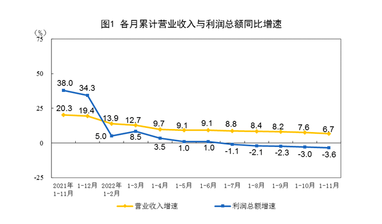

# 工业利润降幅扩大，统计局：两家疫苗重点企业利润同比大减

受疫情反弹和需求不足等因素影响，11月工业生产有所放缓，企业经营压力加大，但利润结构持续改善。

国家统计局12月27日发布的数据显示，1-11月份全国规模以上工业企业营业收入同比增长6.7%，企业销售总体保持稳定增长。工业企业利润同比下降3.6%，降幅较1-10月份扩大0.6个百分点。

国家统计局工业司高级统计师朱虹表示，个别行业及少数重点企业对工业企业利润下拉影响较大。其中，钢铁、石油加工行业利润同比降幅较大，两家疫苗重点企业由于利润同期基数较高，利润同比大幅减少。剔除上述行业及企业，其他规上工业企业利润同比增长6.6%。

随着成本压力有所缓解，装备制造业盈利增速加快。数据显示，1-11月份，装备制造业利润同比增长3.3%，增速较1-10月份加快0.1个百分点；装备制造业利润占规上工业的比重为33.1%，较1-10月份、上半年分别提高0.9和5.5个百分点，工业企业利润行业结构持续改善。

此外，各方面持续加大民生保障力度，强化重点产品生产供应，基本消费品行业利润保持增长态势。1-11月份，酒饮料茶行业利润同比增长21.5%，保持较高增速；烟草、食品制造、文教工美、皮革制鞋行业利润分别增长5.9%-8.6%。

资产负债方面，11月末，规模以上工业企业资产总计156.07万亿元，同比增长8.6%；负债合计88.78万亿元，增长9.0%；所有者权益合计67.28万亿元，增长8.0%；资产负债率为56.9%，同比上升0.2个百分点。

财信研究院副院长伍超明表示，资产增速低于负债，导致资产负债率同比提高。这反映出面对当前的经营困难和对未来经济前景的担忧，企业不愿投资、不敢投资，主动加杠杆意愿仍不强，进而出现资产增速低于负债增速，被动式推高资产负债率的现象。

11月末，产成品存货6.19万亿元，增长11.4%，比上月下降1.2个百分点，连续7个月回落。产成品存货周转天数为18.2天，同比增加1.0天。

伍超明分析，国内需求恢复偏慢、出口增速由正转负和企业利润率维持低位，共同导致企业补库意愿不足。当前工业企业库存增速仍处于历史偏高位置，企业主动去库存需求依旧较强。去年同期基数大幅抬升，也是产成品库存增速加快回落的重要原因。

关于下阶段工业利润走势，伍超明认为，工业利润恢复面临较多挑战，预计下行压力犹存。稳地产和其他稳经济一揽子政策继续落地显效，对工业企业盈利恢复继续形成一定支撑。但随着世界经济衰退风险加剧和高基数效应犹存，预计全球大宗商品价格和国内PPI增速将继续回落，价格因素对工业利润的拖累仍大。工业企业新一轮去库存周期仍在途中，也会进一步加剧工业利润放缓压力。

朱虹强调，总体看，国内疫情反弹短期制约工业企业利润恢复，“三重压力”对工业经济影响仍然较大。下一步，要更好统筹疫情防控和经济社会发展，保障产业链供应链畅通，着力扩大内需，激发市场主体活力，为工业经济企稳回升创造更多有利条件。

