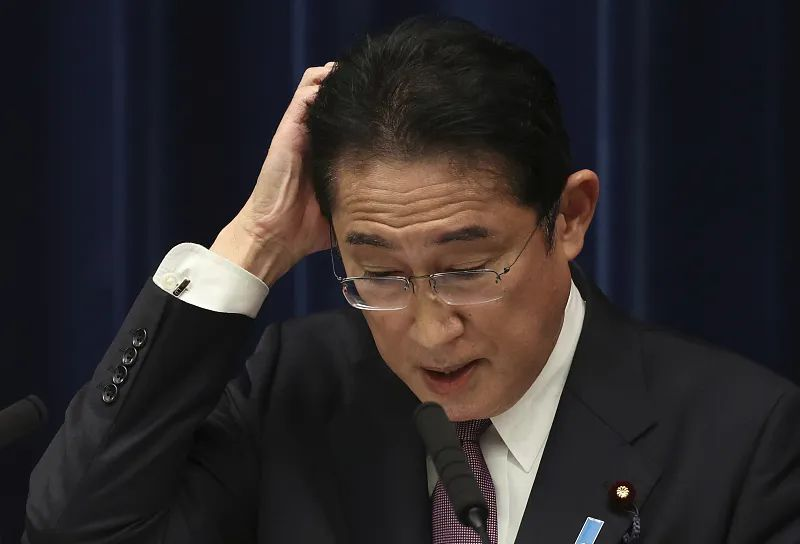
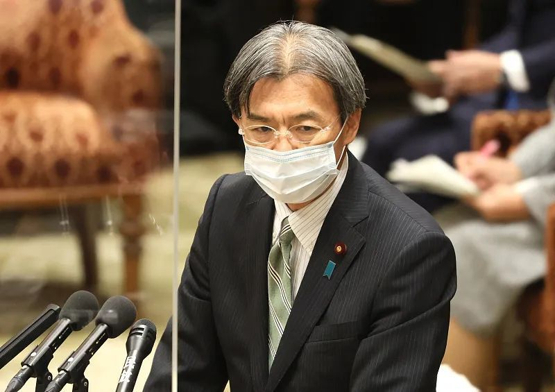

# 日本首相遭遇罕见事态：4名内阁大臣因丑闻缠身接连去职

多家日媒26日透露，日本首相岸田文雄基本决定撤换深陷丑闻的复兴大臣秋叶贤也，他也将成为两个月来岸田撤换的第4名内阁大臣。

报道称，秋叶将于27日离任，继任者或为前金融担当大臣伊藤达也。共同社指出，4名内阁大臣接连去职，是十分罕见的事态，在野党将追究岸田的任命责任。

26日，当被问及是否会撤换秋叶贤也时，岸田文雄并未否认，他说，“必须为明年的例行国会做充分准备。我只能说这些。”

_岸田文雄资料图。图源：视觉中国_

近来，岸田内阁支持率告急，跌至30%以下，滑向“危险水域”。更有日媒以“首相的超低空飞行”来形容岸田内阁的“摇摇欲坠”之势。而岸田本人也被曝政治资金收支报告中有近百张“空白发票”的问题。

长安街知事此前介绍过，10月至11月，不到一个月的时间里，岸田内阁已有3名大臣因丑闻缠身陆续辞职，分别是日本前总务大臣寺田稔、前经济再生担当大臣山际大志郎和前法务大臣叶梨康弘。

寺田稔被曝收取不当政治献金、伪造文书、偷逃税款，山际大志郎与“统一教”关系密切，他还曾与文鲜明的遗孀、“统一教”现负责人韩鹤子合影。

叶梨康弘则是因“说错话”引咎辞职。他在11月9日的一场日本国会议员聚会上说，“（法务大臣）就是在死刑（命令）上盖章，能上新闻头条也只有这种时候，是个不显眼的职位。”

叶梨还称，“法务省和外务省的共同点是与选票和钱无缘。当了法务大臣也筹不到钱和选票。”

值得注意的是，寺田稔与叶梨康弘均隶属自民党内的岸田派，与岸田文雄关系密切。

11月20日晚，岸田文雄在记者会上道歉，称其对内阁大臣陆续辞职深表歉意，已深刻认识到自己在阁员任命上的责任。

此番将被撤换的复兴大臣秋叶贤也，也被曝存在多项问题，涉及政治资金运用、竞选活动违规等。现年60岁的他曾在安倍内阁担任首相助理，今年8月的内阁改组中首次成为阁僚。

_秋叶贤也资料图。图源：视觉中国_

以秋叶的竞选活动费用收支报告为来源，日媒指出，2021年10月众议院选举胜选后，秋叶曾向公设秘书发放大约20万日元（约合人民币1.05万元）报酬，涉嫌违反《公职选举法》。

另据共同社等报道，秋叶也与“统一教”存在关联。由他担任负责人的一个自民党支部曾向“统一教”相关团体支出两笔共计大约5万日元（约合人民币2574元）的费用。

此外，与秋叶相关的政治团体还曾在2021年以“事务所房租”为由，向秋叶的妻子和母亲支付约1400万日元（约合人民币74万元）。

12月25日，日本复兴厅取消了秋叶原定视察福岛的行程。立宪民主党党首泉健太借机发难：“秋叶大臣应该立即辞职。本来他也计划来福岛县视察，但却取消了，复兴行政工作出现阻滞……岸田首相应尽快做出决断。”

立宪民主党国会对策委员长安住淳向媒体表示，“首相自身的责任将被追究。”

有分析指出，岸田文雄当前面临内忧外患三大挑战，一是自民党内部的结构性问题，二是日本疫后经济复苏迟缓，第三则是外交与防卫政策贸然转向带来的隐患。

日本《每日新闻》18日发布的民调显示，岸田内阁的支持率为25%，创岸田就职以来新低，不支持率则高达69%，创下新高。

防卫费大增是岸田内阁支持率下降的主要原因。日本政府16日正式通过新版《国家安全保障战略》等3份安保政策文件，宣称日本应拥有“反击能力”，大幅强化防卫力量，突破诸多战后禁忌，

23日，日本政府在内阁会议上通过2023财年政府预算草案，防卫预算大幅增加，达6.8219万亿日元，是上一财年的1.26倍。2023至2027财年，日本防卫费总额将增至约43万亿日元。

防卫费大幅增加，钱从哪儿来？岸田文雄主张增税，并呼吁日本民众应将防卫费增加视为“自己的责任”，引发民众强烈反感。

在日元贬值、通胀高企的经济形势下，日本普通民众不愿为防卫费增额埋单。有日媒统计，防卫费翻倍将使每一个国民平均每年多负担4万多日元。民调显示，约66%的民众反对政府为此增税。

《朝日新闻》24日发表社论指出，日本政府未经细致调查研究、不顾自身财力强行推出强化防卫力预算，恐将导致无止境的军备竞赛。社论还指出，在不明确自卫队能否保持自主性的情况下，贸然加深日美一体化是危险的。

​​

