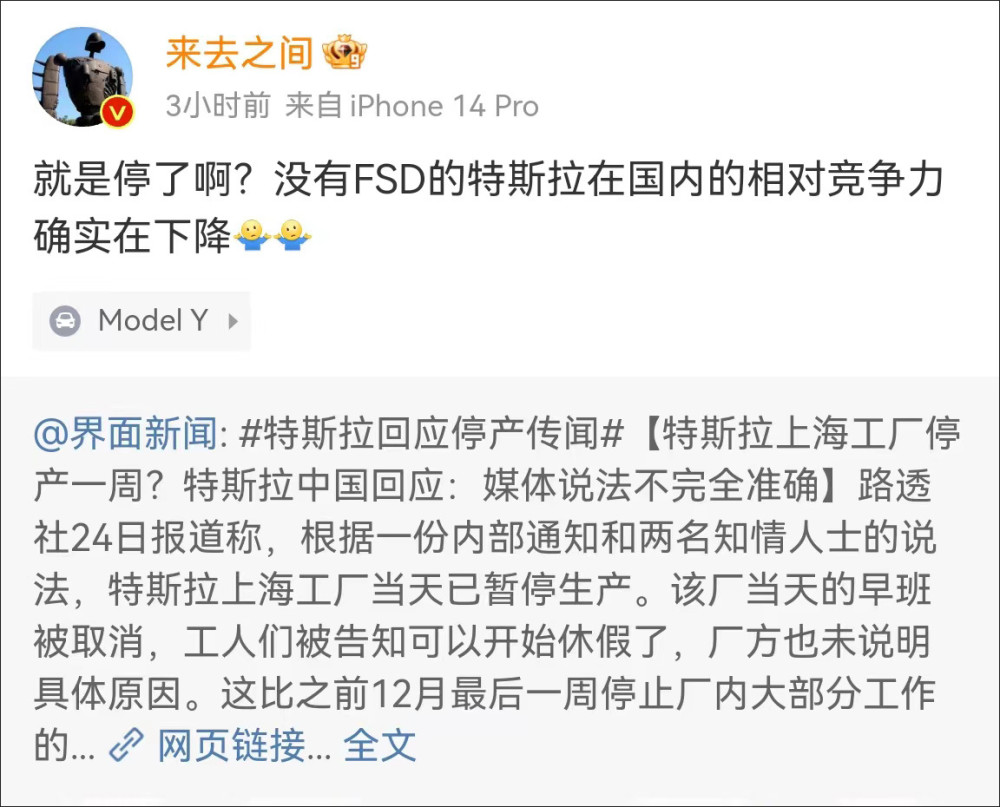
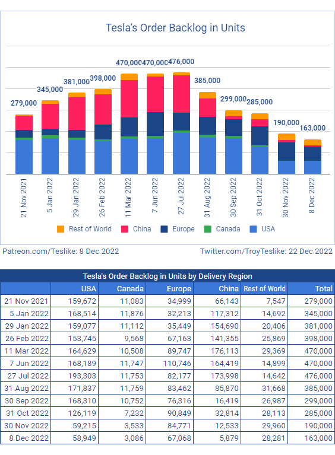
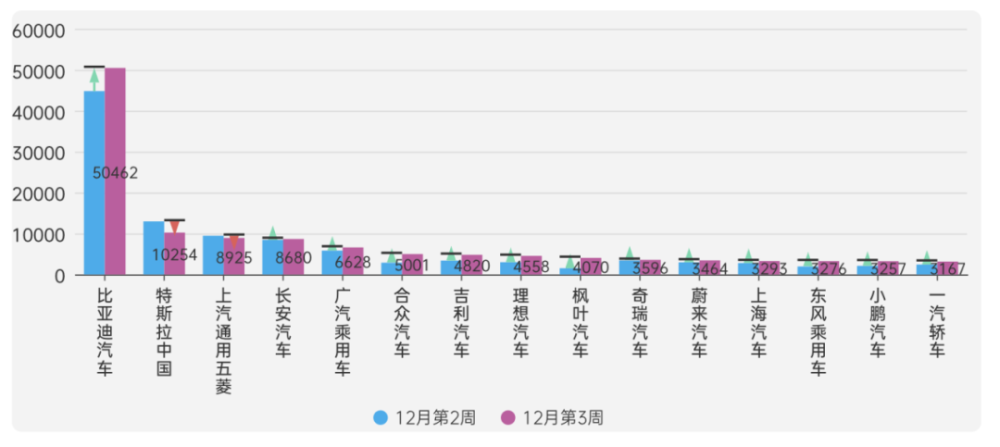
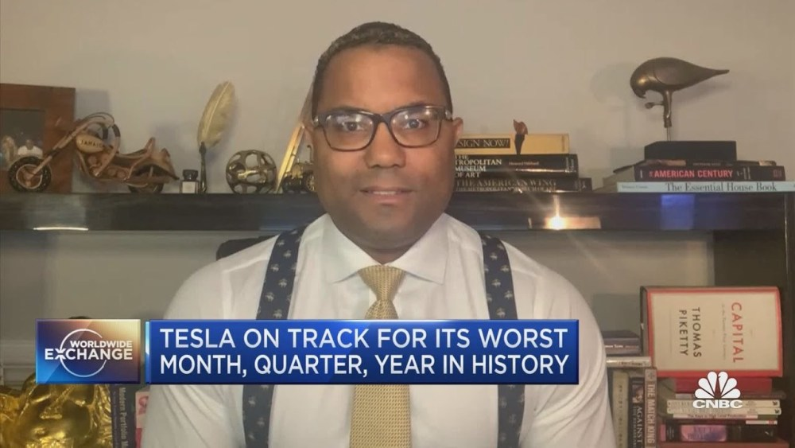
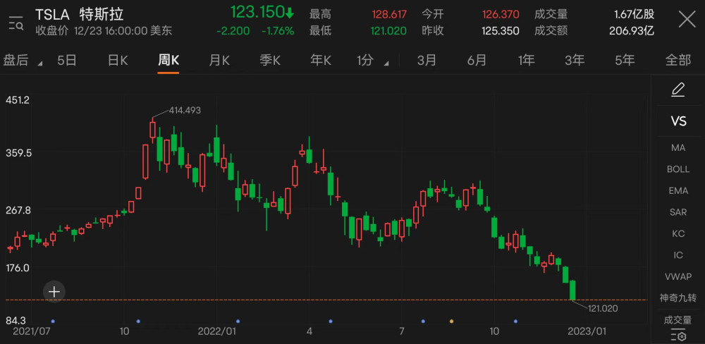

# 特斯拉否认停产一周，但无法否认订单断崖

（文/观察者网 周远方）

“充电桩等车间都未停线，媒体说的工厂停产也不完全准确。”特斯拉中国25日回应媒体。

路透社24日援引“一份内部通知和两名知情人士的说法”报道，特斯拉上海工厂当天已暂停生产。该厂当天的早班被取消，工人们被告知可以开始休假了，厂方也未说明具体原因。这比之前12月最后一周停止厂内大部分工作的计划稍微提前了一点。

路透社此前曾披露，特斯拉计划从本月25日起至明年1月1日暂停该厂Model Y车型的生产。

但特斯拉中国25日表示：“上海工厂2022年仍然保持了高效的生产和优秀产出。整车生产下周（即本周）按计划进行年度产线维保工作，同时工人经过一年的辛勤工作，因此在产线维保期间也进行人员休整。”

特斯拉是否停产的问题近来备受关注，不在于停产本身，而在于特斯拉在中国和全球市场持续的订单量下滑，以及在资本市场的股价持续下滑。

持续关注特斯拉的国外博主@TroyTeslike 22日发布了特斯拉最新的订单数据。

截至2022年12月22日，特斯拉在国内的积压订单仅剩5879辆，远低于7月份的17.4万辆；而特斯拉的全球订单目前也仅剩下16.3万辆，与7月份的47.6万辆相比减少近2/3。16.3万辆的数量对应大约38天的制造能力。在9月21日这一数字为78天，10月6日为70天。

如果这些数据准确的话，那么这意味着特斯拉目前的新车产能明显超过销量。这也解释了今年9月以来特斯拉的一系列降价举措。

12月2日和7日，特斯拉两次释放有关保险补贴的福利，让今年完成交付的产品便宜了近1万元，如果折算到目前的车型价格中，model3标准续航版本最低价格仅25.59万元。9月份以来，特斯拉就开始通过汽车保险的优惠进行变相暗中降价促销，降价幅度达8000元，10月份更是对Model
Y和Model 3的各个版本都进行了官方降价，降价区间在1.4万元至3.7万元之间，加上本轮降价，已完成价格四连降。

如此大的降价力度，却没有令特斯拉的销量产生明显起色。最新数据显示，12月的第三周，特斯拉中国销量为10254辆，较上周继续萎缩，与前几周相比也显得后继乏力。

近期的颓势使知名特斯拉空头、前雷曼高管戈登·约翰逊（Gordon
Johnson）得到了最新的论据支撑，财富网站（Fortune.com）23日报道了他的最新评论。

前雷曼高管戈登·约翰逊接受CNBC采访

约翰逊认为，特斯拉明年股价将下跌超过80%，目标价位在美股23美元左右。今年以来，特斯拉股价已经跌去67%。

“特斯拉的增长故事，包括机器人技术、电池储能系统、电动半挂卡车和其他收入来源，纯粹是对其业务基本面的干扰，”约翰逊表示，“这是一家汽车公司，95%的营收来自汽车销售，5%的营收来自亏损的能源部门，他们只是一家汽车公司，而且已经建立了太多无法销售的产能。”

“特斯拉目前的估值超过了紧随其后的全球三大汽车制造商的总和，尽管该公司2021年销量仅占这些汽车制造商销量的
5%，”约翰逊指出，“为了维持市场的高估值，特斯拉必须证明它正在快速、可持续地增长，但伴随着今年四季度特斯拉在中国、美国和欧洲市场的降价，需求已经成为一个重要问题。”

约翰逊同时认为，特斯拉已经失去了技术优势，尽管它多年来一直是美国电动汽车的领导者，但“现在有很多其他汽车企业具有相同或更好的实际续航里程、更好的内饰、更快的充电……所以必须考虑竞争问题。”

特斯拉股价走势（周K线）

面对市场质疑，马斯克近期并未正面回应，但他在22日公开承诺，两年内不再出售特斯拉股票。

路透社22日报道，在推特空间（Twitter Spaces）的音频聊天中，马斯克预计全球经济在2023年陷入“严重衰退”，对大件商品的需求将会下降。

上周，马斯克再次披露卖出了36亿美元的股票，自去年年底以来，他的套现金额接近400亿美元，特斯拉的股价随之跌至两年多来的低点。

“我需要卖出一些股票来确保应对最坏的情况，”马斯克在节目中表示。

“我认为将会出现一些宏观经济问题，比人们目前认为的更严重，”他说，房屋和汽车销售将受到经济状况的“不成比例的影响”。

他表示，特斯拉董事会对股票回购持开放态度，但这将取决于经济衰退的规模。

**本文系观察者网独家稿件，未经授权，不得转载。**

