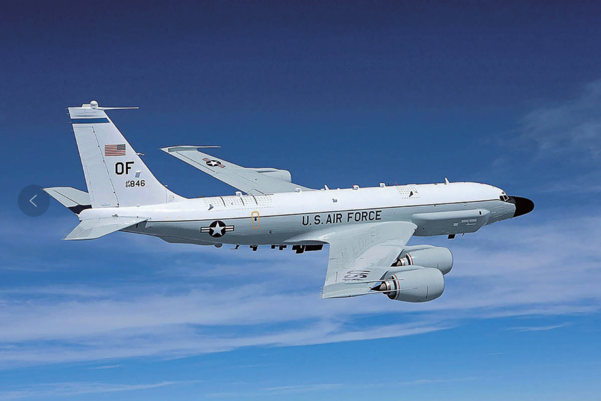

# 警惕！美军机今年赴南海侦察近600架次，专家：中国光“防”还不够

【环球时报特约记者 张杰 环球时报报道
记者胡雨薇】香港《南华早报》网站25日根据南海战略态势感知平台（SCSPI）的数据报道称，2022年1月到11月，美国大型侦察机赴南海侦察近600架次。中国军事专家认为，这一数字虽然比2021年的统计数字有所降低，但美军仍是南海最大的不稳定因素。中国要防好，更要作好更多飞出去的准备。

**7** **月动作最密集**

《南华早报》网站报道称，南海战略态势感知的数据显示，美国从1月至11月派出589架次大型军机，在南海上空进行近距离情报收集。12月的飞行数据尚未公布，美国去年12月派出47架次大型侦察机在南海地区巡逻。报道称，最新的侦察飞行发生在今年12月21日，3架P-8A反潜巡逻机、1架E-3G预警机以及1架RC-135V侦察机分别从日本嘉手纳空军基地和菲律宾克拉克空军基地起飞，在台海和南海地区进行频繁的侦察活动。

《南华早报》称，上述评估是基于ADS-B系统的商业数据，可能只能揭示美国军机侦察活动的一小部分，因为并非所有飞机都打开了ADS-
B转发器，较小的飞机也不包括在统计中。此外，除美国外，澳大利亚还于5月派出军机在西沙群岛周边空域进行侦察飞行。

《环球时报》记者查看南海战略态势感知平台社交媒体账号发布的信息发现，今年美军在南海公开活动次数最多的是7月。2022年7月，美军累计出动67架次大型侦察机前往南海对中国进行抵近侦察，其中部分架次是为配合美军导弹驱逐舰和航母打击群在南海的活动。其次是3月，派出61架次大型飞机进行侦察。最少的月份是9月，为28架次，其余月份在40到60架次之间。

根据南海战略态势感知今年3月发布的一份报告，2021年美国大型侦察机在南海上空进行大约1200次近距离间谍飞行。从这个数字来看，今年频次降低。

中国军事专家张学峰25日对《环球时报》记者表示，这可能和俄乌冲突有关，美国把大量侦察力量派往欧洲，在东欧、黑海上空执行侦察任务，在亚太的侦察频次有所降低。另外，不排除在南海有更多侦察行动由防务承包商的飞机执行的可能性。南海战略态势感知统计的机型主要集中在美军方的RC-135系列、EP-3E、RQ-4、P-8A和E-3等大型平台，而防务承包商通常使用较小型的侦察机。

**美军在南海侦察什么**

张学峰表示，美军大型侦察机在南海的行动主要围绕四大任务。第一个是海上巡逻，主要用于侦察潜艇和水面舰艇，特别是他国潜艇的行动。美军认为，南海是中国核潜艇的重要活动区域，所以十分重视在南海的反潜侦察行动，其中的主力机型是P-8A反潜巡逻机。该机平时主要通过机载搜索雷达对海面进行搜索，发现潜艇潜望镜、通气管之后，可以快速飞抵潜艇航行区域，然后通过光电传感器进一步侦察，并视情投放主、被动声呐。如果P-8A对南海正常训练的他国潜艇投放声呐浮标，那么将是严重的挑衅行为，也是违反国际公约的行动。

第二个任务是进行电子侦察。主要是通过RC-135系列和EP-3系列电子侦察机执行，包括通信信号情报侦察和雷达信号侦察。这种侦察对于破译对方通信，掌握对方雷达情报网的部署、特征具有重要意义，“美军战时进行电子干扰，就要依赖于平时大量侦察的数据积累”。

第三个任务是对南海岛礁上的设施进行光学和雷达成像侦察。P-8A反潜机、“全球鹰”无人机都具备这样的能力。执行这类任务时，上述飞机无须直接飞越岛礁上空，通过侧视合成孔径雷达和侧视侦察相机，可获得高分辨率图像。这种侦察，相对于卫星侦察更为灵活，精度也更高。

第四个任务是对南海上空军机活动进行侦察，主要依靠E-3预警机和E-2预警机，用于评估他国战斗机起飞架次、训练强度、反应时间等。

张学峰分析说，美军侦察机在南海上空的行动主要针对解放军，但对这一地区其他国家的舰机、阵地的侦察是无差别的。美军的几百架次侦察飞行扰乱当地民航飞行航线，特别是一些美国侦察机还更改国际民航组织注册的航空器识别码，伪装成别国客机对中国周边实施抵近侦察，给民航飞行带来严重安全隐患。此外，这些侦察飞行还经常骚扰、干扰有关国家正常军事训练，是南海地区最大的不稳定、不安全因素。

而《南华早报》引用中国专家的话说，“这些近距离侦察活动越来越接近中国海岸，这将不可避免地增加对抗和摩擦的风险。”

**“中国光防还不够”**

张学峰认为，解放军对美方相关抵近侦察进行了有效监控和拦截，严防这些飞机向我领空逼近，严防其对我正常训练舰机进行干扰，严防其对我情报进行有效侦察。

张学峰表示，从长期国际军事实践以及国际法角度来看，无论是大国如当年的苏联，还是小国，在和平时期都很难完全避免、阻止别国侦察机在本国周边的抵近侦察飞行。不进领空不击落，是迄今为止和平时期海空斗争的基本规则。因此，从世界海空斗争来看，中国光“防”还不够。在这种情况下，我们除了要防止美国侦察机飞进来，也必须作好飞出去的准备。来而无往非礼也。以前，中国大型长航时平台比较少，飞机“腿”短。特别是中国在远离大陆的区域没有属于自己的基地，飞出去的难度，显然要比美国更大。

张学峰表示，“大量先进装备陆续列装，为解放军飞得更远提供了坚实的物质基础。中国也要考虑派出相关机型，采取循序渐进的方式，对有关区域进行对等侦察。”

他补充说，首先要实现对“第一岛链”目标，包括台岛东侧、琉球群岛、日本岛等的常态化巡航飞行，对“第二岛链”定期飞行。然后陆续实现飞得更远、飞得更久的目标。这种侦察飞行对于提升威慑能力，提升对于相关区域的信息掌握的灵活性都具有非常重要的意义。

