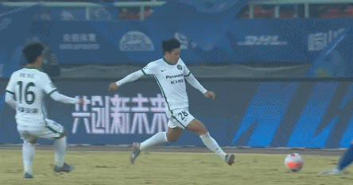

# 重返榜首！中超：武汉三镇2-0浙江 末轮拿下津门虎就夺冠

在北京时间12月27日晚结束的中超第33轮一场焦点战中，武汉三镇2-0力挫浙江队。上半场补时阶段，斯坦丘任意球直接破门，浙江队0射门。下半场，戴维森单刀被扑，戴维森点球锁定胜局。最终，武汉三镇成功终结了浙江队9轮不败的记录（7胜2平）。

此役取胜后，三镇队与泰山队同积75分，三镇队暂时以5个净胜球优势领跑。

_中超最新积分榜_

最后一轮，武汉三镇主场迎战天津津门虎，山东泰山主场迎战北京国安。武汉三镇赢球就肯定夺冠，平或输的话，则要看山东泰山那场比赛的结果。

_最后一轮赛程_

根据中超的排名规则，同分情况下先看相互交手成绩，武汉三镇和山东泰山本赛季两场比赛均战成了1-1平。因此两队最终如果同分，将比较净胜球、总进球数等。

**【关键焦点】**

第45+3分钟，斯坦丘主罚远距离任意球直接破门，顾超毫无反应，武汉三镇1-0浙江队。这是斯坦丘本赛季个人中超第10球。

第94分钟，戴维森点球破门，武汉三镇2-0浙江队。

**【精彩回放】**

第7分钟，戴维森摆脱防守后禁区右路抽射打门，顾超没收皮球。

第8分钟，邓涵文禁区右路突破抽射，皮球稍稍打高。

第13分钟，戴维森禁区左路抽射远角，皮球偏出远端球门。

第17分钟，谢鹏飞禁区右路抽射打门，顾超扑出皮球。

第30分钟，谢鹏飞任意球击中人墙，随后补射打偏。

第45+2分钟，两队球员爆发大规模冲突，场面火爆。

第55分钟，浙江队角球机会，穆谢奎头球攻门顶偏。

第71分钟，谢鹏飞妙传，戴维森获得绝佳单刀破门良机，但他的低射被顾超近距离挡出。

第74分钟，高准翼禁区外抽射打门发生折射，顾超扑出皮球。

第75分钟，邓涵文倒地放铲，和岳鑫发生冲突，随后吃到黄牌。

**【球员评分】**

**【技术统计】**

**【出场阵容】**

武汉三镇首发（4-3-3）：

门将：22-刘殿座

后卫：4-殷亚吉、18-刘奕鸣、3-华莱士

中场：25-邓涵文、12-张晓彬、21-何超（68'20-高准翼）、37-徐皓阳(U23)

前锋：43-斯坦丘、11-戴维森、30-谢鹏飞（91'31-罗森文）

浙江队首发（3-4-1-2）

门将：1-顾超

后卫：4-孙正傲、26-高天语(U23)（46'20-王东升）、2-梁诺恒

中场：28-岳鑫、29-张佳祺（46'31-顾斌）、16-鲍盛鑫(U23)（86'5-刘浩帆(U23)）、21-艾沙江-库尔班(U23)（46'8-钟浩然）

前腰：10-马修斯

前锋：30-穆谢奎、7-多诺万-埃沃洛

主裁判：马宁 VAR：傅明

