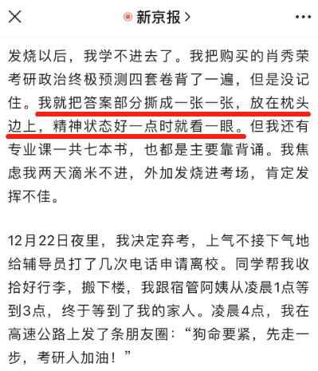

# 2022考研众生相：考生咳嗽声此起彼伏，监考老师难受哭了

这里是心疼表妹艰难考研的新闻妹。

就在上个周末，一年一度的全国考研结束了，妹子记得老家的小表妹也是今年二战，昨天跟家里打电话时就顺口问了下情况。

没想到老妈压低了声音，说表妹刚好在生理期“阳了”，高烧不退遭不住，只好弃考。

一时间我都说不出什么安慰的话，毕竟每年都号称是史上最难的一届考研，但确实没有哪一年像2022年这般，考生们经历着新冠、隔离、封校、异地借考等等意外。

把考研变成了一次耐力和运气的比拼。

据统计，23届考研本有474万考生。

但由于今年的特殊情况，最后走进考场、全程考完的，远少于这个数据。

各省市公布的考研人数，显然也没有一开始机构预测的多。

其中只有西藏标注了“应考人数”与“实考人数”，首场考试的弃考率达到了35%。

辛苦备战那么久，却因为不可控的原因选择放弃，我都替他们感到可惜。

但看到这群年轻的考研人展现出来的真实片段，妹子又真的感到心疼。

有妹妹在考试前一天高烧到40度。

去医院打针，哭着问护士能不能打左手，因为明天还要写很多很多的字。人都烧晕了，病床边还放着一本考研政治习题。

来势汹汹的病毒几乎打乱了所有人的计划，各地政策的变化更是让人措手不及。

有人早就订好的酒店，在方舱停用之后被征作他用。

有人独自在外异地借考，辗转好几个酒店，12月刚被隔离过，出来又开始发烧。

考前发烧是真的难顶。

按照研友们往年的经验，考前半个月左右，肖秀荣会出一套政治的终极预测。

这时考生们就需要集中冲刺，靠临时记忆上考场。

但今年不同，很多考生在这段时间里中招，身体格外疲惫不说，习题答案完全灌不进脑子里，只剩“复习不完了”五个大字。

有的或许咬咬牙还能磕，有的却烧到无法进食，最终突破心理障碍，决定“保命要紧，先走一步”。

没有人会怪他们的选择，这不过是二十出头的年轻人，对考研和人生的重新思考。

正如考研数学的张宇所言，要在保证身体状况的前提下考试，要自己心疼自己。

如果有余力参加考试，当然好。

但从各位参与者的反馈来看，万般辛苦，不忍卒读。

有人发着高烧，耳鸣眩晕，虚脱无力；

有人浑身疼痛、冷到手抖，一年的字白练，写了什么全靠潜意识；

要是运气再差点，分到门口的座位，冷风阵阵，那真是渡劫一样的感受。

而最容易影响考生的，估计是咳嗽。

在特殊考场，阳性考生们咳生咳死，差点喘不过气来；

在阴性考场，身体无恙的考生们也难免被不停的咳嗽声打断思绪。

就算人转阴了，后续频繁擤鼻涕都能把人的脑子擤晕。

最无辜的莫过于原本阴性的考生，为了考研可谓是孤注一掷。

把自己包裹得再严实，也经不住跟刚阳康或在潜伏期的考生同场两天。

很多人一出考场就知道，得，赶上了。

好在这两天，妹子并没有看到有考生在考场遭遇不测的新闻。

据说每个考场都有医护和120坐镇，对他们来说，虚惊一场就是最好的消息。

说到监考老师，他们也不容易。

一方面，身体上被桎梏，一天都得缩在防护服里，行动不便。

另一方面，看到孩子们在逆境中艰难前进，心理上很难不emo。

更严重的是身体心理双重受击，阳了还得上场监考。

老师们在讲台上揪心守着。

考生们在座位上各自历劫。

偏偏考题还不肯轻易放过大家，据肖秀荣教授分析，今年的政治选择题是近几年最难。

一位监考老师回忆，有个男生进场后太难受，举手问什么时候能交卷，得知要两个半小时后，乖乖地继续作答，时间一到立马交卷。

老师收到答题卡一看，只涂了选择题，其他都是空的，草稿纸上却零碎写了些东西。

开篇第一句，是被病毒和难题折磨出的鲁迅文风：今年考研大概是失利了……

前面说了，2022年的考研是一次耐力和运气的比拼。

如果能全程参加两天的考试，无论最后上岸与否，都有“值得写进简历里”的特殊意义。

妹子之前听过一句话：使唐僧成为唐僧的，不是经书，而是取经的那条路。

倒不是让你感谢苦难、歌颂苦难，而是希望你能从苦难中吸取到重新出发的能量，从而在前方以胜利者的姿势回头蔑视苦难。

事已至此，不管之前多么努力地尝试，之后又花多少时间担忧，总有些事无法改变。

那就请慷慨地接受它们，再继续前行。

“只有继续从容向前，才不会辜负那些在漫漫长夜中依旧熠熠生辉的旧时光。”

新闻来源

《2022，当考研遇上奥密克戎》新京报

《女生高烧40度怕影响考研打左手针 病床柜子上还放着政治习题》沸点视频

