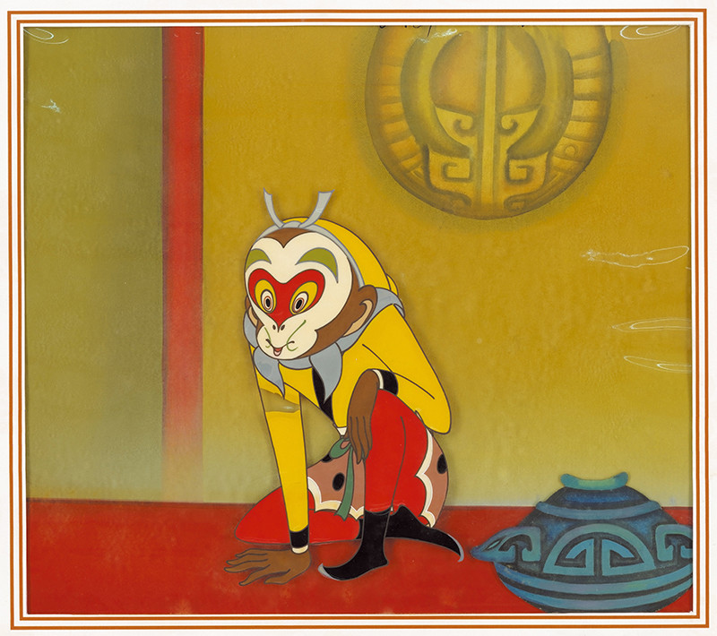

# 动画大师严定宪去世，他的《大闹天宫》曾影响宫崎骏

12月26日，《大闹天宫》首席动画设计、一级导演严定宪因病去世，享年86岁。

严定宪是新中国第一代动画师，被称为“美猴王之父”。1961年，他参与制作了中国第一部动画长片《大闹天宫》，也是《哪吒闹海》和《金猴降妖》的导演。这些动画片陪伴了几代中国人，成为跨越时代的记忆。

他的动画生涯跨越半个世纪，历任上海美术电影制片厂（下称“上美影”）动画设计、导演、厂长，见证着中国动画产业的发展。

严定宪去世消息传来，知名漫画家龚毅坚在微博晒出自己小学二年级临摹的美猴王，感激老一辈艺术家给他留下的美好童年回忆。

《大闹天宫》曾经的辉煌，是中国动画人心目中永远的巅峰。日本漫画家手冢治虫正是受到严定宪创作的动画，才有了科幻漫画《铁臂阿童木》。宫崎骏也是因为看过《大闹天宫》之后，决心将漫画作为终身事业。

中国动漫博物馆收藏了严定宪与手冢治虫共同创作的漫画《孙悟空和阿童木握手》，那是严定宪访问日本时，两位漫画家各自画了自己的漫画形象，让孙悟空与阿童木牵手。博物馆里还有严定宪捐赠的《大闹天宫》赛璐珞原画、《金猴降妖》全套创作资料。

动画编剧叶岚曾在2013年拜访严定宪，她记忆犹新的是，严老虽是中国国宝级动画前辈，家中却朴素而简单，只有客厅墙上挂的一张上美影经典卡通形象大合影的海报，提示着主人的身份。

现任上美影厂长、动画导演速达感叹，严定宪在中国动画界是大师级人物，“他是中国学派的代表人物之一，拥有非常高的艺术造诣。作为美影老厂长，他对美影的创作有非常大的推动，凝聚了最好的一批动画人，集大家之气，才能出大作之力。”

**15万张《大闹天宫》手稿**

生于1936年的严定宪，是中国第一代动画专业生。

上世纪40年代中期，严定宪跟随家人来到上海定居读书，他家步行十分钟内，就有美琪电影院、大华电影院等三个电影院。就在这些影院，他看了来自美国的《米老鼠和唐老鸭》《大力水手》等，影响颇深。他想，这只老鼠肯定不是人扮演的，但如此生动逼真，也不知道是怎么画的。

从小热爱绘画的他，于1951年考进苏州美专动画科。之后全国高校院系调整，他又进入北京电影学校（今北京电影学院），读完动画专业，其间接触到大量苏联动画片。

50年代中期，他分配到上影厂的美术组工作，直到1957年上海美术电影制片厂成立。

在美术组的初期，导演万籁鸣带着年轻团队开始琢磨怎么从黑白片转到彩色片，怎么从画动物转到画人物，如何从几分钟的片子拓展到半个小时。为了让绘画更活灵活现，他让话剧团的人来讲表演，请程十发来上国画课。

团队里，严定宪负责原画，一边工作一边学，做了三部动画片，其中中国第一部彩色动画片《乌鸦为什么是黑的》，在1956年的威尼斯国际儿童电影节获奖。

他经历过中国动画从美国风格、苏联风格到自我风格的探寻。中国动画从万氏三兄弟的《铁扇公主》开始，带着浓郁的迪士尼痕迹。但到了上世纪60年代，上美影推出的一系列动画片已经看不到迪士尼的影响。严定宪曾说，中国动画走自己道路的第一部动画片并非《大闹天宫》，而是创作于1955年、关于中国古代的故事《骄傲的将军》。

“我们当年制作《大闹天空》，所有人都是不计酬劳、不计荣誉的。”严定宪曾回忆，1960年，上美影拍摄《大闹天宫》，他担任原画组组长，带队一张一张画完114分钟的动画长片。

电影每秒是24帧，当时的美术片要做到每秒12张动画，单是铅笔手稿总计就有15万张。大家拿着微薄工资，几乎每天都要工作十几个小时，心无旁骛地寻找属于中国动画的美学。

历时四年创作的《大闹天宫》，直到1978年才全本上映。该片在巴黎上映一个月，观影人次达到10万。法国《世界报》评论道，“《大闹天宫》不但具有美国迪士尼动画的美感，造型艺术又是迪士尼艺术所做不到的，完美地表达了中国的传统艺术风格。”

孙悟空在法国大受欢迎，严定宪也曾为法国小朋友画出500多幅孙悟空。即使年过八旬，他只要提起笔来，分分钟就能画出活灵活现的孙悟空。

**“听到下一个动画高潮”**

在半个世纪的动画生涯中，严定宪共执导了30多部动画片，其中《大闹天宫》《人参果》和《金猴降妖》都与孙悟空有关。仅这三部动画片，就耗费了他十年光阴。

1984年至1989年，他担任上美影厂长，在中国动画体制转型期，一步步提升国产动画的质量与影响力。他用酬金制的方式鼓励创作，仅1986年美影厂就完成了41个剧本。1985年，上美影有十多部动画片在国际获奖，他开始设想举办国际动画电影节。

1988年，上美影承办上海第一届中国国际动画电影节，28个国家和地区的280多部片子参选，最后52部片子参赛。5天的电影节吸引了80多位海内外的动画艺术家参与其中，成为中国动画史上浓墨重彩的一笔。

严老退休之后，国产动画一度落寞，很多人问他，为什么中国再也拍不出《大闹天宫》这样的动画片？

严定宪早就意识到，如今的国产动画走向了三个分叉口，一个是商业动画，一个是艺术动画，一个是学院动画。

2006年，77岁的严老与夫人林文肖自费去参加世界动画电影20周年影展，又去广岛等电影节，没看到任何一部中国动画参加。他知道，像他们这样的老一辈动画师，已经退出舞台，但他从来不会忘记，当时他们是怎么做动画的。

“动画创作，归根结底就是要全身心地投入。”他常说，动画是一项工程，是集体创作，需要许多人的合作与努力，不能急功近利。他们那一代动画人，不顾报酬与名利，只把动画当做事业去做。做《大闹天宫》时，导演带着他们去故宫，想象神仙的仙境是怎样的，又请来京剧演员给他们面授技艺；做《草原小姐妹》时，他们跑到零下20°C的内蒙古体验生活。但这样的经历，今天很难再现。

他始终认为，好的故事、好的团队、艺术风格和动画表演，是动画电影缺一不可的要素。

2011年，3D版《大闹天宫》上映，严定宪赴美和《阿凡达》特效团队合作，全程参与新制作，为新版动画电影保驾护航。速达回忆，严老与林文肖对新动画技术充满好奇，总是逐个镜头地矫正颜色和亮度。该片最终获5000万元票房。

退休后的严定宪一直以自己的方式继续动画事业，写书、演讲、去高校给学生讲课，希望动画专业的年轻人能多吸取过去的经验。他一直相信，今天的动画人有了更好的技术和条件，一定能重新创造国产动画的辉煌。

他常会关注动画系学生的动向，看他们的新作品。他曾说，“从他们的作品里，我听到了下一个动画高潮的脚步声。”

75岁那年，他把自己珍藏多年的1000多幅全套铅笔手绘的《金猴降妖》分镜头台本赠送给中国动漫博物馆。他希望让后辈知道，中国动画长片是如何创作出来的。

