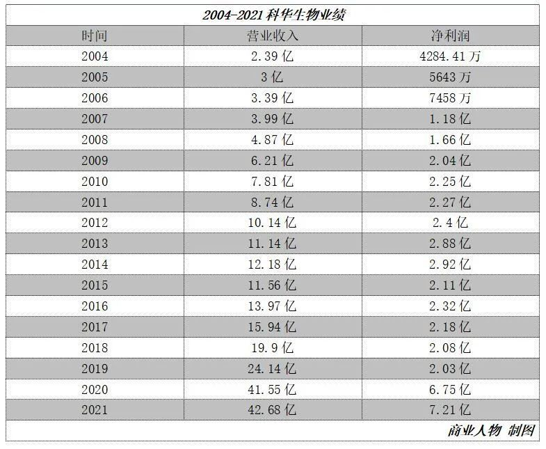

# 医药大佬，殁于新冠

**作者：王珊**

**来源：商业人物（ID：biz-leaders）**

圣诞节当晚，上海科华生物工程股份有限公司（下称“科华生物”）在官网发布了一则讣告，公司创始人、原董事长唐伟国25日在上海病逝。

唐伟国离世的消息来得突然，66岁的年纪并不算大，讣告提及去世原因是因感染新冠病毒伴发基础性疾病。

其实自疫情防控放开后，不时能看到讣告。12月以来，据“商业人物”不完全统计，13位中国科学院、工程院院士相继去世，其中多份讣告对于去世原因用“因病医治无效”概括。

此次唐伟国的去世在网上引起了轩然大波，12月26日下午连续数小时这个话题挂在微博热搜。作为医药上市公司的创始人，仍死于新冠，无尽唏嘘。

唐伟国称得上是中国IVD业的“带头大哥”，他带领科华生物开创了国产酶免试剂和生化试剂产品的先河，他曾任上海生物制品研究所科研人员、上海第二医科大学兼职教授、上海市药品监督管理局药品安全监管咨询专家、上海市生物医药行业协会专家、副会长等。同时，在2017年5月任期届满前，一直是科华生物的董事长，医药行业履历堪称丰富。

唐伟国去世的消息一出，也让他背后的科华生物迅速出圈，但凡这两年关注医药行业的多少都会了解，
**科华生物可不是无名之辈，它在过去两年因核酸检测红利赚得盆满钵满。**

“体外诊断”对于经历了两年多全民核酸的人而言不能更熟悉，已经末路的核酸检测以及当下风口上的抗原检测都属于体外诊断，英文名In Vitro
Diagnosis，简称“IVD”。

科华生物是做体外诊断的公司，前身是上海科华生化试剂试验所，1981年成立。1989年，在唐伟国的带领下科华试验所在国内抢先推出酶联免疫法乙肝二对半试剂盒。在上海科华生物工程股份有限公司职工持股会（原）和唐伟国等人联合发起下，试验所于1998年改制为股份公司。如今公司主营业务为体外诊断试剂、医疗检验仪器的研发、生产和销售，自主产品涉及分子诊断、生化诊断、免疫诊断、POCT（胶体金）。

**虽然科华生物在国内IVD行业创下多个第一，第一家将乙肝、艾滋诊断试剂推向市场，更是第一家研发出SARS诊断试剂的公司，并借此于2004年成功登陆深交所中小板，妥妥的A股“体外诊断第一股”。**

公司在医药行业名号不少，但规模并不大，而且自上市后科华生物无论是业绩还是在二级市场的表现均平平无奇。上市前三年公司净利润仅在千万级徘徊，2007年净利润才正式迈入亿级行列，2004—2007年总营收不过8.78亿元，净利润累计仅1.74亿元。

上市后的16年间，科华生物不温不火，直到新冠疫情爆发，作为体外诊断的老牌公司，2020年科华生物抓住核酸检测的风口，瞬间跃至国内核酸检测试剂龙头，陆续推出核酸检测试剂盒、核酸检测亭、抗原检测等产品。

新冠疫情这只“黑天鹅”为科华生物带来了业绩的暴涨，2019年科华生物营收和净利润分别为24.14亿和2.03亿元，而2020—2021年，公司营收和净利润分别累计84.23亿元和13.96亿元。2021年相较于上市之初，公司营收和净利润分别增长近18和17倍，疫情两年就赚到了过去6年的钱。

**疫情之外的科华生物，自2004年登陆资本市场之后，曾经多次深陷资本的旋涡，纠纷不断，更一度7年间处于无实控人状态。**

2014年其引入由方源资本设立的持股目的公司——League
Agent(HK)Limited（简称LAL），其余两位共同控制人许显德、沙立武退出，唐伟国也失去了控制人的角色，LAL成为科华生物第一大股东，但后者并不实控公司，随后6年多的时间科华生物都处于无实控人阶段，当时唐伟国仍担任公司董事长，并承诺三年内不减持。

随着资本的进入，科华生物虽有意借着募资加大核酸、POCT、临床化学等检测方面的生产投入，并加强对诊断仪器的研发销售投入，但无实控人的公司缺乏长远规划和稳定发展，走马观花似的换了四任职业经理人后，科华生物本有起色的业绩在2015—2019年间再次萎靡不振，营收净利相较于之前五年均有不同程度的下滑。

无实控人的状况一直持续到2020年5月，拥有国资背景的格力地产的全资子公司珠海保联斥资17.26亿元购得科华生物18.64%的股权，6年后，科华生物终于迎来实控人。然而好景不长，去年5月，格力地产又以19.5亿元的价格将手中18.63%的股份卖给圣湘生物，三个月后，三方又以未达各方预期为由终止收购事宜，或是受天隆公司与科华生物之间的资本纠纷连累。

去年起科华生物因与控股子公司西安天隆、苏州天隆（合称“天隆公司”）因钱产生了纠纷，导火索就是新冠疫情。公开资料显示天隆公司成立于2009年，多年来发展并不景气，主要从事核酸提取、诊断试剂等销售业务，2017-2018Q1，公司均在亏损中，累计亏损1598万元。2018年6月，科华生物以5.54亿元拿下两家天隆各62%的股权，且计划对余下的38%股权进行增资。

有了科华生物渠道、资金等方面的帮助，天隆公司逐渐走出亏损，与此同时科华生物也借着后者在分子领域的优势进一步拓展公司分子诊断产品线，看似双赢的一桩生意，因为疫情爆发，在核酸红利的加持下，双方因钱产生了分歧。

双方原本签订的协议是，科华生物收购天隆公司剩余38%的股权价款以9亿元和天隆公司2020年经审计扣非净利的25倍中孰高为准。但天隆公司或许做梦都没料到2020年新冠疫情爆发为其带来了前所未有的红利，2020年天隆公司营收和净利润均迎来暴涨，其中西安天隆营收和净利分别高达20.78亿元和10.85亿元，整个天隆公司的扣非净利润达到11.06亿元，堪称是科华生物的利润奶牛，而科华生物2020年净利润6.75亿元。

吃到核酸红利，赚了大钱的天隆公司立即翻脸，坐地起价要求科华生物按照105.04亿元支付股权价款，科华生物拒绝，随后天隆公司便拒绝配合母公司科华生物年审，结果导致后者于今年5月披星戴帽，*ST科华随之将其告上法庭。

这场闹剧随着天隆公司“赖以生存”的资本——核酸业务遇冷发生转折，上个月中旬，这场涉及百亿人民币的纠纷落幕，科华生物也恢复了对失控的天隆公司的控制权，并拟通过发行股份方式购买后者剩余38%的股权。

如果不再出现意外，天隆公司后续将成为科华生物的全资子公司，1+1能否起到大于2的效果还不得而知。资本的介入，科华生物几番折腾，连带着业绩也一路震荡。好在搭上了疫情这只“黑天鹅”，公司靠着体外诊断的老本行，押注核酸试剂和抗原试剂等涉疫情类产品，新冠红利吃到饱，就连唐伟国的财富也随之暴涨。据科华生物披露，唐伟国于2020年11月通过减持2.9%套现2.68亿元，核酸造富，可见一斑。

据中商产业研究院，我国体外诊断试剂生产企业超1200家，疫情期间竞争尤为激烈，头部企业如科华生物、达安基因、九强生物、深圳迈瑞、复星长征等数十家。科华生物近三年营收复合增长率不足30%，在IVD行业头部企业中排名并不靠前。

**如今核酸红利不再，在科华生物业绩中体现得淋漓尽致。**
2020-2021年公司净利率均在25%以上，而进入2022年这个数字仅剩个位数，今年前三季度公司归母净利润更是同比暴跌95%至3685万元。

如今，疫情防控政策转向，缓解新冠症状的药物、特效药以及抗原检测暂时都在风口上，科华生物的抗原检测试剂上半年也已获批上市，但在后疫情时代，抗原检测的红利能不能吃到嘴里、能吃几天，主动权并不在公司手里。

目前唯一可以确定的是，涉新冠类产品和业务都有保质期，如若过去三年相关行业和企业将在各类检测上的资金投入用作研发抗新冠病毒药物，能不能降低新冠重症率，减少噩耗发生的可能性？

​

*头图购买于视觉中国

