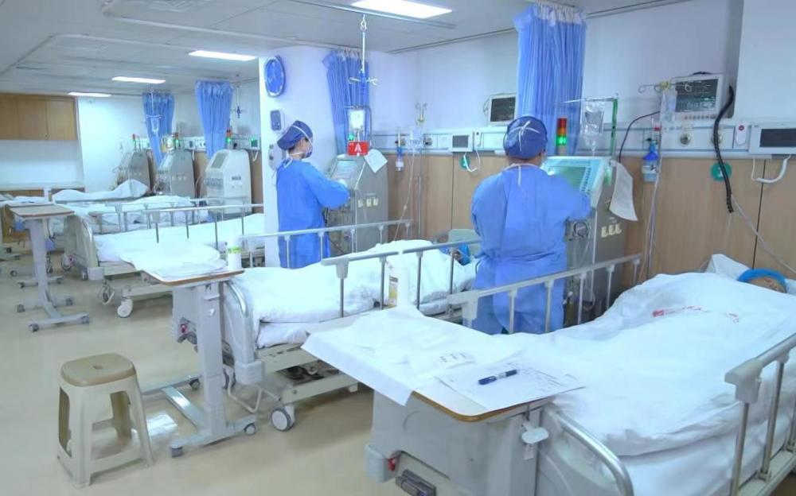

# 咋预防“白肺”？专家提醒：有3个办法提前预警

大象新闻记者 董彩红

家里有老人，担心出现“大白肺”、“沉默型缺氧”等情况，具体如何应对，提前预警？近日，大象新闻接到诸多咨询。针对这些问题，大象新闻记者做了多方采访。

**什么是白肺？**

对于大家关心的大白肺和沉默型缺氧问题，曾有读者这样描述“母亲70岁，感染新冠后五六天都觉得好了，也不发烧了。突然觉得憋气，去医院检查发现是病毒性肺炎，肺都白了。”

对此，河南省人民医院老年医学科武文娟介绍，“白肺”从医学上来说，有两方面的情况。

一种是原本有肺部疾病，例如肺纤维化、肺结核等，肺部受到了损伤，影像学上口语化的描述，会看到白肺。

还有一种情况是临床上比较严重的病毒性肺炎的表现。

正常情况下肺部是由肺泡组成的，肺泡里边充满了空气，进行CT或者是X线检查时，它的影像表现应该是黑色区域。但如果肺泡里出现炎症和感染有渗出液和炎性细胞的时候，肺泡就被这些渗出液或者炎性细胞所填充，射线就穿不透，在影像学的表现上就出现了白色区域，就是大家说的“白肺。”

**咋预防？**

“不能预防，只能预警。”河南省人民医院老年医学科武文娟表示，目前根据新冠病毒感染的情况，推荐80岁以上老人，出现阳性症状后，要及时和社区医生联系，或者自己平时熟悉的主治医生联系，根据情况诊断，需要居家观察治疗还是住院治疗。

那么对于80岁以下，身体状况也不错，或者有高血压、糖尿病等，但又控制的很好，很平稳，想居家观察治疗的话，有哪些变化需要大家警惕？

武文娟说，病毒性肺炎造成的“白肺”也不是立刻就会形成的，一般会在两三天之前都有一些信号预警，大家一定要留意到。

例如：血氧饱和度，心跳，脉搏等变化。

**一、提醒大家：家里老人发烧后，首先要观察精神状态，是否嗜睡、食欲不振、神志淡漠、呕吐等情况。**

**二、还有很多有基础疾病的老人，一般会推荐在家里备一个指尖血氧仪。**

可以注意到两个变化：血氧饱和度和脉搏。

血氧饱和度如果低于93或者90，就要多注意；脉搏正常是60～100,高于100也要警惕。

有人监测时发现，老人散步活动时，数值在95、96也挺好，但一休息，立刻大起大落“从95、96立刻掉到93或者以下”，也要注意。

**三、有的人说，家里老人平时身体也不错 也没有备血氧仪什么的。应该看什么数据？**

武文娟建议，除了老人的精神状态，也可以数一下呼吸频次。在老人休息状态下，一分钟时间数一下，如果超过30次，也需要多警惕。如果呼吸频次看不清楚，也可以通过胸廓活动的频次来数。

一般来说 出现以上变化，就要及时联系医疗机构，做进一步检查和诊断处理。

除了有基础的老年人，高龄老人等，武文娟提醒，过于肥胖的人群，即便是中青年，感染新冠后也要注意和警惕。

**哪些人群高风险？**

据悉，我国新冠病毒感染分为轻型、普通型、重型。

哪些人群有高危因素，北京协和医院呼吸与危重症医学科12月26日最新发布的诊疗参考方案里明确提出:

虽然所有年龄段的人都有感染新冠和发生重症的风险，但是以下人员重症风险高，需要特别关注：

▲年龄≥65岁（也有指南认为≥60岁）

▲养老机构居住人员

▲未接种疫苗

▲患有慢性疾病（心血管疾病、慢性肾病、慢性呼吸系统疾病、糖尿病、神经认知障碍、肥胖症等）

▲各种形式的免疫抑制人群(肿瘤放化疗、器官或造血干细胞移植、先天性免疫缺陷、HIV感染、激素/免疫抑制剂/生物制剂使用者等)

▲其他：肝病、妊娠等。

**新冠病毒感染分型**

▲轻型：临床症状轻微，影像学未见肺炎表现

▲普通型：具有发热、呼吸道等症状，影像学可见肺炎表现

▲重型：符合下列任何一条

呼吸窘迫，RR≥30次/分

静息状态下，指氧饱和度≤93%

动脉血氧分压(PaO2)/吸氧浓度(FiO2)≤300mmHg

临床症状进行性加重，肺部影像学显示 24~48 小时内病灶明显进展>50%者

▲危重型：符合以下情况之一者

出现呼吸衰竭，且需要机械通气

出现休克

合并其他器官功能衰竭需ICU监护治疗。

