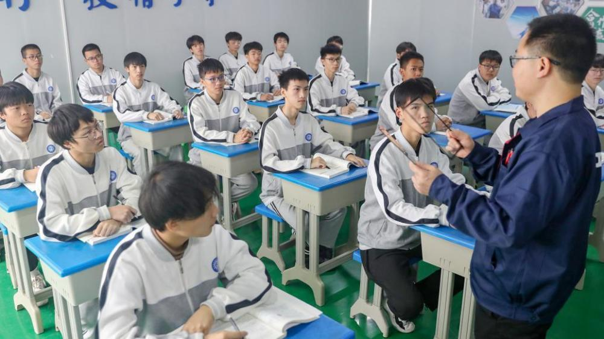

# 教育部：扩大应用型本科学校在职教高考中的招生规模

12月27日，在教育部召开的新闻发布会上，教育部职业教育与成人教育司司长陈子季在介绍《关于深化现代职业教育体系建设改革的意见》（以下简称《意见》）有关情况时表示，《意见》提出了新阶段职业教育改革的一系列重大举措，其中有“五项重点”，包括拓展学生成长成才通道，支持各省因地制宜制定职教高考方案，扩大应用型本科学校在职教高考中的招生规模。

关于“五项重点”，陈子季介绍，一是提升职业学校关键办学能力。即围绕现代制造业、现代服务业、现代农业的亟需专业领域，组建一批国家级职业教育核心能力建设专家团队，打造一批核心课程、优质教材、教师团队、实践项目，遴选一批国家级职业教育专业教学资源库、在线精品课程和虚拟仿真实训基地，做大做强职业教育智慧教育平台，扩大优质资源共享，服务全民终身学习和技能型社会建设。制定新一轮高职“双高计划”遴选方案和中职“双优计划”实施意见，遴选建设一批高水平中高职院校和专业。

二是建设“双师型”教师队伍。依托头部企业和高水平大学建设一批国家级职业教育“双师型”教师培养培训基地。推进职业教育“双师型”教师认定工作，指导各地制定省级“双师型”教师认定标准、实施办法。实施全国职业院校教师素质提高计划，遴选一批高校开展职业学校教师专业学位研究生定向培养。实施职业学校名校长名师（名匠）培育计划，采取固定岗与流动岗相结合的方式，吸引行家里手到职业学校任教。

三是建设开放型区域产教融合实践中心。启动高水平实践中心建设项目，通过政府搭台、多元参与、市场驱动，对地方政府、企业、学校实行差别化支持政策，分类建设一批集实践教学、社会培训、真实生产和技术服务功能为一体的公共实践中心、企业实践中心、学校实践中心。

四是拓展学生成长成才通道。建立符合职业教育办学规律和技能人才成长规律的考试招生制度，支持各省因地制宜制定职教高考方案，扩大应用型本科学校在职教高考中的招生规模；制定职业教育贯通培养指导意见，支持各省开展中职与高职（3+2）五年贯通、中职与职业本科或应用型本科（3+4）七年贯通、高职专科与职业本科或应用型本科（3+2）五年贯通培养；完善本科学校招收具有工作经历的职业学校毕业生的办法；根据职业学校学生特点，完善专升本考试办法和培养方式，支持高水平本科学校参与职业教育改革，推进职普融通、协调发展。

五是创新国际交流与合作机制。持续办好世界职业技术教育发展大会和世界职业院校技能大赛，推动教随产出、产教同行，打造职业教育国际合作平台，最终将职业教育打造成国际合作的战略资源。启动高水平国际化职业学校建设项目，遴选一批国际化标杆学校，推出一批具有国际影响力的专业标准、课程标准和优质教学资源。

