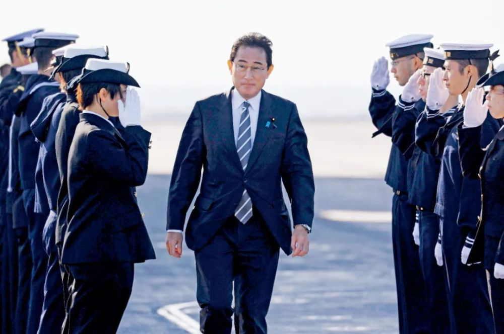

# 日本“专守防卫”政策为何出现重大转向？

_11月6日，日本首相岸田文雄参加海上自卫队成立70周年阅舰式。图/澎湃影像_

12月16日，经历数月的内部讨论后，日本政府通过《国家安全保障战略》《国家防卫战略》《防卫力量整备计划》等“三大安保文件”。新文件宣称日本面对地区新安全形势须具备“反击能力”。

当天，日本首相岸田文雄承认，此次安保文件修改“是战后日本安保政策的重大改变”。《外交学人》评论文章则指出，这标志着“二战”以来日本在和平宪法第九条下长期奉行的“专守防卫”政策的重大转折。

这种转折的背后既有外部因素，也有长期的内部因素。一方面，美国国防部长奥斯汀第一时间对日本新安保战略表示欢迎。日方将中国定位为“最大战略挑战”，与美国政府10月在新国家安全战略中将中国定位为“最重要地缘政治挑战”相互呼应。在9年前的上一版日本国家安保战略中，中国被定性为“国际社会关注的问题”。另一方面，修改宪法第九条走向“正常国家”，是日本执政党自民党本世纪以来长期努力的方向。自安倍政府2014年解禁“集体自卫权”、2015年通过新安保法后，将武力使用方式从“专守防卫”转向“可以反击”，是必然的“下一步”。

2022年7月安倍突然遇刺身亡，修改安保文件成为其“未尽的遗愿”。与此同时，乌克兰危机升级、朝鲜半岛进入2017年以来最密集的导弹试射周期等，都加速了日本国内对新安保文件的审议。美国智库战略与国际问题研究中心（CSIS）分析指出，日本官员们认为，“通过具备更好地保卫日本的能力，美国和其他伙伴将更有可能在危机中对日本提供援助”。

不过，在外部安全压力激增、内阁支持率低迷、自民党内保守浪潮兴起的背景下，新安保文件的修订还是经历了复杂的博弈。《外交学人》指出，安保文件将中国列为“挑战”而非“威胁”，或与现任首相岸田文雄的立场有关。他近期多次表示，与中国建立“建设性的、稳定的关系”很重要。

日本防卫省官员在介绍新文件时也表示，考虑军事、经济、外交等各方面因素，“简单地对中国使用‘威胁’一词不是一个好主意”。日本官员还强调，“反击能力”只能在和平宪法和国际法的限制下使用，并需满足“三个新的使用武力条件”，禁止先发制人的打击。

但外界担忧的是，新安保文件会打开日本军备建设的“潘多拉魔盒”。在2018年的防卫战略中，日本首次提出以反舰导弹打击“企图入侵”的外国舰队；而现在，新安保文件认定的“反击能力”已延伸到“敌国”本土深处的陆基军事目标。同时，日本政府12月14日宣布将采购新潜艇以加强从海上行使“反击能力”，并购置远程导弹，包括射程达1600公里的美制“战斧”巡航导弹。

就远期而言，日本立体式远程反击能力的形成，将促使美日之间构建完善的指挥协调机制，深化美日军事同盟。而当自卫队事实上获得立体打击周边国家的能力，修改宪法第九条、也就更加“水到渠成”。

值得注意的是，有媒体测算发现，即使在和平宪法的限制下，新安保文件已将日本未来10年的年度军费预算，提高到仅次于美国和中国的地步。分析人士担忧，这将使亚太地区本就紧张的安全形势进一步恶化，一场新“军备竞赛”或难避免。

日本单方面转变“专守防卫”政策，引发周边国家强烈反应。被日本安保文件列为“盟友及志同道合伙伴”的韩国外交部12月16日表示，日方政策调整恐严重影响半岛安全和韩国利益，日本政府应与韩方提前协调沟通。

中国外交部发言人汪文斌当天也在例行记者会上表示，日方出台的防卫政策文件罔顾事实，背离日方对双边关系的承诺及中日之间的共识，对中国国防建设和正常军事活动等无端抹黑，中方对此坚决反对，已通过外交渠道向日方提出严正交涉。

发于2022.12.26总第1074期《中国新闻周刊》杂志

杂志标题：日本安保“转守为攻”？

记者：曹然

