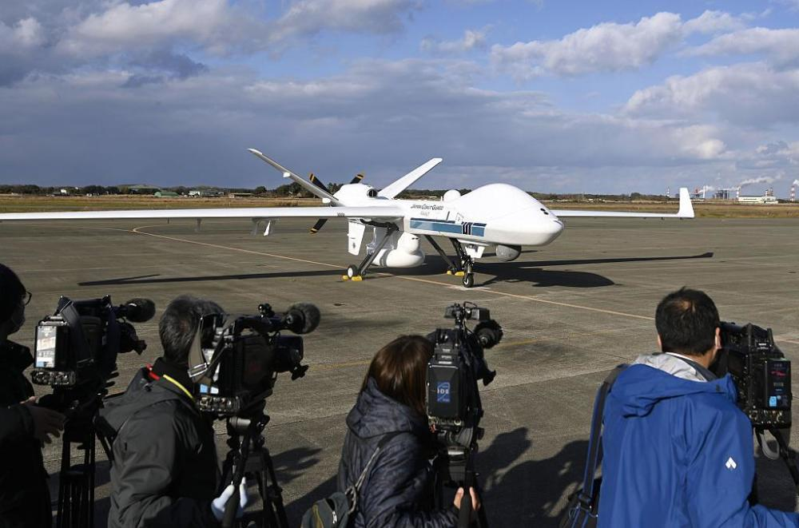

# 日本海上保安厅预算2431亿日元创新高，专家：实际上就是冲着中国

【环球时报驻日本特派记者 岳林炜 环球时报报道
记者张旺】据日本共同社24日报道，日本海上保安厅在2023年度年初预算案中申请额达到2431亿日元（约合128亿元人民币），创下历史新高。公开资料显示，自2012年以来，海上保安厅的年初预算额保持逐年增长。

日本政府在12月16日内阁会议上通过了新修订的三份安保战略文件，文件提出日本将致力于拥有对敌基地攻击能力等政策主张，并将在未来5年大幅增加防卫开支。据日本广播协会（NHK）电视台报道，本月早些时候，日本政府在修订安保相关三文件的同时，还通过有关海上保安厅的新方针。该方针称，为了应对钓鱼岛及其附属岛屿周边海域局势紧张等问题，将加强使用巡逻船和飞机的领海警备能力，以及利用无人机等新技术加强海洋监视的能力。方针明确，为了提高“与国内外相关机构的战略性合作和支援能力”，海上保安厅将进一步加强与自卫队的情报共享和合作；在发生武力攻击事态时，海上保安厅将归防卫大臣统一指挥，海上保安厅将同自卫队开展相应共同训练。此外，为了强化上述能力，海上保安厅预计在2027年度将预算增至3200亿日元左右，是2022年度预算的1.4倍。

共同社称，今年10月，日本海上保安厅以日本东北地区青森县的海上自卫队八户航空基地为据点，已启用1架大型无人机“海上守卫者”，在本次预算案中列入了84.4亿日元用于将该型无人机增至3架。另外，为应对中国公务船常态化航行的钓鱼岛周边的警备，海上保安厅计划到2026年度把1000吨以上的大型巡逻船增至85艘。

外交学院教授周永生25日告诉《环球时报》记者，日本海上保安厅费用的增加，实际上就是冲着中国。这表明，日本与中国在钓鱼岛地区的争夺在加强，这是很危险的趋势，甚至存在把作战部队引向钓鱼岛方向的可能。中日在钓鱼岛海域时常发生对峙，有时候可能还会比较激烈。未来，双方出现摩擦的风险更大了。

长期以来，日本媒体对中国海警船在钓鱼岛领海巡航密切关注，将我合法维权、正常巡航污蔑为“入侵”其“领海”。例如，共同社25日报道称，此前驶入“尖阁诸岛”周边日本“领海”的中国海警局的两艘船，于当天上午相继驶出“领海”，进入外侧的毗连区。这是中国公务船今年第37天驶入“尖阁周边领海”。日媒不断发布此类消息，还进行天数统计，意在渲染“中国威胁”，为其增加防卫预算和海上保安厅预算制造舆论、寻找借口。但正如中国外交部发言人所说，日方所作所为丝毫改变不了钓鱼岛属于中国的客观事实，中方维护钓鱼岛领土主权的决心坚定不移。

