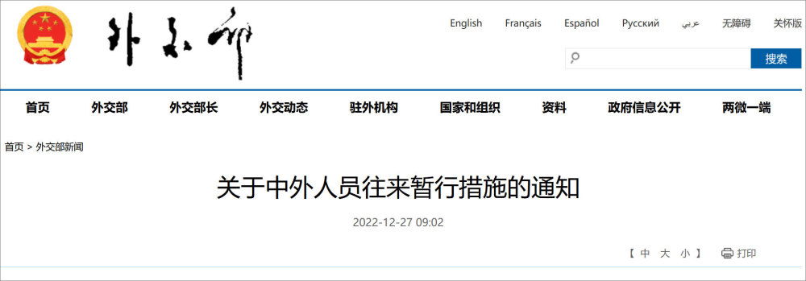
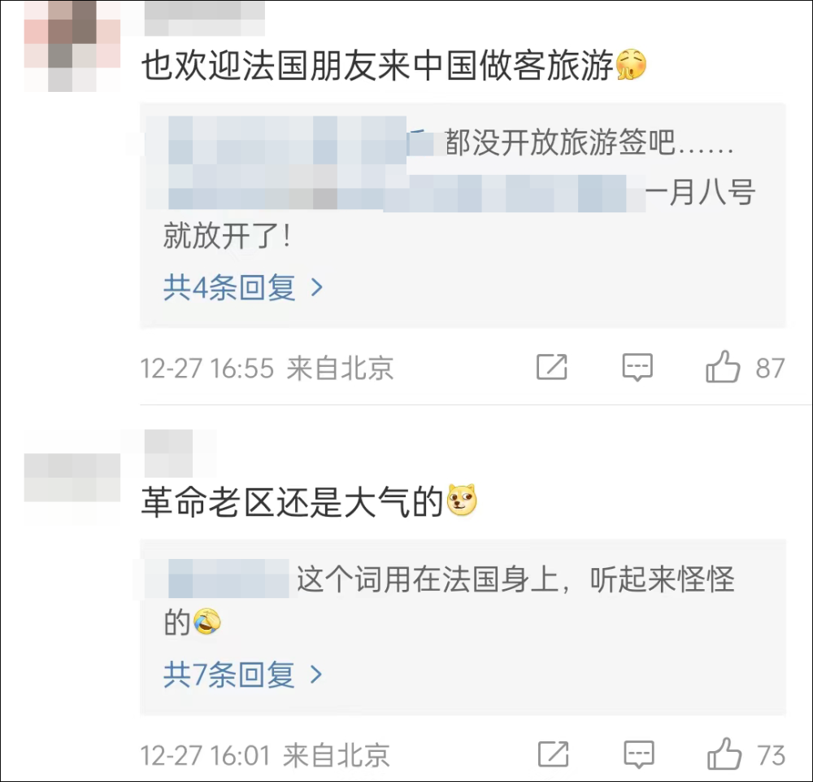
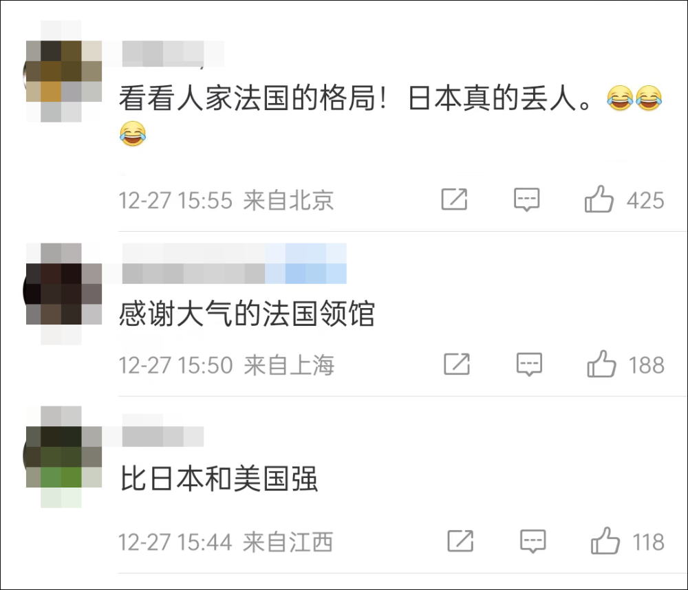
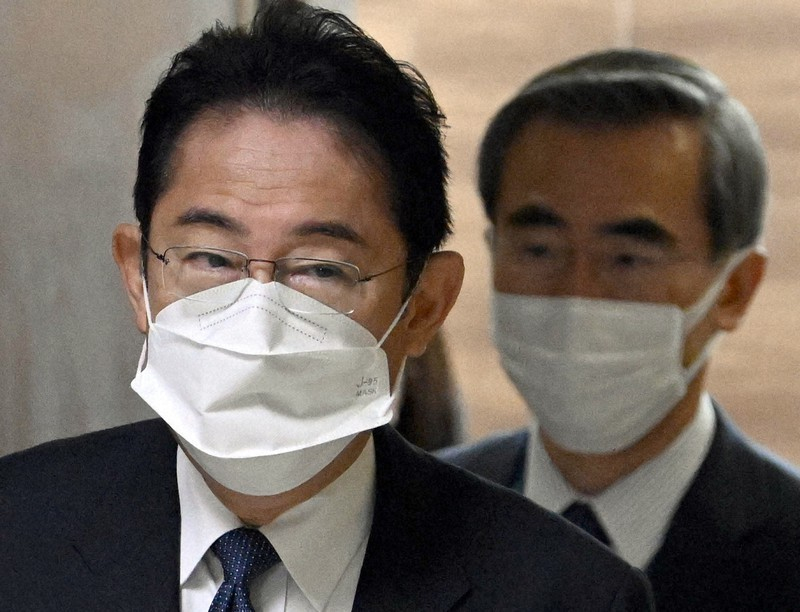
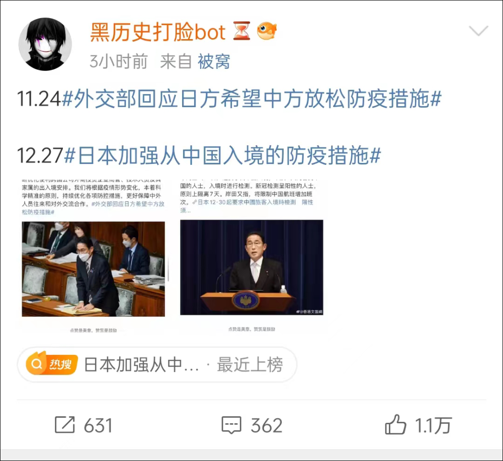
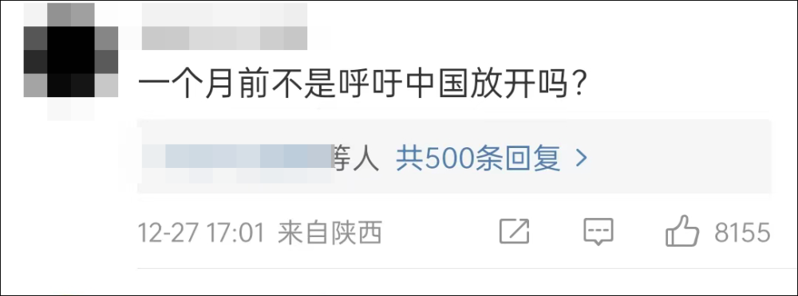
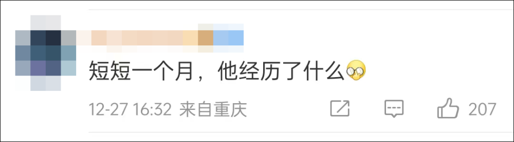

# 法国大使馆发博欢迎中国游客，网友＠日本：看看人家的格局

（观察者网讯）“中国朋友，法国张开双臂欢迎你们！”

12月27日下午，法国驻华大使馆官方微博更新动态，欢迎中国游客前往法国旅游。此举引发众多中国网友点赞，还有人揶揄道：“比日本格局大多了。”

日本首相岸田文雄27日宣布，自30日起加强从中国入境的防疫措施，中国入境日本阳性人员需隔离7天。而在一个月前，日本还呼吁中国放宽防疫措施。

12月26日晚间，国家卫健委发布了《关于对新型冠状病毒感染实施“乙类乙管”的总体方案》。文件优化了中外人员往来管理，取消了入境后全员核酸检测和集中隔离，取消“五个一”及客座率限制等国际客运航班数量管控措施等。

同程数据显示，消息发布后，全平台国际机票瞬时搜索量增长850%；签证搜索量瞬时增长10倍。中国游客最关注的海外目的地排名前三为日本、韩国、泰国；出境游主要搜索用户来自于北京、上海、广州三地。

面对即将到来的中国游客出境旅游潮，法国驻华大使馆27日发布微博表示欢迎：“中国朋友，法国张开双臂欢迎你们！”

法国驻华大使馆置顶了这条微博，还晒出了多张法国美景和美食照片。

_图源：法国驻华大使馆官方微博_

这条微博也引来众多中国网友的点赞：“感谢大气的法国领馆。”“也欢迎法国朋友来中国做客旅游。”

还有网友揶揄起了日本：“看看人家法国的格局！”

据日媒共同社12月27日消息，日本首相岸田文雄当天宣布，日本30日起将加强入境防疫措施。对从中国大陆赴日及7天内去过中国的所有人员，日本将实施入境检测。

岸田文雄表示，新冠检测呈阳性的人员原则上隔离7天，并将限制中国航班增加班次。

值得注意的是，就在一个月前，日方还表态称希望中方放宽防疫措施；如今中国优化了中外人员往来防疫政策，日本却态度转变，加强了对入境的中国游客的防疫管控。

此事让众多网友吐槽日本“两幅面孔”：

除了日本外，还有多个国家近日开始要求对来自中国的旅客查核酸。

印度卫生和家庭福利部日前宣布，来自中国内地、中国香港、日本、泰国和韩国的国际旅客前往印度时必须携带RT-
PCR检测报告，在抵达印度时被发现有症状或COVID-19检测呈阳性的人将被隔离。

韩国疾病管理厅则在12月16日将中国列入“检疫查验的重点国家”名单。

意大利外交和国际合作部网站Viaggiare
Sicuri报道称，自12月24日起，米兰马尔彭萨机场将对所有来自中国的旅客（不分国籍）进行入境新冠核酸检测。这一政策暂时执行至2023年1月30日，到期后将重新评估是否延续。

**本文系观察者网独家稿件，未经授权，不得转载。**

