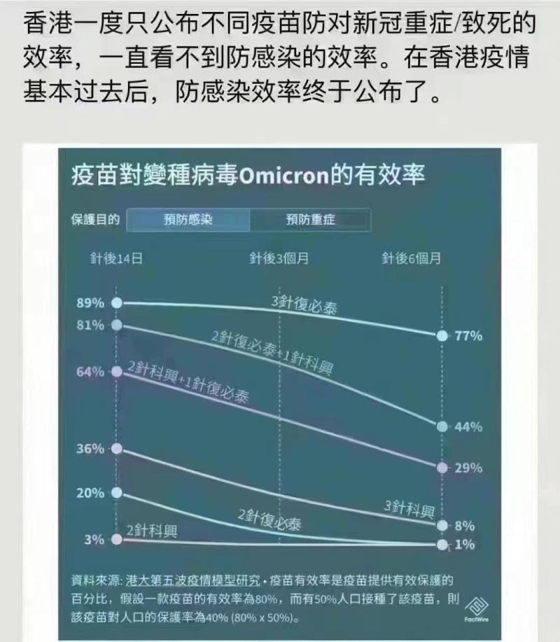
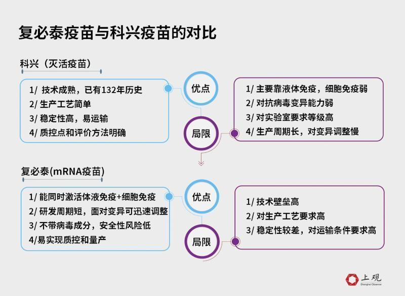
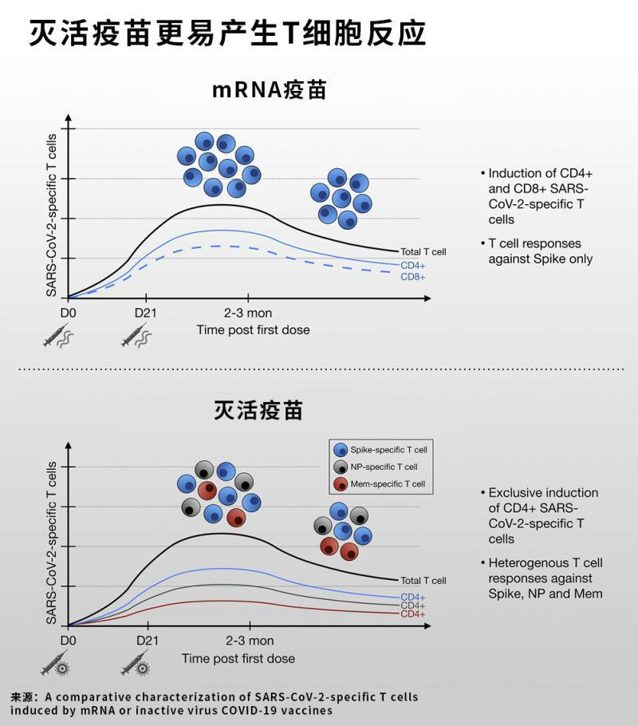
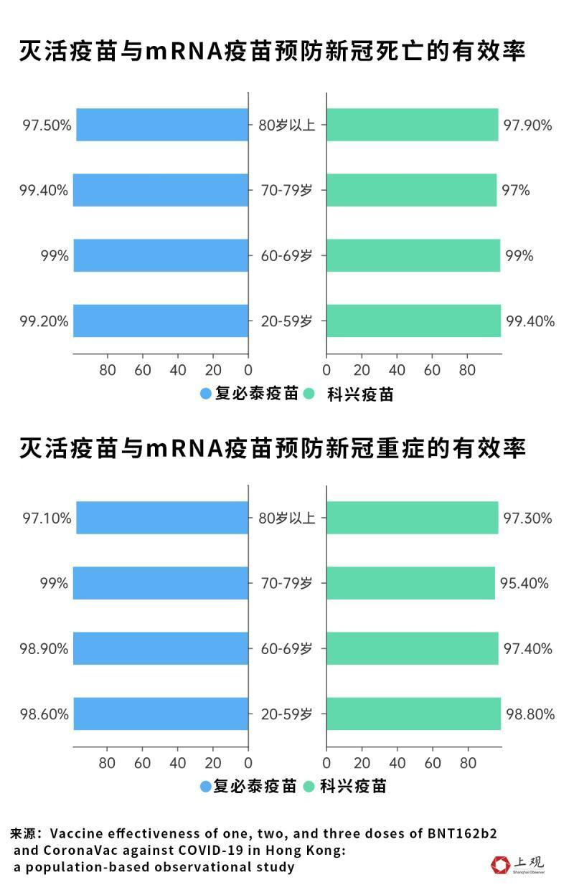

# 科兴三针防感染率仅8％？事实上与mRNA疫苗感染占比无较大差异

近日，网络上流传着一张关于科兴感染效率的数据图，图中表示，根据香港第五轮疫情的最新数据，科兴预防奥密克戎的有效率较低，即使是已接种第三针，在接种后14日，防感染的有效率仅为36%，而6个月后，仅剩8%。

那么，事实真是如此吗？

**一、这并非真实统计数据**

通过溯源我们发现，这张图最早见于今年2月，香港调查性新闻通讯社《传真社》所报道的一项香港大学疫情发展模拟模型，数据内容为模型推算结果，并非香港社会的真实统计数据。

2月10日，港大公共卫生学院发布了第五波疫情发展模拟模型【1】，其中通过不同医学研究的数据，推算了各疫苗组合于不同时期的有效率。研究估计，接种第三针科兴疫苗第14天的预防奥密克戎变种病毒感染有效率为36%，6个月后跌至8%。

那么，真实情况如何呢？

根据香港12月23日公布的疫情数据，在第五轮疫情中（2021年12月31日至2022年12月21日），香港累计感染232万人，超过704万人已接种至少一剂疫苗，有62.7万人已接种第四剂疫苗。

以粗略的计算来看， **接种灭活疫苗与mRNA疫苗，在感染占比上无较大差异。**

以接种第四针后的感染占比为例，接种灭活疫苗的平均感染占比为11.97%，而接种mRNA疫苗的感染占比为8.99%，两者相差2.97%。这一差值随着年龄增加而减少。在80岁以上群体中，两者的感染占比仅相差0.93%。

**并且，随着接种疫苗剂数的增加，预防感染的有效性有所增加。**

**二、防感染灭活效果略低于mRNA疫苗**

尽管实际感染率上两者无较大差异，但从预防感染的角度来看， **灭活疫苗防感染的有效性的确低于mRNA疫苗。**

根据香港大学公共卫生研究院今年11月发表的论文【2】，该研究通过对香港5310名受试者的血清调查，来分析复必泰和科兴新冠疫苗的有效性。

研究发现，同样接种了三剂疫苗，在接种后的7天后，灭活疫苗的有效性（31%）略低于mRNA疫苗（47%）。

两者的有效性都随时间推移而递减，皆为短期有效预防新冠。

但相较之下， **灭活疫苗有效性周期较短。**

mRNA疫苗抗体在血液中保留有效浓度的时间较长，经过104天后有效性衰退一半。而灭活疫苗的半衰退周期为40天左右。

_有效性的强弱或与疫苗所采用的技术有关。_

mRNA疫苗含有病毒的信使核糖核酸（mRNA），其工作原理是向宿主细胞发送指令以复制刺突蛋白，使免疫机制能够及时产生抗体，应对病毒。而灭活疫苗是通过注射完整的、被杀死的病毒副本，使其无法复制而不引发疾病。

两者使用的技术不同，因此产生的有效性也有所差异。

**三、防重症及死亡效果灭活疫苗同样显著**

尽管在防感染有效性上有所不足，但在预防重症与死亡上，灭活疫苗的效果与mRNA疫苗旗鼓相当，甚至更胜一筹。

根据新加坡国立大学医学院今年11月发表的论文【3】，尽管灭活疫苗所引导的抗体反应不如mRNA疫苗，但灭活疫苗能够引发针对病毒上不同蛋白质的广泛免疫反应，
**对于对抗重症感染更有效** 。

研究发现，相较于其他类型的疫苗，灭活疫苗更易产生针对病毒蛋白的T细胞反应。灭活疫苗会刺激名为CD4
T的细胞，当它识别病毒抗原时，会释放成为细胞因子的化学物质，以帮助激活其他类型的免疫细胞。

负责该项目的安东尼奥·贝尔托莱蒂教授表示，由于奥密克戎免疫逃逸能力较强，相较于抗体，T细胞在改善疾病方面更有效。

从实际数据来看，在香港本轮疫情中，总个案死亡率（或者统称总病死率）为0.71%，未接种疫苗者感染新冠病毒而病死的机率是2.87%。接种一针科兴疫苗的病死率为1.25%、两针为0.31%，三针则为0.04%。

换言之， **不接种疫苗的人群比打三针科兴疫苗的病死率高出71.8倍。**

而根据香港大学公共卫生研究院今年7月发表的论文【4】，在接种3针后，灭活疫苗对于预防重症、死亡的有效率都超过95%。

从平均值来看，灭活疫苗与mRNA疫苗无异。在预防重症上，灭活疫苗的有效率为97.23%，仅比mRNA疫苗低了1.18%；而在预防新冠死亡上，两者有效率皆达到98%，差距仅有0.45%。

甚至在部分年龄段上，灭活疫苗的有效率优于mRNA疫苗。例如，在针对80岁以上人群而言，在灭活疫苗在预防重症与死亡的有效率上都高于mRNA疫苗。

而根据智利卫生部今年2月发表的论文【5】，灭活疫苗对于预防儿童、青少年的重症同样有效。

研究发现，对于6至16岁的儿童、青少年而言，两针灭活疫苗的防住院有效率为91%，置信区间在87.8%至93.4%；而防重症（即住ICU）有效率为93.8%，置信区间在87.8%至93.4%。

整体而言，无论是灭活疫苗还是mRNA疫苗，加强针接种可以对新冠病毒的感染提供实质性保护，包括轻微和无症状病例。

尽管目前我国针对新冠病毒感染调整为“乙类乙管”，但“保健康、防重症”依旧是防疫重心，而继续推进疫苗接种，特别是老年群体疫苗接种依旧十分必要。

相关论文：

【1】港大醫學院簡報2019新型冠狀病毒病第五波疫情發展模擬模型

【2】Lau, J. J., Cheng, S. M., Leung, K., Lee, C. K., Hachim, A., Tsang, L. C.,
... & Wu, J. T. (2022). Population-based sero-epidemiological estimates of
real-world vaccine effectiveness against Omicron infection in an infection-
naive population, Hong Kong, January to July 2022. medRxiv.

【3】Lim, J. M. E., Hang, S. K., Hariharaputran, S., Chia, A., Tan, N., Lee, E.
S., ... & Tan, A. T. (2022). A comparative characterization of SARS-
CoV-2-specific T cells induced by mRNA or inactive virus COVID-19 vaccines.
Cell Reports Medicine, 3(11), 100793.

【4】McMenamin, M. E., Nealon, J., & Lin, Y. (2022). Vaccine effectiveness of
one, two, and three doses of BNT162b2 and CoronaVac against COVID-19 in Hong
Kong: a population-based observational study (vol 22, pg P1435, 2022). LANCET
INFECTIOUS DISEASES, 22(9), E239-E239.

【5】Jara, Alejandro, et al. "Effectiveness of an Inactivated SARS-CoV-2 Vaccine
in Children and Adolescents: A Large-Scale Observational Study."

