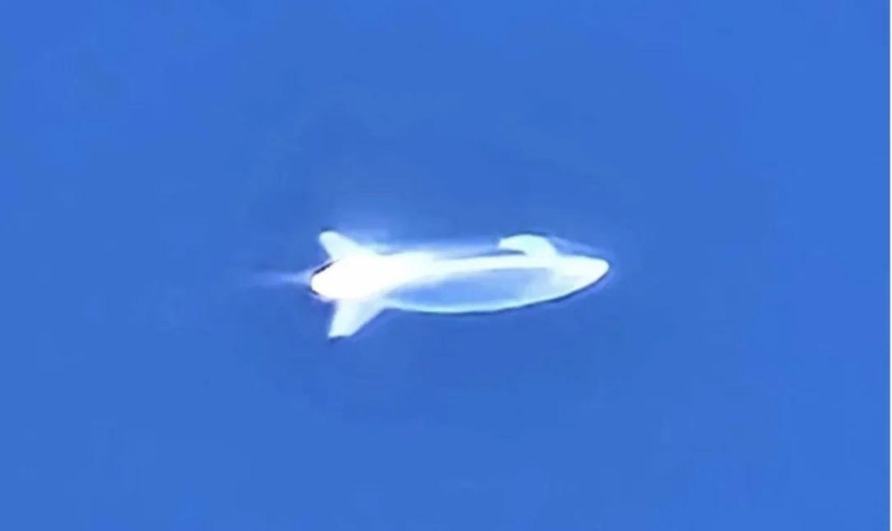
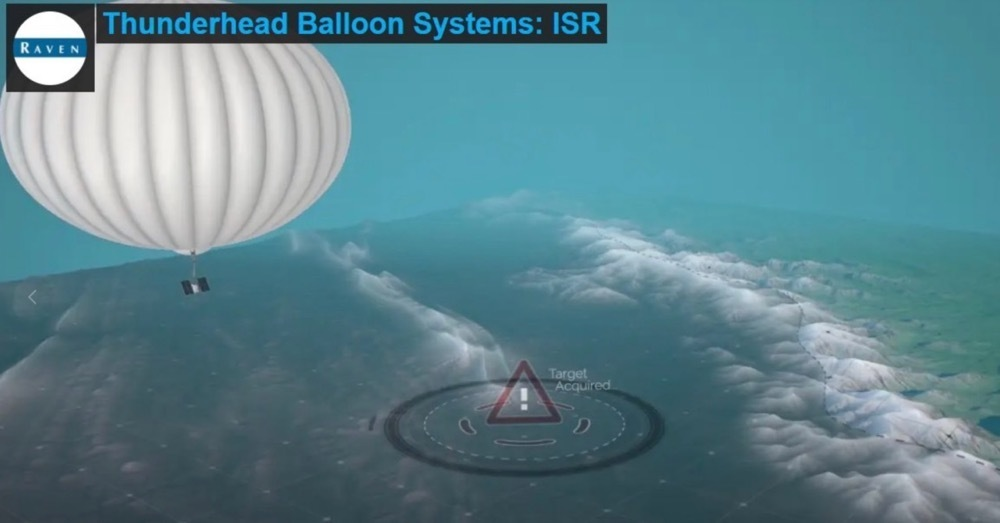
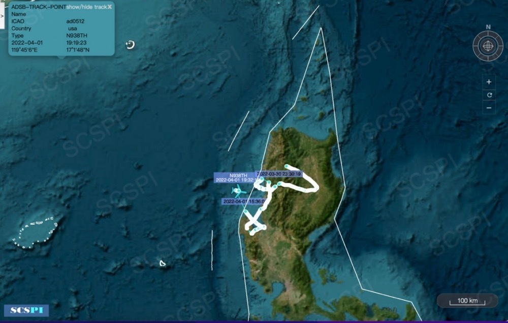
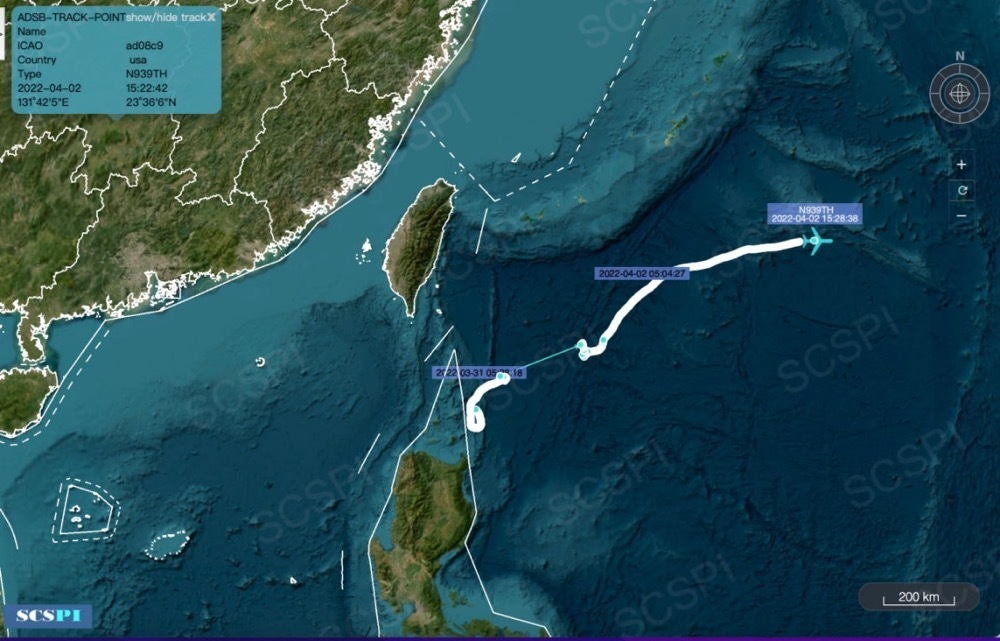
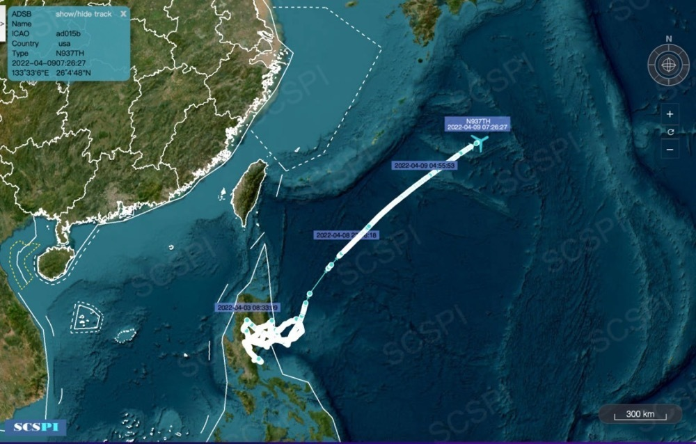
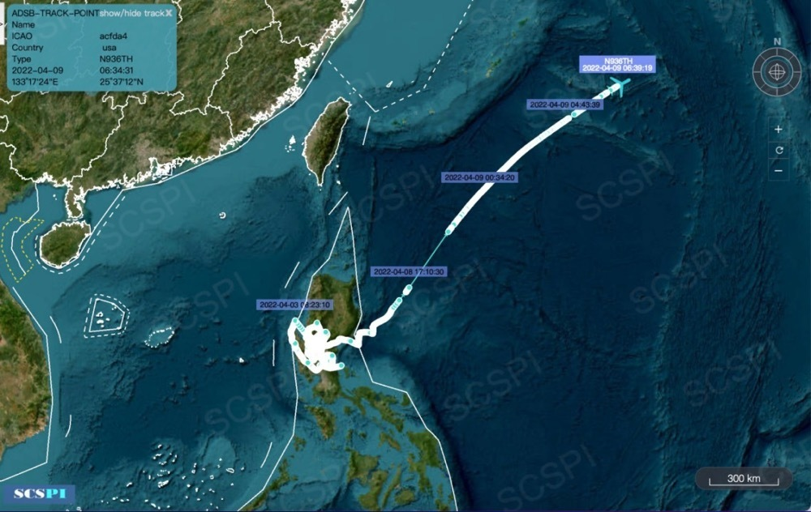

# 美军部署高空飞艇（气球）侦察南海

12月23日《南华早报》报道称，近日在菲律宾苏比克湾附近的南海上空发现不明飞行器，后被证实为平流层飞艇。关于该飞艇的照片拍摄于菲律宾苏比克湾的吕宋岛，首发于脸书（Facebook），后被多家媒体转载。尽管包括《南华早报》在内的多家媒体均表示，没有证据表明这个飞行器属于中国，但多数均含沙射影中国。美国“战区”网（The
Warzone）声称，该飞艇的外形与中国研发的“天恒”号飞艇相似，并由此猜测该飞艇属于中国，用于监控南海岛礁或侦察美军基地。

_图源：《南华早报》_

境外不少媒体和观察家似乎形成了思维定势，即“南海的任何事情都与中国脱离不了干系”, 频繁在南海制造与中国有关的“大新闻”。

殊不知，这艘飞艇更大可能属于美国。首先，美在菲律宾有各种军事存在，且近日美菲军事互动频繁，在苏比克湾附近出现此类飞行器，美军的嫌疑最大；此外，美军此前已有类似部署。据“南海战略态势感知”掌握，在2022年美菲“肩并肩”演习期间，2022年3月底至4月初，美军就至少部署了四艘类似的飞艇。

据ADS-
B信号，这四艘高空飞艇的ICAO号码分别为AD0512、AD08C9、AD015B、ACFDA4，均起飞于菲律宾克拉克基地，在南海和菲律宾海开展侦察活动，每艘飞艇的活动周期在1周左右。其中，AD08C9的活动时间为3月30日-4月1日、AD08C9的活动时间为3月30日-4月2日、AD015B的活动时间为4月2日-4月9日、ACFDA4的活动时间为4月2日-4月9日。它们都来自于美国Raven
Aerostar公司，主要任务大概率是为“肩并肩”演习提供情报支持。

Raven Aerostar公司与美国国防部关系密切，曾多次参与美军演习。2021年9月15日，在挪威安多亚“雷霆云”实弹演习期间，Raven
Aerostar公司曾发射此类高空飞艇，用于探测演习区域中的模拟目标。

_图源：Raven Aerostar公司_

高空飞艇/探测气球项目是美国陆军和陆战队正在探索的多域传感系统（MDSS）概念的一部分，将填补陆基、空基与天基情报监视侦察（ISR）之间的空白。美国此类高空探测气球的作业高度一般在平流层大约15000-20000米，一次能部署100天，试验最长时间为300天，可中途回收，作业半径为50公里（相当于作业面积7850平方公里），作业分辨率为5厘米。具有通信、导航、遥感等一体化功能，与卫星、侦察机等侦察手段相比，成本更低、滞空时间更长、分辨率更高。

另外，值得注意的是，这是美国在南海对中国开展“灰色地带”竞争的又一重大尝试。这些飞艇并非美国国防部或美军资产，与美军租用民用飞机在南海进行抵近侦察有异曲同工之处。一方面，此举是希望通过民间力量来弥补美军平台及传感器数量的不足；另一方面，更重要的是用来探索或拓展美国军事行动的边界。

美菲“肩并肩”2022演习期间部署的飞艇活动轨迹

_美军租用高空飞艇AD0512的活动轨迹_

_美军租用高空飞艇AD08C9的活动轨迹_

_美军租用高空飞艇AD015B的活动轨迹_

_美军租用高空飞艇ACFDA4的活动轨迹_

