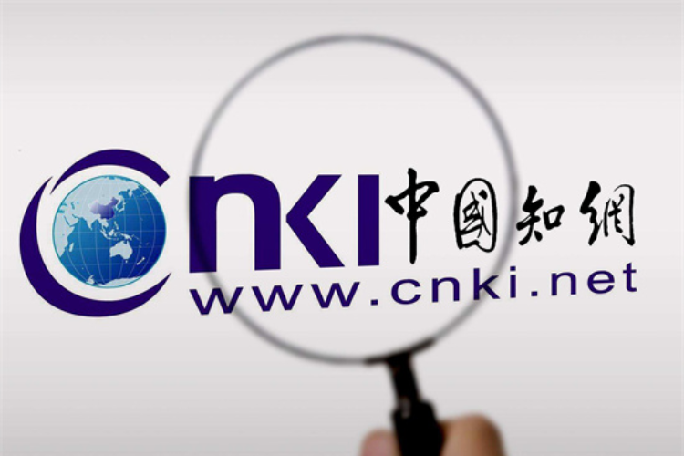

# 解读知网垄断案：不止被罚5％，还承诺数据库三年降价30％

历经227天调查，知网涉垄断案“靴子落地”。

12月26日，市场监管总局通报这起垄断案的处罚结果，知网因滥用市场地位被罚8760万元，系上一年度销售额5%，同时责令知网作出全面整改。

南都记者梳理1.5万字的行政处罚决定书发现，本案的相关市场界定为中国境内中文学术文献网络数据库服务市场。知网被指从2014年开始，滥用市场支配地位实施“不公平高价”和“限定交易”行为。

据南都记者了解，知网案是市场监管总局今年查处的首起平台经济领域滥用市场支配地位案件，也是继去年阿里、美团“二选一”案后，又一起具有典型意义的执法案例。在罚款之外，知网落实市场监管总局要求，公布15条整改措施，包括与期刊、高校解除独家合作协议，数据库价格三年内下调30%以上等。

“这种整改措施比罚款更具实际意义，影响广泛而持久。”有反垄断专家告诉南都记者，反垄断执法的目的是要通过执法消除垄断行为的消极影响，恢复相关市场的竞争。在罚款的同时敦促企业全面整改，这体现了反垄断执法中坚持依法规范和促进发展并重的原则和理念。

一

**考虑平台多边市场特性，区分电子书和文献数据库市场**

今年5月13日，市场监管总局对知网涉嫌垄断案进行立案调查。12月26日，总局通报知网垄断案的结果。据南都记者了解，这是今年查处的首起平台经济领域的滥用市场支配地位案件。

根据《反垄断法》规定，我国禁止滥用市场支配地位行为的分析步骤为：界定相关市场——认定经营者在相关市场上的市场支配地位——认定经营者从事了滥用市场支配地位行为且没有正当理由——分析滥用行为是否具有竞争损害效果。

按此分析框架，界定相关市场通常是关键的第一步。行政处罚决定书显示，执法机构将知网案的相关市场定为“中国境内的中文学术文献网络数据库服务市场”，并提取“中文”“文献”“数据库”三大关键词，将其与其他相关商品市场区分。

以电子图书数据库为例，它主要汇集科技图书、学术专著及各类畅销图书等图书资源，一般较为滞后、更稳定、更新周期长。而中文学术文献网络数据库主要汇集学术期刊、学位论文、会议论文等学术文献，具有及时性、前沿性、动态更新等特点。除了综合搜索、阅读、下载等一体化功能，还能够根据服务数据提供文献引用分析、学术成果产出等多维度统计服务。

再与学术文献网络搜索服务比较，中文学术文献网络数据库服务经营者往往承担着学术资源网络版本出版发行商的角色，需要向版权方支付使用费，通过兜售数据库及增值服务盈利。学术文献网络搜索服务则仅展示文献的题录、摘要等，无法阅读、下载，更毋论学术影响力分析，因此一般不向版权方支付费用，主要通过互联网广告销售盈利。

最后跟学术文献网络数据库相比，行政处罚决定书指出，由于研究内容、学术传播、语言偏好等方面的差异，两者均有特定的用户群体。多年来，未出现外文学术文献网络数据库服务经营者实际发展为中文学术文献网络数据库服务经营者的情况。

以上相关商品市场的经营者，如果想转向中文学术文献网络数据库服务，均面临较高门槛。原因在于中文学术文献网络数据库服务经营者不仅要获得《网络出版服务许可证》《电子出版物出版许可证》等资质并经行政审批，还需获得足够数量的学术文献资源和一定规模的用户，并投入较高成本以搭建相关基础设施，建立营销渠道等。因此，其他经营者短期内难以实现市场进入。

基于此，反垄断执法机构指出，知网案所涉的中文学术文献网络数据库服务市场与电子图书数据库服务、学术文献网络搜索服务、外文学术文献网络数据库服务，在商品特性、主要功能、经营模式等方面有差异，不具有紧密替代关系。

同时，充分考虑平台经济领域的显著特性，市场监管总局认为涉案相关市场属于多边市场——主要服务中文学术期刊出版单位、高校、科研院所、公共图书馆、个人用户等拥有学术资源和使用数据库服务的两类群体，其显著特征是具有跨边网络效应，各边用户对中文学术文献网络数据库服务的需求紧密关联。

四川大学法学院创新与竞争法研究中心主任袁嘉分析认为，这次知网案关于相关市场的界定是一大亮点，既考虑到互联网平台的多边市场、网络效应等特点，也考虑到互联网服务本身的特性——特别是搜索服务和数据库服务的区别。

二

**知网市场份额接近七成，文献下载量达17.4亿次**

接下来，反垄断执法机构进一步论证，知网的哪些特征优势能够证明其在相关市场具有支配地位。

一个明显的表现是，市场份额超过50%。从数据库服务收入来看，2014到2021年间，知网在中国境内中文学术文献网络数据库服务经营者合计服务收入中占比均超过50%，最高达到69.38%。从文献下载量看亦如此，通过知网实现的全文下载量在2021年达到17.4亿次，超过76%中文学术文献全文下载来自知网。

用户的使用情况，与知网收录的学术资源数量有直接关系。数据显示，知网数据库收录了95%以上正式出版的中文学术文献。数量最多、最全，且学术资源质量更高。

执法机构披露，截至2022年5月，与知网合作的北京大学中文核心期刊共1906种，占总数的96.7%。与知网就博硕士学位论文进行合作的985和211、“双一流”高校共计136家，占总数的91.89%。

这也就不难理解，截至2022年5月，知网共拥有机构用户2万多家，个人注册用户1.23亿人，其中覆盖90%以上的高校用户，其他类型用户覆盖率均在60%以上。

行政处罚决定书还披露行业竞争状况。HHI指数（赫芬达尔—赫希曼指数）显示相关市场高度集中，呈现一家独大的市场格局。知网市场份额最高且整体呈增长趋势，长期保持较强竞争优势。

因此，知网在与用户的谈判中，拥有较强的议价能力。知网基本以一年为限签订合同，并在续签时提高价格。但据执法机构调查，在知网数据库持续涨价的情况下，其机构用户数量在2014到2021年间仍保持年均2%的增长。部分用户在停用后，又再次续订。

由此不难看出，用户对知网的高度依赖。知网掌握大量的核心学术资源，具有很强的锁定效应。执法机构了解到，知网数据库服务具有事实上的学术评价功能，不仅直接衡量学术影响力，还与国内主要学术评价体系深度关联。国内高校、科研院所在评价、评级管理中，普遍将研究成果被知网收录作为基本考核要求。用户转向其他平台的成本高、难度大。

不仅如此，知网还具有较为强大的财力和先进的技术条件。2021年，知网营收17.52亿元，面向50多个行业设立分公司，在各个省（自治区、直辖市）均设立办事处，拥有1000余人的销售团队，设有9个数据加工基地，数百名技术工程师，以及100余项具有自主知识产权的各类数字出版技术。

这样的技术能力使得知网在关联市场也具有显著优势，包括学术不端检测服务市场。与其他平台相比，知网依托海量学术资源开发的学术不端检测系统已成为国内学术期刊出版单位、高校、科研院所和个人用户普遍使用的检测工具。

综合上述因素，反垄断执法机构认定，知网在中国境内中文学术文献网络数据库服务市场具有支配地位。

三

**独家合作对象不断增加，一年向竞争对手发函3200件**

利用市场支配地位，知网具体实施了何种滥用行为？从总局公布的行政处罚决定书可以看到，主要集中在要求期刊和高校独家授权，以及不公平高价销售数据库两方面。

知网作为学术资源平台，获取学术文献尤其是核心期刊、博硕学位论文等数量越多、质量越高，就越能提升其在市场中的影响力。为确保自身竞争优势，知网自2014年以来，通过签订格式化独家合作协议、设定奖惩方法等方式，锁定大量学术文献资源。

证据显示，知网与学术期刊出版单位约定，独家使用期刊文献的数字化汇编和复制权、数字化制品发行权、信息网络传播权等权利，同时要求合作对象不得向其他竞争性平台授权。在此合作模式下，知网每年达成独家的期刊数量为920种至1525种不等，其中北京大学中文核心期刊占比62%以上。

同样的模式，知网与高校签订的独家合作协议也明确，高校未经知网同意不再向其他机构或个人提供博硕士学位论文的数字形式传播。自2014年以来，与知网达成独家合作的高校数量和占比逐年增长。截至2022年5月，已达到490家，占其合作高校总数的63.1%。

为保证独家合作的顺利实施，知网还采取多项奖惩措施，包括增加版权使用费、免费使用查重服务等。

调查结果示，知网根据所签合同的性质，决定所支付版权使用费的多少。如学术期刊出版单位与知网签订非独家合作协议，仅能收取销售额11%的版权费，年收入大多在万元以内。与知网达成独家合作的，将能获得数倍以上的版权使用费。与高校的合作亦然，签订独家合作协议将带来收入的大幅增加。

另外，知网还以免费提供查重服务为交换条件，换取学术资源提供方的独家授权，进一步锁定学术资源。

如发现合作对象在其他竞争性平台发布文献，知网将要求两者停止合作，同时向竞争性平台发函，要求删除相关数据。如不配合发函，知网则暂停支付版权使用费。执法机构指出，自2014年以来，知网要求学术期刊出版单位发函超过3200件。

在调查过程中，针对独家合作的一系列情况，知网提出未强迫合作对象签署独家合作协议，同时结合相关市场情况和行业情况，独家合作形式具有一定程度的合理性。

市场监管总局分析认为，知网提出的理由不能成立。虽未强迫独家合作，但知网通过独家排除、限制竞争的主观意图明显，破坏了公平竞争的市场秩序。同行业竞争者也较少采取独家模式，知网的行为不利于行业规范健康发展，不具有合理性。

对于知网所称“独家合作模式具有保护知识产权的效果”，市场监管总局认为大量证据和诉讼表明，独家合作与知识产权保护没有必然联系。

相反，独家合作限制了学术资源的传播渠道，影响了学术期刊获得更多市场机会。尽管知网提出近年来知网独家合作学术期刊的被引用量和下载量均稳步提升，但执法机构认为这并不能说明独家未产生不利影响。如果不存在独家合作，会更利于学术期刊广泛传播。

四

**数据库价格年均涨幅超10%，实现涨价续订的销售获高提成**

近年来，陆续有高校不满知网数据库服务的费用过高，多次传出停止合作的传闻，令知网陷入“店大欺客”的争议。这次市场监管总局公布的行政处罚决定书同时披露了知网数据库的销售模式。过高涨幅的背后，是定价机制不透明，对涨价销售的激励措施，以及不公平手段持续推高价格。

执法部门经调查发现，知网数据库的成本基本长期稳定。一方面，知网与合作对象的合作期限绝大部分超过三年，知网每年支付的版权费用基本稳定，因此学术文献采购成本长期稳定。另一方面，知网通过技术和流程的优化，使数据加工效率不断提高，加工成本不断降低。在每年数据加工量基本稳定的情况下，知网的数据加工成本基本稳定。

在成本稳定的前提下，知网连续多年以较大幅度提高数据库服务价格，自2014年以来年均涨幅达10.06%。用户采购数据库的年均价格涨幅超过30%的有66家，10%到30%之间的有622家。将2021年的采购价格与2014年对比，价格涨幅高于4倍的有91家，高于3倍的有157家。

这一涨价幅度明显高于同行竞争者。2014年以来，知网同行业竞争者数据库服务价格平均涨幅均不超过4%。知网数据库产品的毛利率远高于行业平均水平。

在每年更新合同并涨价之余，知网还通过不公平的手段持续推高数据库服务价格。

比如，从期刊总库中挑选学术价值较高的部分独家合作期刊组成个刊数据库单独销售。如此一来，许多用户需要同时购买期刊库和个刊库才能满足使用需求。原有的期刊库价格未降，新增的个刊库价格连年走高，用户购买所需金额自然大幅上涨，部分用户采购成本上升3倍以上。

更为根本的，知网在销售数据库时采取高定价、高折扣空间的价格策略，价格折扣无明确标准且不公开透明，使其能够通过提供不同的报价和折扣方案，提高了数据库服务整体价格。

其中，影响数据库服务价格的因素还包括同时在线的用户数量。机构用户为追求能够更多人同时在线，减少出现数据库无法登录、无法下载、下载掉线等问题，不得不接受知网的涨价要求。

从知网内部，执法机构还了解到，知网销售数据库以推动涨价作为主要目标，要求用户每年续订数据库服务的价格涨幅在10%以上。为确保涨价目标，知网内部采取了严格的管理和奖罚措施，明确销售人员获得一定比例的提成，如续订且实现价格上涨则提成比例更高。

五

**罚款占比为何是上一年度销售额的5%？**

综合以上调查分析，市场监管总局认为，知网滥用在中国境内中文学术文献网络数据库服务市场的支配地位，通过签订并实施独家合作协议，要求学术期刊出版单位、高校只能向当事人提供学术文献数据，并以不公平的高价销售中文学术文献网络数据库服务，排除、限制了相关市场竞争，侵害了用户的合法权益，破坏了良好的学术生态，影响了中文学术文献网络数据库服务市场规范健康创新发展，已构成滥用市场支配地位。

根据《反垄断法》第二十二条第一款，禁止具有市场支配地位的经营者以不公平的高价销售商品和没有正当理由，限定交易相对人只能与其进行交易。市场监管总局责令知网停止违法行为，并处2021年度中国境内销售额17.52亿元的5%，共计8760万元的罚款。

南都记者盘点发现，知网垄断案是继去年阿里、美团“二选一”案，市场监管总局查处的第3起平台经济领域的滥用案件，也是今年的首起。此次知网被罚8760万元，占其2021年中国境内销售额5%。如何看待这笔罚单？

中国社会科学院大学竞争法研究中心执行主任、法学院副教授韩伟认为，知网实施的限定交易与不公平高价行为对市场发展造成的损害明显，且违法行为从2014年开始实施，持续时间长，并引发社会各界的强烈关注。执法部门综合有关考虑因素，并结合知网积极整改等情况，处以5%的罚款具有合理性。

南都记者注意到，知网案公布后，一些观点认为罚款比例偏低。对此袁嘉表示，5%的罚款占比属于正常处罚的范围，既不是从轻也不是从重，属于一个比较中部的区间。当然和美团、阿里案相比，知网营收的绝对数额也相对较低。

上海交通大学特聘教授、国务院反垄断委员会专家咨询组成员王先林告诉南都记者，反垄断执法机构确定具体罚款数额时，应当考虑违法行为的性质、程度、持续时间和消除违法行为后果的情况等因素。因此，每个案件的具体情况不同，综合考虑的结果也就会有差异。

根据《反垄断法》规定，经营者违反规定，滥用市场支配地位的，由反垄断执法机构责令停止违法行为，没收违法所得，并处上一年度销售额1%以上10%以下的罚款。

值得一提的是，南都记者注意到，知网案并未没收违法所得。

六

**被罚后，知网公开15条整改措施**

相比罚款，南都记者采访发现，多位专家更为关注的是知网如何整改，因为这关乎市场竞争秩序的恢复。

按照市场监管总局要求，知网需要停止独家合作，不得限制学术期刊出版单位、高校等与其他竞争性平台开展学术资源合作。不得实施不公平的高价行为，应以公平、合理、无歧视的价格在中国境内销售中文学术文献网络数据库服务。

12月26日，处罚决定书公布后，知网于官网首页发布公告回应称，诚恳接受罚款、坚决服从，同时公布了15项整改措施。

除了彻底整改与期刊、高校已有的独家合作外，知网将推进行业非独家合作模式，积极倡导并主动推进行业放弃独家授权权利，探索平等合作、共赢发展的非独家合作模式。

知网承诺大幅降低数据库服务价格。用户的学术文献数据库服务实际成交价格三年内下调30%以上，完善定价机制，依据公平、合理、无歧视原则，建立科学、公开、透明的服务定价机制。取消“并发用户数（同时在线人数）”计价方式，以成本为基础，合理制定服务价格。

同时，知网称将纠正不合理销售模式。全面取消各类“个刊”“单刊”，停止拆分数据库单独销售的模式。成立用户委员会，建立数据库服务价格调整用户沟通机制。为强化平台公益属性，知网还称将进一步扩大免费范围，免费开放“高校用户校外访问系统”。

对于知网和作者之间的知识产权侵权纠纷，知网承诺将保护作者合法权益，具体措施包括成立作者服务中心，开发作者服务平台等。知网还表示，将着力解决知网与著作权人，以及期刊、高校等主体之间的授权链条不完整、不规范问题，依法合规取得著作权人授权。

同时，知网将与上游期刊社完善文献作者稿酬支付办法，为作者提供线上线下相结合、方便快捷的稿酬申请、结算和发放渠道；与行业协会、著作权集体管理组织协商制定著作权保护实施方案并予以严格落实。

另外在查重服务方面，知网表态将面向个人开放论文查重服务，定价不高于市场主流产品。完善学术不端检测系统的技术手段、规则算法、数据来源、版权保护等，有效提升用户学术不端检测质量。

为防止再次出现违法行为，知网表示将全面加强合规建设。一方面，建立并完善企业全方位、全流程的合规管理体系，加强对业务行为的有效管控；另一方面，设立合规管理部门，开展反垄断和版权合规风险筛查，完善合规咨询、审查、培训和考核机制，确保依法合规开展经营。

七

**专家：相比罚款，整改措施的影响深远**

韩伟梳理知网的五大方面整改举措发现，“彻底整改与期刊、高校的独家合作”和“大幅降低数据库服务价格”，是对知网案聚焦的独家合作与不公平高价两大竞争关注的直接回应。“保护作者合法权益”、“持续优化相关服务”以及“全面加强合规建设”这三个方面，则是当事方结合该案查处针对自身服务水平与内部管理机制的附带承诺。

韩伟告诉南都记者，“这些整改措施的有效落实，有助于中国境内中文学术文献网络数据库服务市场有效竞争机制的修复。其中对学术文献领域“双重收费”（double
dipping）难题的化解效果，值得期待。”

王先林认为，“本案中，这些整改措施比罚款更具实际意义，影响广泛而持久。这不仅是知网消除违法行为后果所必需的，也非常直接和有力地回应了社会关切的相关热点乃至痛点问题。”

在王先林看来，罚款只是手段。反垄断执法的目的是要通过执法消除垄断行为的消极影响，恢复相关市场的竞争。知网案在罚款的同时，市场监管总局还监督知网全面落实整改措施、消除违法行为后果，以促进行业规范健康创新发展。这也体现了反垄断执法中坚持依法规范和促进发展并重的原则和理念。

袁嘉也表示，此次知网案更需要关注的是通过执法去制止经营者的违法行为，关注知网提出的整改措施对于竞争秩序的恢复以及消费者权益保障方面的作用。

包括公众十分关心的知识产权侵权问题，袁嘉认为这事关知识产权权属、授权规则以及侵权判定等复杂内容。而这些内容，难以在反垄断案件的查处过程中进行非常全面的分析，在已经能够认定垄断行为的情况下，展开全面分析也没有太大的必要性，这是涉及知识产权的反垄断案件中一个普遍难点。但此次知网提出整改方案中对于作者权益保护的明确回应，仍体现了案件执法中对知网如何尊重作者的知识产权等问题的讨论。

南都记者发现，这种“罚款+敦促整改”的执法行为并非首次。此前阿里案和美团案中在作出行政处罚决定书的同时，也都发出要求企业整改的行政指导书。其中美团案，还责令全额退还独家合作保证金12.89亿元。

韩伟研究发现，经济发展伴生的各类反竞争行为的出现，使得反垄断救济措施逐步变化，比如近年全球多个反垄断辖区以及OECD都在热议“临时措施”的适用与革新。在我国，近年来平台经济领域反垄断执法中出现了行政指导方面的探索。一些个案中，反垄断执法部门结合执法发现的问题，引导当事方依法合规经营，这也体现了国内《行政处罚法》明确的“处罚与教育相结合”原则。

“现阶段来看，这种探索对我国竞争文化水平的提升具有积极意义。但应注意聚焦个案涉及的竞争关注，区分法律责任与社会责任。”韩伟说。

出品：南都反垄断课题研究组

采写：南都记者黄慧诗 李玲

