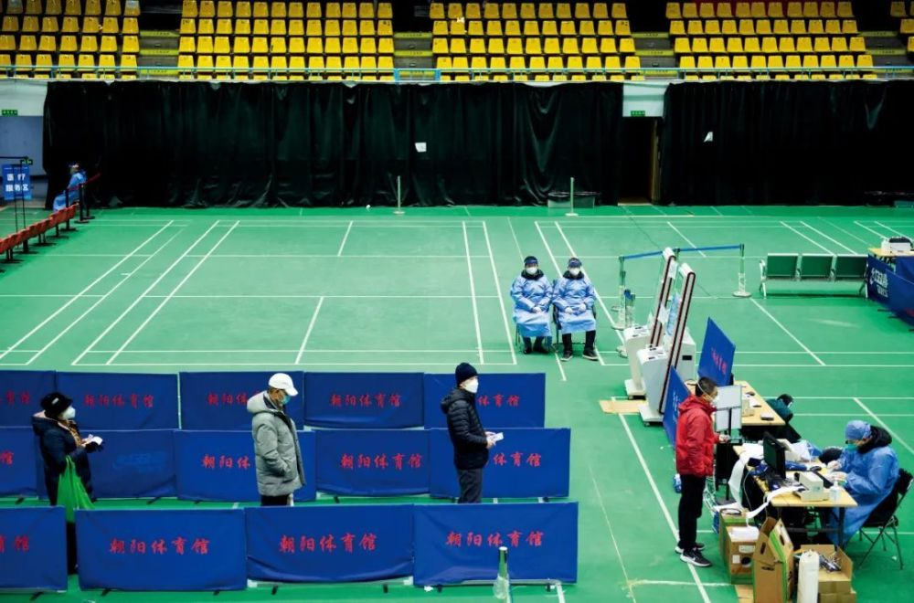
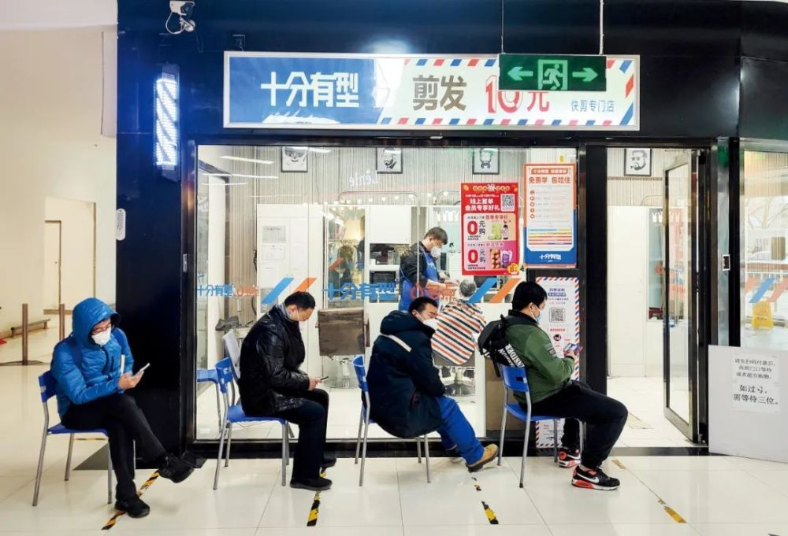
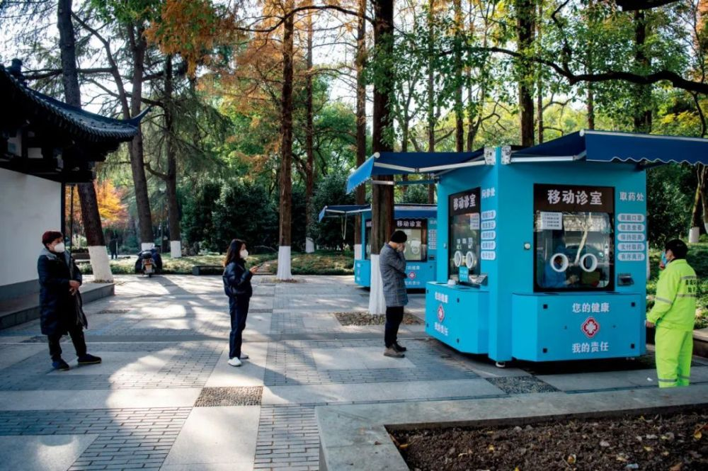

# 防疫大调整：当务之急是压低感染峰值

12月26日晚，国家卫健委宣布了两项重大调整，第一、将于2023年1月8日将新型冠状病毒感染从“乙类甲管”调整为“乙类乙管”。第二、将“新型冠状病毒肺炎”更名为“新型冠状病毒感染”。

根据同日发布的《关于对新型冠状病毒感染实施“乙类乙管”总体方案》（后简称《“乙类乙管”总体方案》）官方解读，当前，奥密克戎变异株虽然感染人数多，但致病力较早期明显下降，所致疾病将逐步演化为一种常见的呼吸道传染病。综合考虑病毒特点、疫情形势、疫苗接种等因素，国内已具备将新型冠状病毒感染调整为“乙类乙管”的基本条件。另一方面，同样考虑到奥密克戎变异株致病力减弱，仅有极少数病例有肺炎表现，决定将“新冠肺炎”更名为“新型冠状病毒感染”。

香港大学生物医学学院教授、病毒学专家金冬雁对《中国新闻周刊》说，这一调整是大势所趋，有助于公众正确认识新冠病毒，但目前全国正处于感染高峰期，疫情防控仍面临诸多挑战。

他建议，降级后仍应把握好新冠防控的“三道防线”，一是继续推进老年人疫苗接种，80岁以上老人要尽快接种第四针，还应尽快推进mRNA疫苗接种；二是储备好大量抗病毒药物；三是做好分级诊疗，防止医疗挤兑。

**纠正了一些令人担忧的现象**

自2020年1月20日，国内将新冠纳入“乙类甲管”之后，至今已将近三年。今年12月初，国家发布“新十条”以来，一直有专家提出应将新冠感染降级管理，但也有专家认为，在中国当前疫苗接种率、医疗资源情况下，降级条件还未成熟。多位专家对《中国新闻周刊》感慨，没想到“靴子落得这么快”，虽然整个12月期间，多地在防疫上已“实质性地将新冠按照乙类管理”。

根据《“乙类乙管”总体方案》，降级管理后，未来对新冠病毒感染者将不再实行隔离措施，不再判定密切接触者，不再划定高低风险区；不再开展全员核酸筛查，检测重点转向医疗机构门急诊患者、具有重症高风险的住院患者等，及养老院、社会福利机构的脆弱人群。12月26日，国务院疫情联防联控机制同时下发了五个相关细则文件，涉及“乙类乙管”后的疫情监测方案、检测方案、重点人群、重点机构、重点场所防控指南、个人防护指南等内容。

_2022年12月24日，北京市部分医院在体育馆里开设简易发热门诊，为市民提供诊疗、开药等服务。图/新华_

检测方面，纠正了此前一些令人担忧的现象，比如明确要求有症状的医务人员开展抗原或核酸检测，降低疫情在医疗机构内传播风险。最近两周内，多位医生对《中国新闻周刊》反映，由于医院正面临感染高峰，承压较大，医院要求医护感染后要尽快返岗。专家担心，这可能进一步加剧院内感染规模，让医院成为“疫情放大器”。

对当下最令人担忧的老年人群体，新发布政策的一个亮点是强化了对养老机构的严格管理，比如要求：疫情流行期间，养老院工作人员须每周开展2次全员核酸检测，老人每周开展2次抗原或核酸检测，工作人员与老人的检测隔日交替开展。

任何外来人员进入养老院，都要查验48小时内核酸检测阴性证明，并同时现场开展抗原检测。另外，疫情严重时，可由当地党委政府或联防联控机制经科学评估适时采取封闭管理举措，防范疫情引入和扩散风险。

养老院的感染趋势也在一定程度上代表了对重症资源的需求。香港第五波疫情中，一个最大的教训就是养老院因防控不当而暴发大规模感染，造成大量老人死亡。据香港医院管理局数据，2022年1月1日至5月25日期间，全港共有超过95%的养老院暴发疫情，共造成52000余人感染，其中4996人离世。多家养老院感染比例达到79%以上，部分机构死亡率甚至高达10%。

多位专家建议，在感染高峰期，养老院必须严管，工作人员严格实行闭环管理，而且应重点监测养老院每天的新增感染数字并准确上报。

**“压平曲线、推后峰值”**

实际上，这些关于医院、养老院的进一步约束性措施，都相当于一种压峰措施。德国华裔病毒学家、埃森大学医学院病毒研究所教授陆蒙吉对《中国新闻周刊》提议，应根据疫情形势变化，尤其面对大规模传播时，采取适当的“压峰”措施，如限制堂食、减少聚集性活动、增加社交距离等控制人群流动的办法，以降低疫情高峰期集中感染人数，减少对医疗秩序的冲击。

国家传染病医学中心主任张文宏指出，在保障社会基本活动的同时要尽量压低第一波疫情的曲线，则全社会有望在维持一定非药物公共卫生（NPI）措施的基础上，顺利应对后续几波疫情，整个社会逐步恢复开放。

此前，浙江、广东、山东、江西等多地已经提出“压平曲线、推后峰值”的防疫策略，但一些地方在提出口号后，并未落实具体压峰措施，只有浙江、山东、上海等少数省市出台了相应政策，比如上海提醒民众“周末非必要不外出”，浙江建议快递小哥、出租车司机等重点人群，继续开展重点行业核酸检测，养老院、福利院、中小学、幼儿园等重点场所，继续查验核酸检测阴性证明等。

《“乙类乙管”总体方案》进一步明确：要强化疫情监测与应对，研判疫情发展态势，依法动态采取适当限制聚集性活动和人员流动等措施压制疫情高峰。

值得注意的是，在重点人群、重点机构、重点场所的防控指引方面，新政明确了疫情严重时，短期内可减少人群聚集的措施：会议中心、体育场馆、文化场馆、市场商超取消或推迟非必要的大型活动；商场和超市、银行、农贸（集贸）市场等营业场所停止促销等人员聚集活动，商场、银行等缩短营业时间；相对密闭的娱乐休闲场所、洗浴场所、宗教活动场所暂停营业或开放；餐饮场所应限制同餐人数，或取消堂食。

美国耶鲁大学全球健康政策与经济学副教授陈希对《中国新闻周刊》形容：“这是久盼的亮点。”他建议，在即将到来的春运期间各地必须要采取一定的压峰措施，比如鼓励老人和脆弱群体减少去聚集性场合。

陆蒙吉认为，明确具体的压峰措施是一个进步，因为各地医疗系统现在确实面临很大的压力。在他看来，现在很多地区还没有到达感染高峰，因此如果能采取一些压峰措施拉长感染曲线，延缓峰值到来，就可以为自己“赢得时间”，在这期间尽可能增加ICU床位、抗病毒药物等医疗资源储备，“需要的资源储备量很大，不可能一下子全部解决，因此各地必须要争取时间”。

_2022年12月25日，北京市朝阳区一理发店门外，人们排队等待理发。摄影/本刊记者
贾天勇_

他也指出，降为“乙类乙管”之后取消了全部隔离措施，也就缺少了一种最重要的压峰手段。据陆蒙吉介绍，在德国，目前已经度过了奥密克戎的三波高峰，从BA.1到BA.2再到BA.5,今年冬季的疫情没有出现明显的反复，但即使如此，德国大部分州仍保留了感染者隔离措施。

一位不愿具名的公卫专家建议，国家未来应进一步明确如何执行压峰措施，什么时候开始压峰，何时应把措施取消。

陈希表示，“有几个明显的信号，比如急诊收治患者数、重症人数、普通病床占用率、ICU床位使用率等，美国会监测医院的这些数据，并将压峰措施落实到医院辐射范围内的具体社区，非常精准压峰。”他说，中国目前的主要考验是地方政府缺乏对医院层面的数据监测，并将这些数据和当地防疫决策有效结合起来，“这方面还有很多细化的工作要做”。

**重点是“防重症”，不是“治重症”**

新冠病毒感染回归“乙类乙管”后可能面临什么风险？

国家疾控局传防司司长雷正龙12月27日解读称，一是调整后由于不对传染源及密接人员采取隔离措施，可能造成新冠病毒感染率呈现快速上升趋势。二是短时间内新冠病毒感染者大幅增多将明显增加就医需求，同时医务人员自身感染将导致医疗服务供给减少，因此调整初期部分地区将可能出现医疗资源相对不足的现象。三是调整初期，部分公众对新冠疫情的快速上升可能出现焦虑情绪，担心新冠感染后的健康危害。

《“乙类乙管”总体方案》明确提出，降级后的防疫目标是“保健康、防重症”。雷正龙说，为了确保新冠病毒感染“乙类乙管”平稳实施，有效防范可能出现的风险，一方面要提前做好医疗资源准备，完善分级分类诊疗机制；另一方面要加强药物供应保障。

当下，三级医院最主要的问题是缺人，之前感染的医护人员本周虽开始大批返岗，但和需求相比仍有很大缺口。目前，多数医院都开始将其他科室开放收治新冠病人，“比如我所在的医院，康复科、内分泌科、消化科、肾内科等都来收治新冠，但问题是，这些科医生不像呼吸科或感染科有治疗新冠患者的经验。”一位安徽三甲医院感染科主任说，因此总体来说，真正能治疗新冠的医护人员是很不足的。

《“乙类乙管”总体方案》对三级医院的重症资源提出了很高要求：确保综合ICU监护单元可随时使用，通过建设可转换重症监护单元，确保需要时24小时内重症监护资源增加一倍。但前述感染科主任说，这个要求很难实现，以他所在医院为例。12月初防控政策松动后立刻去采购呼吸机，目前也只采购到少数几台，“呼吸机都断货了”，“现在我们连吸氧管连接头都缺，因为以前医院对这方面需求不多，平时根本没有储备”。

另一位北京某三甲医院血液科护士长也对《中国新闻周刊》说，医院不可能在短期内增加太多重症监护设备，她所在医院目前已经把很多科室的心电监护设备都调去了急诊和感染科。

国家卫健委医政司司长焦雅辉12月27日在解读方案时介绍，在床位资源方面，国内二级以上医院总床位数561.6万张，近期床位使用率在60%上下浮动。全国三级医疗机构重症医学床位11.2万张。从使用情况看，近期重症床位整体使用率在55%〜60%之间波动。

多位专家指出，中国的人均ICU床位占有率原本就比欧美低不少，现在更应该思考：如何更好整合有限医疗资源救治真正的重症患者。

陆蒙吉提出，从国外的经验来看，对于有基础病老年人这类高风险群体，最关键的是早期能及时进行抗病毒药物治疗，防止他们发展成重症，假如在感染后第二天就启动抗病毒治疗或配合一些基本的氧疗，后期发展成重症的可能性很小。在他看来，重点在于“防重症”，而不是“治重症”。

陆蒙吉认为，关键在于是否能将有潜在重症风险的患者及早“识别”出来，及时让他们进入重症管理模式。他说，“现在国内为何重症病例看起来相对多，因为很多老年人都是在家扛了好几天才到医院，这时候能采取的治疗措施已不多了，只能靠机体去克服炎症。这么多重症患者又会造成ICU床位不足，也造成了一些额外死亡，但其中大部分死亡其实是可以避免的。”

前述公卫专家表示，抗疫进行到现在这一阶段，在“防的措施”和“治的措施”之间，应有一个更科学的协调机制，“坦率说，如果防不好，治的压力就非常大”。

_2022年12月22日，浙江金华市婺城区婺州公园内，由核酸采样点改造而成的移动诊室正式投入使用。图/人民视觉_

**“最需要医院救治数据”**

12月27日的国务院联防联控机制新闻发布会上，中国疾控中心传防处主任医师殷文武介绍，新冠病毒感染回归到乙类传染病后，疾病监测报告及对外发布将调整为公布现有住院病例数，现有重症包括危重症以及累计的死亡病例数，删除既往密切接触者的报告情况，不再区分本土的病例和输入的病例。频次调整为一个月公布一次，在中国疾控中心网站发布。

他还指出，防控措施调整后，中疾控采取多种措施收集相关的疫情信息，评估疫情的强度及发展趋势，其中包括：开展法定传染病网络报告，搜集一些哨点医院发热门诊、重症、死亡情况，同时搜集药店发热药品的销售数据、12306上的求救信息等大数据。他说，“各地也在积极开展工作，有些在社区开展感染情况调查，有些采取网络问卷调查，这些都弥补了报告信息的不足，对整个疫情评估起到了很大的作用。”

一位长期进行疫情模型预测的数据专家对《中国新闻周刊》指出，目前各地主要通过模型预测感染趋势，但就模型预测而言，“相较确诊数字，我们最需要的数据其实是医院救治相关数据，比如发热门诊患者数、普通病房和ICU感染者数字，因为奥密克戎重症率相对而言是固定的，因此可以根据医院就诊数据反推整个人群的感染规模并预测趋势”。

根据最新发布的《新型冠状病毒感染“乙类乙管”疫情监测方案》，要求各地依托全国流感监测网络哨点医院，开展监测，每日统计门（急）诊和住院患者人数、具有急性发热呼吸道症状人数、核酸检测数和阳性数、抗原检测数和阳性数，按照流感监测网络流程上报。

前述数据专家指出，这些数据的收集和上报，对评估和预测一个地区的感染规模、感染高峰和重症高峰非常有帮助。此外，他还建议有条件的地区应尽快开展核酸或抗原抽样调查，阳性检出率比通过新冠调查问卷收集上来的相关数据要更精准一些。

就医院自身而言，数据监测的目的是为了提前发出预警。《“乙类乙管”总体方案》首次划出了一道医疗机构挤兑的预警线：当定点医院、亚定点医院、综合医院可收治新冠患者的救治床位使用率达到80%时，医疗机构发出预警信息。

陆蒙吉分析，80%的预警线意味着所有床位只剩下20%的冗余度，按感染者的指数增长趋势，在医院发出预警的时间点一周之内，可能就会有四五倍以上的新增重症病人，很快就会击穿医院已有的重症资源。

根据《新型冠状病毒感染“乙类乙管”疫情监测方案》，各地要对部分陆路、航空和海港口岸城市入境人员、哨点医院就诊患者、重点场所和重点人群中核酸检测阳性标本，以及重症和死亡病例标本等开展新冠病毒全基因组测序工作，实时掌握病毒株变异趋势，及时捕获新变异株，分析变异对病毒特性、免疫逃逸能力等的影响。

陈希提醒，在放宽入境管控措施后，未来要在口岸加大病毒测序，如果发现有更大威胁的新变种入境，应当及时调整。

世界卫生组织总干事谭德塞在12月21日的新闻简报会上说，2022 年已经接近尾声，与一年前相比，我们在大流行病方面的处境要好得多，自
1月底全球奥密克戎感染达到峰值以来，每周向WHO报告的新冠死亡人数至今已下降了近
90%。但是，监测、检测和测序方面的差距意味着我们对病毒的变化了解不够透彻，“因此我们还不能说疫情已经结束，未来还有太多的不确定性。”

记者：霍思伊

