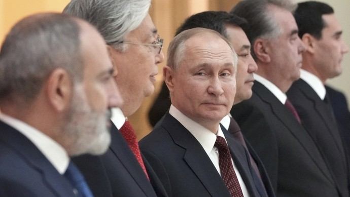

# 临近岁末，普京在家乡开启主场外交，时隔2个月再次邀请这批客人

临近岁末，俄罗斯总统普京又一次进入“忙季”。除了接连召开部门会议，回应记者不断抛来的有关乌克兰局势的提问外，他近日又在家乡圣彼得堡开启一轮主场外交，接待一批来自周边国家的贵客。

26日至27日，独联体国家领导人非正式会晤在圣彼得堡举办，这也是短短2个月后这一非正式会晤今年第二次在俄“登台”。普京在致辞中表示，独联体成员国之间虽然存在分歧，但仍将继续深化合作。

分析人士认为，普京今年罕见地多次利用独联体合作框架内的非例行安排来召开会议，体现俄方将后苏联空间视为重要战略依托，通过外交发力破解乌克兰危机造成的困局。

**会晤频率之高引人关注**

独联体全称独立国家联合体，成立于1991年12月，总部设在白俄罗斯首都明斯克，工作语言为俄语，现有9个正式成员国，分别是阿塞拜疆、亚美尼亚、白俄罗斯、吉尔吉斯斯坦、摩尔多瓦、哈萨克斯坦、俄罗斯、乌兹别克斯坦、塔吉克斯坦。

此次，俄罗斯作为会晤发起方，邀请到绝大多数成员国领导人亲临参会，唯一例外的是摩尔多瓦。该国正在研究是否部分退出与独联体的协议，近年来参加的活动一般停留在部长级别。

不过，硕大的棕色圆桌前，依然齐聚了9位领导人——摩尔多瓦的“缺位”被土库曼斯坦“补齐”。土方于2005年放弃独联体成员国身份，转为联系国，可选择参与对自己有利的项目。此次土库曼斯坦总统亲赴圣彼得堡参会。在两天会期内，他与其他8位领导人一起，就欧亚地区局势和组织的未来规划深入交换意见。

外界注意到，尽管如《俄罗斯报》所言，独联体领导人在新年前夕举行非正式会晤已成为一种传统，但今年各方会晤频率之高依然令人瞩目。

就在2个月前的10月7日，普京刚刚在圣彼得堡召开过一次独联体领导人非正式会晤。当时，迎来70岁生日的普京还收到白俄罗斯总统卢卡申科的贺礼——一台拖拉机。仅一周后，作为今年独联体轮值主席国的哈萨克斯坦，就在阿斯塔纳召开了该组织框架下的元首理事会。媒体公布了近20项合作文件，涉及反恐、经贸合作、应对气候变化等多个领域。

谈及本次会晤，俄总统新闻秘书佩斯科夫此前声称，“国家元首们并没有交换新年礼物的打算，将讨论严肃的事情”，但白俄罗斯媒体还是发现，卢卡申科戴起了一枚戒指——这是热情的东道主为每位与会领导人准备的“薄礼”，上面刻有独联体图案，写有新年祝福。

会晤期间，普京的发言受到舆论广泛关注。他指出，维护欧亚地区的共同安全与稳定是独联体国家合作的关键领域之一，该领域面临的挑战和威胁与日俱增。虽然独联体成员国之间也会存在某些分歧，但重要的是各国将继续开展合作。

**合作基于历史也基于现实**

**中国社科院俄罗斯东欧中亚研究所中亚研究室副主任杨进** 指出，俄罗斯与其他独联体国家的合作，既是历史传统的延续，也基于当前复杂环境下的现实需求。

从历史维度看，独联体国家曾同属“苏联大家庭”，长期以来形成安全上的相互依存、经济上的分工协作，以及文化上千丝万缕的联系。正因如此，当“苏联大厦倒塌”时，一些经济上严重依赖苏联中央财政的国家（如塔、吉、土等），并无强烈的“分家”意愿。这为后来成立独立国家联合体奠定了基础——既保障各国拥有独立主权，又使它们能在同一空间内继续深化合作。

1991年12月，白俄罗斯、俄罗斯、乌克兰三个苏联加盟共和国的领导人在白俄罗斯签署协议，独联体从此登上历史舞台。去年，这一地区性国家间组织跨过三十个春秋。成员国在纪念组织成立30周年的声明中表示，基于共同利益和共同历史，独联体在维护和发展各成员国间的经济、人文和文化历史联系等方面发挥了重要作用，堪称“独一无二的对话平台”。

杨进指出，独联体国家间利益牢牢地嵌套在一起。政治上，后苏联空间是俄追求大国地位和未来复兴的基础性支撑。独联体中的部分国家与俄罗斯是兄弟国家或友好国家，结有联盟关系，与这些国家深化紧密联系有助于俄发挥全球影响力。经济上，独联体国家互为市场，尤其俄罗斯对中亚国家而言是重要的农产品出口市场和劳务移民市场。有数据显示，塔吉克斯坦七成居民依靠俄罗斯劳务移民汇款生活。安全上，各成员国紧密合作，亚美尼亚等独联体国家设有俄罗斯军事基地……

“但合作的同时，独联体内部也不乏分歧。组织影响力的下滑，更是不争的事实。”杨进说，“格鲁吉亚、乌克兰等国在30年间因为各种原因退出组织，成员国从以往的10多个下降至9个。而不少独联体国家领导层的迭代，也使最初的紧密关系呈现倒退和松散化……但即便如此，以政治功能为主要特点的独联体，其地位依然受到俄方重视。它希望在其中发挥大国影响力，进一步赢得政治支持。”

从现实维度看，当下变乱交织的国际形势，更使俄罗斯和其他独联体国家有相互借重的需要。

杨进指出，对俄罗斯而言，后苏联空间政策是俄外交政策的主要组成部分——无论是普京今年出访多个独联体国家，还是更频繁地利用独联体合作框架内的非例行安排，都体现出俄方对后苏联空间的重视，将周边地区视为重要战略依托。

尤其乌克兰危机以来，俄罗斯面临西方极限制裁，外交和经济压力不言而喻。因此俄方发起本次会晤，一方面旨在加强对独联体国家外交，以求打破困局；另一方面也是同周边国家加强沟通，缓解其他独联体国家关于“乌克兰危机下一步可能演变为俄与其他国家冲突”的担忧。

对其他独联体国家而言，第一，无论组织本身的发展，还是地区治理，大国因素的介入都有特殊意义，能起到引领地区合作等作用。第二，它们长期以来与俄罗斯在各个层面的密切联系，使俄罗斯成为非常自然的合作伙伴。第三，地区安全稳定方面呈现的新态势，也需要俄罗斯参与应对。例如哈萨克斯坦今年初的国内骚乱事件，以俄罗斯为首的集安组织立即派遣维和部队，对局势企稳发挥了重要作用。

**上海政法学院欧亚研究所所长李新**
认为，以独联体国家间的合作为基础，俄罗斯等国建立了集体安全条约组织、欧亚经济共同体、关税同盟（后升级为欧亚经济联盟）等地区合作架构。这些组织在年末集中上演“峰会潮”，俄方召集的此次会晤是其中一环。

一个大背景在于，独联体刚成立的上世纪90年代，由于俄罗斯试图投入西方怀抱，对独联体不怎么上心，“可以说该组织是原苏联地区最松散的组织之一”。直到10多年前，尤其是欧盟启动“东方伙伴计划”、急欲拉拢6个原苏联加盟共和国之后，俄罗斯才猛然意识到后苏联空间的重要性，开始加强对这一地区的影响和掌控，尽可能把小伙伴团结起来。

**风险与挑战不容低估**

两位分析人士认为，世界处于动荡变革期，独联体国家的发展受到一系列内外部因素的负面影响，风险和挑战不容低估。

首先，在政治和安全方面，乌克兰危机的外溢风险受到广泛关注。一些独联体国家担心危机加剧冲击本国的安全环境。尽管普京多次重申俄愿就乌克兰危机进行谈判，但目前和平解决的曙光仍未出现。李新指出，一些独联体国家在乌克兰问题上表现出与俄罗斯的距离，这是俄罗斯不得不正视的问题。

安全领域的另一些挑战还表现在，独联体成员国之间存在历史、民族、资源等方面的矛盾，无论是纳卡冲突，还是中亚飞地问题，均难在短时间内解决。这不仅威胁地区安全，也阻碍团结发展。此外，今年的哈萨克斯坦骚乱，以及近年的白俄罗斯、吉尔吉斯斯坦政局动荡，也牵动地区敏感神经。

土耳其安卡拉危机与政策研究中心指出，这也可以解释为何集安组织要在多个中亚国家举行演习，“俄罗斯想继续在上述国家的安全问题上发挥作用。”

其次，在经济领域，受乌克兰危机和西方对俄制裁等因素影响，与俄罗斯有着紧密经贸联系的独联体国家受到波及，通胀加剧，经济压力不小。塔吉克斯坦总统拉赫蒙最近直言，2022年是世界历史上“最困难的年份之一”。

杨进指出，面对困境，独联体国家也在谋求出路，探索推进本币结算等，以降低交易成本的风险。但李新认为，考虑到独联体组织的松散性及其经济实力的有限性，之前提出的自贸区计划等尚且未能实现，至于货币一体化、能源一体化等合作的推进，更牵涉经济主权，恐怕阻力更多。能否落实独联体2030年经济发展战略目标，要打个问号。

最后，域外国家的介入也使形势更趋复杂。杨进注意到，今年美国、欧洲、日本都力度空前地加强对中亚地带的外交攻势和资源投入，而一些独联体国家政要也前往美国与商界人士洽谈。这一方面反映出西方希望独联体国家与俄保持距离，平衡俄罗斯地缘影响力，另一方面也显示独联体国家采取更多元平衡的外交。这将对俄罗斯构成压力。普京能否应因变局，像送出的戒指礼物一般，抓住地区伙伴们的心，考验他的智慧。

