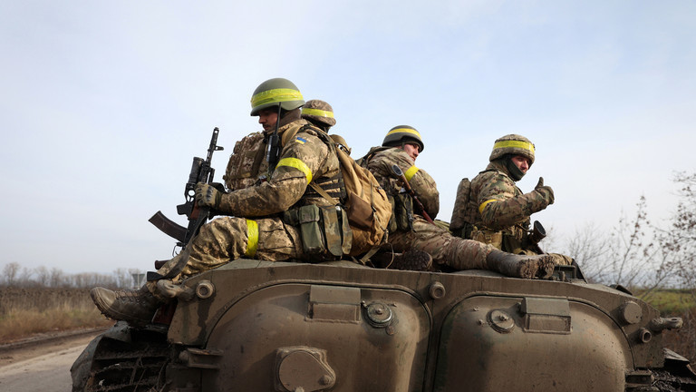
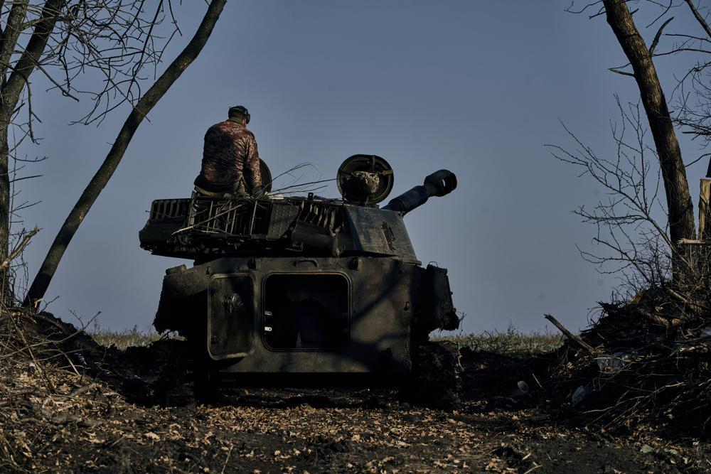
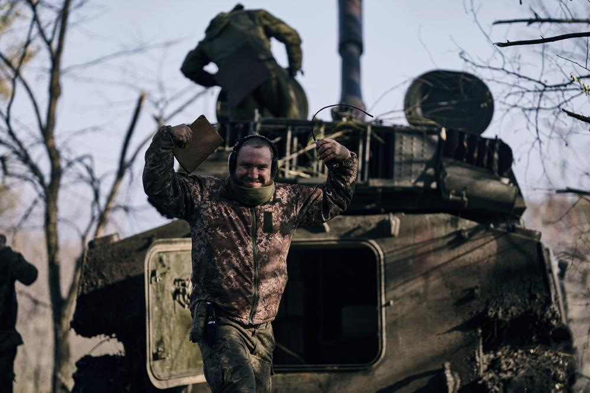
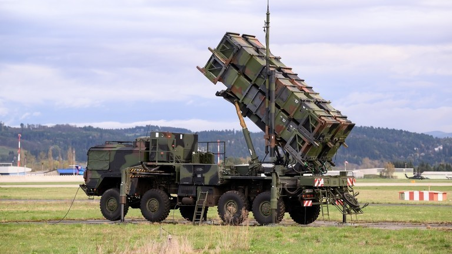

# 乌克兰战争：2023年局势将如何发展？有五种可能

乌克兰战争即将进入第二个日历年。2023年，战争局势将如何发展，战争能在明年结束吗？如何结束？在战场上还是在谈判桌上？还是会一直持续到2024年？几位军事分析人士对此发表了自己的看法。

**1.俄罗斯春季攻势能否成功将是关键的决定因素。**
——英国埃克塞特战略研究所副主任迈克尔·克拉克。“那些试图入侵欧亚大草原上任何一个国家的人，最终都注定要在那里过冬，”克拉克说。

面对大草原的冬天，拿破仑、希特勒和斯大林都不得不让军队继续前进，现在，普京正在他入侵的地面上倒退，正在为冬天坚守阵地，等待俄罗斯在春季发动新的攻势。

双方都需要暂停，但乌克兰人有更好的装备，也更有动力继续前进，我们可以预期他们会保持压力，至少在顿巴斯地区是这样。

在克雷默纳和斯瓦托夫附近，他们非常接近取得重大突破，将俄军击退到40英里外的下一条天然防线，接近他们2月份实际上开始入侵的地方。

当眼前的利益如此之大时，基辅将不愿停止行动。然而，在收复赫尔松之后，乌克兰的攻势可能会在西南部暂停。

越过第聂伯河东岸，向俄罗斯通往克里米亚的脆弱公路和铁路施压，可能过于困难。但永远不能排除基辅发动新攻势的可能性。

2023年，关键的决定因素将是俄罗斯春季攻势的命运。普京承认，大约5万名新动员的军队已经在前线，刚刚动员起来的另外25万人正在为明年的战斗进行培训。

在俄罗斯新部队的命运在战场上尘埃落定之前，除了更多的战争，没有任何其他可能性。另一种可能是短暂而不稳定的停火。普京已经明确表示，他不会停止行动。乌克兰明确表示，该国仍在为生存而战。

**2.乌克兰将在明年春天取得胜利。**
——华盛顿特区的科学家和分析师安德烈·皮昂科夫斯基。“乌克兰最晚在2023年春季完全恢复领土完整，最终将取得胜利。有两个因素促成了这一结论，”皮昂科夫斯基说。

一是乌克兰军队和整个乌克兰民族的动力、决心和勇气，这在现代战争史上是前所未有的。

另一个事实是，在对俄罗斯姑息多年后，西方终于成长起来，意识到自己面临的历史挑战的严重性。北约秘书长延斯·斯托尔滕贝格最近的一份声明最好地说明了这一点。

我们付出的代价是金钱。而乌克兰人付出的代价是鲜血。如果俄罗斯看到武力得到回报，我们都将付出更高的代价。对我们所有人来说，世界将变得更加危险。

乌克兰必然会取得胜利的确切时间，将取决于北约提供改变游戏规则的一揽子军事攻击武器(坦克、飞机、远程导弹)的速度。

我预计梅利托波尔将成为未来几个月(也许几周)的关键战场。占领了梅利托波尔后，乌克兰人可以轻松地向亚速海进发，有效地切断克里米亚的供应和通讯线路。

在乌克兰在战场上取得毁灭性进展后，俄罗斯将在技术会谈上正式同意投降。战胜国乌克兰、英国和美国将塑造一个新的国际安全架构。

**3.看不到战争结束的迹象。**
——伦敦国王学院战争研究系芭芭拉·赞切塔。“普京预计，乌克兰会被动接受其更强大邻国的行动，其他国家不会有实质性的介入。这种严重的误判导致了一场旷日持久的冲突，似乎看不到结束的迹象，”赞切塔说。

这个冬天将是艰难的，因为俄罗斯对乌克兰基础设施的攻击将进一步打击已经支离破碎的乌克兰人民的士气和忍耐力。但事实证明，乌克兰的应变能力是惊人的。他们将坚定不移。战争会拖延下去。

谈判的前景黯淡。为了达成潜在的和平协议，至少有一方的核心要求需要改变。没有证据表明这种情况已经发生，或者很快就会发生。

那么，结局将如何到来呢？这场战争的物质和人力成本可能会打破俄罗斯政治精英的承诺水平。关键在于俄罗斯国内。

过去的战争中，误判是一个关键因素，比如美国的越南战争，苏联的阿富汗战争，都是以这种方式结束的。在这个误判的国家，国内政治状况发生了变化，使得退出，无论是否体面成为唯一可行的选择。

然而，这可能只有在西方坚定支持乌克兰的情况下才会发生，因为乌克兰国内因战争成本而承受的压力越来越大。

可悲的是，这将继续是一场旷日持久的政治、经济和军事决心之战。到2023年底，它很可能仍在进行中。

**4.乌克兰明年可能会赢得这场战争。**
——前美国驻欧洲陆军总指挥本·霍奇斯。“现在计划在基辅举行胜利游行还为时过早，但现在所有的势头都在乌克兰，毫无疑问，他们将赢得这场战争，可能是在2023年，”霍奇斯说。

在冬季，事情会进展缓慢，但毫无疑问，乌克兰军队将比俄罗斯军队更有能力应对，因为所有的冬季装备都来自英国、加拿大和德国。

到明年1月，乌克兰可能会进入解放克里米亚战役的最后阶段。历史告诉我们，战争是意志的考验，也是后勤保障的考验。当我看到乌克兰人民和士兵的决心，以及乌克兰迅速改善的后勤状况时，我看到的只有俄罗斯的失败。

俄罗斯从赫尔松撤军在一定程度上让我得出了这个结论。首先是对乌克兰人民的心理刺激，其次是让克里姆林宫深感尴尬，第三是给了乌克兰军队一个关键的作战优势，所有进入克里米亚的途径现在都在乌克兰武器系统的射程之内。

我相信，到2023年底，乌克兰将完全恢复克里米亚的控制和主权，尽管可能会达成某种协议，允许俄罗斯逐步退出在塞瓦斯托波尔的部分海军存在，甚至可能直到俄罗斯非法吞并克里米亚之前存在的条约结束(大约2025年)。

乌克兰沿亚速海沿岸的基础设施重建工作正在进行，包括马里乌波尔和别尔佳斯克的重要港口，重新开放从第聂伯罗河向克里米亚输水的北克里米亚运河将是另一个受到关注的重要项目。

**5.现在谈论战争结束为时尚早。** ——特拉维夫的军事专家大卫·詹德尔曼。他说：“以下是双方希望在下一阶段实现的目标，而不是它将如何结束。”

俄罗斯动员的30万军队中只有大约一半已经进入战区。其余的部队，加上赫尔松撤退后被释放的部队，给了俄军发动进攻的机会。

对卢甘斯克和顿涅茨克地区的占领将继续下去，但俄罗斯不太可能取得重大突破，比如从南部开进巴甫洛格勒，在顿巴斯包围乌克兰军队。

更有可能的是延续目前的战术，在狭窄的方向上缓慢地压制乌克兰部队，缓慢推进，如在巴赫穆特和阿夫迪夫卡地区，在斯瓦托夫-
克里梅纳地区也可能采用同样的战术。同时，继续针对乌克兰能源基础设施和对乌克兰后方的其他攻击将完成这场消耗战战略。

俄罗斯从赫尔松撤退后，大量乌克兰军队也被释放。对他们来说，最有战略价值的方向是向南，到达梅利托波尔或别尔扬斯克，目的是切断俄罗斯大陆通往克里米亚的通道。这将是乌克兰的重大胜利，这正是俄罗斯人加强梅利托波尔防御工事的原因。

乌克兰的另一个选择是斯瓦托夫，如果在那里成功，将危及整个俄罗斯前线的整个北翼。最大的问题是，目前有多少空余的乌克兰军队可以用于这个方向的进攻，扎鲁兹尼上将桌上摆着什么样的时间表，有多少正在建设的后备旅和兵团将在一个月、两个月或三个月后准备就绪，包括人力、装甲车辆和重型武器。

等泥巴结冰后，我们就能知道这个问题的答案了。这个答案会让我们更接近“它将如何结束”。

