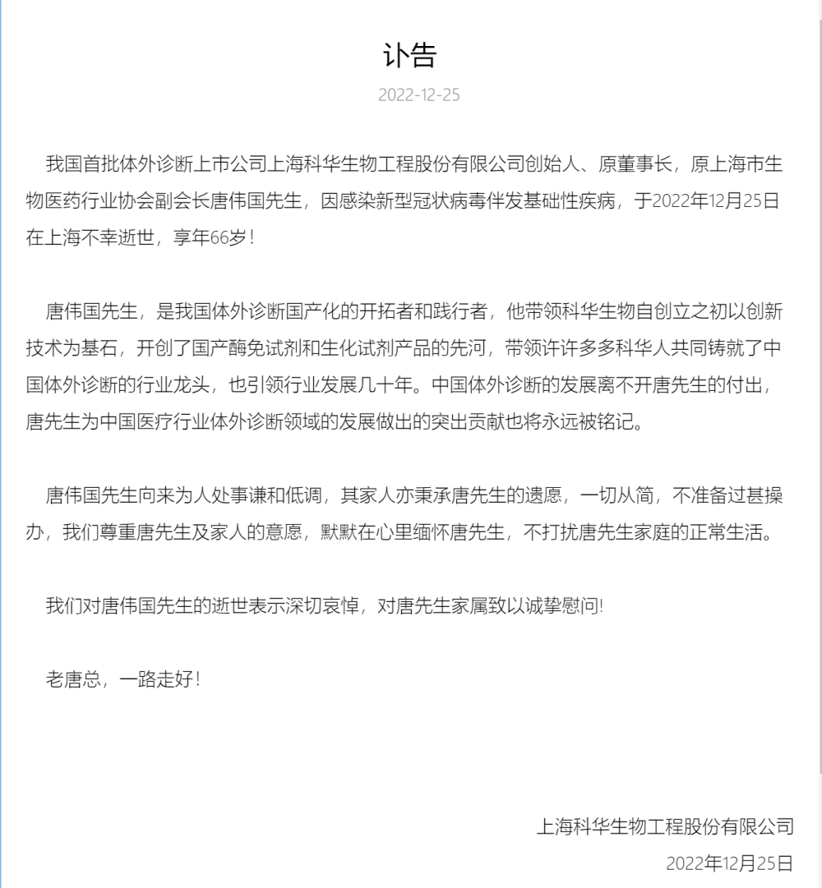

# 体外诊断“老大哥” 科华生物创始人唐伟国因新冠伴发基础性疾病逝世

每经记者：许立波 每经编辑：陈俊杰

2022年12月25日，体外诊断上市公司上海科华生物工程股份有限公司（SZ002022，股价11.60元，市值59.66亿元）在公司官网发布讣告，公司创始人、原董事长，原上海市生物医药行业协会副会长唐伟国先生，因感染新型冠状病毒伴发基础性疾病，于2022年12月25日在上海不幸逝世，享年66岁。

在公司的讣告中，评价唐伟国为“我国体外诊断国产化的开拓者和践行者”。讣告中提到，唐伟国带领科华生物自创立之初以创新技术为基石，开创了国产酶免试剂和生化试剂产品的先河，带领许许多多科华人共同铸就了中国体外诊断的行业龙头，也引领行业发展几十年。中国体外诊断的发展离不开唐先生的付出，唐先生为中国医疗行业体外诊断领域的发展做出的突出贡献也将永远被铭记。

1981年，科华生物前身上海科华生化试剂实验所（以下简称科华所）创立，彼时的国内体外诊断产业，尚停留在市场导入期，全国范围内从事体外诊断试剂生产、研发的单位仅几十家，临床检验所需试剂仅有极少数的部分商品化试剂，绝大多数仍然要靠实验室手工制配，大多以“作坊式”、“非主营”的生物制品研究所为主，如科华生物另一位创始人沙立武担任负责人的上海湖南化剂室（主要生产类风湿胶乳和蛋白电泳用丽春红染液），以生产冻干乙型表面抗原诊断血球为主的北京生物制品研究所等。

不过，伴随着对外开放、国际交流合作成为社会共识，这一阶段同样也是体外诊断企业迅猛发展的黄金时期。

在科华所成立次年，唐伟国就带领研发团队成功将国产第一套全包备“二对半”试剂盒推进临床；1989年，在解决了包被后酶标板和酶结合物工作液长期保存的稳定性问题后，科华在国内率先研制出酶联免疫法乙肝二对半试剂盒，标志着中国酶免疫试剂盒开始进入大规模商品化生产时代。

正是这一标志性的创新，让科华由此开启了长达十年的酶免乙肝两对半市场统治地位。当年的老科华人员回忆，彼时上海各大医院的检验科主任骑着自行车，背着包，包里装着现金，在科华厂房的门口排队，刚刚生产出来的试剂在现场就被抢购一空。

除此之外，科华生物还是国内第一家将乙肝、丙肝、艾滋诊断试剂推向市场的企业，也是率先开发出SARS诊断试剂的企业，“国内体外诊断第一股”的名头一时无二。到2004年公司申请中小板上市的时候，科华生物在招股说明书中已经以四个“最”评价自身，即“国内生产量最大”、“市场占有率最高”、“品种最齐全”、“报批量最大”。在此过程中，唐伟国为科华生物及体外诊断产业做出的突出贡献功不可没。

科华生物上市时，唐伟国是公司并列第一大股东，也是公司董事长。发行前，唐伟国的持股比例为12.6139%。当时，招股书介绍唐伟国曾历任上海血液中心技术员、上海生物制品研究所科研人员，上海科华生化试剂实验所科研人员；现任上海科华生物工程股份有限公司董事长,上海市药品监督管理局药品安全监管咨询专家，上海市生物医药行业协会专家，副会长。

讣告表示，唐伟国先生向来为人处事谦和低调，其家人亦秉承唐先生的遗愿，一切从简，不准备过甚操办，公司尊重唐先生及家人的意愿，默默在心里缅怀唐先生，不打扰唐先生家庭的正常生活。

“老唐总，一路走好！”

_图片来源：科华生物官网_

