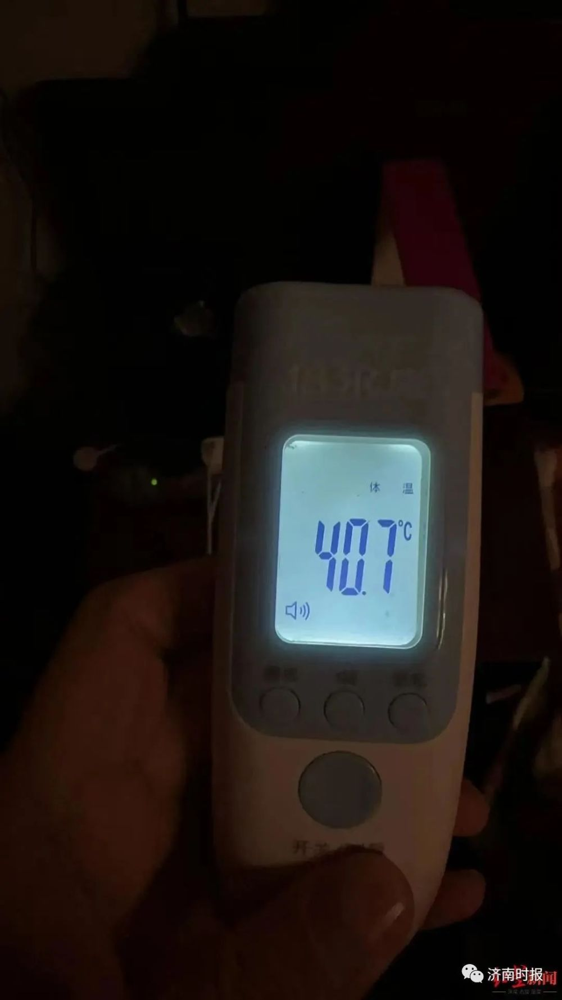
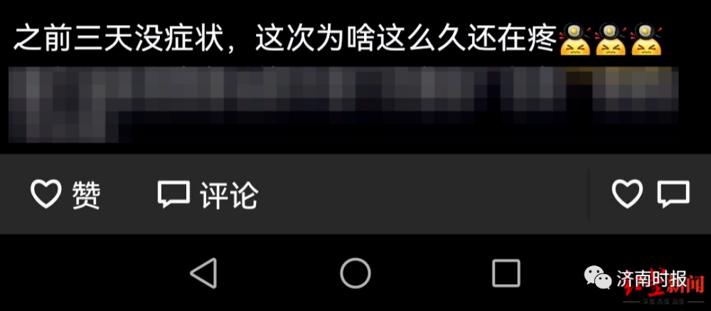

# 女子转阴5天又阳了高烧40℃，“比第一次疼十倍”，专家：属于抗原复阳

“浑身疼，巨疼，头疼，像二锤敲，一直敲，太阳穴往外鼓起疼。腰背疼，翻身都翻不动，下半身除了疼没任何感觉了……”相隔5天第二次抗原“阳性”，让张女士没有想到的是，这一次的症状比第一次难受太多了，“比第一次疼十倍都不止。”

对于这一次“阳”，在张女士看来也有自己的原因。她认为自己已感染一次，因此缺少了防护，在公司上班时，偶尔没戴口罩，也没有像之前那样随时消毒了。

对张女士的这种情况，病毒学专家常荣山解释，张女士属于“抗原复阳”，这次感染过程比普通感染要长、抗原检出阳性的同时疼痛感加重。

**相隔5天第二次“阳”** **高烧近41℃，“这次自己缺少了防护”**

张女士是四川广元市人，今年35岁，在广元经营公司，从事服务行业。12月9日，她出现发烧症状，用抗原试剂一测，“阳”了。“当时发烧最高38℃，然后身上肌肉酸痛，休息了4天左右就恢复了。”张女士向记者回忆，第5天开始没有症状了，第7天抗原就转阴了，连续做了三四次抗原，都是阴性了。

没有症状，抗原连续阴性，张女士开始上班了。然而，仅仅过了5天，12月20日白天，张女士开始头疼、头晕；21日凌晨3点左右，老公为她测体温，已经高烧达40.7℃。

_张女士第二次出现症状后体温最高达40.7℃_

“我当时以为自己感冒了，因为都在说感染一次新冠后就会产生抗体，要等几个月才可能再感染。但是，我不仅高烧，还发冷，浑身疼，我怀疑是再次感染了新冠。”张女士说，于是她用抗原试剂一测，结果显示“阳性”。

这一次“阳”，在张女士看来，是自己缺少了防护，因为她认为自己已经感染了一次，因此在公司上班时，偶尔没戴口罩，也没有像之前那样随时消毒了。

**“比第一次疼十倍不止”** **全身疼痛反复发烧，服药后降到39℃**

“浑身疼，巨疼，头疼，像二锤敲，一直敲，太阳穴往外鼓起疼。腰背疼，翻身都翻不动，下半身除了疼没任何感觉了……”

12月24日18时许，张女士给记者发来了一条简短文字，里面包含了6个“疼”字。

相隔5天第二次抗原“阳性”，是她没有想到的。更让她没有想到的是，这一次的症状比第一次难受太多了， **“比第一次疼十倍都不止。”**

“疼死我了，睡不着啊……”“这次为啥这么久还在疼……”12月23日凌晨2时28分、24日17时02分，张女士发了两条朋友圈，都透露着一个关键词：“疼”！

_张女士这两天发的朋友圈_

这次的症状，除了全身疼，喉咙也疼，还有咳嗽，有痰等症状，而一咳嗽，头就更疼。张女士甚至不愿多看手机，这几天更多时候是在睡觉，甚至是关机睡觉。

几天来，张女士全身疼痛状况仍在持续，反复发烧，不过已在39℃以下。她说自己服用了对乙酰氨基酚，甚至还吃了头痛粉。

**病毒学专家：属于“抗原复阳”** **主要原因是免疫力低**

针对张女士的情况，病毒学专家常荣山表示，所谓“复阳”有两种，一种是核酸“复阳”，还有一种叫“抗原复阳”， **张女士的情况属于“抗原复阳”**
。所谓“抗原复阳”，通俗地讲，就是第一次感染后没有好利索，病毒复制下降了，产生的抗原浓度低于了检测试剂盒的最低检测限，显示的是“假阴性”，身体内的病毒并未完全清除。

一般来说，感染后的14天，体内产生的中和抗体才能完全保护自己，张女士从初期感染的9日到19日只有10天，身体的中和抗体滴度不够高；19日碰到的同事如果还处于感染期中的病毒脱落期（俗称排毒期），张女士又没有做好防护，就会发生“二次暴露”；如果是这样，张女士体内病毒复制增加就是可以解释的了，
**不仅抗原复阳，而且症状加重** ；原因在于她的抗新冠免疫力没有完全恢复，恢复的一个硬指标是至少14天后，或抗新冠中和抗体IgG浓度高于保护阈值。

常荣山称，张女士还属于轻症或者普通型，轻症是没有肺炎症状的，不需要到医院去救治，张女士的情况可能处于轻症和普通型之间，没有到普通型。如果变成普通型，就变成肺炎了，就需要住院治疗了。如果“抗原复阳”了，也不用过分担心，血氧没有降到91%以下，没有呼吸不畅、胸闷、难受的情况，心率没有急剧上升，就不用太过担心。不过，如果血氧急剧降低，心率急剧上升，这样就有危险，要去医院救治了。

**二次感染是啥？** **和“复阳”有何不同？**

**10问10答**

**1.什么是二次感染？**

北京大学第一医院感染疾病科主任王贵强12月22日接受新华社采访时介绍，二次感染是指感染康复后，经过一段时间再次感染新冠病毒，常常由于新冠病毒变异导致。

**2.如何确定二次感染？**

12月20日，北京市疾控中心官方微信公众号刊文表示，不同国家或地区针对二次感染的定义不同，但基本条件都是要确诊后间隔一段时间。比如，欧洲疾控中心认为，只有当首次感染的病毒完全清除，并且有足够的时间产生免疫反应时，才能诊断为真正的二次感染。英国定义二次感染的间隔至少是90天，美国则是间隔60-90天以后。

二次感染需要结合症状体征、临床表现、免疫反应、基因测序等多项指标综合判定。

**3.二次感染的发生概率是多少？**

北京疾控刊文介绍，二次感染的发生概率主要与人体免疫水平和病毒株变异有关。抗体等免疫反应指标越高，病毒株变异越小，二次感染的发生率越低。当前研究显示，相较于早期变异株，奥密克戎导致的二次感染要略高。但总体来说，短时间内发生新冠病毒二次感染的概率还是比较低的。

“从二次感染出现的时间来看，一般有一段间隔期，不会说感染以后很快二次感染，同一毒株的二次感染概率极低。”

王贵强教授12月22日接受新华社采访时表示，二次感染主要还是指变异株的突破性感染，突破性感染的时间间隔和临床表现是密切相关的；间隔时间越短，症状越轻，间隔时间长了以后症状就偏重，这和人体内的免疫抗体有直接关系。

**4.如何区分“复阳”与二次感染？**

北京疾控刊文介绍，“复阳”是指感染者症状基本消失，达到出院标准之后，再次检测发现核酸呈阳性。“复阳”患者一般无明显临床症状，且基本没有传染性；而二次感染相当于一次新的感染，是痊愈后的再次感染，一般来说，可有临床症状出现，并且核酸载量较高，具有传染性。

**5.抗体水平与二次感染的关系？**

北京疾控刊文介绍，多项研究显示，接种疫苗或自然感染产生的免疫能够降低二次感染的发生率。免疫力低下或抗体水平较低的人群相对较易存在二次感染的风险。因此，这部分人群平时还应注意加强个人防护，并及时接种新冠疫苗或加强免疫。

**6.短时间再出现症状是否属于二次感染？**

北京疾控刊文指出，发热之后短时间再出现症状不属于二次感染。

普通人群被病毒感染后，免疫系统立即启动，细胞免疫和抗体水平不断升高。一般两周后抗体水平达到峰值，并在短期内维持较高的水平，对机体具有一定的保护作用。人体在新冠病毒感染后康复前，由于免疫系统已在发挥作用，短时间再次感染相同或者不同新冠病毒变异株的可能性极小。

**7.二次感染后的病情是否更加严重？**

北京疾控刊文指出，目前，新冠病毒重复感染导致严重疾病的报道少见。重复感染后的疾病严重程度与病毒感染剂量、新冠变异株，以及个人健康状况都可能有关。但总体上，重复感染导致重症的风险很低。

**8.哪些人群发生“二次感染”可能性大？**

北京佑安医院感染综合科主任医师李侗曾12月20日接受央视新闻采访时表示，发生二次感染的概率比较高的群体：

第一类是免疫功能低下的人群。比如说老年人的免疫功能有退化，那么患者感染康复之后，保护力维持的时间比较短。还有三岁以下的婴幼儿，免疫功能还没有健全，那么康复之后获得的保护力时间可能也比较短。

第二类是免疫缺陷人群。比如艾滋病患者和免疫抑制剂使用者，他们的保护力持续时间也比较短，随着时间延长，“二次感染”的风险比较大。

第三类是高风险岗位的人群。比如医护人员、公共交通运维人员等，他们平时和人接触比较多，传染的风险也比较高，需要更加注意。

**9.什么情况下易发生二次感染？**

12月20日，湖北省华中科技大学同济医学院附属同济医院感染科副主任郭威做客长江日报直播间表示，距上次感染时间较长，“阳康”半年后二次感染的可能性还是很大。同时在缺乏防护的情况下，也有可能二次感染。

**10.康复后如何预防二次感染？**

郭威医生表示，建议大家平时要科学有效地戴口罩，加强手部卫生，保持社交距离。另外，康复半年后再接种一剂疫苗加强免疫。

新冠康复后还是感觉累？

完全恢复需要多久？

医生解答

有很多人反映在新冠转阴返岗后，总是感觉非常疲乏，这是什么原因呢？

北京大学人民医院感染科主任高燕表示，虽然病人烧也退了、抗原也转阴了，但是其实人体体力、功能的恢复还需要约2-3周。不用太焦虑。尤其这些急性病，都是“病来如山倒，病去如抽丝”，它跟慢性病的特点不太一样。

这段时间，病人要注意休息、适当地加强营养，促进身体恢复，这样能尽快回归正常状态。

