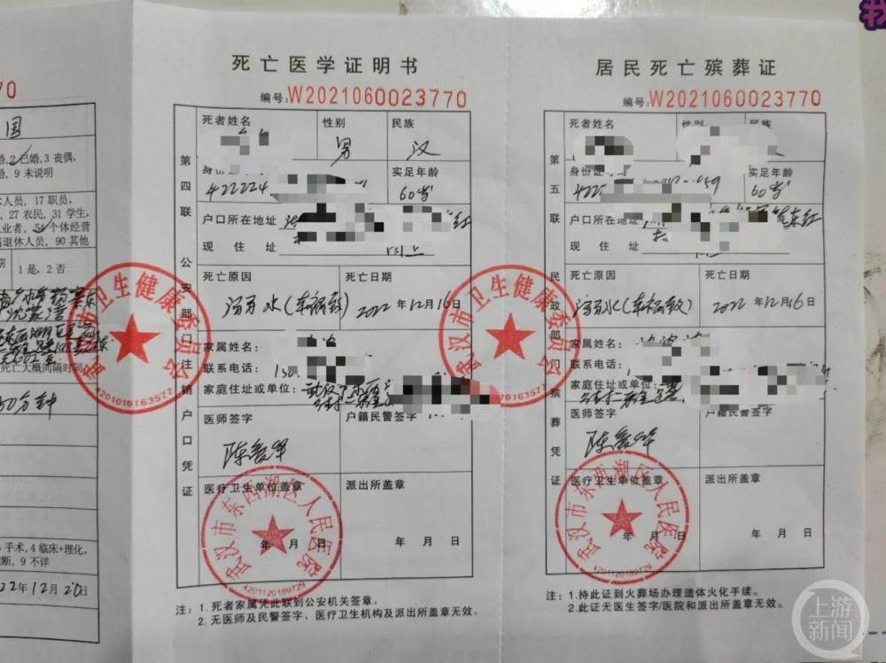
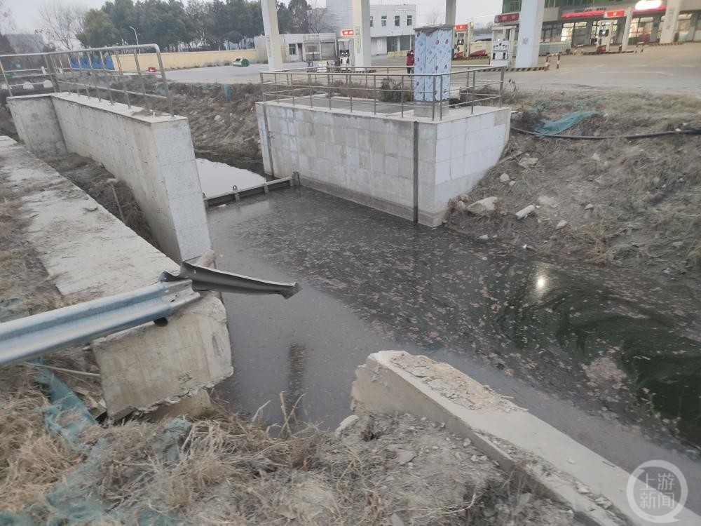

# 急救车闯红灯将私家车撞进水渠致车主溺亡，3名医护人员被指“袖手旁观”

12月16日中午，60岁的沈先生永远地离开了家人。

去世之前，他驾驶着白色私家车正常行驶在十字路口，一辆闯红灯的急救车车头左侧与白色私家车副驾一侧相撞，白色私家车坠入路旁深约1.15米的沟渠中。车祸发生37分钟后，消防员将沈先生救出，已无生命体征。死亡医学证明书上载明了死亡原因：溺亡。

_▲救护车车头左侧与私家车副驾一侧相撞。_

沈路说：“肉眼可以判断出水不深，我站在水渠中间才到胸部。如果他们及时下渠去救，我爸可能不会溺亡。他们是医护人员，救死扶伤是他们的天职。”

肇事救护车隶属于武汉市东西湖区急救中心。该中心负责人称，救护车上有6人，一名重症患者，一名家属，一名医生，一名护士，一名担架员，一名司机。车祸发生后，司机懵了，在他电话指导下，才下水救人，但没救成功；来自卫生院的医生担心患者病情，没下水；护士一根肋骨骨折，蹲在地上；听“吆喝”的担架员没收到医生护士的指令，没下水。

针对家属提出的未及时救援，该负责人称，司机正在等待交警的责任认定；医生、护士、担架员已将材料交至区卫健局执法大队。“司机配合交警，医护配合执法大队。”

有律师认为，除救护车司机外的3名医护人员未履行救助义务，违反道交法和民法典，应依法承担法律责任。也有律师认为，3名医护人员道义上有责任积极挽救沈先生。

**闯红灯的救护车**

事故发生在武汉市东西湖区东西湖大道与兴工六路交会处。

白色私家车上的行车记录仪记录了事故发生过程。12月16日中午1时11分，沈先生驾驶白色私家车在兴工六路上行驶。临近十字路口时，他轻踩刹车后继续前行，此时视线正前方的交通灯亮着绿灯，显示还剩13秒。当绿灯跳至10秒时，私家车车身猛烈抖动、翻转，坠进路边水渠。

沈路提供的事故图片显示，救护车车头左侧受损，私家车副驾一侧及车头受损严重，主副驾安全气囊已弹开。事故发生后，私家车撞断路边护栏，从斜坡上坠入路边水渠。

12月26日，上游新闻记者在事发现场看到，用于城市排涝的水渠宽约3米，水面距路面约3米，长约3米的护栏被撞断，护栏旁的树枝有刮擦痕迹。

事发后，身高1.7米的沈路站在水渠中，水与胸部齐平。经卷尺测量，水深约1.15米。

_▲沈先生驾驶的私家车坠入此渠，水渠中间最深处1.15米。_

救护车车身上喷有东西湖区急救中心的字样。该中心注册资本1400万元，是独立法人机构，上级主管单位是武汉市东西湖区卫健局。

该中心负责人介绍，事发时，救护车正在转运一名重症患者，患者由家属陪同；救护车司机35岁，2017年开始驾驶救护车；医生和护士来自走马岭街中心卫生院，事发时在急救中心值班；担架员负责抬担架。“闯红灯是为了救治患者，他的病情很危急。”该负责人说。

该负责人说，车祸发生后，救护车司机拨打报警电话。他又调度了两辆救护车赶至车祸发生地，一辆用来转运重症患者，一辆用来转运沈先生至协和东西湖医院。

沈路称，他从交警部门了解到，消防员于1时45分下到沟渠内救人，1时48分将人捞出。捞出时，其父已无生命体征。

**私家车司机溺水身亡**

武汉市东西湖区人民医院病历记载，沈先生呼吸心跳停止，双瞳孔散大到边缘。立刻心肺复苏及气管插管，抢救50分钟左右无效，宣告死亡。

沈路介绍，尸检时，他待在父亲身旁。他观察到，其父皮肤未见外伤，内脏未受损，右手脱臼。盖有武汉市卫健委和协和东西湖医院公章的死亡医学证明书载明，死亡原因：溺水（车祸致）。

南方医科大学南方医院副主任医师刘凤芹受访时称，溺水多久能抢救主要取决于溺水程度、治疗是否及时等因素。若患者抢救及时，心肺复苏后恢复自主呼吸，生命体征也逐渐好转，一般3—10分钟左右能救活。

_▲死亡医学证明书上载明:沈先生死亡原因溺亡。_

沈路说：“几名医护人员在这关键的3到10分钟时间里，没有救援，而是站在救护车旁，救护车离水渠约10米，是在视力范围内。如果救了，我爸有生还的可能。只有一个人朝水渠走过去，一个人能救得起来吗？”

上游新闻记者获得的监控视频显示，车祸发生后，多名身穿白色防护服的医护人员，在救护车旁，时而踱步，时而驻足，持续时长至少10分钟，并未朝水渠边走去。

沈路接受不了本该救死扶伤的医护人员的“袖手旁观”。

沈路说，其父经营一家电器设备营业部，是家中的顶梁柱。60岁还没退休，就是想再帮衬他和弟弟。连日来，母亲夜不能寐，时而大哭，时而发呆。

沈路说：“爸爸在离营业部还有1公里多的地方走了。”

**3名医护人员未援手原因各不同**

除重症患者及其家属外，急救车上还有4人，他们在车祸后做了什么？12月26日，上游新闻记者试图采访这4人，未果。

武汉市东西湖区急救中心负责人介绍，车祸发生后，急救车司机报警，接着给他打电话说：开始没看见白色私家车，以为它开走了，现在发现它坠入水渠中，很懵，该怎么办？他急忙告诉司机，赶紧去水渠救人。与此同时，他调度了两辆救护车赶往车祸现场。接着，司机表示，其已下到水渠中，救不起来。“司机很慌乱，不知道怎么办，我让他去救人的。”

该负责人称，司机未将沈先生救起的主要原因是私家车倒扣在水渠中。然而，沈路提供的图片显示，私家车并未倒扣在水渠中，而是车头扎在水渠中，车尾翘起，车顶露在水面外。

沈路强调：“负责人在说谎，交警告诉我，车没有倒扣。消防下水3分钟就把人捞起来了。”

_▲私家车撞断护栏后坠渠。上游新闻记者
沈度 摄_

该负责人称，车祸发生后，他也找另外3人了解相关情况。急救车上的医生称，他担心重症病人，所以没有援手；护士胸部疼，蹲在地上，经诊断她有一根肋骨骨折；担架员见医生和护士没有援手，也没有援手。

上游新闻记者提醒该负责人：“死者家属在质疑‘袖手旁观’。你连忙指示救护车司机下水救人，相比司机，医生急救知识更丰富，你有没有指示医生去帮忙。肉眼可判断水渠水不深，医生和担架员也没受伤。”

针对此问题，该负责人并未回答。他说，急救车司机正在配合交警调查；医生、护士、担架员已写了车祸材料，交至东西湖区卫健局执法大队。是不是救援不力？要不要担责？执法大队正在调查。

该负责人表示，待相关部门调查结果出炉后，急救中心会积极对待。

**未救援的医护人员需要担责吗？**

医护人员未援手溺水人员是否需要担责？上游新闻记者采访了4名律师。

北京富力律师事务所主任殷清利认为，家属应当首先审查肇事救护车是否同时具备执行紧急任务、确保安全以及按规定使用警报器及标志灯具等三个要件，该三个要件未完全具备，意味着救护车未依法享有“道路优选通行权”。

殷清利称，《民法典》第1005条规定“自然人的生命权、身体权、健康权受到侵害或者处于其他危难情形的，负有法定救助义务的组织或者个人应当及时施救”，救护车先行闯红灯引发事故并导致沈先生掉入沟渠，对此应当视为先行行为引起的救助义务，救护车上的人员及该单位享有对沈先生负有采取有效措施排除危险或者防止结果发生的特定救助义务，对此在未履行救助义务的情况下，应依法承担法律责任。

湖北联帮律师事务所副主任罗锋与殷清利观点类似。他说，道交法第70条规定，在道路上发生交通事故，车辆驾驶人应当立即停车，保护现场；造成人身伤亡的，车辆驾驶人应当立即抢救受伤人员，乘车人应当予以协助。“司机、护士、担架员是具备救援知识的乘车人。”

河南泽槿律师事务所主任付建认为，救护车在没有确保安全的情况下闯红灯，造成了重大人员伤亡，至少应当承担主要责任。救护车上的医护人员有义务对沈先生进行救治，这是法律义务性规定，医护人员必须遵守。

也有律师持不同观点。

北京市中闻律师事务所律师邓千秋称，救护车系急救中心所有的车辆，司机开车系履行职务的行为，其造成的后果在民事上应由急救中心承担。如果最终认定救护车司机对此次事故负全部责任或者主要责任，救护车司机则构成交通肇事罪。

邓千秋说，救护车上的医护人员虽不是交通事故的肇事方，但基于其作为医护人员所承担的救死扶伤的天职，交通事故系在医护人员和救护车司机共同履行职责的过程中所引发，医护人员有道义上的责任。

上游新闻记者 沈度/文 除署名外受访者/图

编辑 徐远哲

责编 郎清湘 官毅

审核 冯飞

