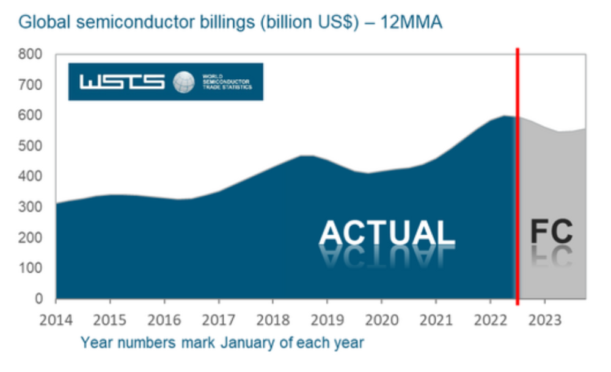
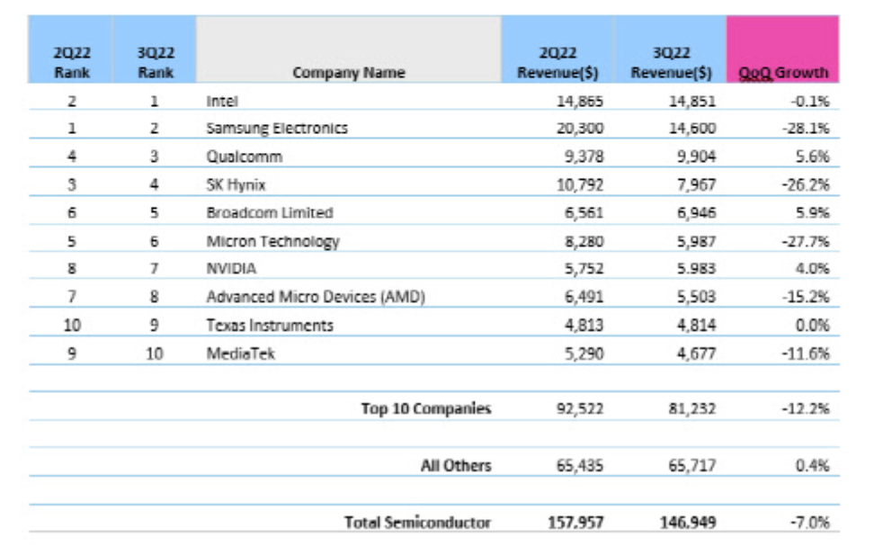
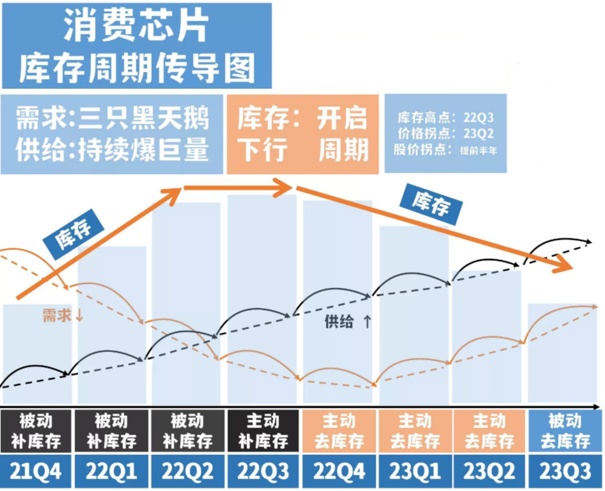

# 芯片厂商猛踩刹车过冬，砍单、裁员、倒闭接踵而至

_“芯事重重”是《新产研》栏目重点研究的方向之一，计划通过产业链、投资研发、生产制造、人才培养和政策法规等不同角度切入，真实、客观、全面的反映行业的现状。
本期聚焦缺芯问题缓解后的半导体产业，面临着砍单、去库存和裁员等诸多新问题。_

**划重点**

  * _1_ “缺芯潮”基本结束，砍单、去库存以及裁员的消息接踵而来，芯片市场新一轮的下行周期正在开启。
  * _2_ 厂商赔钱也要砍单，一般违约要赔付30%左右。射频龙头Qorvo因削减订单，支付了高达1.1亿美元的违约金。
  * _3_ 几乎所有终端市场的重大客户都在进行库存调整，台积电三大客户包括苹果、AMD、英伟达也都集体下调了订单。
  * _4_ 为了维持产能利用率，晶圆厂不得不通过降价“抢客”，同时增加汽车芯片产能，但汽车市场如今也开始走向缓和。
  * _5_ 裁员或许是安全“过冬”最简单有效的手段之一，格芯、英特尔等已锁定前排，但比无薪假、裁员更惨的是倒闭。

**文 I 十巷 、 编辑 I 猴猴 苏扬**

**报道 I 芯潮IC 、 ID I xinchaoIC**

2020年卷起的这轮“缺芯潮”将半导体产业链各环节都推向了高潮，芯片价格飞速上涨、产能供不应求以及行业厂商大肆扩产等成为过去一年多来的常态。

然而，在经历了长期的缺芯和产能扩充之后，2022年以来，在全球通胀、地缘冲突、贸易争端等一系列黑天鹅事件冲击下，曾经火热的电子市场逐渐开始降温。

传导到终端市场，智能手机、PC等下游消费市场下调出货预期，手机、PC处理器、存储芯片、驱动IC、射频芯片在内的上游芯片供应商削减订单的消息更是不绝于耳；汽车半导体需求的瓶颈效应也正在得到解决；近期业内又传出台积电7nm芯片产能利用率已跌至50%以下，芯片扩产计划也已暂缓的消息。

能看到，随着供需关系变化，“缺芯潮”基本结束。与此同时，芯片和终端企业砍单、去库存，以及行业厂商相继裁员的消息接踵而来。在疯狂的超级景气后，芯片市场新一轮的下行周期正在开启。

世界半导体贸易统计组织（WSTS）近日发布消息称，继2021年取得26.2%的强劲增长后，预计今年全球半导体市场增速放缓至4.4%，达到5800亿美元。

资料来源：WSTS

随着通胀上升和终端市场需求持续减弱，WSTS预测，2023年半导体市场规模预计将同比减少4.1%至5565亿美元。

多家调研机构也指出，全球半导体市场增速放缓，半导体市场正在进入一个从热向冷的周期性转变。

在这个转变的过程中，芯片行业正在经历怎样的挣扎与波折？拐点背后，契机与挑战又在如何上演。

01

芯片供应商

赔钱也要砍单降库存

2022年第三季度电子元器件采购调查结果显示，有超过8成的受访企业在第三季度遭遇了消费终端砍单的经历。

此前，IC设计企业抢产能抢翻天，为了后续能顺利取得产能，陆续与晶圆代工厂签订长期产能保障合约，晶圆代工产能爆满。

“缺芯潮”结束后，为了及时止损，厂商赔钱也要砍单。

有本土IC设计公司表示：“随着今年第二季度起市场景气急转直下，第三季度又更加严峻，芯片设计企业库存水位不断升高，为避免库存发展至难以控制的情况，部分公司已在第二季度、第三季度减少投片，并向晶圆代工厂支付当期投片未达量的罚款。”

据知情人透露，按照行规，终止合约要赔偿合同金额的30%左右。

例如，全球笔电触控板模组暨与触控屏幕IC龙头义隆提前解除与晶圆代工厂签订的三年期产能保证合约，并支付违约金，将导致季度营收锐减29%-36.1%；早些时候，射频龙头厂商Qorvo削减联电订单量，违反了双方此前签署的长期合同，支付了高达1.1亿美元违约金。

Qorvo财报计提长单违约支出 （资料来源：Qorvo财报）

群智咨询预测，整体芯片市场的库存调整周期将至少持续至2023年下半年。

种种现象都凸显了半导体行业整体景气度的低迷。作为半导体市场晴雨表，消费电子的不景气率先会影响到存储市场。

对于存储厂商来说，2022年，尤其是2022下半年，局势格外艰难，存储市场萎缩严重，受其影响，全球前三大存储厂商三星电子、SK海力士和美光科技今年第三季度的营收额都大幅下滑，三星营收环比下降28.1%，SK海力士销售额下降超过26%，美光下降27%以上。

Q3全球芯片销售额top10（不包括晶圆代工厂）资料来源：Omdia

TrendForce表示，DRAM价格自年初以来就一路走跌，下半年合约价每季跌幅更超过10%，显见需求市场的严峻；NAND闪存市场同样呈现供过于求的状态，导致第三季晶圆价格跌幅达30%-35%，预计第四季度NAND价格持续下探。

面对存储芯片需求前景继续走弱再加上库存过剩，行业厂商正在做出减产、缩减资本支出的应对策略。

1、美光近期将其晶圆开工量减少约20%，2023财年资本支出计划同比减少33%；

2、SK海力士表示明年资本开支将同比减少50%以上；

3、铠侠从10月起将日本两座NAND闪存工厂减产3成；

4、西部数据也发布警告称，将延后下一座NAND工厂的建厂时间；

相比之下，三星则看好长期存储器需求，暂未宣布减少2023年投资，保持了逆周期扩产的传统。

库存压力扩大、减产缓不济急。DIGITIMES Research预测，负面因素仍持续，第四季度三大存储厂商年营收减幅将扩大至28%。

当前，存储产业链面临两难局面：一边是业内降价预期高度一致，上游资源不断降价，成本越来越低；另一边，市场需求疲软，流速显著变慢，竞争杀价加重。这严重打击了下游和终端囤货备货的想法，普遍都是按需拿货。下游下单意愿和吃货能力下降，主动或被动地缩减采购量，维持库存水位。

如此一来，原厂库存短期不仅难以回落还接连走高。展望2023年，TrendForce表示，随着库存过剩的增加，存储芯片的价格预计将在明年全年逐季下降，2023年底将持平或降至最低。

有业内人士透露，几乎所有终端市场的重大客户都在进行库存调整。当前，一些供应商正在与客户签订长期协议，期望减少库存中的成品，也在努力使库存具有可替代性，以平衡任何需求的变化。

非内存企业中，高通、德州仪器和联发科等厂商均预计今年第四季度营收将出现两位数下滑，多数企业将整体需求疲软和客户库存调整归咎于前景黯淡。

台积电三大客户包括苹果、AMD、英伟达也都集体下调了订单。

据悉，由于苹果手机首批出货目标已经削减了一半，因此苹果在台积电的芯片订单上进行了下调；AMD与英伟达则因为PC市场需求急跌以及“挖矿”热潮的褪去，两家企业在CPU和GPU芯片上的销量不及过去几个季度，因此不得不向台积电表明调整订单规划。

此前，联发科已对第四季度5G芯片砍单30%-35%；高通也对高端骁龙8系列产量下调10%-15%。

砍掉新的订单之后，去库存成为消化高企的积压芯片的重要手段。CINNO Research 最新发布的集成电路研究和报告显示，2022
年第三季度，中国主要IC设计厂商的平均存货周转天数进一步增至约 216
天。同时，由于库存水位过高叠加需求持续性疲软，本轮半导体周期下行时间恐长于市场预期，IC设计厂商去库存进程将蔓延至2023年上半年。

对此，有芯片厂商表示，面对市场需求疲软以及库存高企的现状，在内部，芯片供应商一直面临着寻找消耗过剩库存和实现年终目标的解决方案的压力；在外部，他们需要为逆风做好准备，例如提供更大的价格优惠以及寻找新的增量市场。

资料来源：半导体风向标

对于消费芯片库存及周期情况，浙商证券所长助理&产研院科技首席陈杭表示，过去一段时间的实际情况，21Q4-22Q2，需求端开始连续三个季度出现“黑天鹅”，需求自21Q4开始急转而下，半导体库存水位逐渐拉高，市场开始供过于求，22Q4的市场需求降至冰点。这也意味着，供需关系来到最大失衡阶段，去库存速度变缓，芯片库存持续拉升市场高位，进而导致芯片价格继续下跌，全产业链迎来“至暗时刻”。

综合来看，半导体产业步入库存调整期，从下游的手机、电脑、电视等终端厂商，到上游面板、各类消费类芯片厂商，不要说补库存，去库存都来不及，现货市场大降价，芯片设计公司支付高额违约金，普遍以自损的方式来逃脱库存高企的旋涡。

02

晶圆厂打折鼓励客户投片

产能转向车芯

随着芯片厂商订单减少，晶圆代工行业也感受到了下游传导过来的压力，各晶圆代工厂产能利用率开始出现松动。摩根士丹利证券预计晶圆代工产能利用率于明年第二季度将下滑至70-80%，明年下半年才能恢复至90%。

为了维持产能利用率，这导致晶圆代工厂不得不通过降价“抢客”。

据行业媒体消息，已有晶圆代工厂近期降价逾一成。为了防止订单流失，一些晶圆代工厂向客户约定，在部分特定制程开出“优惠价”。

对于价格策略一向保守的中国台湾晶圆厂，在当前市场需求急剧减退的情况下，也对价格给出了较以往更大的谈判空间，通过各种形式的折扣来鼓励客户多投片。但碍于市场需求不振的趋势以及IC厂商致力于降库存，降价对订单数量的帮助非常有限。

有业内人士向笔者表示：“以前都是客户主动找上门，然而现在需要出门找客户了。数月之前还在谈论涨价、缺货、扩产，转眼间砍单、降价、减产，甚至降薪裁员的关键词就取而代之。”

尽管代工厂都不愿意公开承认，但跟代工厂打交道的芯片设计公司的反馈证实了这一现象。各代工厂的声明和行动都在释放出明确的信号，即晶圆代工行业已进入下行周期。

TrendForce预测，用于消费电子的芯片制造订单将在第四季度大幅下调。在全球排名前十的芯片制造厂中，大多数企业要么增长缓慢，要么收入下降。因此，代工厂将重点调整其产品结构，增加汽车芯片产能成为了行业趋势。

前期，在消费电子疲软之际，汽车市场似乎是少有的健康成长赛道之一。汽车芯片供应商均表示，汽车行业的增长在很大程度上或部分抵消了其他业务的下滑。

德州仪器、英飞凌、瑞萨等汽车芯片大厂发布的第三季度财报能看出来，汽车业务除瑞萨电子以外都获得了5%以上的环比增长，瑞萨也表示本季度的汽车业务表现仍强于预期，并在补充汽车销售渠道库存。同时，各大厂商均认为汽车内部的长期增长趋势非常显著，能够提供强劲的结构性增长机会。

行业专家向笔者表示，半导体市场的供需关系变化非常迅速，晶圆代工厂最核心的竞争力在于能否快速适应环境变化，用高机动性来做出对应。

除了如台积电这样，在先进制程建立优势布局来实现机动，类似联电、华虹集团这样的差异化策略，依靠成熟制程同样能够有效提高抗风险能力。对产品结构单一的厂家来说，应当深度思考，如何通过发展特色工艺，实现差异化的产品路线和机动性的发展战略。

然而，在市场下行趋势下，供需关系不断调整，一度作为众多芯片厂商“救命稻草”的汽车市场，如今也开始走向缓和。

摩根士丹利在最新发布的报告中指出，从半导体晶圆代工后段制程的最新调查中得知，部分车用半导体供应商，包括瑞萨电子、安森美半导体等目前正在削减芯片测试订单，这意味着车用芯片缺货的问题也正在缓解。

从终端、芯片设计企业的砍单潮最终传递至晶圆代工环节。群智咨询分析，2023年对于晶圆代工业存在各种不确定因素，出于规避风险、节约开支的目的，晶圆代工业的扩产速度大概率会整体放缓。

反映到实际举措中，则是头部晶圆代工厂无一例外地下修资本支出。

1、台积电打响了晶圆代工资本支出下修第一枪，台积电在第三季度法说会将2022年资本支出下修至360亿美元，相比年初的440美元降幅超过18%；

2、随后另一家晶圆代工大厂力积电选择跟进。据悉，力积电今年资本支出将自原定的15亿美元大举调降至8.5亿美元，降幅达43%；

3、联电将今年的资本支出从36亿美元调降至30亿美元；

4、英特尔也正试图在短期节省开支与旨在满足长期需求的投资之间寻求平衡。

另外值得注意的是，作为今年早些时候通过的美国《芯片和科学法案》的一部分，美国向半导体供应商提供的补贴不会增加相关企业的资本支出。相反，大多数收到这笔钱的半导体厂商将用它来代替原本计划的资本支出。

知名半导体产业分析师陆行之认为，降产能利用率、砍资本开支是行业利空出尽的重要指标之一，明年晶圆代工业衰退已成共识。

03

裁员浪潮扑面而来

半导体行业集体砍单去库存、缩减资本支出，延缓建厂趋势尚在发酵，裁员潮又席卷而来。

面对行业“寒冬”，裁员或许是安全“过冬”最简单有效的手段之一，目前格芯、英特尔、ARM等半导体厂商已锁定前排位，纷纷加入裁员队伍。

英特尔在公布第三季度财报的同时宣布裁员决定，涉及部门包括销售、市场营销等，裁员比例约占其人数的20%。英特尔发布财报表示将在2023年削减30亿美元营运成本。

前不久，由于公司希望削减成本，英特尔在爱尔兰工厂的数千名员工已获得长达三个月的无薪休假。英特尔称，无薪休假方式将通过留住人才并削减成本来帮助公司实现长期增长。自愿休假计划让我们有机会降低短期成本，并为员工提供有吸引力的休假选择。”

格芯正在启动招聘冻结，并采取一系列有针对性的行动来选择性地减少员工数量。据悉，格芯将在今年底前全球将裁员 800
人，以非生产制造端的员工为主，高阶主管也包括在内。

芯片IP巨头ARM在“卖身”失败后，也不得不开源节流。报道称，ARM决定全球裁员18%，但与其他国家/地区的员工相比，裁员员工似乎更多地落在了英国员工身上。全球其他各地裁员人数为550人，而英国就有700名员工被裁。

美国硬盘制造商希捷在2023财年第一财务季度会议上表示，以降低成本支出，公司计划裁员约3000人——约占全球员工总数的8%。

10月底，业内传出Marvell将裁撤大部分中国研发团队的消息。另外，苹果、美光、AMD也被曝暂停绝大部分工作岗位的招聘。英伟达虽然表达了不裁员的决心，但其提供的公开招聘岗位肉眼可见地减少了，英伟达承认正在放缓整合新员工的速度。

据裁员数据统计网站统计，今年美国科技行业裁员人数突破10万人。10月裁员公告同比大幅增长48%。

此外，被称为台湾“硅谷”的新竹科学园区高科技企业也开始给员工放“无薪假”。台积电鼓励员工主动休假；网络上不时就会流出相关企业停工停产待岗通知书，据目前获得的停工停产待岗通知书可知，最长的无薪假已长达4个月。

日前，豪威集团内部信表示，公司面临着极大的市场挑战，价格、存货和供应链都面临极大压力。由此，我们必须要进行成本控制，目标是2023年成本减少20%：

1、停止所有招聘，离职不替补

2、高级管理人员降薪

3、全集团所有地区春节期间都停工

4、停发季度奖金和其他任何形式奖金

5、严格控制支出

6、一些研发项目减少NRE支出

比无薪假、裁员更惨的是倒闭，由于市场终端需求减缓的极大冲击，摇摇欲坠的台湾LED芯片厂新世纪光电股份有限公司宣告破产，自2022年11月16日起全面歇业停工。

除了上述企业进行裁员和人员收紧之外，即使是一些受经济衰退影响较小的芯片厂商也在对他们的支出和招聘更加谨慎。

在接受芯潮IC采访时，国内某芯片行业资深猎头证实了这一现状，“在今年秋招的过程中，我帮一些同学做过内推，企业给的反馈是秋招不急，他们收到的投递量也很大，校招不愁。”相比校招，企业对拥有5年以上芯片设计经验的工程师的需求仍较大，招聘还相对火热。”猎头向笔者补充道。

芯汇泽(上海)信息技术有限公司资深技术总监白峰也表达了同样的观点：“半导体真正缺的是顶尖人才以及有经验的工程师。而之前由于资本蜂拥而上，导致大量没有相关经验的人进入行业谋取高薪。在目前这波裁员中，高薪低能者应该是比较危险的。且一旦被裁后，再找工作可能面临困难。”

综合来看，自今年下半年以来，半导体行业掀起的这股裁员大潮可谓此起彼伏。无论是处理器企业、存储巨头、代工厂商还是面板领域，国内外半导体产业各环节都感受到了产业链传出的寒意。

在多重因素夹击下，全球经济正陷入一场困局，半导体正在经历行业低迷期。去年，半导体巨头们还在为收入、利润节节攀升，股价屡创记录而欢呼，而今年则就要体味股价集体大幅下跌的苦涩，眼下不得不勒紧裤腰带度日。

04

行业迎来洗牌契机？

每一阶段的半导体周期，都记录着芯片行业一段跌宕起伏的历史。

在2020年底到2022年初，半导体行业历经供不应求-供给持续爬升-需求减弱-再到供过于求的过程。许多机构表示，这一轮的半导体超级周期接近尾声。

“缺芯潮”过后，新一次的市场低迷已经真正开始。

半导体市场发展具有明显的周期性。近20多年来，全球半导体行业每隔4-5年都会经历一轮周期。

1978-2021年全球半导体销售额 （资料来源：WSTS）

对于产业链企业而言，每次市场周期性变化，都是一次优胜劣汰的筛选过程，同时也是行业玩家在全球产业版图上洗牌的契机。正如前面周期轮转中所看到的，一场危机往往也会同时成为行业公司发展路径的坐标与拐点。

当前，又到了一个把握周期的关键节点，此起彼伏的市场危机与机遇下，芯片行业“砍单”、“去库存”、“缩减支出”、“裁员”以及“逆势投资”等讨论声日益升温，行业厂商如何穿越周期，保持竞争力，成为摆在眼前关键而急迫的问题。

**参考文献**

【1】《半导体砍单、裁员、倒闭之火，正蔓延》，芯世相，作者：Silvia;

【2】 《芯片，行情分化》，芯世相，作者：Silvia;

**免责声明**

1、本文内容为芯潮IC原创，内容及观点仅供参考，不构成任何投资建议；文中所引用信息均来自市场公开资料，我司对所引信息的准确性和完整性不作任何保证。

2、本文未经许可，不得翻版、复制、刊登、发表或引用。如需转载，请联系我们。

