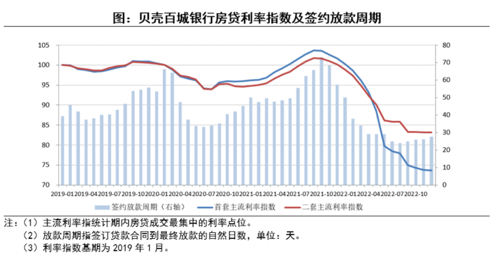
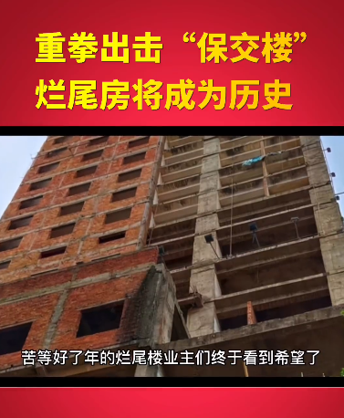
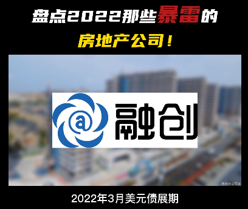
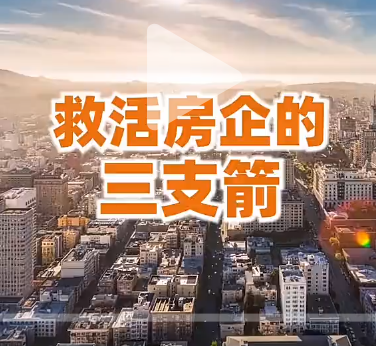
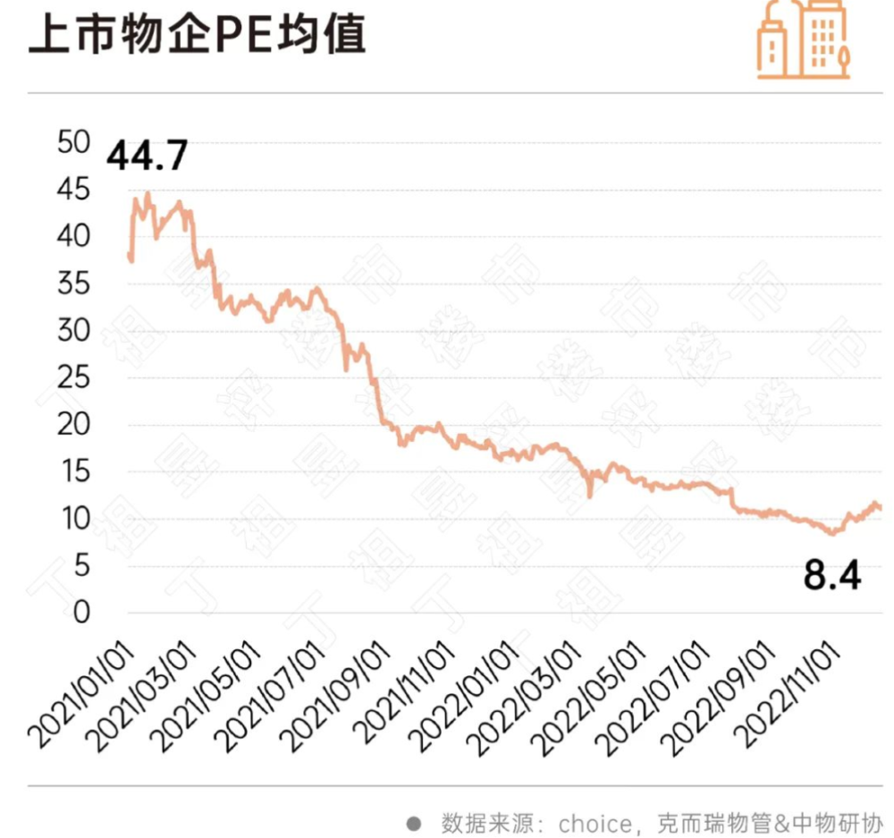
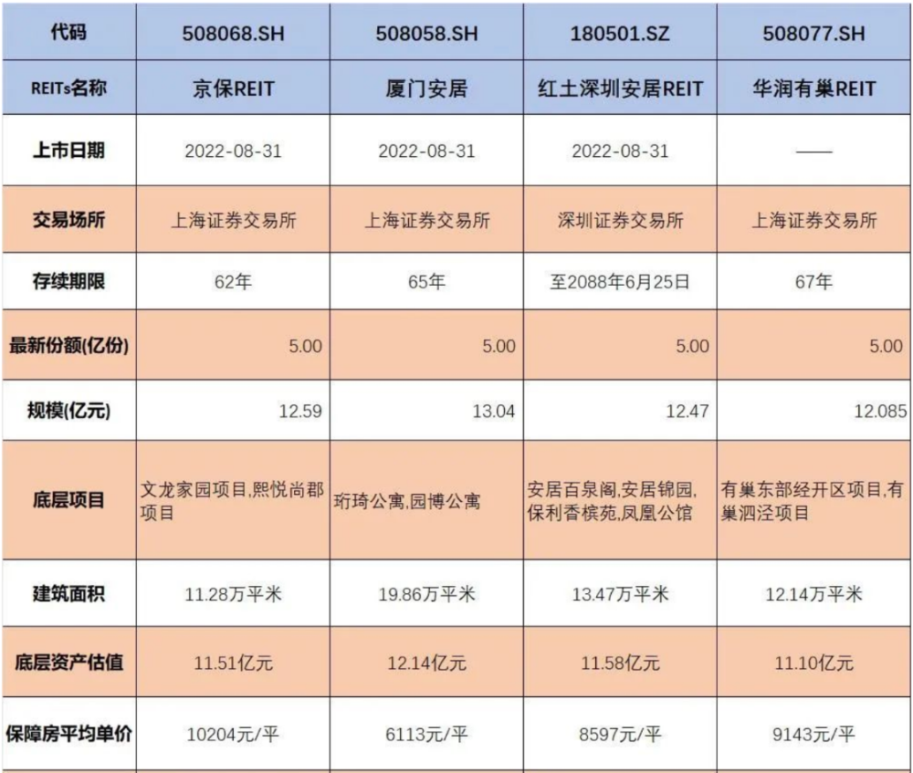
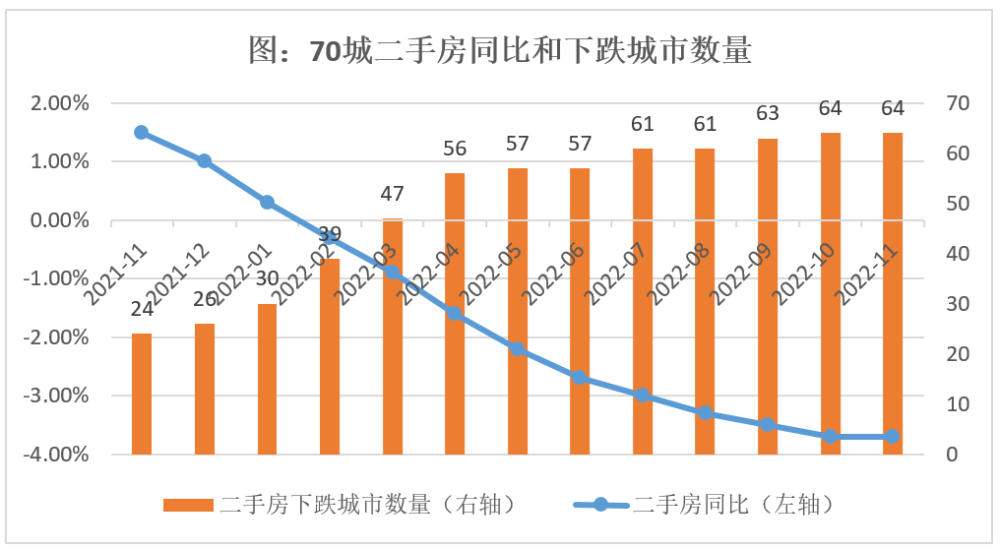
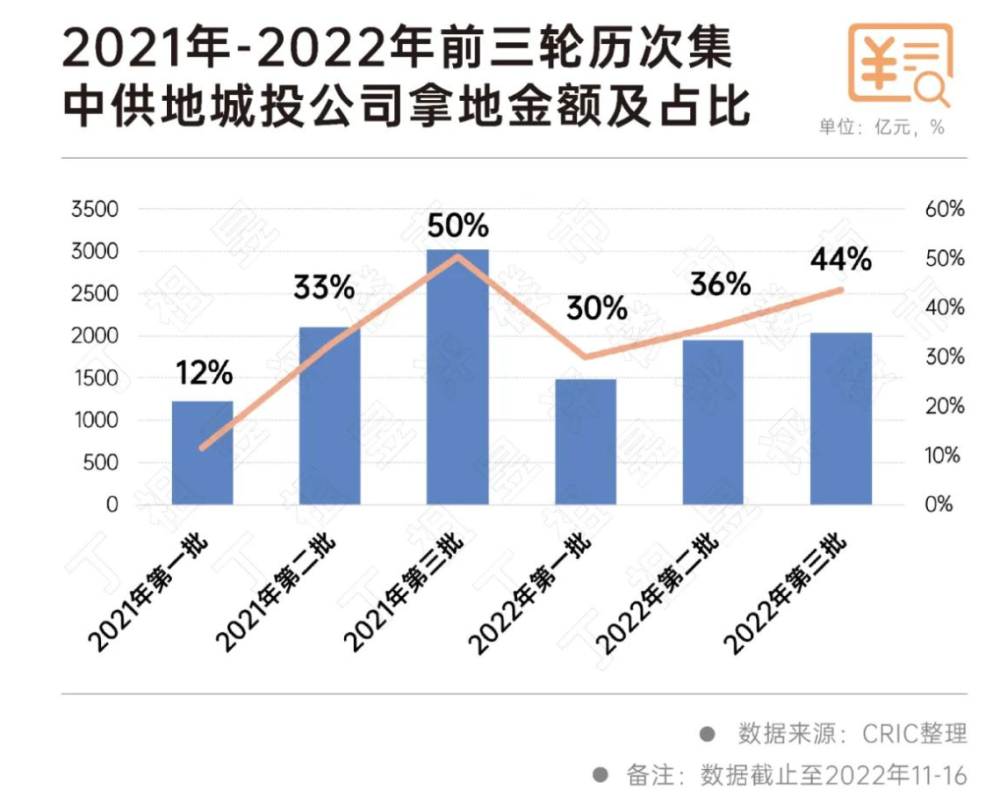
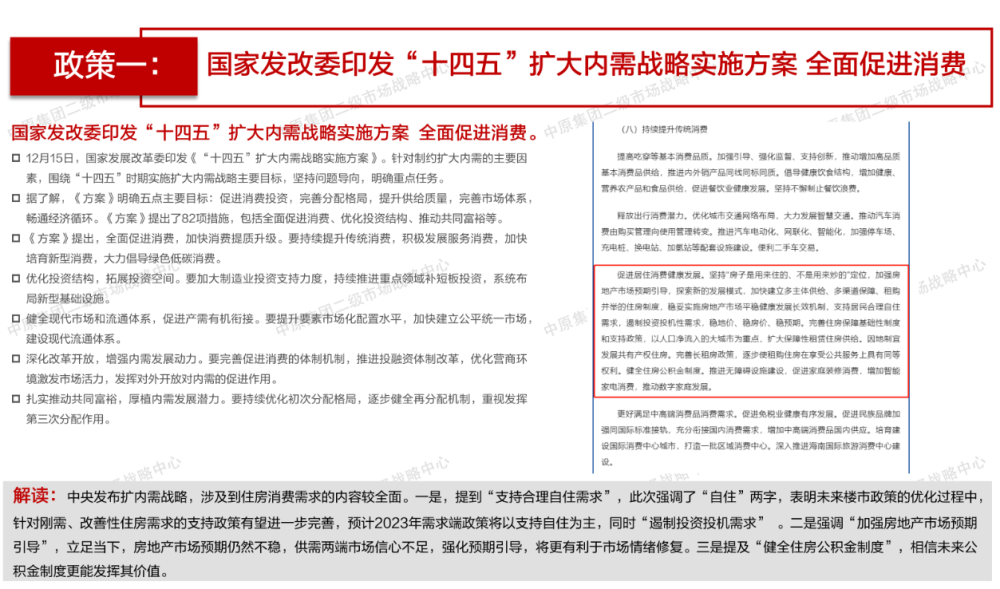

# 2022年房地产10大事件：房贷利率创历史新低、全力以赴保交楼……

事件一：新一轮降息通道开启

从2022年1月开始，央行开始全面降息，5年期LPR下调5个基点到4.6%，这是2020年4月份以来的首次下调。注意的是，这只是开始：

5月，5年期LPR下降15个基点，至4.45%，首次下降这么大幅度

8月，5年期LPR再次下降15个基点，调整为4.3%

9月底，央行再放大招，同环比新房价格均下跌的，首套房利率加点水平下调幅度不限

11月，30多个城市房贷利率降至4%以下。

图：房贷利率创历史新低

点评：

首套房贷利率降至了历史最低，而且从2021年年中5%以上的水平开始下降。节奏和力度非常大。为何？首先，房价还在历史高位，但购买力明显减弱；其次，对房价的预期不再像以前了，这是最要命的。一旦预期房价不涨，而投资房产的综合成本在6%（折旧、物业、按揭、机会成本等），出租是投资收益率自有2%左右，还不如存款，5年期定期存款利率在3%左右。所以，今年存款涨的很快。从这个分析来看，预计明年还得下降，因为房价预期真的改变了，不降息，规模化买房很难复归。

事件二：保交楼首次上升为楼市的主题

2021年就提出了“保交楼”，但真正开始发力，在2022年，因为民企大面积暴雷，保交楼的范围扩大。2022年7月28日，政治局召开会议，首次在国家层面提出保交楼的主题。11月21日，人民银行、银保监会召开全国性商业银行信贷工作会议，人民银行将面向6家商业银行推出20000亿元“保交楼”贷款支持计划。随后，央行又推出2000亿无息贷款，标志着保交楼上升到重要任务，存在资金硬缺口，不得不国家介入。

图：保交楼上升为楼市主题

点评：

楼市繁荣这么多年，社区越来越漂亮，现代化，但居然连房子都难交付，并成为楼市管理的主题。不管楼市怎么繁荣，百姓的权益是第一位的。背后反映的问题是，这么多年楼市高举高打，事实上是资本和杠杆推着走，民生和居住属性被忽略。因此，保交楼也是倒逼行业和市场转型。2023年，保交楼进入攻坚阶段，剩下的都是存在资金硬缺口、债权债务关系复杂的项目，需要各方努力，也需要更加智慧化的措施。但不管如何，百姓的权益要保障，谁把资金拿走了，就让谁追回来，后者要承担法律后果。

事件三：房企暴雷全面蔓延，恒大处理未有结果

房企暴雷，从2021年的恒大、泰禾等粤系、闽系个别案例，演变到2022年大面积爆发。目前来看，除了旭辉、碧桂园、龙湖以外，TOP50内的民企地产基本上都暴雷了。所谓暴雷就是，公开宣布债务无法偿还了。而且，房企暴雷产生了蝴蝶效应，近期国企央企地产、城投平台的资金链也开始趋紧了，比如拿地减弱了。

图：2022年房企暴雷范围扩大

点评：房企暴雷，是楼市一系列问题的总根源，比如停贷断供、保交楼、信贷收紧、债主逼债等，这些在供给端对楼市进行冲击，导致需求端预期恶化，银行不敢给开发商贷款、购房人不敢买暴雷房企的房子。房企暴雷，从个别案例恶化为全局风险，也是系统性风险的主要源头，2022年中央经济工作会议将房地产放在防风险一栏中。到目前，2022年暴雷的房企比如恒大，仍没有妥善的债务重组方案出台，保交楼也还在进行中，预计2023年处理房企暴雷，仍是楼市的主题。

事件四：三支箭发出，资本市场融资12年来首次开启

从2022年8月6日央行祭出“16条”措施以来，信贷、债券、股权三个融资渠道（俗称“三支箭”）全面纾困房企资金面，防范系统性风险发生，即信贷满足开发商合理贷款需求，境内银行间、交易所债券等面向房企开始注册，借壳上市、再融资等暂停了12年的资本市场融资也开闸了。

图：三支箭全面纾困房企资金链

点评：

三支箭，本来是针对民企全方位开启平等的融资渠道，要求金融机构不得有所歧视。只不过，由于民企地产的下滑、风险更严重，2022年底单独把民企地产资金面纾困问题，重点强调。三支箭发出，源于地产下行、资产价格下跌，金融机构担心风险。对所有民企地产企业，即便是合格抵押物的项目，也不敢给融资，即所谓的“一听到是民企地产，马上摇头NO”。这与上行期争着给房企贷款，形成鲜明对比。目前，三支箭还未见到效果，什么时候资产价格不跌了，民企开始拿地了，融资也就开始回归了。

事件五：物业上市势头减弱，出险兜售物业板块的现象

受房地产市场拖累和反复疫情的影响，物企上市热情减弱，整体上市意愿下降，行业出现IPO终止和退市现象。2022年物企上市热情进一步减弱，仅3家物企递表，相比2021年的34家大幅锐减，而且，物业股估值降至历史最低，2022年不到10倍，相比2021年初44.7倍的估值下降不少。同时，头部物业企业，包括雅居乐、恒大、富力、奥园、祥生等开始出售旗下物业以自救。截至12月底，2022年物管行业已披露相关信息的并购交易31宗，交易金额106.3亿元。

图：物业企业估值降到新低

点评：

物业是现金奶牛，估值又比较高，而且国家重视行业转型，向物业和社区管理、持有型物业运营转型。因此，央企、国企都在做大物业管理的规模，这样符合国家要求，也能发挥规模效应。因此，出险企业把物业卖给优质房企，这是自救的一条可行的路径，也是唯一可以接受的售卖资产。

事件六：多地推二手房“带押过户”，促进市场良性循环

为了激活二手房市场，促进房屋良性循环，2022年8月份以来，超过20个城市陆续宣布推出二手房“带押过户”的交易模式，其中既有深圳、广州、西安、宁波、苏州、无锡等热点城市，也有中山、丽水、潍坊、淮安等三四线城市。

图：带押过户在全国大范围展开

点评：

二手房“带押过户”模式的核心是免去了提前还贷以注销抵押登记的“过桥”环节，实现贷款资金到账与产权过户登记、抵押权注销和设立登记同步办理。环节之间打通了，降低了信用信息成本、缩短了交易周期，有利于二手房交易流转，促进换房需求，带动新房销售。

事件七：首批房地产REITs试点发售

2022年8月16日，国内首批保障性租赁住房REITs正式公开发售，标志着我国住房租赁产业“投-融-建-
管-退”的闭环正式合拢。四支产品分别为华夏北京保障房REIT、中金厦门安居REIT、红土深圳安居REIT、华夏基金华润有巢REIT，其公众投资者认购全部超募拟认购份额数量均超过100倍。

表：四支保租房REITs情况

点评：

12月8日，证监会副主席李超在中国REITs论坛2022年会上指出，要加快打造REITs市场的保租房板块，预计未来保租房发行REITs的门槛会降低，而无风险收益率随着利率常态化下行，理财产品净值化管理，打破刚兑等，都意味着保租房REITs的吸引力会明显增加。REITs是什么？简单讲就是底层资产可持续现金流为依据发行的受益凭证。未来，不用再去投资房子了，交易成本太高，门槛太高，还卖不出去。投资REITs就行了，资金门槛很低，还有人帮你选现金流可持续的房子，帮你管理房子。

事件八：新房、二手房价连续15个月下跌

截止到11月份，全国70城新房价格环比连续15个月下跌，同比已经连续下跌8个月；二手房环比连续15个月下跌，同比连续下跌10个月，有51个城市的新房价格同比下跌、64个城市的二手房价格同比下跌。房价下跌城市数，下跌幅度创近年来历史新高。

图：房价下跌城市数，下跌幅度创近年来历史新高

点评：11月二手房指数同比下跌3.7%，对应的均价下跌绝非是3.7%，至少是20%。也就是说，二手房价格相比一年前下跌了至少20%。而且，下跌幅度可能更大，珠三角二手房价格下跌超过30%。新房也一样，由于担心老业主闹事，地方政府也不太同意大幅度降价，开发商直接降价有限，但返佣幅度恒大，把这部分算在跌幅里面，实际的跌幅非常大。总之，2021年买房的，现在明显亏了。

事件九：城投托底土地市场，第三轮拿地占比44%

临近12月中旬，22个典型城市基本已完成了2022年第三轮集中供地。2022年前三轮集中供地中，中心城区供地比重均在48%以上，比2021年三轮中心城区供地比重高出5-8个百分点。三轮供地结束后，仅上海完成年度计划的八成，多数城市供地计划完成不及六成。央企、民企第三轮供地与前两轮相比均呈现下降走势，尤其以央企第三轮下降明显，拿地金额与首轮相比下降了34%，与次轮相比下降了53%。城投公司投资力度逐轮提升，拿地金额与首轮相比提升37%，与次轮相比提升4%。

图：城投大范围托底拿地

点评：

楼市下行，销售回款不断走低，即便央企国企地产企业，也无法再次大规模拿地，于是，城投开始进场了。但地方国资平台拿地整体入市率仅有9%，一方面是业务能力不力，并非是专业地产企业；二是市场下行，入市了也卖不出去或亏损。财政部近期文件指出，严禁通过举债储备土地，不得通过国企购地等方式虚增土地出让收入，不得巧立名目虚增财政收入。因此，预计2023年城投托底的案例应该会减少。

事件十：扩内需再提地产，再次明确“支柱产业”的定位

12月16日，中央经济工作会议强调，把恢复和扩大消费摆在优先位置，支持刚性和改善性住房需求，推动房地产向新发展模式平稳过渡。同时，近期管理层也指出，房地产是国民经济的支柱产业。

点评：

不管是与西方国家相比，还是“七普”数据显示的需求满足程度，我国房地产还有很大的发展空间。以珠三角为例，该区域住房自有率仅50%左右，7800万人口中一半左右是新市民、外来人口，主要居住在体验感差、配套设施严重不足的城中村、园区宿舍。还有，存量房源的供应效率比较低，配套设施、电梯布置率比较低。所以，房地产还要大发展，只不过，过去那种高举高打的模式，持续不下去了。

展望2023年，如果疫情影响能在一季度得到控制，百姓可以线下自由活动；如果需求端的预期能得到好转，财政能积极纾困百姓收入，提高工作前景和就业预期；如果供给端能处理好保交楼、风险处置得到有效紧张，房企不再无序打折促销。也就是说，做到了这三个如果，商品房价格将在2023年6月份前后触底，首先是二手房交易扩大，价格过度下跌的趋势收窄，然后带动新房市场量价稳定。

