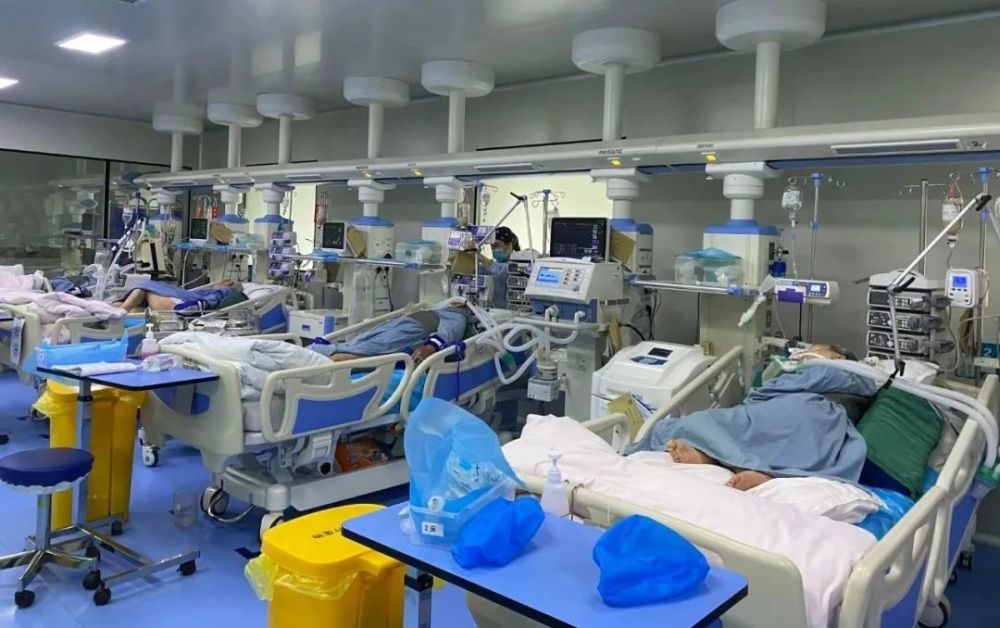
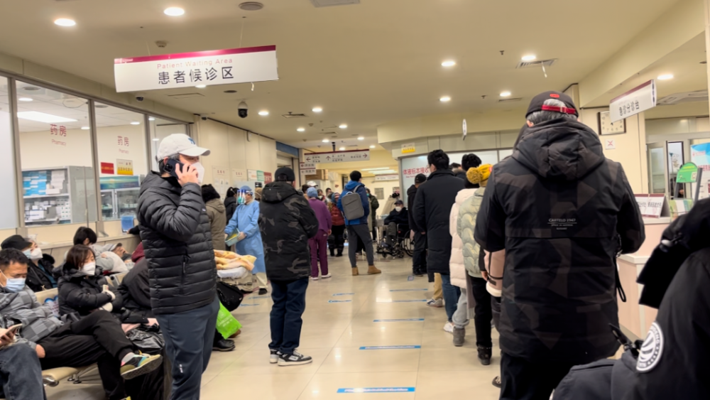
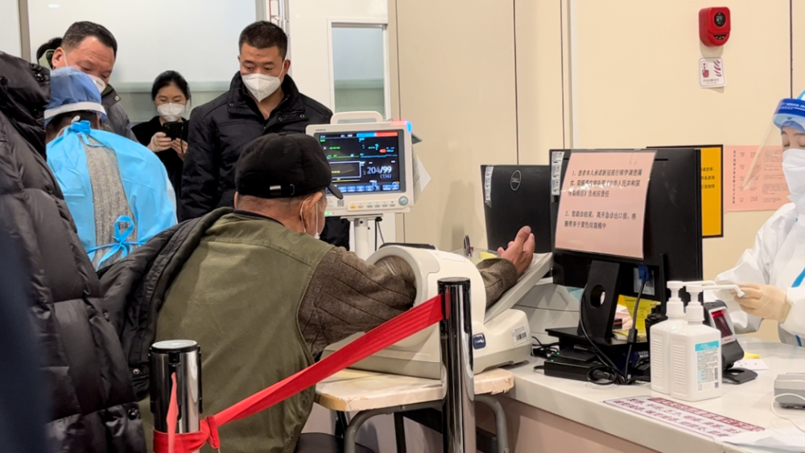
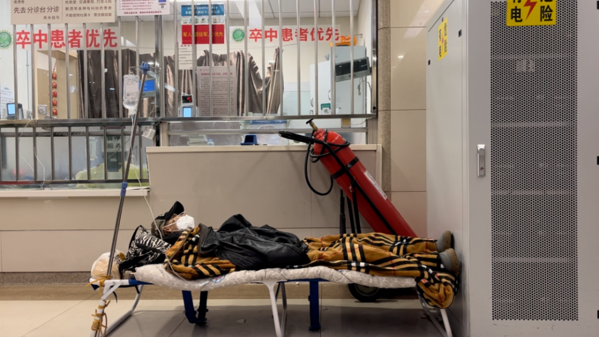

# 不到300张床位的乡镇医院，接诊约200名新冠患者，仅有的6张ICU床位已满

一个感染高峰将去时，紧跟的是重症冲击，最大限度地均衡调配医疗资源才能渡劫。

**文/ 王小 凌馨 辛颖**

**编/ 王小**

_脑梗、心梗等重病人，已经把这家医院的ICU占满了
摄/凌馨_

新冠感染高峰已冲向医疗系统的最后一道防线。

“每天都在减员，每天都在调度人手，我也是一边挂水一边在上班。”2022年12月26日，江苏一家二级医院的院长在电话那头语带哽咽。

这家拥有不到300张床位的乡镇医院，已收治了约200名新冠肺炎患者，多数都是60岁-90岁的老人。一旦这些老人的病情加重，医生们恐怕没有能力与死神争抢——重症监护室（ICU）有六张床，已满员。

ICU是医疗体系最后的战场。然而，这家二级医院七位ICU医护人员，现在一多半陆续躺倒了。“医护人员发热还在上班，有的自己走路都在喘。”这家二级医院院长说。

这波疫情的高峰期还没到。 **多位专家预测，未来一两个月、春节前后将会是感染高峰。**

中国疾病预防控制中心流行病学首席专家吴尊友在《财经》年会上发言称，2022年12月中旬到2023年1月中旬，第一波疫情主要在全国大中城市上升；1月下旬到2月中旬，春运前流动造成第二波疫情上升；2月下旬到3月中旬，春节后返回工作岗位及务工人员返程，引发第三波疫情。

截至2022年12月23日，国内重症病例515例，比一个月前的100多例虽增加不少，但整体重症还不算多，这让医疗系统有了一个补齐资源短板的窗口期。

国家卫生健康委医政司司长焦雅辉说，
**做好下一阶段医疗服务工作的“先手棋”和“关键棋”，要求各地把二级医院重症监护科和重症监护病房按照标准进行改造，要求三级医院综合ICU要达到床位总数4%的比例。**

2022年底突然暴起的新冠感染潮，让一些老人、儿童和基础疾病患者无处可避，医院将随之迎来重症救治的高峰，这最后一道防线准备好了吗？

**重症高峰将至**

2022年12月的江苏，低温徘徊在2摄氏度左右，往日这也是医院ICU最忙的季节。

在南京医科大学附属逸夫医院，“ICU床17张，满的；脑外ICU有7张，满的；CCU（冠心病重症监护病房）15张，也满的”。该院重症医学科副主任贾凌说，这些病人的平均年龄在75岁以上。

**重症的高峰通常比感染高峰滞后——不少感染者由轻症发展到重症，需要十天到两周左右。**
北京协和医院官微称，2022年12月12日，北京迎来感染高峰，15日迎来发热门诊高峰。彼时，专家预测，重症高峰会在一两周后到来。

变化始自圣诞前的那个周末，新冠阳性的重症患者突然多起来。“今天抢救的有四五个插着管上呼吸机，没有床位。”贾凌12月27日告诉《财经》记者，一个月前，ICU每天收治病人数为两到三人。

12月26日中午，北京的胡可赶到朝阳医院急诊科时，大厅里挤满了自带小板凳候诊的人群。“主要都是老人，有一些能坐在轮椅上输液”，100多个号的候诊，等了六个多小时。她旁边的一位等候输液治疗的肺炎患者，最近每天都要经历一次这样漫长的等待。

_北京朝阳医院患者候诊区
图/受访者提供_

当晚8时许，在南京另一家三级医院急诊，程一看到，每两分钟就有一位老人被移动床推进阳性病区。他们也要等100多个号，才有可能在医院走廊或楼梯间临时安顿下来。

五日前，国务院联防联控机制医疗救治组召开全国电视电话会议强调，三级医院要兜住医疗救治和生命保障的底线，全力做好老年和儿童重症患者医疗救治。

在上海，“全市发热门诊量从高峰的26日开始逐步下降”。上海交通大学医学院附属仁济医院党委书记郑军华告诉《财经》记者。往来急诊的救护车，却变得更忙了，
**12月26日，仅瑞金医院急诊，就接了92辆救护车，是平时的整整3倍。上海那轮疫情时，高峰期也只有51辆。**

心梗、脑梗等突发患者，已占满了医院的床位。那些有肺部疾病、糖尿病和肥胖等基础疾病的老人，也更多地被医院留了下来。仁济医院急诊留观患者的平均年龄已经达到77岁。

中国60岁以上人群的新冠疫苗接种率相对低，且完成两剂疫苗接种对一些人产生的保护效力只有50%左右，甚至更低。

据研究，
**相较于年轻人来讲，65岁以上、75岁以上、85岁以上的老年人，感染新冠肺炎以后重症的风险分别是5倍、7倍、9倍，死亡风险分别是90倍、220倍和570倍。**

北京大学第一医院感染疾病科主任王贵强在不久前的新闻发布会上说：老年人、有基础病患者，尤其是没有打疫苗的老年人，一定要做好防护，不要在第一轮流行高峰感染。在这个流行高峰感染，可能会出现医疗资源分配不均或者挤兑的问题，导致重症患者得不到及时有效的救治。

仅用了半个多月，新冠疫情冲击波已经从北上广一线城市顺着人流，陆续抵达三四线城市及更远的村镇。随着
2023年春节渐近，农村和城市之间的双向流动会更加频繁。感染高峰之后，向重症发展的新冠肺炎患者会多起来。

由于形势变化太快，很多地方医疗系统尚不能及时筑起防护。尤其，当老人和慢性病患者身份重叠，容易发展为危重症，全国各地的情况都差不多。

丁香医生一篇文章称，美国的一项研究显示，
**假设一个州预留了25%的ICU床位给新冠患者，ICU床位使用率每增加1%，将在未来七天内使因新冠导致的死亡人数增加2.3人。**

目前国内正在经历重症救治高峰的省份，重症床位的资源已经接近临界值，需要进一步来扩充重症床位的资源，或者是加快重症床位的周转。焦雅辉在2022年12月27日发布会上表示，我们提出一个要求，就是对于急诊留观的重症患者要实现24小时清零收治。最大程度实现重症患者的应收尽收、应治尽治。

**需要ICU，更需要均衡医疗资源**

医院在尽量安排老年新冠阳性、伴随其他基础病的患者入院。
**“主要是75岁以上的老人，昨天收治了一位100多岁的，都是基础病比较重的脑出血、偏瘫、肿瘤、血透患者，还有长期卧床的。”** 贾凌说。

这意味着需要ICU病床的，不仅是新冠肺炎患者。

按国家卫健委要求， **三级医院综合ICU要达到床位总数4%的比例。然而，对大多数医院而言，感染潮还是太快，准备的时间太仓促。**

以北京协和医院为例，开放住院床位2000余张，截至2022年8月，开放ICU床位58张，没有达到4%。在2022年11月22日，该院ICU提交了筹建重症隔离病房、组建新冠患者重症治疗预备梯队的方案，将急诊隔离病房、学系综合病房、MICU（内科重症监护室）陆续投入使用。

“经过近三年的提升，（仁济）医院现在有近170张ICU床位，已经接近总床位数的10%，但按照‘十四五’的规划目标，要提升到200张以上。”郑军华说。

根据国家卫健委的要求， **各个专科ICU，也要按照综合ICU标准扩容改造和建设。也就是需要的时候，可以在24小时内迅速转换成重症ICU资源。**

南京逸夫医院22张专科ICU在12月底已全部转换给了新冠阳性患者使用，一个拥有20张病床的后备ICU，也已投入使用。

目前，全国拥有ICU床位总数已达18.1万张，焦雅辉在2022年12月27日的发布会上透露这一数据，其中包括全国储备“可转换ICU”床位10.48万张。

平均下来每10万人有约12.8张ICU床位。鉴于中国的重症医学于20世纪80代初才起步，发展到这个数字已经很能拿得出手了。综合多个公开数据可见，近邻日本、韩国，每10万人13.5张、10.6张，新加坡也才7.1张。

地方医院仍然不堪承重。“都是阳性病人，能住上院的都是老年人，年轻人感染就不收住院了。”北方某家二级医院呼吸科医生在12月27日告诉《财经》记者，安排不了床位的患者滞留在了急诊科，或者只能患者自己想办法找医院。

_图/受访者提供_

**问题可能在于国内的医疗资源不均衡：全国18.1万张ICU床位，13.34万张在三级医疗机构。**

2021年中国卫生健康事业发展统计公报显示，全国有三级医院3275家。此前有调查显示，三级甲等医院作为优质医疗资源的代表，高度向东部地区集中。

三级甲等医院全国1651家，广东一省占了122家。据21世纪经济研究院统计，45%的三甲医院都在东部地区，而中部、西部地区只占不到三成。

ICU床位数的地区差异是如此明显。根据重症医学会2015年的一份ICU建设现状调查，彼时，
**只有华东地区每10万人ICU床位数能达到4.03张，西北、东北地区每10万人拥有ICU床位仅分别是2.97张、2.38张。**

尽管近年来二级医院的ICU建设加速，诊疗水平得到大幅提升，但还是有部分地区的县级ICU建设仍处于初级阶段，一般仅开设6张-8张床位左右。

在某北方县城，最好的医院是二级甲等的县人民医院，2019年成立呼吸重症监护室，有5张床位，另外综合ICU还有6张床位，在2021年投入使用，一共占总床位数的3.67%。这也是该常驻人口17.3万的县，仅有的ICU床位。

**年底补齐短板，能做到吗？**

为了接纳更多新冠重症患者，上述江苏乡镇二级医院新设了一个简版“ICU治疗室”，就是在普通病床多配了高通量供氧设备。

焦雅辉曾提出三个解决思路：一是地级市把方舱医院用起来，按照床位10%的比例来改造监护床位；二是二级医院按照标准改造出ICU；三是三级医院综合ICU要达到床位总数4%的比例并按照现在床医比和床护比，再额外扩充20%到30%的医疗力量作为重症力量的补充。

“所有这些扩容和改造工作，我们要求各地务必在2022年12月底之前完成。”焦雅辉说。

到了12月27日，一些医院还没准备好。福建一家二级医院，在2022年10月初完成了五张病床的ICU设备采购招标，总金额300多万元，至今没有开科。“因为设备从采购到供货，需要一个时间。”该院项目负责人告诉《财经》记者。

**建一个ICU病房，需要以床为单位配置呼吸机、监护仪、监护床、微量注射泵、雾化机等，此外还需要除颤仪、抢救车等。其中，呼吸机是购置费用的“大头”，如果配置设备高端，一台就需要40万元左右。**

郑军华介绍，在筹备上海新国际博览中心方舱医院ICU时测算，80张床位如果按高标准建设，需要2亿元的投入，但是考虑经费问题，按照最基础的配置，采购了不到3000万元的设备，平均算下来一张床位配备不到40万元的设备。

11月17日，国务院联防联控机制提出，定点医院ICU床位要达到床位总数10%。广发证券研报显示，假设一张重症床位设备价格为10万元，目前新冠定点医院数量大约三级医院占500家，二级医院占1000家，另外假设三级医院床位为1000张，二级医院床位为500张，重症床位占总床位数量大约5%，ICU建设相关增量市场达50亿元。

整体看，自2020年疫情之后，国内相关医疗补短板的进程就展开了，彼时提出医疗新基建的“千县计划”，2022年国家下发超3000亿元的医疗专项债，9月又给了贴息贷款政策，基本涵盖了医院现有设备的更新换代补充扩建、重症科室的建设等，彰显了医疗补短板的决心。

到2022年12月，二级以上医疗机构救治设备，已有监护仪97.12万台、血液透析单元15.11万个、有创呼吸机11.60万台、高流量吸氧仪3.82万台、床旁血滤机（CRRT）1.97万台等，数量可观。

**“其实在防疫政策调整之前，部分地区的呼吸机需求量就在上升，当时就把整个的生产工业区全封闭起来，调拨员工加班工作。”**
一位呼吸机企业人士对《财经》记者说。

迈瑞医疗2022年10月10日披露的投资者关系活动记录称，全国已上报超过2000亿元的医疗设备贷款需求，预计和公司产品相关的贷款需求将超过200亿元。

包括监护仪、呼吸机、除颤仪及ICU整体解决方案在内的生命信息与支持业务，是迈瑞医疗最大的产品线，贡献了超过四成营收，2021年实现收入111.5亿元，同比增长11.47%。该公司在2021年度报告中称，“主要得益于国内以大型公立医院扩容为主导的医疗新基建的逐步开展。”

2022年前三季度，迈瑞医疗该产线国内部分单季度增长超过了30%。实现了营业收入232.96亿元，同比增长20.13%，归母净利润81.02亿元，同比增长21.60%。

**全国二级、三级医院床位总数约561.6万张，12月27日焦雅辉透露的最新ICU床位数是18.1万张。以此计算，占整体床位比仅3.2%出头，这意味着还有更多的设备订单在路上。**

突然砸下来的“大蛋糕”，企业接下来也不轻松。一位跨国医械企业人士告诉《财经》记者，同事都感染新冠病毒了。一位国产医械企业人士说，急需扩产能的时候，就从集团其他生产企业调人帮忙。

2020年初武汉疫情紧急时，是政府部门协调供货，“现在仍然是以各地医院自己采购为主。”上述呼吸机企业人士介绍，
**最近国家药监局、地方的卫健委、医保局、发改委都在调研摸底企业情况，了解产量、库存，为应急调整做准备。**

岁末年初，ICU设备需求再次暴发，即便是医生们，想得到一台新的呼吸机，也要靠亲朋好友一起上阵“找门路”。

2022年12月26日，南京逸夫医院“抢”到五台无创呼吸机。贾凌为此感到庆幸，“刚把机子装好，就有一个病人用上去了，不然人可能就不行了”。

如果只需组装，一两天内就可供货。航天长峰曾公告，在接到郑州大学第一附属医院呼吸机订单后，48小时内完成生产配送、安装调试和工作人员培训。但对各方来说，政策调整来得太突兀，材料供应、物流渠道等，都有点措手不及。

迈瑞医疗一位业务负责人向《财经》记者证实，
**呼吸机确已供不应求。另一位国产呼吸机企业人士说，尤其是一些县级医院，前期没准备，现在只想采购一两台呼吸机的，“已经没有精力给它们供货了。”**

**我们需要撑起多少张ICU病床**

在上述江苏乡镇二级医院的简版“ICU治疗室”，护士是临时培训上岗的。“如果患者需要气管插管的话，还是要往三级医院转。”该院院长说。

为了应对重症高峰，自12月中旬，武汉大学人民医院呼吸内科调整排班，安排更多医护人员进入ICU轮转。“根据需要，支援ICU的人手随时还要增加。”该院呼吸与危重医学科副主任医师余昌平对《财经》记者说。

南京逸夫医院成立了一个专家巡查小组，由呼吸科、重症医学科共六七名有新冠肺炎治疗经验的医生组成。重症患者的诊断和治疗方案制定，要由这个巡查组拍板。他们还需要每天早晚巡查两次，指导脑外科、心内科等专科ICU的医护人员，快速完成角色转换。

**买设备、划地盘不算难，资金充足就可解决。ICU扩容的真正难点，在于医护专业人员的招聘与培养。**

重症医学科创新技术——体外膜肺氧合仪（ECMO），全国二三级医院目前共拥有2300余台。“很多医院虽然采购最先进的ECMO，但基本只用于教学和展示，平时还是用老款的，就是没什么人会用。”上述国产呼吸机企业人士介绍。

_图/受访者提供_

尤其在小县城医院，医护人才更难得。上述北方二甲医院呼吸科医生介绍，最近一直在加班，负责普通病房和ICU的医护没有分开，“因为没有人手”。

德国是世界公认的ICU床位多、做得好的国家。其医院联盟主席格拉尔德·噶斯（Gerald
Gaß）也对媒体抱怨，鉴于新冠肺炎病人数量攀升，护理人员瓶颈问题便成为
“当前面临的核心挑战”，不要仅把重症监护室的情况作为判断疫情是否可控的唯一标准，且每五位来院的新冠肺炎病人，就有一位需要进行急诊治疗。

贾凌分析，刨去在校学习时间，培养一名重症医学科医师，至少需要三到五年，才能称为“合格”。
**培训上岗还不算难的，“问题是你要能把人看好。ICU的病人，每天情况都可能变化，每天的治疗都要做相应调整，才能降低病死率”。**

中金公司2020年的一份研报中，将“护士短缺”列为除“政府财政投入不足”之外，导致中国ICU建设水平低于大多数西方发达国家的原因之一。

《中国医院建设指南》中称，ICU医护人员与床位比例要求较高，其中医生与床位比例为0.8∶1，护士与床位的比例为3∶1。

根据焦雅辉透露的数据，中国重症医学的医师总数是8.05万人、护士22万人，据此推算，与床位比例分别为0.54∶1和1.47∶1，均未达到要求。

**“其实发展重症医学对医院来说短期就是亏本的，为抢救一个患者要投入十几个人力，成本是非常高昂的。”**
郑军华介绍。在上海仁济医院，近170张ICU床位，是一个配有58位医生、307名护士的团队在支撑，而且医院非常重视重症医护人员的招聘、培养，在职称晋升时给予政策照顾和倾斜。

如果医院的ICU床位快速扩张，疫情平息后，有可能会空床过高，人员成本、设备损耗等对医院来说这是一笔不菲的成本。

**目前国内有约400家医院建有ECMO中心，其中只有100家医院是处于相对比较活跃的状态，每年会收十例以上的病人，其他的医院都是在个位数。**

据北京协和医院重症医学科杜斌2016年的研究文章可见，美国ICU床位数居于全球前列，2005年至2007年间，美国ICU的平均床位使用率仅为70%，机械通气患者比例不足40%，低危患者的比例甚至高达53%。

该文指出，估计中国ICU床位数与英国相似，占医院总床位数不足2%。床位数更少的英国ICU，收治患者病情更重，且患者病情越危重，住院病死率却较美国更低。杜斌认为，这些事实提示，“盲目增加ICU床位数，不仅不利于降低总体医疗费用，而且还可能对病情真正危重的患者造成危害。”

因为感染新冠后出现胸闷症状，12月26日在北京朝阳医院就诊的胡可，被急诊护士分为急迫程度最低的四级，一位已经呼吸特别急促的老大爷，属于三级，直接被安排测血氧血压，然后再走候诊流程，如果是一级、二级的危重症患者可走特殊通道，无需候诊。

焦雅辉说： **目前来看，全国总体床位资源和设备资源是能够满足重症患者救治需求的。**
同时，我们也要求在国家的区域之间建立区域协同支援制度，根据每个地方疫情发展不同阶段的需求，及时统筹调配全国重症资源加强重症患者的医疗救治。

2023年1月8日起，中国新冠病毒感染将调整为“乙类乙管”。

**“我们比以往任何时候都更接近宣布新冠大流行的紧急阶段已经结束，但我们还没有走到那一步。”** 世界卫生组织总干事谭德塞在离去的2022年底说。

（文中胡可、程一皆为化名）

