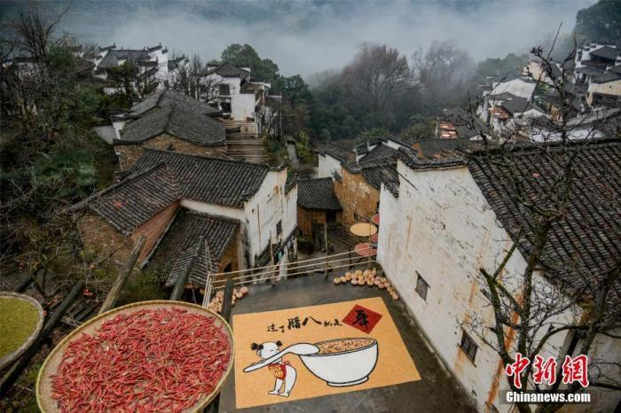
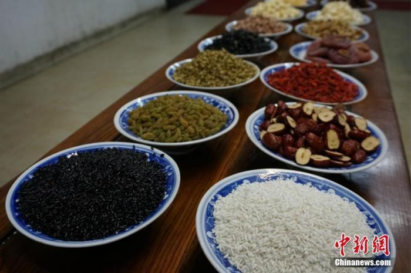
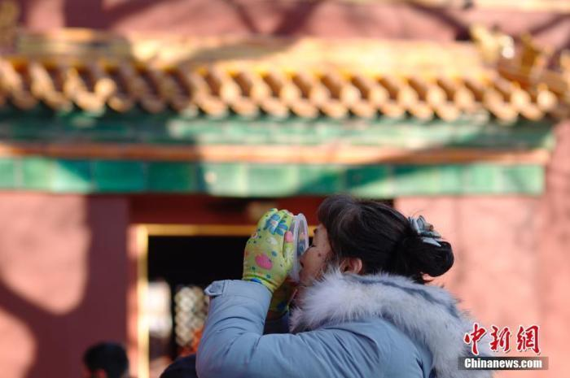
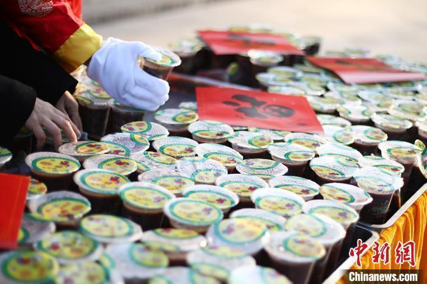
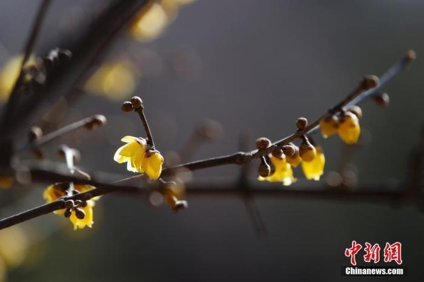

# 今日腊八丨过年序幕拉开！

小孩小孩你别馋

过了腊八就是年

浓香的腊八粥

可口的腊八蒜……

当腊八节来临

过年的序幕就此拉开

_资料图：中国传统节日“腊八”，“中国最美乡村”江西婺源篁岭古村的村民和游客们共同度过的腊八节。洪海君
摄_

在传说中

古人认为大人小孩身体不好

是由于恶鬼作祟

这些恶鬼十分害怕赤豆

在腊月初八的时候

人们便以红小豆等熬粥

以求祛疫迎祥

这一习俗渐渐流传下来

腊八粥用料讲究

有些做法精致复杂

如用黄米、白米、江米

以及去皮枣泥等合水熬煮

等煮熟之后

以染红的桃仁等点染粥面

看上去赏心悦目

_资料图：图为“少林五行腊八粥”所需的配料。韩章云
摄_

“吃冰”亦是旧日习俗

腊八前一天

用干净的盆舀水放在屋外

等待水慢慢结冰

以前相传吃了腊八节这一天的冰

未来一年不会肚子疼

人们期待着身体健康

“腊八豆腐”是此时美食

成品色泽黄润如玉

另外一种节俗食品

则是好吃的腊八面

_资料图：北京雍和宫，市民品尝腊八粥。中新社记者
韩海丹 摄_

将蒜瓣剥好皮

放进瓶子之类的容器

浸入米醋后封严瓶口

待到除夕启封

鲜香可口的腊八蒜

正是餐桌上的美味佳肴

草木向阴犹带雪

风光近腊已如春

以传统历法来看

腊月临近岁尾

此时天气虽依旧寒冷

但春天的气息已经悄然萌动

_资料图：工作人员将定制的腊八粥摆放整齐。泱波
摄_

春节的脚步渐渐临近

腊八节到来后

再有一段时间就要过年了

人们忙着采购年货

期待不久之后的阖家团圆

_资料图：北京陶然亭公园一株腊梅悄然开放，吸引游客前来观赏。中新社记者
杜洋 摄_

又是一年腊八节

愿你生活美好如愿！

(记者 上官云)

