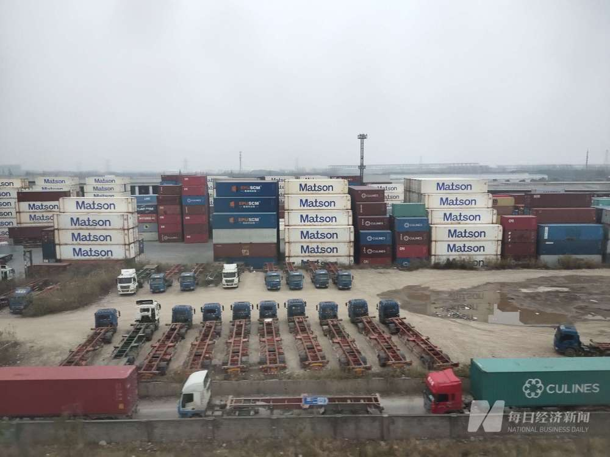
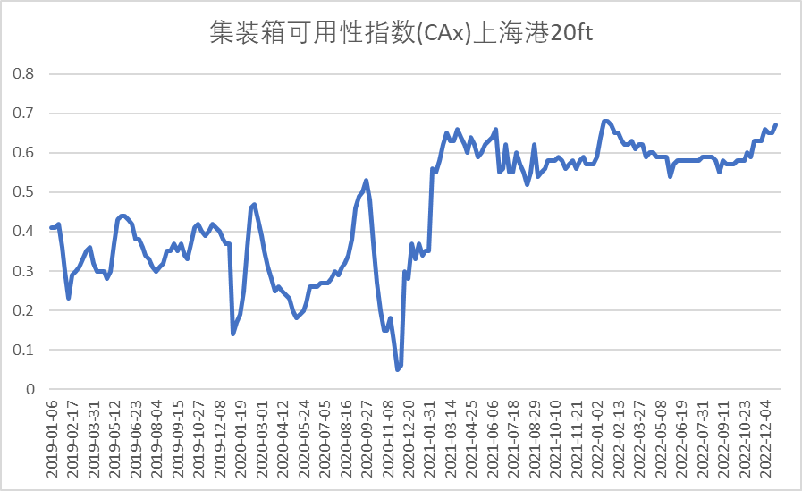
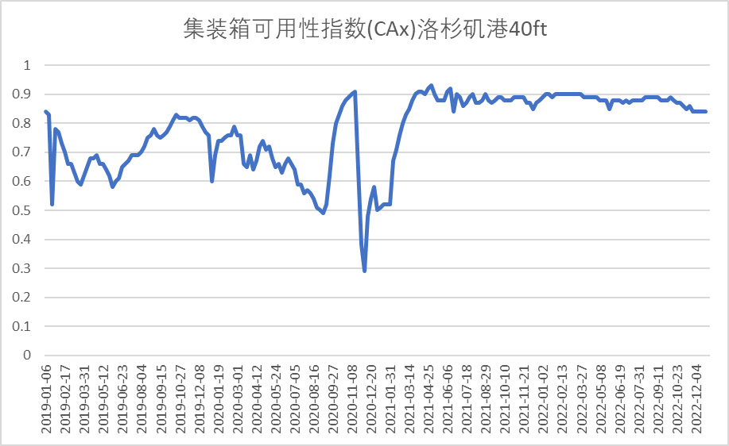
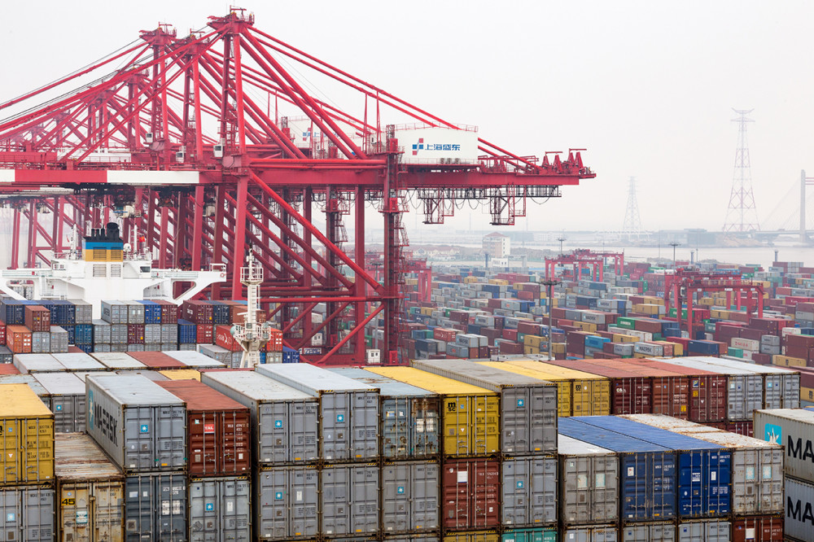

# 全球集装箱溢出流入中国：有码头空箱堆存量占比超90％

每经记者：张韵 每经编辑：梁枭

从一箱难求到空箱堆港，仅仅半年时间。

11月，盐田港的空箱突破开港29年以来的最大堆积量。在担忧情绪渲染下，卡车司机难接单的消息也不胫而走，一些观点将矛头指向了悲观的货运需求与客观的运力过剩。

如今，情况是否有所变化？

临近年底，春节前的出货小高峰终于让缺单的集卡司机忙碌起来。“进入12月份，出货增加，油价下调，部分运输价格还上调，因此司机接单都有积极性了。”与11家车队合作的货代小郑如是说。

中远海控（SH601919，股价10.29元，市值1656亿元）方面向《每日经济新闻》记者表示：“中远海运会积极做好成本管控工作，通过多元化的方式，减少空箱堆存费支出。”与此同时，国内港口企业也对内部码头堆场用地进行优化腾挪，物流公司的新箱购买意愿也变得更为谨慎。

“毫无疑问，目前全球都处在集装箱供应过剩中，不是一个港口，而是全球的集装箱都多了，”上海国际航运研究中心首席信息官徐凯解释道：“过去我们因为出口货物多，进口货物少，不得已要把空箱运回，现在是别的国家都堆不下了，满出来了，所以才要往我们这里运。”

货运有所回暖

12月30日，小郑通过微信向记者表示：“这几天（宁波）北仑堵车非常严重，一是因为货多了，二是因为很多堆场晚上不作业，都挤在白天，目前宁波集卡司机的接单情况好转很多。”

而12月28日傍晚六点，在上海高桥镇海港城路江东路路口以东，集装箱运输车拥堵不前，汇成百米长龙，而路口以西的左右道路上，临时停放的无人空车更是不下百辆。

_港城路沿路集卡停车场
图片来源：每经记者 张韵 摄_

一位在车内休息的司机师傅告诉记者，有些司机“阳”了所以停车没干活，还有一些是在堆场外等待提箱的。

“现在处于特殊时期，一是疫情导致司机数量减少，二是春节前的出货小高峰，所以出现司机不够的现象”，小郑补充，“前段时间，油价上涨，运价没调，加上出口量降得比较明显，作为弱势群体的司机们失去接单的积极性，而目前的行情变了，给司机的价格也是高的，司机都是‘应接尽接’的”。

空箱压港持续

尽管如此，码头空箱堆港的现象尚未得到缓解。面对空箱回流造成堆场紧张的问题，各港生产部门也积极安排场地堆存空箱计划，以提高堆场利用率。不过，进入12月，空箱挤占堆场资源仍是各枢纽港的压力所在。

《每日经济新闻》记者在部分堆场走访发现，临近门口的集装箱落地货柜已堆放至6~7层，仅暂落箱场的积压情况较上月有所改善，大约每2~3天完成周转。

_港城路一堆场货柜堆至6~7层
图片来源：每经记者 张韵 摄_

_集装箱堆至堆场入口 图片来源：每经记者
张韵 摄_

日前，上港集团（SH600018，股价5.34元，市值1243亿元）振东分公司的在场空箱堆存量占比超过90%。为了缓解空箱堆港压力，12月公司将18块重箱轮吊作业箱区调整为空箱堆高车作业箱区，场地平箱将原6层高堆存改到7层，并利用正在总装调试中的自动化轨道吊三期部分场地。

与此同时，振东码头加强了与船公司的联动，通过沿海调运和优先提箱等举措，加速空箱提离，并利用上港外运场地，增加集装箱直卸的艘次和箱量。上港家园披露的数据显示，振东共增加空箱位34770TEU，空箱位总数达到85770TEU。

船公司向记者表示，现阶段，国内各口岸空箱数位于历史高位，业务部门主要是做好用箱统筹，并倾向堆放至费率较低的堆场。

集装箱贸易量已大幅下降

随空箱压港而来的是集装箱贸易价格不断走低。

一位不具名的集装箱贸易圈内人士告诉记者，从12月数据来看，贸易箱成交数量比上月大幅减少，主要交箱口岸有青岛、宁波、天津，其他港口比较缓慢或者箱量充足，近期没有接到买箱订单。

上述人士主要向物流及贸易公司等市场上的中小客户销售集装箱。据他所言，今年的箱价一直在走低。“我们公司的价格8月份在2400USD/TEU，到12月份落到了2050USD/TEU。”

“现在客户和箱厂都不会做库存箱的。”不仅如此，记者了解到，物流公司下单变得越来越谨慎，每单的数量也不会太大，集装箱贸易环节已经深刻感受到市场下滑的经营压力，而依托背靠背合同的中间商更是没法扭转持续下行的箱价，只能持续跟踪，一旦拿到更好的价格及时向客户推荐。

“但国内集装箱的贸易活动不至于停滞。”12月30日，航运界网副主编马晖在微信中向《每日经济新闻》记者表示，春节假期来临前会有一波贸易量回暖，如果空箱堆存过多，一般堆场会出台政策调整，预计空箱问题在春节前后会改善，具体走势春节之后会有变化。

箱量过剩如何消化？

从源头来看，市场的种种表现源自全球箱量供给过剩。

记者从2015年~2022年10月中国金属集装箱产量及增速情况数据图中看到，2020年及以前，中国集装箱产量约为10000万立方米，2021年中国集装箱产量同比增长了133.8%，达到23057.6万立方米，而在今年1~10月，尽管产量同比有所下降，但依旧高于往年，为13387.5万立方米。

徐凯分析认为，在2020年~2021年间，由于集装箱没有流动起来，海运市场出现一箱难求，大量新箱经船公司及大货主订购下海，加上众多本应老旧淘汰的集装箱经过修补继续使用，导致当前全球集装箱实际保有量有所增加，大量集装箱出现过剩。

德鲁里航运资讯机构的数据显示，目前集装箱过剩量预计超过600万TEU。从全球各港口的集装箱可用性指数来看，11月，上海港、青岛港处于0.6~0.7区间，而位于欧美的安特卫普港、洛杉矶港则处于0.8~0.9区间。

_图片来源：受访者供图_

徐凯解释道，一般而言集装箱可用性指数位于0.5说明供需是平衡的，而目前欧美主要消费市场的一些港口指数已逼近0.9，说明大量空箱堆放在那里，且远超国内各港口的堆放量。

“这意味着全球的集装箱都多了。而在一些主要消费市场，如果没有空箱调运的需求，箱子就扔在那里，只有当班轮公司要把自己的箱子调运到装货港时，才会到达像中国这样的出口国”。徐凯进一步表示。

马晖也表示，一般而言，一条船需要配备3倍的集装箱量，此前集运市场大繁荣时箱子有去无回只能疯狂造箱，现在国内空箱存量增加，对未来的货运市场是好事，因为有足量的箱子，就不会再出现突发的缺箱情况，会提高供应链韧性。当然，运价肯定是下滑的。

在航运业内看来，现在的空箱回流是正常的，集装箱的过剩并不能用来解释货运市场本身出现了问题，经济学家对明年出口贸易量的悲观预判仍需考证。

徐凯对未来的货运需求持积极观点。据他观察，国际的动荡局势不会再加剧，一切生产活动会加速恢复，因通胀加息抑制的消费需求不可持续，而欧美的高库存也将在今年年底得以消耗。另外无论在思想上还是技术上，人们有了更多的数字化工具以应对市场的不确定性，欧美通过跨境电商购买中国商品的趋势不可逆，因此2023年的货运市场将是稳中向好的局面。

事实上，早在2020年时，疯狂造箱之下，市场已早有预见，箱量过剩是必然结果，而如何消耗是目前业内正在讨论的问题。徐凯认为有两种方式：行业内部可通过江海联运等方式将一些空箱分配至如重庆、武汉等内陆货源地；行业外部可以将多余的集装箱改造为住房、办公房等其他用途，从而逐渐消解市场压力。

