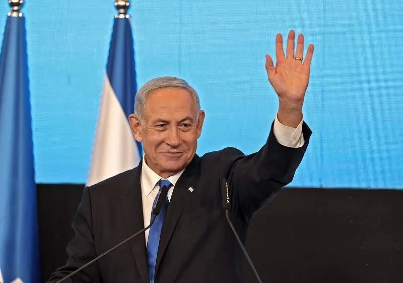
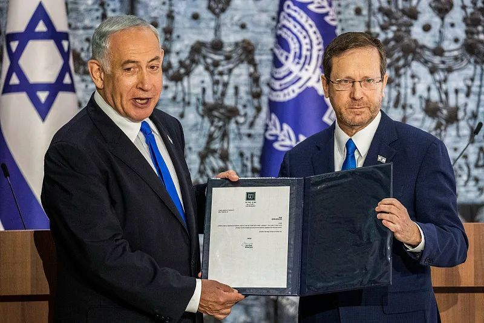

# 内塔尼亚胡组起“史上最右政府”

当地时间12月29日，内塔尼亚胡率领新一届政府在以色列议会宣誓就职，现年73岁的他是以色列历史上执政时间最长的总理，曾执掌以色列政坛15年。

一年多前，内塔尼亚胡曾在下台后表示“将很快回来”，如今他第三度出任总理。

_内塔尼亚胡资料图。图源：视觉中国_

内塔尼亚胡是出了名的强硬派右翼，其新政府更是由于极右翼政党的加入，被称为以色列“有史以来最右的政府”。新一届政府由利库德集团、宗教政党沙斯党和极右翼政党宗教犹太复国主义者党等6个政党组成。

宣誓前，内塔尼亚胡发表讲话称，新政府将主要推进3项主要任务：阻止伊朗发展核武器、加强基础设施建设以及加强以色列法律和秩序建设。

今年11月，以色列举行自2019年4月以来的第五次议会选举，内塔尼亚胡所领导的右翼阵营赢得议会120个席位中的64个席位。

但随后的组阁之路并不顺利。由于盟友对一些重要部长职位的争夺十分激烈，内塔尼亚胡不得不花费大量时间协调。同时，为了让面临司法纠纷的几名议员顺利进入内阁，右翼阵营还需要在议会通过几项基本法修正案。

12月8日，内塔尼亚胡向以总统赫尔佐格申请延长组阁期限，12月21日，在组阁最终期限到来前不到半小时，内塔尼亚胡才“压哨”完成组阁。

_11月13日，以色列总统赫尔佐格授权内塔尼亚胡组建新政府。图源：视觉中国_

最近几周，“最右政府”的组建引发外界担忧，一些极右翼人士在新政府身居要职，恐进一步激化巴以矛盾。

例如，极右翼政党犹太力量党领导人伊塔马·本-格维尔将担任新设置的国家安全部首任部长，他以极端的反阿拉伯言论著称，呼吁以色列吞并整个约旦河西岸，曾因煽动种族主义和支持恐怖组织而被定罪。

本·格维尔主张放宽对安全部队使用实弹射击的规定，认为士兵应获得全面的豁免权，推动立法豁免枪杀巴勒斯坦人的以色列士兵。

极右翼的宗教犹太复国主义党领导人比撒列·斯莫特里赫将出任财政部长，同时将负责以色列在巴勒斯坦约旦河西岸的所谓民事事务。

就在新政府宣誓就职的前一天，即28日，内塔尼亚胡公布了一份政策指导文件，强调犹太人对包括约旦河西岸部分地区在内的“土地享有不可剥夺的权利”，将推进约旦河西岸等地犹太人定居点建设。

报道称，文件还提到一些极右翼盟友的要求，即在以色列占领的约旦河西岸地区给予安全部队更大的使用武力的空间。

对此，巴勒斯坦总统府当天发表声明称，以新政府此举会造成地区危险局势升级。若不遵守联合国相关决议，巴勒斯坦问题就不会有任何解决方案。

近来，巴以冲突反复上演。今年是2005年以来约旦河西岸巴勒斯坦人因冲突死亡人数最多的一年，半数以上发生在以色列军事和搜捕行动期间。以色列平民遇袭事件也创下2015年来新高。

_12月18日，约旦河西岸地区，以色列军队在反对以色列袭击阿斯卡尔营地的示威活动中干预巴勒斯坦人。图源：视觉中国_

以色列新政府的政策走向也将影响与美国的关系。有分析认为，新政府上台后以美关系的大框架不会变，美国仍会把以色列视为中东地区的坚定盟友，但在巴以、伊核等问题上将会产生较大分歧。

美国国务卿安东尼·布林肯12月4日发出警告，美国将反对下届以色列政府在被占领的约旦河西岸建立新的定居点。

“我们还将继续明确反对任何威胁到两国解决方案的行动，特别是扩大定居点、意欲吞并约旦河西岸的措施、破坏圣地的历史现状、拆除和驱逐以及煽动暴力。”布林肯在对美国亲以色列进步团体“J街组织”发表讲话时说。

此前，两名美国外交官在《华盛顿邮报》发文称，美国将继续满足以色列的合法安全需求，但不会为以色列在耶路撒冷和其他巴勒斯坦被占领土的恶意行动提供进攻性武器或任何其他支持。

文章呼吁美国总统拜登向以色列喊话，如果以新政府采取种族主义政策，拜登政府将不会与他们打交道。

以色列资深外交官阿隆·平卡斯近日也撰文指出，虽然内塔尼亚胡与拜登私交不错，但“拜登对内塔尼亚胡的极右翼政府几乎不抱任何期望”。未来，以新政府与美国政府之间的裂痕或将进一步加深。

除了外交政策方面，以色列新政府上台后还将面临一系列内部挑战，包括解决国内生活成本高昂、失业率高企、住房短缺、基础设施不足等问题。

此外，内塔尼亚胡涉贪腐案仍在审理进程中，他被指控与企业进行利益交换、收受价值巨大的礼物等。内塔尼亚胡一直否认相关指控，有报道称，内塔尼亚胡计划推动议会通过一项豁免法，以免除他受到的指控。

