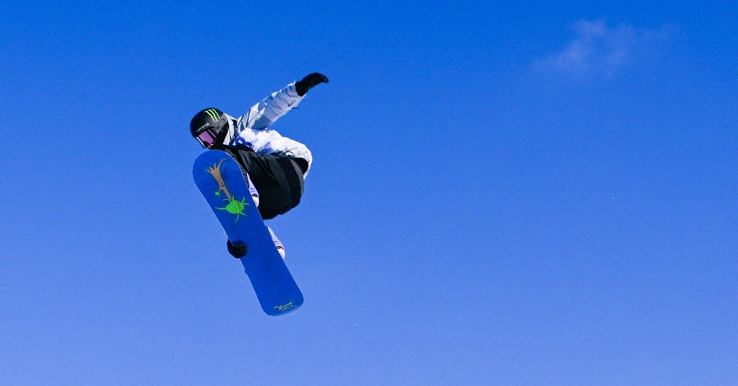
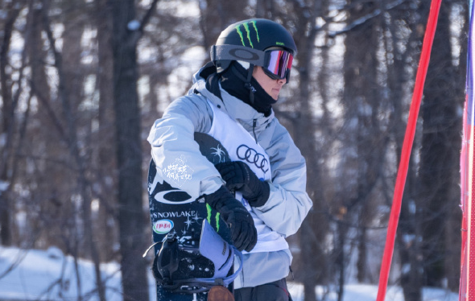
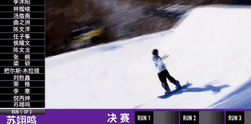
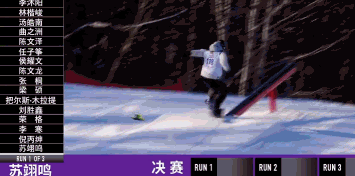
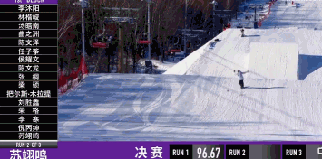
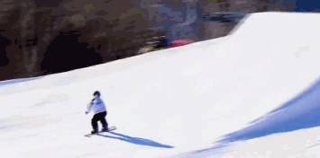
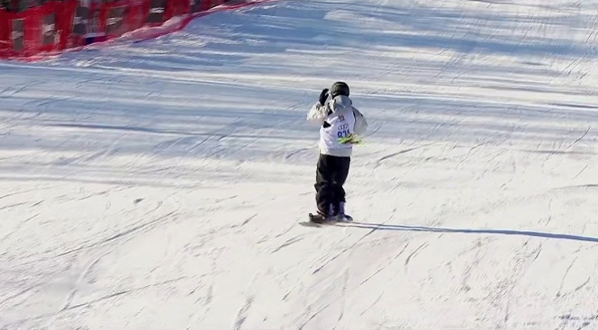
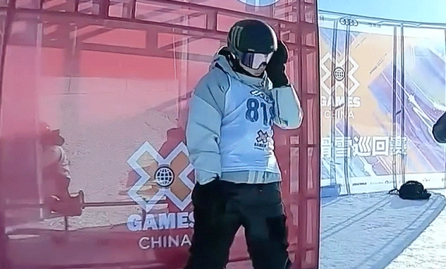

# 冠军！苏翊鸣1620完美落地 腾空起飞＋决赛创纪录 压轴夺魁

北京时间12月30日，X GAMES CHINA 2022滑雪巡回赛-
北大湖站单板滑雪大跳台，苏翊鸣夺得冠军，苏翊鸣第一滑96.67分，第二滑72分，第三滑75分，压哨斩获2022年最后一冠，恭喜。

预赛阶段，苏翊鸣压轴登场，第一滑斩获88分，第二滑，苏翊鸣完美的做了“空中转体1440度”动作，拿下96分。以第一名的身份强势晋级到决赛。

决赛一共三轮，苏翊鸣作为预赛第一，最后登场。第一滑，苏翊鸣做出了1620，转体1620度抓板，完美落地，之后的动作也行云流水，获得96.67分，再度创造本届X
GAMES CHINA 北大湖站的最高分。

第二滑，苏翊鸣动作简单，有了基础分的保障之后开始随心所欲的进行表演。苏翊鸣直接起飞，跳台环节简单动作直接高飘，得到73分；

第三滑，苏翊鸣依旧是风格表演，彩虹桥外转直接飞跃，虽然动作难度不大，但完美的非常流畅，没有失误，斩获75分，夺得冠军。

不得不说，苏翊鸣确实太强了，他的比赛给人的感觉是非常稳，当然这也和苏翊鸣的实力有很大的关系。预赛阶段的1440已经令人足够惊艳，决赛更是做出了1620，完美落地，但要知道对于苏翊鸣来说，这并不是特别大的挑战，毕竟苏翊鸣是世界上首位完成单板滑雪内转1980度抓板动作的男子运动员，冬奥会更是连续做出1800的动作，完美夺冠。

苏翊鸣依靠着强势的表现、低调的性格，再加上此前是影视童星，吸粉无数。最为关键的是苏翊鸣在比赛中的成绩很好，动作难度高、成功率同样很高，也期待未来苏翊鸣的表现。

