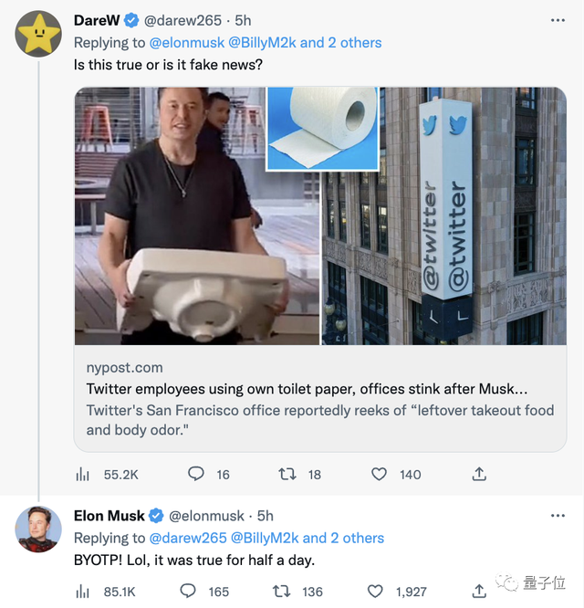
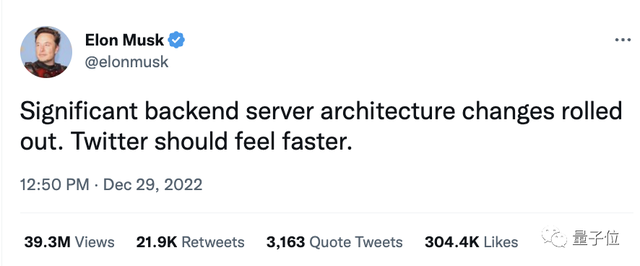
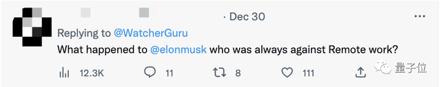
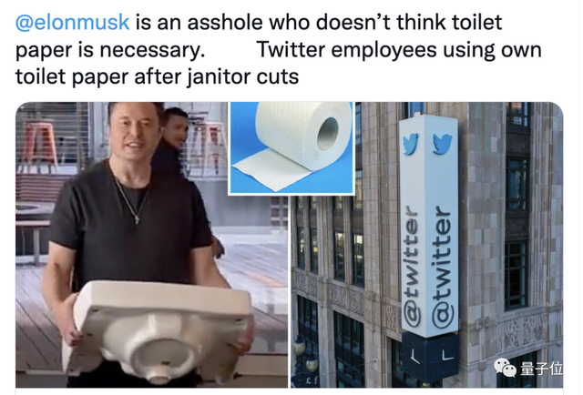
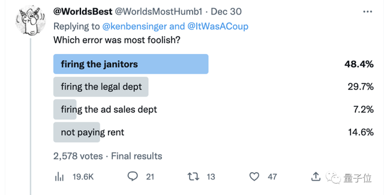
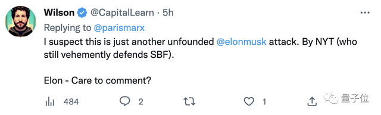
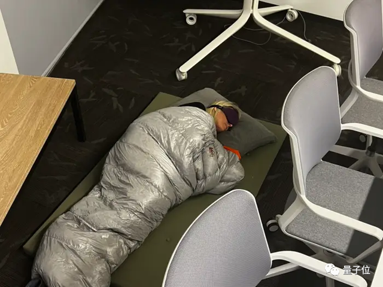
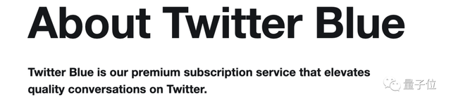
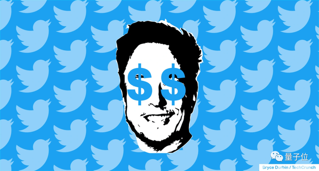

# 前世界首富疯狂“降本”：断厕纸、辞保洁、腾办公室、关数据中心

杨净 詹士 发自 凹非寺

量子位 | 公众号 QbitAI

陷入危机马斯克，正在千方百计地节省开支。

特斯拉那边还未停歇，推特这边，员工已经开始自带厕纸了。

据《纽约时报》等媒体爆料，马斯克取消了一个月清洁服务，整个办公室都变得“脏乱差”。

而且因为拖欠租金，总部办公室浓缩至两层，屋子里始终弥漫着外卖等各种奇怪味道。

更关键的是，连数据中心和第二大办事处西雅图也给关闭了。

前者本可以保障30%的计算能力，在周四宕机时提供备用保障来缓解问题。

而后者因为不交租金将被驱逐，所有员工被要求居家办公。

有网友吐槽：但是马斯克不是讨厌居家办公吗？

马斯克是如何节省开支的？

在裁掉75%员工之后，马斯克现在朝着非人工成本方向迈进了。

小到清洁服务，大到关闭第二大办事处，简直无所不用其极。不得不承认，马斯克在节省开支这方面，也是很懂的。（Doge）。

而且目标也已明确。据《纽约时报》报道，一份内部文件显示，自11月初以来，马斯克就在试图削减 **约5亿美元** 的非人工费用。

现在来看由小及大，马斯克这波操作主要有三个方面。

首先， **解雇清洁工和部分保安，办公室浓缩至两层** 。

没有了清洁服务，于是整个办公室都弥漫着外卖等各种奇怪的味道，也没有人来补充卫生用品，员工们得自带卫生纸。

马斯克在推上回应了这个问题： **it was true for half a day.** （ BYOTP是自带厕纸的缩写）

此外，或许是因为已拖欠租金的缘故，目前总部办公室已经浓缩至两层，关闭了四层楼。

再到公司运营， **关闭数据中心，减少员工培训** 。

被关闭的萨克拉门托数据中心，可承载约30%的计算能力，尤其在大规模运行时可提供备用保障。一旦关闭，还可能导致内部数据丢失。

结果很快周四那天推特遭遇大规模宕机，一些员工被迫加班修复，虽然具体原因没有透露。有知情人士透露，如果还运营这个数据中心，问题也许能得到缓解。

值得一提的是，在推特宕机前，马斯克曾表示，他对后端服务器架构进行了“重大”整改，可以让Twitter“更快”。

与此同时，新员工的培训也从此前的三天时间，直接缩短至90分钟。

据《纽约时报》透露，公司内部也正在实行零基预算策略，即部门员工要证明任何支出是合理的。

然后就是， **关闭西雅图办事处，全员居家办公。**

主要原因是，不交租金了，要被驱逐出去了。于是公司要求所有员工在家办公。

结果这一点遭到不少网友的吐槽：是谁之前一直在反对远程工作的？

除了不交房租外，还有一些款项也在推迟付款，包括一些安全、税务准备和其他服务、供应商之类的费用。

裁员也依旧在继续，通信部门被曝取消。

在最新Twitter论坛上马斯克曾透露，基础设施部门裁员50人，公共政策团队裁员15人，目前推特仍有2000多名员工。

前阵子，马斯克高级助手之一Luke Simon，也被曝离职了。

网友：起码有新水槽

**目前，马斯克尚未回应上述内容，但网友评论已经满天飞。**

有人拿出当时搬水槽的图来“安慰”推特员工——最起码，你们拥有了新水槽：

甚至有人做成了梗图，评价道——马斯克肯定认为洗手间有水槽就行，无需厕纸：

更有好事新媒体发起投票，你觉得哪个决定最蠢？

在2500多票中，近半数人认为“解雇保安”最傻。评论区还有不少人还表示：比起以下选项，“收购推特”最傻。

值得关注的是，舆论风向并非100%倒向一边。

也有人质疑该内容，认为这是权威媒体对马斯克的攻击，呼吁他出来澄清。

推特已不再处于迅速破产边缘

**马斯克对成本看重并非没有道理。**

此前量子位就介绍过，马斯克近期现金压力很大。

10月底，他花费440亿收购推特，本想用特斯拉股票抵押方式完成交易，但出于投资人等外部压力，计划被迫搁浅，他转而套现了390亿美元的特斯拉股票，其中一部分用以支付昂贵的收购交易。

而这，与特斯拉股价一再下跌同时发生，这导致马斯克可支配的“子弹”变得更少。

此种状况下，马斯克转而从银行贷款130亿美金，由于此项债务由推特承担，为此，公司每年将增加10亿美元的债务成本。

背负此等压力下，马斯克从一开始拿到推特，即开启大刀阔斧的省钱计划。

他先是大举清洗管理层，开掉半数以上员工，削减人力成本。这当中，还闹出“让员工打印代码讲解”、“错误开除技术开发人员，又求人回归”的剧情。

留下继续工作的员工也并不好过，马斯克在内部大力倡导“硬核”工作文化，反对“远程办公”，强行要求大家返岗，每周工作时间还必须超过40小时，鼓励大家吃睡都在公司，向自己看齐。

_△
图源：BI_

与此同时，马斯克带领推特11月初就计划上线了蓝V计划，强力推荐8美元加V资格，又闹得平台内虚假账号上下翻飞。在短暂下架调整后，此项服务在12月中旬重新上架。

至于蓝V服务上线原因，马斯克对外解释得也很明确—— **提高收入** 。

B端收入方面，推特动荡期间不少广告客户流失，马斯克在“优化”人员中也不小心开掉大量客户服务员工。

为挽回客户，马斯克又在12月初启动了“有史以来最大的广告主激励项目”，有买有赠，还邀请广告公司与品牌方“电聊一下”。

另值得一提的是，推特于近期对外宣布，计划强制每个用户都开启个性化广告推荐服务，其目的当然也是讨好品牌方，留着客户提升收入。

_△
图源：Techcrunch_

**那么，马斯克治推成效到底如何？**

最近他对外表示，推特已经不再处于迅速破产边缘。

在12月22日，一个由特斯拉拥趸及基金经理组织的Twitter Spaces讨论中，马斯克露面并谈及了在推特的压缩成本的工作。

马斯克表示，自己不得不在一个月时间内，将推特疯狂的成本控制住，避免公司破产。他认为，目前该目标已经基本完成。

他继续强调——推特管理复杂度比特斯拉低一个数量级，后续自己仍会将主要精力花在特斯拉上。

至于后续，他将确保推特正常运作并能开发新的功能。

**如此一看，推特这场大戏，一时还不会完。**

参考链接：

[1]https://www.nytimes.com/2022/12/29/technology/twitter-elon-musk.html

[2]https://www.geekwire.com/2022/reports-twitter-to-close-seattle-office-and-
faces-eviction/

[3]https://twitter.com/ZoeSchiffer/with_replies

[4]https://www.seattletimes.com/business/facing-eviction-twitter-closes-
seattle-office-reports-say/

[5]https://www.nasdaq.com/articles/twitter-wont-go-bankrupt-anytime-soon-says-
elon-musk

[6]https://www.businessinsider.com/twitter-hq-subject-of-san-francisco-
building-inspector-probe-2022-12

— 完 —

关注我们，第一时间获知前沿科技动态

