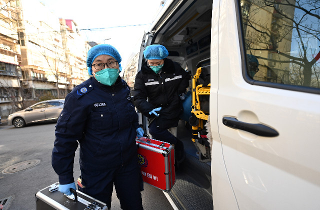

# 多地ICU告急：有县城感染比例15%左右 但床位和呼吸机已不够用

“相比前两周，床位更加紧张了。”

北京航天中心医院呼吸与危重症医学科主任陈济超对第一财经表示，作为一家开放床位1200张的三级综合医院，目前，北京航天中心医院重症床位达到110张左右，占比超10%，这超出了国家卫健委提出的“三级医疗机构重症资源的扩容和改造后，保证综合ICU和可转换ICU能够达到医院床位总数的8%”比例要求。

“即便如此，无论是综合ICU还是多个专科ICU，床位已经达到比较饱和的状态。以呼吸科为例，在12月初床位扩增之后，目前的床位使用率已超过100％。”陈济超说。

时至年底，已经经历了感染高峰的一些城市，正在经历重症高峰。

近日，第一财经从北京、吉林、安徽、武汉、广州等多地二三级医院一线医生和就诊患者处了解到，目前，在急诊和发热门诊就医的人群中，病毒性肺炎患者，尤其合并基础性疾病的高龄老人开始增多，重症床位也越来越紧缺。

事实上，最近一个多月以来，全国的重症床位已经急速扩张：根据国家卫健委数据，11月12日，全国每10万人口的重症医疗床位不足4张；12月9日，全国重症医学床位总数是13.81万张，重症医学床位接近10张/10万人的水平；截止到12月25日，全国重症医学床位总数是18.1万张，也就是10万人有12.8张。

即便如此，供需依然失衡。

“此前防院感、将病房阴阳分区的规划，已经在现实面前低头。”安徽某三级综合医院综合ICU主任告诉记者，医院已将专科ICU和综合ICU进行整合，总体ICU床位数已扩充至100张，目前全部用于收治新冠病人。同时，根据安徽省近日对下辖各综合医院提出“实现急诊留观病房24小时‘清零’”的要求，医院增设了部分临时过渡病房，且正将更多的普通病房改造成呼吸病区，以实现对病人应收尽收。“除了癌症等个别病区，内外科把相应的床位、设备都拿出来了。如果遇到亟需入院的非新冠患者，我们会让其签署风险告知书。”

德国华裔病毒学家、埃森大学医学院病毒研究所教授陆蒙吉在接受第一财经采访时表示，根据既往数据，奥密克戎引起的第一波社会面疫情的周期一般在3个月左右。但由于国内重症医疗资源存在历史欠账、民众在防疫政策放开前期的自我防范意识不足，叠加正值冬季流感高发期，此波国内疫情的重症高峰期和疫情整体演进周期大概率都会拉长。

“以北京为例，度过重症和死亡的高峰预计还需要4～6周的时间。对于较晚暴发感染潮的城市而言，时间窗口也很小了。”
陆蒙吉称，这时候，一方面需要更充分调度社会以及基层医疗机构力量，实现医疗救治压力分流；另一方面，要谨防重症医疗资源分配失衡，导致其他疾病患者得不到及时救治。

_天津急救医生谢艳杰（前）和护士陈岩手提急救箱前往病人住处（12月29日摄）。新华社图_

**多种因素抬高重症人数**

“那么偌大一座城市，为什么就是找不到一张住院病床？”

看着87岁的老母亲在北京东城区某三级综合医院的急诊留观区坐着吸氧，精神开始萎靡，却联系不到一家有床可收的医院，李静开始在社交软件上求助。“老人本身就有慢阻肺和高血压，上周感染后一直居家。28日早上发现老人站立困难、反应迟缓，就赶紧送到医院。医生给老人打了激素，但告知我们急诊留观室和住院病房一时半会都腾不出床位。”李静告诉第一财经。

同一天，中部某省会城市三级医院呼吸科主任张丽丽接诊了一位37岁小伙子，该患者在感染新冠后的第6天，出现持续咳嗽、胸闷和再度发热的情况，被家人送至医院。CT结果显示，其肺部出现了较大面积的斑白片状阴影。“要是再送来早一点就好了。”

北京急救中心“急诊接诊人次抢救床位留观床位使用率情况”最新数据显示，12月27日，
当地134家医院中有64家报告“急症拥挤程度高”。其中，北京大学人民医院当日急诊接诊人次达到1030，急诊抢救病床使用率为2166.67％，为当天之最。

而一周前的12月20日，当地报告“急症拥挤程度高”的医院共有44家，而在这44家医院中，当日急诊接诊人次最高为621，急诊抢救病床使用率最高为293.75％。

陈济超解释说，一个新冠病重患者的住院周期一般需要7～10天，甚至更长时间病才能使得病情趋于稳定。由此推知，此轮北京感染高峰时段收治的部分病重的新冠患者病情尚未稳定，还有一些患者经过治疗后病情虽然好转但还没达到出院标准，这就占用了一部分床位。

另一方面，累计的病人量还在增加。因为新冠重症一般发生在感染后的5～7日左右，而与人群暴露更少的居家老人发生新冠感染也相对较迟。

“目前，来院门急诊就诊的患者以合并慢性心肺疾病、慢性肾病、心脑血管疾病、糖尿病等基础性疾病并出现血氧饱和度下降、肺部受损的高龄老人为主，其中，一些老年患者基础病明显加重，乃至出现器官功能衰竭。也有一些患者因为此前对疾病严重性的认识不够，没有在感染初期进行CT检查和医疗干预，在感染加重迹象出现后，近期来到医院就诊。这两方面因素共同导致重症救治压力加大。”陈济超称。

不仅仅是北京，重症救治患者增加，急救留观区、住院区床位周转难的现象也发生在其他多个省市。

NCP生命支援（简称NR）是在2020年武汉疫情时期成立的线上志愿组织。近期以来，该志愿团队整理了全国425个城市医院的基本信息，并以此为底表，绘制出多个城市的紧急医疗救治资源的动态更新表格，表格内容包括二三级医院急诊、呼吸专科和综合ICU的床位占用情况等。

NR发起人郝南对第一财经表示，目前，有的城市处于感染高峰期，有的城市已经到了重症高峰期，但这些城市几乎无一例外地遭遇了急诊挤兑，住院病床挤兑也越来越突出。“因为肺炎患者太多了，重症肺炎患者也太多了，现在基本上每个城市病房都处在不断积累病患的状态。”

安徽某三级综合医院综合ICU主任也对第一财经提到，现在很多来就医的高龄新冠感染者，自身就合并多项基础疾病，有的脑梗四五年，有的长期食用免疫抑制剂，有的肾上腺皮质功能低下。这些患者中，还有相当比例出现了严重的肺部感染。老人免疫力低下，如果不将这些患者及时收治入院，进行有针对性的医疗干预和监测，其病程进展会很快。

陆蒙吉也认为，
**目前国内医院重症人数增多可能因为多重因素叠加所致。这些因素包括，各地感染进展和波及人群比预料得更多，基数增大；感染者没有第一时间就诊，错失救治最佳时机；进入老年人感染的高峰期后，老年人基础性疾病多，一些老人疫苗接种时间过早或没有完成加强免疫，危重症病患呈现快速增长。**

**此外，陆蒙吉认为，重症人数增多的因素还包括，由于医疗资源缺口尚未得到明显改善，门急诊和入院治疗的新冠患者的医疗需求也难以保质保量地满足，进而致使一些普通型转为重症或危重症，重症患者的救治周期也被拉长。**

根据《关于对新型冠状病毒感染实施“乙类乙管”的总体方案》，以地市为单位，当定点医院、亚定点医院、综合医院可收治新型冠状病毒感染患者的救治床位使用率达到80%时，医疗机构发出预警信息。

但随着重症高峰来临，前述综合ICU主任称，大概从上周二或周三开始，月初新增的阳性病区也不够用了，同地市其他三级医院情况大体相当，“只能自救”。

**医护、药品、仪器缺口大**

在感染高峰期来临之后，医院经历了短暂的大批医护人员因感染而减员的困境。随着症状较轻和第一批感染医护人员带病或阳康复岗，各地医护人员不足的缺口正在补足，但救治压力依然不小。

首先，综合ICU和专科ICU扩增的床位需要有数量相匹配的医护人员和救治仪器。“比如，在呼吸科，我们需要配有足够的高流量吸氧设备，以及无创呼吸机和有创呼吸机，以保障重症监护室是每床都能够进行吸氧治疗和呼吸机治疗。”
陈济超称。

其次，出于对患者精准分流的需要，也是为了确保重症患者得到及时救治，发热门诊和急诊也需要投入更多有重症救治背景的医生护士和呼吸机、心电监护仪等仪器设备。

_12月15日，在中国医科大学附属盛京医院南湖院区发热门诊，值班医生在为患者治疗。新华社图_

前述安徽三级医院综合ICU主任坦言，一个低年资的ICU医生完成培养周期至少需要2~3年，这靠短期开展多次重症救治能力培训是达不到的。即便对于基本功扎实的医生，也需要一年的时间才能独立承担日常的ICU临床工作。

“现在既要面对大量ICU病区病人和家属，又要兼顾其他科室和门急诊收治的新冠重症患者，加之规培生已经放假，我们ICU医生有些分身乏术了。”该ICU主任说。

与此同时，“巧妇难为无米之炊”。面对源源不断的重症患者，各地医疗机构的设备和药物供给都开始告急。

“朋友母亲在医院上无创呼吸机，医生建议用有创呼吸机但是医院里没有，想找有有创呼吸机的医院住院。”“老人因肺炎住院，医生建议上抗病毒药，但医院一时进不到货了，哪里能够买到？”“哪家医院能买到球蛋白？”

28日以来，在一个超过200人的北京新冠医疗资源互助微信群组中，多个新冠重症病人家属提出求助需求。这其中，新冠口服药Paxlovid的需求最大。

“循证医学证据显示发病5天内，尤其是3天内给与小分子抗病毒药对于有重症高危因素的患者是有保护作用的。”陈济超称。

北京社区医院将供应新冠口服药Paxlovid，但第一财经了解到，由于Paxlovid的采购和储备有限，对于大多数城市医疗机构和患者而言，Paxlovid仍是一盒难求。

“我们医院从来没有储备，只能提供常规的抗病毒药。”华中地区某三级医院重症医生表示。

医疗救治仪器同样捉襟见肘。

安徽某县三级医院院长21日告诉第一财经，当地感染高峰还没有到来，全县感染比例在15％左右，但床位和呼吸机已经不够用了。医院共有30台所有呼吸机，此前从未遭遇周转不过来的问题。“目前，医院垫付2000万，紧急置购了40台呼吸机。”

而在较早经历感染高峰的北京、河北石家庄、保定等地，第一财经梳理发现，12月中上旬以来，在石家庄市第二医院、首都医科大学附属北京地坛医院、北京大学第一医院等三级医院，均曾在其官网上发布过招标文件，采购内容包括血液透析机、具备心电图等参数记录和监护功能的生理参数传输管理系统设备、通气面罩、持续正压呼吸面罩、心电图纸等仪器或耗材，招标时间均在一周之内。

**“床位越少，分类、分流越重要”**

在陆蒙吉看来，床位越少，就越需要通过基层医疗机构将病人分类分流，并争取到更多资源帮助重症患者。

“比如，当出现肺炎表现的轻症患者居家康复时，如果出现胸闷、气喘、呼吸困难等现象，可以第一时间去距离更近、更可及的社区医院进行就诊和吸氧，则既能省去到二三级医院急诊排队等候使用呼吸机的救命时间，也可以减少了医院的急诊救治资源挤兑。”
陆蒙吉举例称。

在北京，日前，市卫健委和市医疗保障局联合发布《关于进一步提升重症救治服务能力的通知》。要求各有关医疗机构组织对老年人等高风险人群发放血氧夹，鼓励各区在社区卫生服务机构为有需求的居民提供氧气灌装服务，方便居民居家氧疗。

29日，北京海淀区和朝阳区相继发布可以提供氧疗需求的社区卫生服务中心名单及联系方式，其中，海淀区有51家，朝阳区有48家。

“我们医院配的呼吸机已经开始使用了，也提供床位给老人。但呼吸机仅一台，目前已经占用了。”30日午间，第一财经以患者家属身份拨打朝阳区呼家楼第二社区卫生服务中心电话，工作人员查询后告知记者，目前，如果带患者过来吸氧，估计至少得等1个小时。

“面对当前的‘疫情大海啸’，基层医院既要承担非重症诊断和救治，又要承担重症和危重症转运，显然能力是难以匹配需求，而三级医院资源又已经相对饱和了，那么，社会上这么多日增的高龄感染者和有重症倾向的感染者该怎么办？我认为，亟需将社会力量的作用发挥出来。”郝南称。

他提到，目前，他所在的公益团队正在筹备一个制氧机漂流计划，希望可以让闲置在市民家中的制氧机流动起来，为出现肺部炎症、但暂时入院无门的新冠患者，提供氧疗辅助乃至生命支持。

对于重症患者的救治需求，三级医院则要兜底保障作用。一方面，要把急诊资源能够更快速的循环和周转起来，并畅通急诊和住院病房收治之间的绿色通道；另一方面，要最大程度实现重症患者的应收尽收、应治尽治。

陈济超称，为了满足短期内大量新冠危重症病人救治需求，保障不同病区救治水平的同质化，目前，医院在对于刚刚扩充至新冠救治的外科等科室团队，加快推进临床急救知识培训的同时，还是会将新冠专业救治交给有专科和重症救治经验的团队，即由呼吸、综合ICU和感染科兼急诊科主任牵头，联合老年医学科等科室，成立了新冠危重症救治专家团队，由急诊医生将病人在抢救中的情况定时汇总至各个科室和专家团队，再在院内协调调配床位和医护人员。

在收治床位扩容方面，陈济超还提到，在如老年医学科、肾内科、消化科等内科病房都增加了新冠重症患者收治容量之后，考虑到新冠重症高峰期尚未度过，近期，医院规划外科收治部分新冠患者来缓解急诊和内科压力。“但在住院病人总数不断累加的过程中，如果一个医院资源饱和了，就需要全市各级医院的资源统筹调配，这并非是一家医院能够解决的问题。”

(文中李静、张丽丽为化名）

