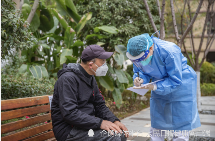

# 多地公布新冠感染率调查情况，四川实际感染率高于63.52%

**人民日报健康客户端记者 孔天骄**

“您是否已经感染新冠？”近日，海南、浙江、四川等多地通过问卷调查公布了当地新冠感染数据，一些地方阳性感染率在60%以上。有些地方仍处于不断上升期，预计1月初达到感染高峰。

_12月15日，在重庆市两江新区康美街道筹备二组社区，社区卫生服务中心的医务人员核对市民信息。新华社记者
黄伟 摄_

**四川：实际感染率高于63.52%，日新增感染已处于回落阶段**

12月26日，四川省疾控中心发布的四川省新冠感染情况问卷调查（第二次）结果显示，省内21个市州183个县（区、市）的158506名被调查者的感染率为63.52%，另外还有28%的调查人群虽未测核酸或抗原，但有发烧、咳嗽等类新冠病毒感染症状，因此本次调查人群的新冠病毒实际感染率应高于63.52%。全省阳性检出的高峰期集中在12月12日~23日，目前日新增感染已处于回落阶段。

**海南：预计感染率已达50%，新增新冠感染人数处于高位波动期**

12月30日，海南省新冠疫情防控新闻发布会（第八十四场）在海口举行，海南省疫情防控工作指挥部综合组副组长、医疗救治组副组长，省卫生健康委员会党委委员、副主任李文秀通报全省新冠疫情防控工作有关情况，近日，海南省每日新增新冠感染人数处于高位波动期，全省预计感染率已达50%。三亚市、海口市整体上已过感染高峰。

**浙江衢州：感染率约占总人口的30%-35%，1月初达到第一波高峰**

12月28日下午，衢州市举行新冠病毒感染防控工作新闻发布会。衢州市卫健委党委书记、主任廖利军介绍，根据研判，衢州市将在12月底进入感染高峰期，1月初（元旦左右）达到第一波高峰，并进入高位平台期，可能在1月底（春节后一周）达到第二波高峰。会上介绍，参考市疾控中心微信问卷调查数据，衢州市目前总体感染率约占总人口的30%-35%。

**浙江舟山：感染人数比例达到30%-40%，预计于12月底进入疫情高位平台期**

12月29日15时，浙江舟山市举行新冠肺炎疫情防控工作领导小组第十七场新闻发布会，介绍了统筹推进疫情防控有关情况并回答记者提问时提出，通过对全市核酸阳性检出率、社区哨点监测和重点人群抽样调查情况进行综合分析，估算全市目前感染人数比例达到30%-40%，总感染人数接近40万人，预计于12月底进入疫情高位平台期，高峰期维持一周左右。

“目前，我国新冠疫情处在高位流行，但各省份进入的流行阶段不同。”12月29日，中国疾控中心流行病学首席专家吴尊友在国务院新闻办举行吹风会上介绍，“像京津冀、成渝地区、华中部分省份，疫情发展相对比较早，目前可能流行的高峰时期都已经过去。重庆、安徽、上海、湖北、湖南等省市疫情正在高位流行阶段。河南、吉林、福建等省份疫情发展速度也比较快。”

吴尊友表示，专家根据搜集到的疫情信息综合研判，中国的春运会有大量的人员流动，使得疫情可能会更加复杂，所以各地都在认真做好，关于疫情信息的监测，分析，研判，尽最大限度把流行高峰带来的影响给它削弱。

