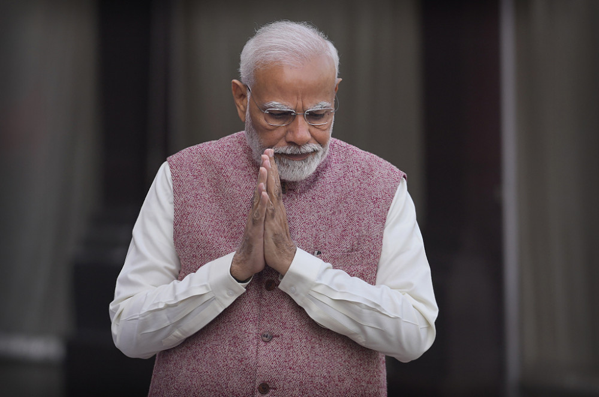

# 大选来临前，印度总理莫迪为何敢将穷人粮食援助减半？

本月，印度总理莫迪所属的印人党在莫迪家乡古吉拉特邦赢得了创纪录的胜利。但就在2023年印度多邦将举行邦议会选举之际，莫迪政府却做出将穷人的粮食配给减半的决定，这一举措可能为莫迪所属政治势力的大选表现增添风险。

_印度总理莫迪 视觉中国 资料图_

据路透社12月29日报道，从2023年1月开始，印度将停止每人额外发放5公斤的粮食援助的政策。该政策因应新冠疫情而生，已实行28个月之久。据统计，有超过8亿人获得了这份额外粮食补贴。

在印度，粮食援助是一项合法权利。面对新冠疫情对财政造成的破坏，许多印度人依靠粮食补贴政策获得了帮助。路透社指出，补贴食品和其他物品是在印度赢得选举的关键。然而，免费食品计划使印度政府损失了约470亿美元的，这加剧了财政赤字，并使政府仓库中的小麦库存降至多年低点。

分析人士表示，印人党本月于古吉拉特邦取得大胜、外界更看好印人党拿下2024年大选胜利，这样的现实情况让莫迪政府在财政管理上有更大自由度。

路透社指出，结束上述免费食品补贴政策后，印度政府预计每年可节省近200亿美元。印度财政部长尼尔马拉·西塔拉曼（Nirmala
Sitharaman）将于2023年2月1日提交下一财年的预算。一位政府消息人士表示，结束新冠免费食品计划的举措将使政府下一财年的补贴负担减少约30%，并帮助政府比预期更快地控制财政赤字。

消息人士称，政府在包括食品和化肥在内的三大项目上的补贴支出可能会从本财年（2023年3月31日结束）的近5.5万亿卢比（约合人民币4622亿元）降至下一财年的4万亿卢比以下。此外，2023-2024年度的财政赤字目标将比本财政年度的6.4%降低至少50个基点。

几个月前，随着新冠限制措施的放松，一些经济学家曾希望取消免费食品计划。印度政府上周表示，该计划将于12月结束，取而代之的是，印度政府将依据一项新冠疫情暴发前制定的法律来提供为期一年的免费食品补贴。

根据一项已有10年历史的法律，印度的穷人可以得到食物保障，并将其视为一项权利。

“将人均有效食物分配从10公斤减少到5公斤显然是不符合民粹主义的（non-populist）。”印度前财政部长苏巴什·钱德拉·加格（Subhash
Chandra Garg）说。

“但是，这种额外的食品补贴显然也不是为了满足热量需求而必要的。因此，如果你能推销这样一种理念：穷人将获得满足其真正食物需求所需的东西，即每人免费5公斤，可能（政策更改的）负面效应就能被中和。”

印度民意调查机构Cvoter Foundation的创始人亚什万·德什穆克（Yashwant
Deshmukh）对路透社表示，众所周知，莫迪是一位向选民传达他想传达的信息的“大师”，而且国内没有明显的挑战者这一事实对他有所帮助。

CVoter数据显示，莫迪的支持率约为60%，而最接近他的竞争对手、主要反对党国大党的拉胡尔·甘地的支持率约为20%。

德什穆克说：“我认为莫迪一直在执行他的大部分决定，这要归功于他的可信度和声望……这是因为人们不怀疑他的意图。如果没有信任，对任何其他领导人来说，就很难在选举前结束这样的食品计划。”

但印人党高级领导人拉维·尚卡尔·普拉萨德（Ravi Shankar Prasad）强调，减少粮食援助的决定不应与选举或政治挂钩。

