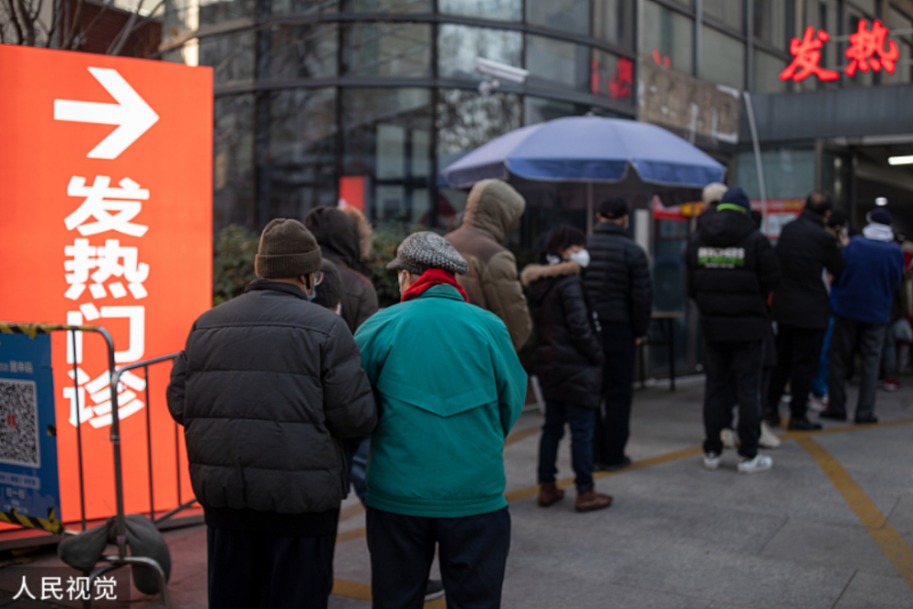
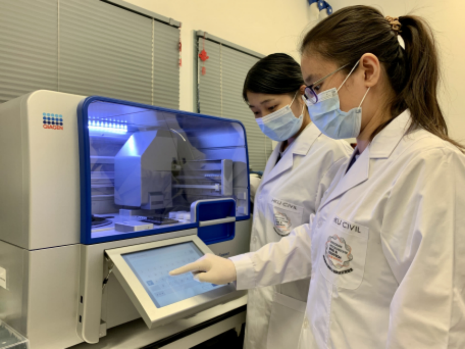
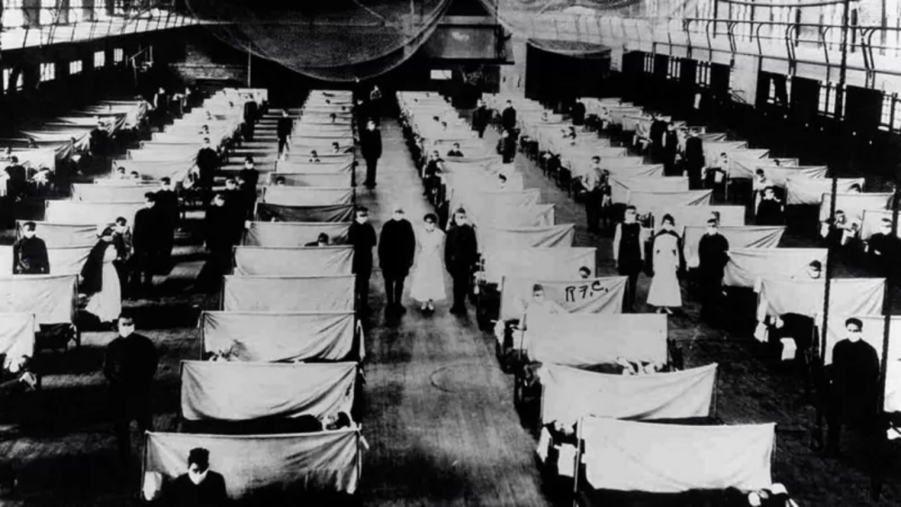
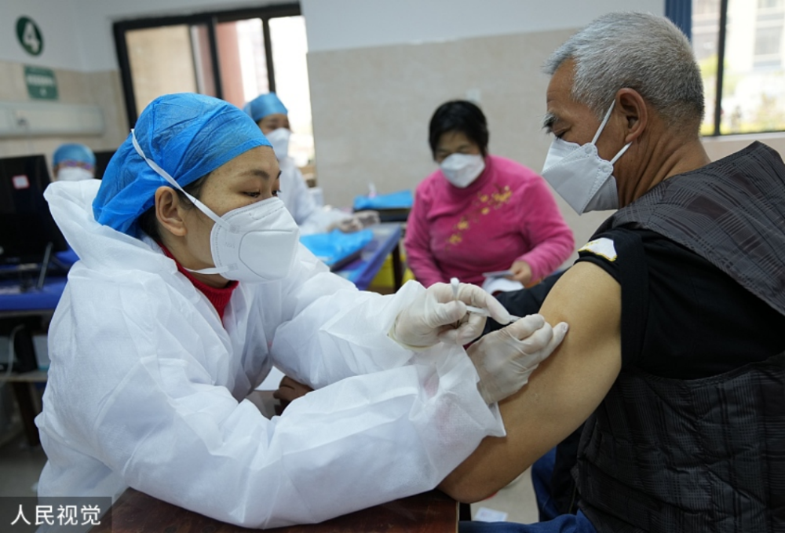
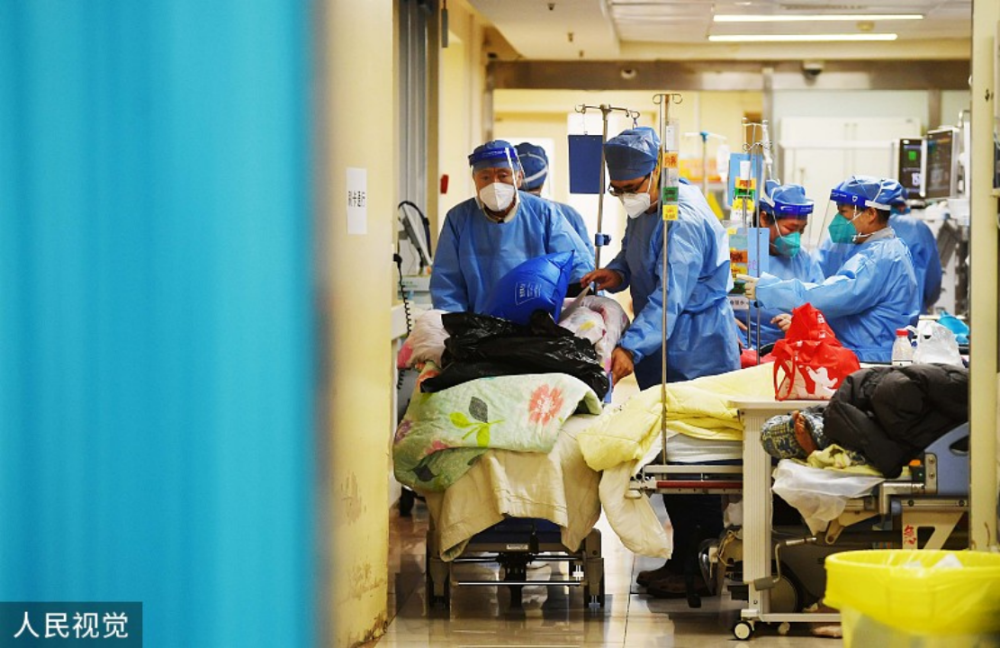

# 奥密克戎专攻有免疫力的人？疫情大流行正走向终结？金冬雁回应争议

防控新政发布以来，公众对疫情的关注度持续高涨，病毒学家金冬雁多次接受媒体采访回应关切。与此同时，网络上也有很多对其观点的截取、质疑乃至误读，争议不断。

奥密克戎专攻有免疫力的人？奥密克戎的轻症及无症状感染比例占总感染人数的99%，这一数据是否准确？

网络盛传的白肺、重复感染、XBB和BQ.1.1毒株破坏力等问题，如何解释？

以下为腾讯新闻《一起来唠科》于2022年12月25日与香港大学生物医学学院教授、病毒学家金冬雁的对话实录：

一、回应自身争议

**1\. 奥密克戎是为了专门攻击有免疫力的人而进化出来的，而不是专找有免疫力的人去攻击甚至不攻击没有免疫力的人，它的进化过程和人对它的易感性是两码事。**

**问：你在此前的采访中提到，“奥密克戎是专找有免疫力的人去攻击”。部分人将此理解为免疫力低下的人群就不用担心奥密克戎感染的问题，甚至理解为不需要去打疫苗。对此，你怎么看？**

**金冬雁：**
我不是讲人对于奥密克戎的易感性，这和“进化过程”完全是两个问题。人对于奥密克戎的易感性没有差别，奥密克戎不会“认”有免疫力还是没有免疫力的人，它都会感染。没有免疫力的人会感染更多，感染之后重症和死亡也更多。很不幸，有时媒体标题一突出，有些东西就被混淆了。

至于“有免疫力的人”就是打过疫苗或者是经过自然感染的人。

我讲“奥密克戎专攻有免疫力的人”时，主要是讲奥密克戎的进化过程，即奥密克戎在进化过程中与德尔塔处于一种竞争关系时，它是如何“脱颖而出”甚至是“应运而生”的。再直白一点，奥密克戎是为了专门攻击有免疫力的人而进化出来的，它在进化过程中为了攻击有免疫力的人，做了一些改变。

_（图源：媒体报道截图）_

我再把这个过程从头到尾讲一遍，讲清楚一点。

在奥密克戎之前，在全世界占优势地位的是德尔塔，那时超过90%的毒株都是德尔塔。在这种情况之下，奥密克戎是如何出现的？其实，这也是目前新冠大流行演变史上的一个谜。现有的分子进化分析的数据很清楚地说明奥密克戎不是由以前任何一个毒株直接变出来的。

但不管奥密克戎是从哪里来的，经过我们的研究基本上掌握了一个特点。这个特点就是，在动物实验里，我们用奥密克戎和德尔塔两种病毒毒株一起去感染实验用的金仓鼠，发现如果金仓鼠此前没有受过感染或者没有打过疫苗，德尔塔与奥密克戎在“比拼”时，德尔塔占优势。相反，如果我们给实验动物打了疫苗，那情况就不一样了。这时，奥密克戎在与德尔塔的“比拼”中，奥密克戎就会胜出。

也就是说，如果现在全世界的人都没有免疫力，那德尔塔可能还是一个优势毒株，因为它具有比奥密克戎更强的复制能力，它能产生更多的后代病毒，所以它就会占绝对优势。如果在大家都没有免疫力的情形之下，是不会出现奥密克戎的。

而在有免疫力的人群里，德尔塔被大大抑制了。因为大家都打过疫苗或者都经过自然感染之后，德尔塔就没有“生存之地”了。

这时，奥密克戎出现了。它出现以后做了一些改变——一方面，奥密克戎通过一些突变来逃避免疫力的打击，所以在免疫力之下它还能生存；但另一方面，同样这些突变使它的复制能力更低了，它的致病性也更低了，它成了一个弱毒株。奥密克戎以弱毒株的形式出现，所以它才能够在大多数人都有免疫力的环境下“脱颖而出”。所以，免疫逃逸与复制能力变差、致病性变低这两件事是连在一起的，是通过同样的突变来实现的。

总之，我此前在接受其他媒体采访时，讲的不是奥密克戎不会攻击不打疫苗的人或没感染的人。相反，不打疫苗的后果更严重，而非不打疫苗就可以逃避奥密克戎的攻击。我讲的是奥密克戎是为了逃避免疫力而产生的，但大家引申认为“打了疫苗或受过自然感染的人更容易受奥密克戎攻击，不打疫苗就不会感染奥密克戎”，这是完全错误的。

**2\. 纵向比较历史和横向比较全球，新冠疫情从大流行过渡到季节性、地方性流行，预计需要2-3年。**

**问：你曾在12月20日的采访中提到“疫情正从大流行过渡到季节性、地方性流行”。你预计何时完成这种过渡？**

**金冬雁：** 新冠疫情从大流行过渡到季节性、地方性流行，预计需要2-3年。

从历史的比较中可以看到，冠状病毒以及流感病毒在经过世界大流行以后，不会一直持续，而是在2-3年以后转弱。此外由于人群中大多数人有比较强的免疫力，它最终会变成季节性流行。新冠病毒的发展规律也与这些病毒相差不远。

而从全世界的规律来说，经历过奥密克戎的一波比较大的流行以后，会进入地方性流行的阶段，大多数国家都是这样的。认为这个冬天美国和欧洲会发生另一次“大海啸”的预测，完全没有根据。

_12月8日，美国华盛顿市区圣诞集市开放（图源：视觉中国）_

**3\. 新冠疫情在走向终结的路上，需要经历大规模疫情爆发，而我们正在其中。**

**问：你曾在12月9日采访中提到“社区有很大机会出现海啸式爆发，因此要很小心”。12月22日，你在一个线上会议里提到“新冠病毒变异率比流感低多了，全球疫情正在走向终结”，部分公众认为这两种说法存在矛盾，你能进一步阐述下吗？**

**金冬雁：** 这两个情况是有不同语境的。

“新冠病毒疫情在全球正在走向终结”，其实不是我讲的，是谭德塞讲的。（编者注：2022年9月14日，世卫组织总干事谭德赛指出"虽然目前疫情尚未结束，但终点已经在望。"
）他说的这个意思就是曙光在前嘛，所以说我们正在走向结束。而在9月之前，我也有过类似隧道尽头的表述。比较直言不讳的德国著名病毒学家、国际冠状病毒研究的主要权威Christian
Drosten在12月27日更明言，新冠世界大流行已结束，新冠现在就是地方性流行病。我不同意他的说法，唯一原因就是我国目前正在经历疫情大海啸的剧痛。

全世界大多数的国家和地区已经完成了从全球大流行向地方性流行的转变。欧洲、美国、中国香港等国家和地区的特点基本上符合地方性流行的特点。这个特点就是：首先总感染人数较少，不超过总人口的20%；有效传播率比较低，只有1.2%；另外，重症率和死亡率也非常低。这都是有清楚的数据来佐证的。

至于“疫情海啸式爆发”，是指我们是最后迎接“大海啸”的主要国家。现在，北京等城市已经经历了本波疫情的最高峰，接下来其他城市也将达峰，可以和应该做的就是更好地应对。世界各国都经历过了，我们还是应该正面地去看待它。我们可以做得比其他国家更好，这是我们应该期许的。当然，我们现在离这个目标还有点远，但应该向着这个目标前进，用实际措施去减少重症和死亡，这是一个最高的目标。

**4\. 筑好“三道防线”是医疗资源不发生挤兑的前提，当下需重点关注住院病床和ICU资源情况。**

**问：你在9月的一次采访中说，放开后医疗资源不会挤兑，11月的采访中又提到，大规模疫情时中国医院可能由于大量老人未接种疫苗而不堪重负，产生医疗挤兑。你如何解释这两次表态前后观点不一致的问题？**

**金冬雁：** 我在9月和11月讲医疗资源挤兑的两段话是有不同前提的。

我在9月份说“医疗资源不会挤兑”，是以我讲到的“三道防线和一个软件“（编者注：三道防线和一个软件为：接种疫苗、储备新冠抗病毒药物、保护医疗体系与公民教育，下文会详述）为前提的。

9月份的时候我们主张的是有序和逐步开放，甚至是在春暖花开的时候，选一个气温20度以上的南方城市试点。而且我们当初非常强调的是，在开放以前一定要筑牢这三道防线，才能说可以避免出现医疗资源发生挤兑的情况。

11月媒体问我中国内地是否会像中国香港一样发生严重问题，我回答，“如果我们把疫苗接种做好、把抗病毒药物储备分发好，我们就能避免中国香港当时的窘境。”

在1月，中国香港60岁以上老人接种率只有20%，这一点很不理想。从内地提供的接种数据来看，我们认为情况相对乐观。但如果老人没有打够三针，那确实是无法预料的。我们从未主张过冬天开放，当知道要冬天开放时我们也是一再提出要非常小心。这也是我11月时讲的，如果冬天开放，本身呼吸道传染病病毒的活跃程度就较高，那么造成的损失可能会较大。

所以我在9月和11月前后采访回答是不矛盾的。

至于“医疗资源挤兑问题“，如果是发热门诊内部资源紧张，那不是很严重的问题。但如果住院病床全部安排满，ICU资源到达警戒线，那就是真正的挤兑。这是两个不同问题。

现在到底是什么情况？我建议国家卫健委及相关部门在公布信息方面更清晰、公开、透明，公布全人群感染率、60岁以上人群感染率、住院率、住院病床占有率、ICU占有率、因新冠进入ICU人员数目、ICU满员程度，以及亚型突变株的分型分析。这样一方面可以安抚民心，一方面为大家提供数据进行深入研究。

_12月24日，上海第十人民医院发热门诊（图源：人民视觉）_

**5\. 按照中国或者国际标准，嗓子疼、肌肉酸痛、三天高烧等症状都是轻症，目前没有理由推翻99%轻症和无症状的判断。**

**问：你曾在采访中提到“奥密克戎的轻症及无症状感染的比例占总感染人数的99%”，这是否与目前公众所感知的感染后嗓子如吞刀片、肌肉酸痛、白肺等症状相矛盾？**

**金冬雁：** 这一数据当然是准确的，全球各地都是这个数据，中国当然不会例外。

99%这个数据是各地官方宣布的统计数据。例如中国台湾9月统计了一百多万人，有99.65%都是轻症和无症状。

现在大家在网络上描述的感染后嗓子如吞刀片、肌肉酸痛、三天高烧等症状，按照中国或者国际标准都是轻症，也没有超出当初对它的危害性判断。肺炎一般只在年长、有基础疾病等人士身上出现。但在疫情感染高峰期，由于感染基数大，即便比例很小，数目也并不少。

此外，现在由于抗原检测试剂不足，大多数无症状感染者甚至都不会去检测。

例如2020年初武汉疫情爆发时，病毒毒性应该是最强的。但事后中疾控和医科院协和医大校长王辰院士调查结果显示，有82%属于受感染而未报告未发现者，其中大部分应为无症状感染和轻症。大家可以看到即便是那个时期轻症、无症状也有这么多。

至于当下中国轻症及无症状比例如何，我们虽然缺乏数据，但同样也没有理由推翻99%轻症及无症状的判断。

至于在99%的轻症及无症状中，无症状和轻症各自占比多少，比例可能是一比一甚至是一比二，但一比十是错的。我们有一段时期的数据表明奥密克戎90%是无症状感染，我当时就表示这是不可能甚至是错误的。我们的诊疗方案没有与时俱进，仍要求确诊应有影像学证据。很多感染者没有做CT，于是严格地说不能算轻症，但核酸是阳性，只好纳入了无症状，这个技术性原因造成了误解，这是不合理的。香港一百万核酸阳性人士中约四成是无症状，离开这个比例太远都不合理。

**6\. 新冠病毒的突变是有限度的，奥密克戎可能继续突变产生新毒株，但造成更大危害的可能性是比较小的。**

**问：你曾在采访中提到“新冠病毒只会越变越弱”，也有观点认为“病毒传播越广感染越多，出现新毒株的概率就会越大”，你如何看待？**

**金冬雁：**
“病毒传播越广感染越多，出现新毒株的概率就会越大”这个观点不是完全没有道理，因为病毒的变异需要有机会复制才行，如果病毒不复制，它变异的机会就会小一些。但是，新冠病毒不仅遵循一般的规律，还遵循其本身的规律。

它本身的规律就是，新冠病毒的突变是有一定限度的。新冠病毒并非可以无限变异，而是在一个“框架”里自然选择，它不可以无限突变。

有人说，病毒复制越多越有可能出现一种致病性更强的新变种，这种可能性不是没有，但是非常非常小。因为当病毒的毒性或致病性更强的时候，宿主“致命而死”，病毒自身也没有可以依附的环境了。皮之不存毛将焉附？所以，病毒即使发生了这样的变异，没有十分特殊的原因也不可能被自然选择留存下来。

有专家认为，病毒变异是随机的，所以它可能变强也可能变弱。但病毒的变异还有一个自然选择、优胜劣汰的过程。

目前新冠病毒变异的基本环境和前提条件就是人有较强免疫力。自然选择留存下来的突变都是在人有较强免疫力的环境下依旧能生存的突变，这样的突变大概率都是毒性降低，致命性、致病性都降低。正如奥密克戎符合了一定“标准”，它才能成为现在的一个优势毒株。

在现阶段，奥密克戎已经基本走向稳定了。奥密克戎仍会继续突变产生新毒株，但这些新毒株造成更大危害的可能性是比较小的。从历史以及新冠病毒本身的发展进化历程来看，都是如此。

Christian
Drosten在奥密克戎出现之初的今年一月就预言“奥密克戎可能成为后大流行时代的第一版毒株”，我认为他的预测很准确。正如三种甲型流感病毒H1N1、H2N2、H3N2和四种社区获得性人类冠状病毒一样，奥密克戎来自于毒性更强的世界大流行毒株，但已脱胎换骨成为地方性流行的毒株。它仍会继续变异，但不会大幅跳脱其他地方性流行的呼吸道病毒的进化轨迹。过去100多年或更长时间，上述病毒都与人类相依相随。他们几乎感染每一个人，他们也不断变异永不停歇，但他们并没有孕育出对人类致病性更强的毒株。这才是我们应该体认的自然规律。

二、回应网络流言

**1\. 一周内重复感染两次是不会发生的，重复感染即便发生症状也很轻。**

**问：网络上有人表示自己一周内重复感染、重复感染后病情加重，你如何看待？**

**金冬雁：** 一周内重复感染两次是不会发生的。

一种情况是根本就没有康复，由于我们现在没有足够的抗原检测试剂，不能做到每天检测，或者每天检测但有个别次取样不当、试剂不合格带来假阴性，所以会出现阳转阴又转阳的情况，其实就是同一次感染还没好。

另一种情况是所谓的“复阳”，复阳对感染者自身病情影响很小，不会有特别重症状或者导致死亡，况且复阳病人没有传染性，实际上是核酸检测过于灵敏带来的困扰，这些复阳病人自己没有病无需吃药、也不会传染别人，完全可以不用管。

虽然大家担心重复感染，其实重复感染很少，即便发生了，症状多数也很轻，除非是自己本身有别的病症，不然不会加重病情。就像我们过去得流感一样，得了一次重感冒后可能接下来几年的感冒就不会这么重。

**2\. 当下大流行里的重症不是德尔塔造成的 ，奥密克戎是弱毒株但也会导致白肺。**

**问: 之前有传言认为在北京流行的毒株可能是德尔塔，所以导致很多人感染后出现白肺的症状。你如何看待？**

**金冬雁：**
一些说法认为“奥密克戎变成了致病性更强的毒株或者奥密克戎现在又与德尔塔共存了”，这都是没有根据的。中国当下不存在德尔塔毒株，现在大流行里的重症也不是德尔塔造成的。

提出“认为北京现在的流行毒株是德尔塔”这种论调的人，多数并没有在这个领域里做研究，也不是凭借真实世界的数据进行分析而提出的，这只是他们的一些想法。这些想法在几方面都与现有的事实不相符。

首先，这一次大流行中的主要毒株肯定不是德尔塔，这是政府公开宣布的。北京市是以BF.7为主，其他的地区可能是以BA.5为主。当然，我们确实希望国家在变种数据方面多提供一些信息。例如，在美国、欧洲、新加坡以及中国香港等国家和地区，对于一段时期的毒株占比都有更详细的资料。这些资料其实是重要的。它不仅对于研究的人来说是有用的，它对于分析预测以及安定民心也有作用。

此外，奥密克戎根本就不是德尔塔变出来的。现有的分子进化分析数据很清楚地表明，奥密克戎不是由以前的任何一个毒株直接变出来的。

奥密克戎与德尔塔是两种不同的毒株，它们同时出现了以后在“比拼”，看哪一个毒株能在人的整体环境里“胜出”。结果占优势的是奥密克戎，而不是德尔塔。所以德尔塔现在基本消亡了，目前它没有在全世界任何一个地方的大流行里“发挥重要作用”，在中国也是一样。

有人担心：是不是我们在哪里暗藏了德尔塔，现在它“跑出来”造成很多人白肺。这肯定不是事实。

至于为什么会有一些人出现白肺？我一直强调的是，奥密克戎确实是一个弱毒株，它造成的重症率和死亡率比德尔塔低很多，但并非是零。奥密克戎肯定会造成一定数量的重症和死亡。由于现在中国感染基数很大，所以我们就会看到更多的重症和死亡。这也是事实。我们本来的目标就是要减少重症和死亡。

白肺其实是指肺部CT出现的磨玻璃影，并不是新冠病毒感染所特有。其他病毒或细菌感染也会出现，例如社区获得性人类冠状病毒、呼吸道合胞病毒或结核杆菌。磨玻璃影分各种不同程度，仍按照九版诊疗，有磨玻璃影至少应属普通型，而在24~48小时内进展超过50%则为重症。但在临床实际中，完全无症状的感染者也可能出现轻微的磨玻璃影。随着新冠病毒被清除，所引起的磨玻璃影也是可以被完全吸收的，并不代表肺部永久受损。新冠病毒感染者即使出现磨玻璃影也不值得大惊小怪。在奥密克戎年代，磨玻璃影是十分罕见的。打齐疫苗可大大减少其出现，60岁以上老人或60岁以下长期病患者在感染后第一时间开始服用Paxlovid也可以大大降低其出现的机会。

**3\. 全民核酸根本查不到突变株，变异株的监测工作只能加强不能削弱。**

**问：一些网友认为在缺乏全民常态化核酸的当下，主要流行毒株可能不再是BF.7或者BA.5，你如何看这个问题？**

**金冬雁：** 现在各行各业的人通过自学都成为了所谓“专家”，但他们往往都有一些盲区。

其实“全民核酸”特别是混样式核酸根本就查不到突变株。因为分析毒株要做序列测定，甚至是全序列测定的。这是一件需要特殊技术的专门工作，是由疾控中心来组织实施的。

过去，疾控中心一直在做这些事情，现在同样也要做，这是疾控中心的职责。变异株的监测工作，我们只能加强不能削弱。

现在北京的毒株应该主要还是BF.7，这是中疾控宣布的。北京本波疫情主要是由于“超级传播”导致的，因此多数毒株可能都指向同一个来源。当然，我们对其他次要的毒株的监测也要加强。

此外，我们还可以吸取世界各地监测的一些有益经验，通过多种渠道去做监测。例如全球有70个国家和地区已常态化地开展污水监测新冠病毒，这是一个多学科配合的问题。我们可以拓宽途径来更准确地反映现实情况。大家可以放心的是，专业的事情留给专业的人员去决定。

_香港大学张彤教授带领团队开发污水检测新冠病毒方法（图源：香港大学）_

**4\. BQ.1和XBB等新的变异株传入，不会出现“大海啸”。**

**问：网传BQ.1和XBB等新的变异株传入中国会引发新一轮大流行，你如何看待？**

**金冬雁：** BQ.1和XBB等新的变异株传入中国不会引发新一轮大流行。

在欧美占优势的是BQ.1.1和BQ.1，新加坡占优势的是XBB。这些地区的确诊数字特别是重症和死亡均未有显著爬升。

且XBB和BQ.1在动物实验中表现出致病性是下降而非上升的，因此这方面的担心是多余的。

在中国，新冠病毒走向终结已经进入了不可逆阶段，与全球疫情终结的大趋势是联系在一起的。即便新毒株带来确诊数目上升，那也必然是小幅度上升，不会出现“大海啸”。

例如北京市出现一波感染高峰后，往后六个月甚至更多的时间内不可能再出现大规模疫情。这个规律在中国香港、美国、欧洲等地都一样。大概率北京市经过此次流行后会进入新的“地方性流行”阶段，病毒大大钝化，传播速度及相关数字都会大幅下降。

**5\. 推测中国本波疫情会导致更厉害的毒株出现没有道理，新冠病毒变强、变得更致命的可能性是小的。**

**问：你如何看待一篇题为《中国的 Covid 海啸可能引发一种感染世界的危险新变种》的报道？**

**金冬雁：**
认为中国本波疫情会出现一个更厉害的毒株，这种推测是没有道理的。因为中国再大毕竟只占世界人口的四分之一，世界上其他四分之三的人口已经经历过类似的奥密克戎大海啸了，当时其他地区没有发生的事，现在也不会发生在中国。

“病毒在中国大流行就会产生更强的变种”这种可能性不是没有，但是新冠病毒与其他病毒发生致命性突变的可能性几乎是接近的。

我们来回顾一下历史。

人类呼吸道病毒的世界大流行分两种，一种是流感病毒，一种是冠状病毒。在人体里长期存在的有四种冠状病毒——229E、OC43、HKU1以及NL63，这四种病毒不需要有动物宿主，其传染性也比较高，而且会周期性地引起流行，大多数人都感染过这些病毒。这些病毒是怎么来的呢？通过分子进化分析，我们知道它们来自动物，是从动物跨种传播到了人。这四种冠状病毒第一次从动物传播到人时，与新冠病毒一样引起了世界大流行。

通过史籍研究有学者发现，在1890年发生过一次世界大流行。那时候，OC43从牛跨种传播到人，造成了一百万人死亡，非常惨烈。1890年至今，OC43一直都存在于人群里，但是它变成了只会引起普通感冒的病毒，当然它也会引起一小部分人的重症，在脆弱人群里也会引起肺炎。有时，这些病毒也会引发一些比较严重的症状，但它们的致病性基本上都是很弱的，且人体对它们也具有了一定免疫力。这些病毒这些年来没有再引起过新的世界大流行。也就是说，病毒经过一次世界大流行以后就会转变成地方性流行或者是季节性流行的毒株。这是这四种冠状病毒的规律，我认为这也是新冠病毒的规律。

_1890年流感（图源：Creative Commons）_

过去一百多年里发生过的三次世界大流感同样是这个规律。

1918年，出现了一个非常厉害的毒株（H1N1）。后来美国学者从当时死亡的人身上找到了这个病毒，并通过测序重组出了病毒。当时，很多研究者认为这个病毒会“杀伤”全世界。但后来发现，这种情况不会出现，因为大家都有免疫力。这个病毒不是每年都会来，一般是过几年出现一次。

_1918年流感（图源：GETTY IMAGES）_

从1918年到1957年，主要流行的都是H1N1。但1921年以后的H1N1与1918年的原始毒株相比，其毒性已经大大降低。

到1957年，出现了H2N2世界性大流行，这次是比较厉害的。但到1959年之后，又变成了季节性、地方性流行。

到1968年，出现了H3N2病毒。当时的情况大致是，这个病毒从中国内地传到中国香港后，很快传遍全亚洲、全世界。H3N2的毒性比H1N1、H2N2要强，但是H3N2在1969年以后又变成了季节性和地方性流行。

地方性流行有什么特点呢？首先，它的有效传播率比较低，在1.2左右；其次，它影响的总人口比较低，有说是20%，也有说是10%、25%；它造成的重症和死亡也都比较低。

我们每年都会应对季节性流感，与现在这种情况也有类似之处。流感病毒也从曾导致世界性大流行的较强毒株变成更弱的毒株。此外，人体也开始建立起免疫力来对付这个世界大流行的毒株。

当然，流感病毒H1N1、H2N2、H3N2不是不在变，它每年还是要变的，而且它的突变率比新冠病毒高一倍。但是从1918年、1957年、1968年以后，除了在2009年出现了一次小规模的大流行以外，每年交替流行的就是这三个毒株。

这种季节性、地方性流行的毒株每年继续突变，但这种变化都是漂变（编者注：漂变即病毒通过细小的变化伪装自己，从而达到躲避人体免疫系统识别的目的），也就是小突变。这和现在的奥密克戎内部的所有变化是同样性质的问题，也就是在一个水平线上有小小波动，但离基线都不远。

新冠病毒的发展规律也与这些病毒相差不远。有观点认为这些流感病毒也可能突变产生很大变化，这种可能性从科学上来说不是没有，但是非常非常小。过去一百年没有发生过。

所以，新冠病毒变弱、变得像普通感冒的可能性是大的，它变强、变得更致命的可能性是小的。我从2020年1月到现在，都坚持这个观点。

**三、回应公众关切**

**1\. 三道防线即接种疫苗、储备抗病毒药、保护医疗体系，灭活疫苗要三针以上才能够有较好保护效果**

**问：关于如何减少重症和死亡，你有什么具体的建议吗？**

**金冬雁：** 其实我一直都在不断强调“三道防线”加公民教育，也就是三个“硬件”和一个“软件”。

“软件”非常重要，我们需要做政策宣导，给大家做思想准备，把政策改变的理念说清楚。否则，就会造成混乱、谣言四起，这样其实是不利的。

“硬件”方面，“三道防线”中的第一道防线是疫苗。

现在中国一些城市和农村距离感染高峰可能还有一两个星期，我们应该抓紧时间给老人接种疫苗和加强针，因为灭活疫苗确实要三针以上才能够有较好的保护效果。

以中国香港2022年真实世界的数据来看，如果个体一针疫苗都未接种，那么受奥密克戎感染的机会大概是50%；如果个体接种了三针灭活疫苗（科兴疫苗），那么在“大海啸”时期受感染的机会将降低到10%；如果个体接种了三针mRNA疫苗（复必泰疫苗），受感染率是5%。所以，疫苗还是有减少感染的作用。

我再提供一组数据，在中国香港2022年的疫情中，80岁以上的人群是死亡最多的，现在差不多有11000多了，其中死亡的中位数是83岁。那接种疫苗和未接种疫苗有什么差别呢？80岁以上的老人，如果一针疫苗都未接种，个体感染死亡率是15%，这是相当高的；如果接种了三针灭活疫苗，那么死亡率是接近2%；如果接种了三针mRNA疫苗，那么感染死亡率是接近1%。

因此，我更希望国家尽快批准mRNA疫苗，让人类创新科技的结晶能够给防疫提供一个更强大的武器。

_12月24日，广西柳州医护人员为老年人接种新冠疫苗（图源：人民视觉）_

第二道防线是大量储备辉瑞的Paxlovid，并制定合适的方案让60岁以上老人及有基础疾病的脆弱人群在确诊后能第一时间用药。世界各地的数据都表明，这可以大大降低住院率和死亡率。

医疗资源不受挤兑也是以这两道防线筑牢为基础的。我们人类在这场战斗中到现在已经有两大强有力的“武器”，如果我们运用不好，那确实是我们的一个失误。

大量储备药并免费提供给60岁以上老人及有基础疾病的人群，不仅可以拯救生命，从卫生经济学来说，也可以大大降低医疗资源的损耗。

此外，对于投机分子囤积、倒卖新冠抗病毒药物的行为，以色列的数据表明，40岁到64岁的人群用了Paxlovid以后根本没什么用、没什么好处。一些人囤积这些药，其实没有任何帮助。

_辉瑞新冠口服药Paxlovid（图源：人民视觉）_

第三道防线是，我们要保护医疗体系不发生挤兑、不崩溃。

我们现在不再进行常态化核酸检测，就一定要做抗原检测。我们国家抗原试剂的产能是很高的，我们要保证医院有充足的抗原检测试剂，做好感染者与未感染者间的区隔。因为医院里就诊的人大多数是脆弱群体，很多都是老人和有慢性病的人群。如果医院里一部分受感染的人把病毒传给了未感染的人，造成的后果是重症率和死亡率就会非常高，也会增加医疗压力。

此外，已经感染的医生依然坚持在岗位上，这是非常值得钦佩的。但是，受感染的医生在高传染期，还是应该休息。等进入低传染期后，医生可以做好防护再工作。

当然，还有其他一些方面，比如加强我们医疗机构分诊制度、社区医院与中心医院的分工、加强远程治疗、开通热线电话来减轻医院负担等。

_12月27日，北京首都医科大学附属北京朝阳医院（图源：人民视觉）_

总之，最重要的就是这三道防线——接种疫苗、抗病毒药的储备与使用，以及保护医疗体系。

**2\. 新冠死亡统计口径没有对错，不过最好一以贯之**

**问：国务院联防联控机制日前公布新冠死亡的定义，由于新冠导致的肺炎、呼吸衰竭为首要死亡诊断，归为新冠病毒感染导致的死亡；其他的心脑血管等基础病导致死亡则不归入新冠导致的死亡。中国香港则将以上两类都归入新冠死亡。你如何看待这两种口径？**

**金冬雁：**
中国香港是逝者28日内抗原或核酸有一次阳性，无论何种原因死亡，都计算为新冠死亡。这个标准很宽泛，不能拿这个标准和中国内地的传染病死亡标准相比。世界上也有一些国家比如新加坡、美国和中国内地的口径类似，但执行时的尺度要比中国内地的宽松。

其实我们过去对传染病死亡的计算标准和我们现在公布的这个标准相似，上海疫情后期有些地方把这个口径更改了，向中国香港的标准靠近了一些，现在再次重新强调了之前的做法。

两种口径实际上没有对错，不过最好一以贯之。

**四、结语**

**问：网络上对你的观点的截取、误读和质疑，是否对你的科普教育工作造成困扰？**

**金冬雁：**
我在2020年1月受了非常大的震撼，感觉自己有社会责任去跟公众沟通，于是我改变了我曾和其他多数学者一样不希望接受媒体采访的做法，代表部分出于各种原因不便发言的学者们将声音传播出来，将与公众沟通作为我的本职工作来做。我是铁杆的爱国爱港，至少能本着比较专业的态度畅所欲言。

防疫是一个多学科问题，我的专业是医学病毒学，医疗救护、公共卫生、流行病学等是我自己感兴趣，所以有所涉猎。于是我本着我作为科学家的本心，除了做科学研究外，尽量和公众沟通、为大家解释我专业领域熟悉的知识，将这一理念身体力行贯彻。

当然，有误解也是正常的。部分自媒体会将你的表述颠倒黑白，再嫁接各种解释，然后疯传，这我们也没有办法。一经发现，只能尽力纠正。

对于一些非本专业的问题也可能说错话，甚至作出错误的判断。比如关于北京无症状和轻症的患者比例，现在看到的数据是99%，未来如果只有98%或95%，我后续会根据可靠途径提供的数据进行修正。此外，我在不同时期根据不同数据和情况说了不同的话，本身其实并不矛盾，但公众如果将其抽离出语境，那表述的意思可能就被扭曲甚至走向反面。

总之，我将科普当成工作、事业去做，我认为这对我们科学防疫、精准防疫有正面作用。我也希望大家能尊重科学、尊重一线医护人员，他们是最辛苦、承受最大压力的人，我们应当提供更好条件，让他们在得到保护的前提下为患者和公众提供专业服务、贡献专业知识。

如果有确实证据说明我说错了话、作出了错误判断，请大家指出，我会收回修正。

