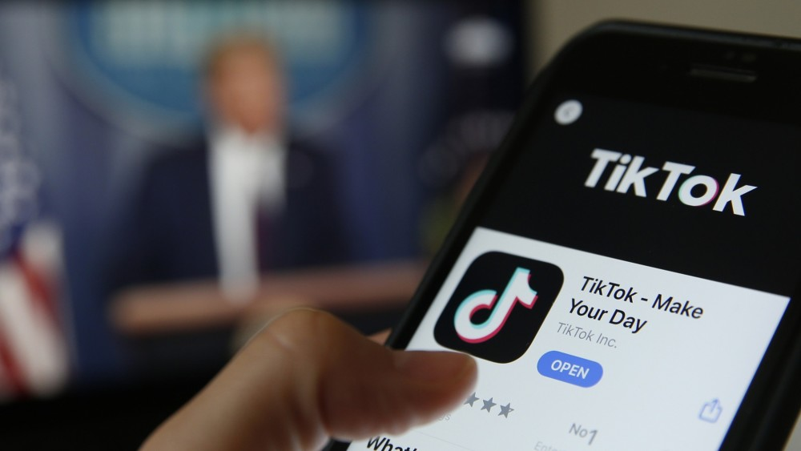
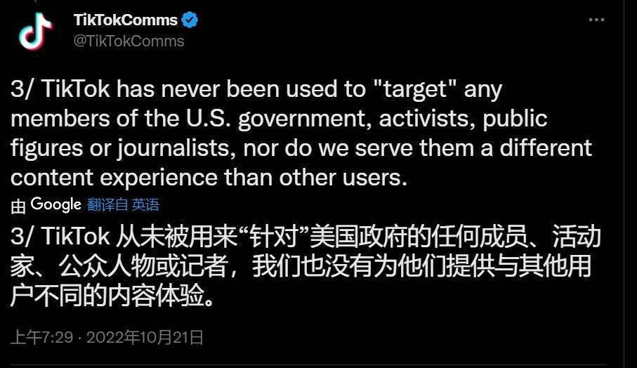

# 字节跳动不当访问美国用户隐私：一次将被放大的ESG风险

出品 | 虎嗅ESG组

作者 | 袁加息

头图 | 视觉中国

本文是#ESG进步观察#系列第001篇文章

本次观察关键词：用户数据隐私保护、跨境合规治理

《福布斯》12月23日报道，字节跳动的员工动用特殊权限查看了多名美国媒体记者在TikTok上留下的隐私数据。此举违背了TikTok此前关于用户隐私保护的公开承诺，即不会出于商业以外的目的，对特定美国用户的信息进行监控。

据报道，字节跳动之所以访问子公司TikTok的数据，是为了堵住内部资料外泄给媒体的漏洞。为此，字节的内审人员不当查看了多名记者的TikTok账户数据，包括他们的IP地址、APP内通信等，以审查他们是否曾与涉嫌泄密的员工联络见面。

也就是说，为了弥补一个问题，字节触发了更大的问题。

该事件的后果可能极为严重。自从2020年特朗普政府对TikTok发难以来，字节跳动及TikTok一直在努力向美国政府和社会各界展示该APP的数据安全性。但是，本次事件将令情况变得复杂。

12月27日，据《华尔街日报》引述知情人士的消息，拜登政府内部的一些官员已经在美国外国投资委员会（CFIUS）的讨论中提出，应迫使字节跳动出售美国业务。

为什么事件的后果可能空前严重？

TikTok曾多次遭到美国政府的监管乃至封杀威胁。

在形势最为严峻的2020年，时任美国总统特朗普曾对TikTok采取强制措施，威胁要么禁止TikTok在美运营，要么字节跳动剥离TikTok美国业务并出售给美国本土企业。特朗普认为，TikTok对美国民众输出价值观并采集用户信息，对美国国家安全构成了威胁。

之后，2021年就任的拜登政府撤销了特朗普对TikTok的禁令，暂时缓解了TikTok在美国的生存危机。

但是，公司并未从此高枕无忧。美国政府和监管部门对TikTok的调查始终在推进。并且在美国国家和各个州政府中，存在大量反对TikTok在美运营的官员，持续推动对TikTok采取更严厉措施。他们反对TikTok的理由，还是集中在美国国家安全和用户数据隐私问题上。这些争议中，有用户隐私等ESG议题，当然也包含大量的地缘政治因素。

但一直以来，TikTok的所谓安全威胁基本停留在理论层面或制度层面。各方给出的调查结果，
**未能充分证明TikTok对美国国家和公民的数据安全产生了实质性的侵害。**

较近一轮公关的攻防战发生在2022年6月。一篇来自BuzzFeed的报道对TikTok造成了较大的不利影响。BuzzFeed的记者Emily Baker-
White通过分析80份TikTok内部会议的录音、以及9位TikTok员工的陈述得出结论，母公司字节跳动位于中国的技术人员仍在持续访问TikTok的美国用户数据。

针对这一波媒体调查引发的质疑，TikTok及母公司字节跳动做了相应的风险管理和回应，重申了在数据存储本地化方面的努力，即美国用户的数据都存储在甲骨文公司的云端。同时TikTok一再保证，用户数据的访问权限是被严格限制的，公司不会使用用户数据去对特定人进行定位追踪。

然而，这次年底爆出的字节跳动员工不当访问用户隐私的事件，让TikTok的各项合规努力付诸东流。

实际上，字节正是在与美国媒体的攻防战中，暴露出了对方希望寻找的破绽。

从现有的信息回看，正是2022年6月的负面报道，使得字节跳动希望加强内控，防止内部资料再度流入媒体手中。为此，公司的内审部门展开的工作之一，就是调查员工与媒体之间的关系，并且在调查过程中使用了不合规手段。前面提到的BuzzFeed记者Emily
Baker-White，是被重点调查的人之一。Emily Baker-White后来入职《福布斯》，也把与TikTok之间的战斗带到了《福布斯》。

TikTok于10月在推特上做出的一份澄清，图片来源：Twitter

10月，字节跳动查看用户个人信息的行为，再度被Emily Baker-
White本人探知，并通过《福布斯》进行报道。TikTok最终承认了内部员工的不当行为。这样，TikTok的新一轮舆论与监管危机在所难免。

此次事件打破了TikTok在美国小心维持的平衡与信任。它可以说是正中批评者的下怀，印证了此前对TikTok的指控。事件可能导致政府中对TikTok的反对派占据上风，并采取极度严厉的监管措施和行政制裁。

**“被破坏的努力”**

据《福布斯》，字节跳动CEO梁汝波在内部邮件中表达了深深的失望之情：“我们花费巨大努力建立起来的公众信任，被少数人的不当行为严重破坏。”

**用户数据隐私的保护，是企业ESG治理和合规治理的一个重要议题。**
TikTok的案例中牵扯的地缘政治问题虽然不容ESG置喙，但公司触发的用户隐私风险则是一个标准的ESG问题。在出海企业中，像移动应用、电商、3C、智能汽车、电信服务等类型的业务，通常运营着成规模的海外用户数据，需要严格遵守所在国的数据法规。

在数据合规上，TikTok以及母公司字节跳动付出的努力，不可谓不充分。

首先，TikTok进行了大量技术与制度方面的建设，包括但远远不限于通过了代表高水平数据安全的ISO27001认证。TikTok及其母公司拥有世界领先的技术团队，数据安全的技术性问题自然不在话下。

不过，美国方面质疑的不是TikTok的技术水平，而是公司治理方面“人”的因素：TikTok是否将用户数据用在商业目的之外的用途？内容推荐算法是否带有偏见？是否对美国用户推送带有特定价值观（尤其是中国主流价值观）的内容？

2020年，彼时的TikTok已经在美国拥有约5000万级别的用户。来自华盛顿的主流态度认为，TikTok上的美国用户信息被传输并存储到了母公司位于中国的服务器上。这是华府不能够接受的。

抛开地缘政治的因素不谈，对数据跨境传输的管制，确实是从2020年前后开始受到各国监管者的重视。

根据2021年德勤与中兴通讯联合发布《数据跨境合规治理实践》白皮书，各国的数据跨境法规可以分为三类：第一类是极端严苛的数据“本地化存储+禁止出境”，第二类是极端宽松的“无本地化存储要求+自由出境”，以及居间的第三类“有条件的存储与出境”。大多数国家的数据法规属于第三类。
**于是出海企业在数据治理方面的核心工作，就是弄清目的地国“有条件的存储与出境”政策中的“条件”是怎么，以及如何遵守。**

这些后来的经验，正是TikTok等先驱蹚出来的“血路”。美国虽然是“数据跨境自由流动”的支持者，但当局对于TikTok所持美国用户数据的要求，属于最为严苛的“本地化存储+禁止出境”类型。

在2020年下半年特朗普政府开始对TikTok发难的同时，字节跳动经过与甲骨文公司的密集协商，决定将TikTok在美国的服务及数据存储，搬到甲骨文云上，实现本地的存储与使用。同时，TikTok的在美运营，已经全权交给了基于加州洛杉矶的本土团队。

TikTok的数据合规工作，是“本地化”与“透明化”的两条腿走路。在2020年3月，公司公布了透明化建设的两项重要举措，向外展示公司的安全可信赖。其一是建立“透明度和问责中心”（Transparency
and Accountability Center，简称透明度中心），并发布《透明度报告》；其二，是组建了一个内容顾问委员会。

TikTok的“透明度中心”是一个物理存在的地点。受邀的访客可以在这里参观TikTok的内容审核后台系统，看到APP的一些代码及其他数据管理操作。类似的信息也开放给了内容顾问委员会。这个委员会由独立的学者、专业人士构成，他们为TikTok在美国的团队提供内容治理、技术伦理、数据安全等方面的建议，并履行监督义务。值得补充的是，这些举措是全球性的，不限于美国市场。这在整个科技行业也是领先的举措。

我们很难穷举TikTok和母公司字节跳动为了数据合规做出的努力。总之，他们在技术和制度的基础上，加码了“本地化”与“透明化”两项举措。用稍专业的数据安全话术来解释，TikTok的相关举措涉及在“数据收集、存储、传输、使用”等流程上合规运营，外防黑客攻击风险，内防员工违规风险，并且对外自证清白，极力获取用户和监管者的信任。

令人扼腕的是，公司的“巨大努力”，最近毁在“少数人的不当行为”上。

为何严防死守之下还是出现了漏洞呢？据《福布斯》的报道，实施此次“不当行为”的是字节跳动内部审计人员。这实质上意味着，风险是从公司治理的内核上爆发的。

企业的内审部门，本应是保障企业合规的终极防线；为了履行监察职能，内审团队通常拥有企业内部信息系统的高级访问权限。然而，
**字节的内审人员在调查公司内部的泄密漏洞时，却突破了他们本应坚守的数据合规底线。**
可能字节与TikTok的高管都不曾想到，危机会以这种“祸起腋肘”的形式爆发。

出于后见之明， **我们或许可以强调一下企业核心团队合规文化建设的重要性。** 但对于字节来说，损失可能已经难以挽回了。

根据多家媒体的报道，事后字节跳动整肃了各级公司的内审部门，撤销了其对敏感数据的访问权限，并且辞退了相关责任人。

然而在很多美国财经媒体和立法者看来，字节及其子公司这次犯下的错误是不可饶恕的。

**注定悲剧？**

诚如一些评论者所言，运营一个内容平台本来就是非常困难的事。像脸书、推特这些美国土生土长的内容平台，都免不了沾染数据违规的争议以及政治丑闻。比如，推特、脸书和Youtube都曾或多或少卷入2016年美国“通俄门”事件。类似地，像TikTok这样有中国背景的企业，对于美国国内的政治暗流，抵抗力更弱，且被拿捏的把柄更多。

TikTok大概自2020年起，越发收紧平台关于政治广告内容的审查，在美国社会中采取“政治中立”策略，以防卷入不必要的风险。

但TikTok的谨小慎微不足以屏蔽所有的非常规风险。更何况，美国国内的一些反对力量带着有色眼镜看待TikTok，把TikTok及其母公司的一举一动，都放在显微镜底下审查。

所以，认为TikTok注定悲剧的观察者大有人在。

就TikTok这家公司本身来说，它在美国市场为“赢取信任”和“不犯错误”这两项无形价值而支付的成本，正不断地加高，或许终将高到公司难以负担的程度。而全球化退潮和地缘冲突的大背景不改变，TikTok之类企业所支付的高昂信任成本，也就很难改变。

不过，不能因此认为TikTok是个ESG意义上的失败企业。TikTok在美国执行了相当成功的本土化策略，维持着与本土社区、亚文化群体之间良好的关系，并且成了网络文化风潮的积极引领者。TikTok为众多音乐人、艺术家以及形形色色的消费品牌打造了知名度，为他们创造了生计来源。在美国之外的世界各地，TikTok拥有超10亿用户。

即使是在TikTok看起来最为“失败”的在美数据合规领域，它也践行着为其他出海企业探路的使命。只是，在本次事件之后，TikTok还能否继续把路走下去，正在变得很不明朗。

