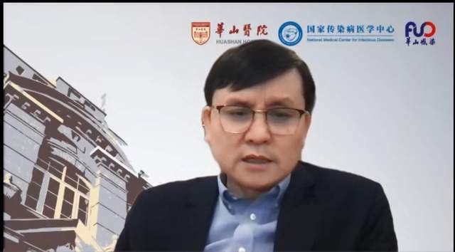

# 张文宏：“刀片株”“干饭株”仍属于轻症，黄金72小时守护脆弱人群

一大早赶到医院，参加住院危重病人的交班、查房；上午，参加市领导召集的新冠重症患者救治专题会议；中午回到医院，讨论几名新收治入院的重症患者救治方案；13:30，参加为医务人员举办的老年患者救治规范的培训活动；14:30，与瑞金医院副院长陈尔真一起，作为救治专家，与上海各区相关领导共同讨论如何继续扩充、拓展基层救治能力。16:30，赶到另一家三甲医院，为10多位感染新冠病毒的高龄老人会诊……

2022年12月29日，上海市新冠疫情防控救治专家组组长、复旦大学附属华山医院感染科主任张文宏的工作日程，也是近期上海救治专家们繁忙状态的缩影。傍晚，在工作间隙，张文宏医生接受了大江东工作室的专访。

**大江东：** 请介绍一下上海这波新冠病毒感染的主要特征和近期患者的救治情况。

**张文宏（上海市新冠疫情防控救治专家组组长、复旦大学附属华山医院感染科主任）：上海从12月22日开始到达感染峰值状态，按照估算，目前感染人数是千万级别的。**
假设上海1000万感染者中0.5%需要住院，就意味着近期数周内有5万人需要住院，各大医院无一例外要收治上几千人，其中特别危重的还需要做呼吸支持。所以，虽然重症在感染人群中比例低，但基数大了，绝对人数还是多的，这就是这波奥密克戎感染的特征——
**我们面临着所有国家在疫情开放之初都经历过的严峻挑战。**

目前，上海正在全力提高重症病人的救治能力，从基层卫生机构到三级医院，所有医生护士都投入到针对奥密克戎的全面战斗。 **一是提升基层社区的救治能力，**
包括增加救治点位、培训医务人员，提供氧疗、抗病毒药物，制定规范诊疗手册，
**要让更多病人在发病的“黄金72小时”内得到有效治疗，让重症病人尽快通过分级诊疗体系转诊上级医院。二是二三级医院扩充病床数，优化收治流程，让急诊的重症病人尽量在24小时内能够收治，完成所有新冠抢救流程。**
我所在的华山医院，除了感染科在各个院区的几百张床位外，今天又拿出了一些其他科室两层楼面的床位，作为医院集中收治的公共平台。

**大江东：** 同之前相比，这一波疫情的应对和救治有什么特点？医生们是否有了更新的药物或治疗手段？

**张文宏：**
经过这三年，我们形成了很多救治的规范流程。通过对此前死亡和重症病例的研究分析，我们发现疫苗接种可以有效降低重症率与死亡率。通过多方宣传大力推进，很多人完成了全程疫苗接种。我们在抗病毒药物、呼吸支持、ICU病房和设备等方面，也做了一定的准备。在治疗流程上，根据重症新冠的特征，及早使用氧疗纠正缺氧，使用激素改善炎症以及早期的抗凝治疗等。一般而言，重症救治的高峰，将紧跟着感染高峰很快到来，应对的武器就是以最大的努力与不眠不休的精神，布局医疗资源，从基层医院到三级医院，以最快的速度抓住72小时“黄金时间”的救治，无论是社区内的早期基层医疗救治还是重症病人的急诊救治，都要
**力争做到更快更早，才能和死神抢夺时间、抢夺生命，奋力降低重症率、死亡率。**

_张文宏视频接受采访。来源：人民日报中央厨房-
大江东工作室_

**大江东：** 老年人和有基础疾病的脆弱人群是这波感染中最让人牵挂的群体。老龄化程度很高的上海，对脆弱人群的保护和救治上做了哪些准备？

**张文宏：**
上海养老院住了8.8万老人，护理院住了2.2万人，还有七八十万居家的有着各种基础疾病的高龄老人，以及500多万60岁以上老年人。上海对此做了全面排摸。除了推广接种疫苗，早先我们的想法是尽量保护住老人和脆弱群体不在这波流行中被感染，所以对养老院实行封闭管理，建议老人居家、少出门，不要出来跳广场舞、搓麻将，压低重点人群感染峰线，延缓他们的感染时间。但在迅猛如海啸般的奥密克戎传播中，老人感染率还是比较高的，重症患者也在增加。目前正进入大决战的关键时期，
**上海在努力把医疗资源送到老人们身边，让脆弱人群在“黄金72小时”内得到及时救治。**
上海各区都在组织将医疗力量下达到护理院、养老院，市级专家组也分区域与基层对接，加强会诊、查房、培训。

**这一次，是我们与奥密克戎之间的全面力量对决。**
没有讨巧的机会，不是三甲医院多开几个重症病房就能解决救治的，而是从基层到中枢都要有效动员，每个家庭也要懂得怎么维护好脆弱人群、什么情况要到医院就诊；每家社区卫生中心也都能尽可能扩大救治力量……

**奋力守住脆弱人群感染这个关口，这次的大流行关，我们才能咬牙迈过去。**

**大江东：** 有人说，这波感染的主力毒株BA.5或BF.7更“毒”，有道理吗？

**张文宏：**
目前的主力毒株都是国外广泛流行过的，都有学者做过毒力比较，BA.5、BF.7的重症率、死亡率与第一代奥密克戎很接近。很多人感染后感觉发烧、肌肉酸痛等症状比较严重，还起了很炫的名称，像“刀片株”“干饭株”等，但这样的人群仍然属于轻症。重症在医学上有清晰的界定：呼吸困难、氧饱和度低于93%；做CT检测肺部有较广泛的浸润，出现大面积的阴影甚至白肺。如果吸氧也没用，还需要气管切开、机械通气，就是危重症了。
**我们对病毒基因组开展持续监测，现在并没有发现新的特殊毒株，上海目前主要是BA.5、BF.7，它们引起重症的比例是明确的。**

**大江东：** 您感染过奥密克戎吗？症状严重吗？

**张文宏：感染过，我的症状很轻。**
第一天居家休息，开了六七个网络会议；第二天就到阳性病区查房了。周边没有人觉得我感染过，因为每天都在病房里，都在工作。我打过第四针，我自己的经历也让我更支持疫苗接种。

**大江东：** 从疫情初起至今，您一直很强调加强营养，尤其是蛋白质摄入的重要性。为什么在呼吸系统疾病救治中要如此重视营养问题？

**张文宏：**
在参加疫情救治和查房时，见过不少病例。2020年时，不少境外输入病例往往是因为路上辗转转机，三餐不给，营养缺乏，感染后病情很快加重。今年4-6月上海疫情期间，很多老人因为突然离开养老院等熟悉环境，去了方舱或隔离酒店，加上肺部感染、基础疾病变化等，营养摄入受影响，抵抗力大幅度下降，症状突然加重。这次，我们也发现，因为急诊医疗资源紧张，在急诊滞留的患者很难保证充分的营养供给，两三天一过，营养跟不上，也会出现重症进展加快问题，这时再用上救治手段也未必起到效果。而营养质量好，免疫力水平好，病人可能就会扛过去。

**营养是救治新冠感染的基础。有营养才有抵抗力，营养的重要性，怎么强调都不过分。**
希望这段时间，所有感染者或居家观察的老人，一定要特别注重增加营养，蔬菜、碳水等多样、均衡摄入，优质蛋白的摄入更是重中之重。

**大江东：**
2022年初，您说研究了奥密克戎感染者的医学影像，不是“大号流感”，认为这种变异株“会咬人”。您从影像上看到了什么？现在看，它主要“咬”在哪里？

**张文宏：**
当时不少人认为奥密克戎只侵犯上呼吸道，毒力下降。与德尔塔株相比，奥密克戎毒力确实是明显下降了。2022年初，上海承担了国际航班主要入境地功能，输入性病例不断。我看片子看到，奥密克戎整体上的重症发生率在下降，但是在脆弱人群中还是有肺炎表现，
**临床的实际情况告诉我们，绝不能说奥密克戎对所有人都不会有危险，都不会侵犯肺部。**

流感已在世界上流行100多年，我们也建立了一定程度的交叉免疫。新冠是新病毒，感染面广了，风险就会被迅速放大。最近，我们可以更清楚地看到，奥密克戎确实“会咬人”，脆弱人群会出现肺炎症状，有些人甚至需要插管。奥密克戎重症率不高，但要说它全是上呼吸道症状，“不咬人”，也是错误的。中国的感染者基数这么庞大，哪怕它只“咬”几口，可咬的全是老人、脆弱人群，也会让我们心中很痛很焦灼。

我们现在处在开放后特别迅猛的奥密克戎第一波冲击阶段，特别艰难。必须集聚全社会力量、扩充医疗资源、保护好脆弱人群，奋力扛住奥密克戎的冲击，走出这波疫情，取得最后胜利。

来源：人民日报

