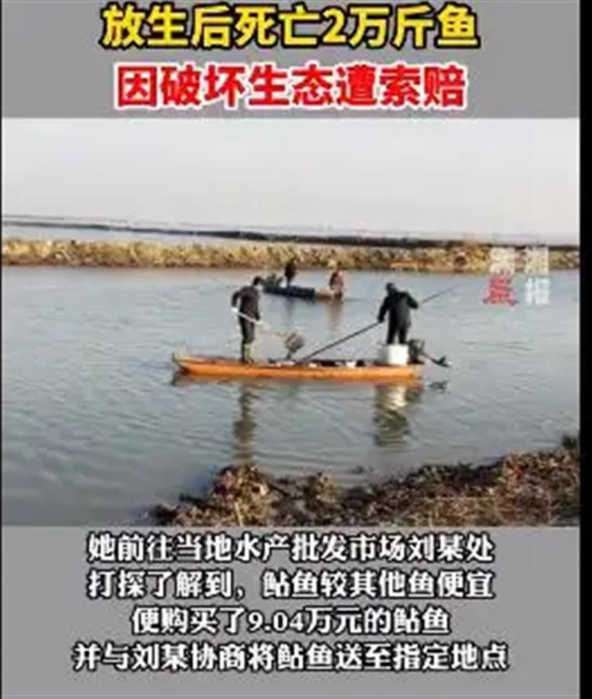

# 放生还是杀生？为祈福放生鲇鱼死亡2万斤，女子缴9万元处置费

极目新闻评论员 吴双建

“我们已收到徐某缴纳的9万余元应急处置费。”日前，江苏省常州市金坛区检察院接到长荡湖渔政监督大队的电话通报。女子徐某是一起非法放生外来物种案件的被告，她在当地长荡湖偷偷放生2.5万斤鲇鱼，结果出现大量死亡，渔政部门耗费10天才完成打捞。鉴于该行为已严重危害长荡湖水生态系统安全，检察机关已向法院提起了民事公益诉讼。（据12月29日澎湃新闻）

_相关视频报道截图_

徐某买鱼就花了9.04万元，现在缴纳了9万余元的应急处置费，另外还面临着公益诉讼，可能还要赔数万元，这个教训何其深刻。胡闹放生导致自己金钱损失惨重，恐怕是她始料未及的吧！

然而，只是徐某自己会遭遇严重后果吗？长荡湖的生态会受到什么样的影响还真不好说。报道中称，徐某放生的不是本地的鲇鱼，而是“革胡子鲶”。“革胡子鲶”本名为埃及胡子鲶，原产于非洲尼罗河水系。专家就表示，该鱼种生长速度快，繁殖能力强，具有较强的入侵能力，一旦入侵成功，将对长荡湖水生态系统造成重大损害。也就是说，除了打捞上来的2.02万斤死鱼，还有4800斤革胡子鲶进入了湖中可能存活了下来。更何况，由于放生鱼类的大量死亡，也严重污染了水体。

回过头来看，徐某的放生变成杀生，变成害生，不是一目了然吗？徐某身体不好，想做善事得福报可以理解，但也应该了解相关知识，而不是胡乱为之。不知道徐某看到这些死鱼，内心有什么想法，媒体不妨好好采访一下。

自己受到处罚，环境受到危害，就脱离了放生的初衷。如此大量放生外来物种，幸亏找到当事人，否则只能由社会来承担恶果。

放生行为时时引起热议，就是此举会给生态环境造成危害。特别值得一提的是，商业化在其中起到了推波助澜的作用。不少人就被商业机构的各种话术所迷惑。放生的量越大，福报越多；放生的次数越多，回报越大……殊不知，这都是有关商贩和一些相关机构为了赚钱制造出来的话术，并没有什么科学依据。至于放生矿泉水、放生牛奶这样的闹剧，更是造成资源浪费，百害而无一利。

一些所谓的“专业”网站，各种各样的“放生学说”层出不穷，也让越来越多的人深陷其中。宣称什么放生能治病、能找好工作，这不是在误导人吗？另外，在网上各种代放生的广告也比比皆是。为了争抢生意，“放生”的功用几乎无所不能。

“没有买卖就没有伤害”是常识，应该广而告之。对有关部门而言，消除放生背后的商业驱动机制，也是当前的重中之重。而另外，就该让放生者承担相应后果和责任，正如对徐某的处罚一样，如此才能让他们长记性。

（来源：极目新闻）

