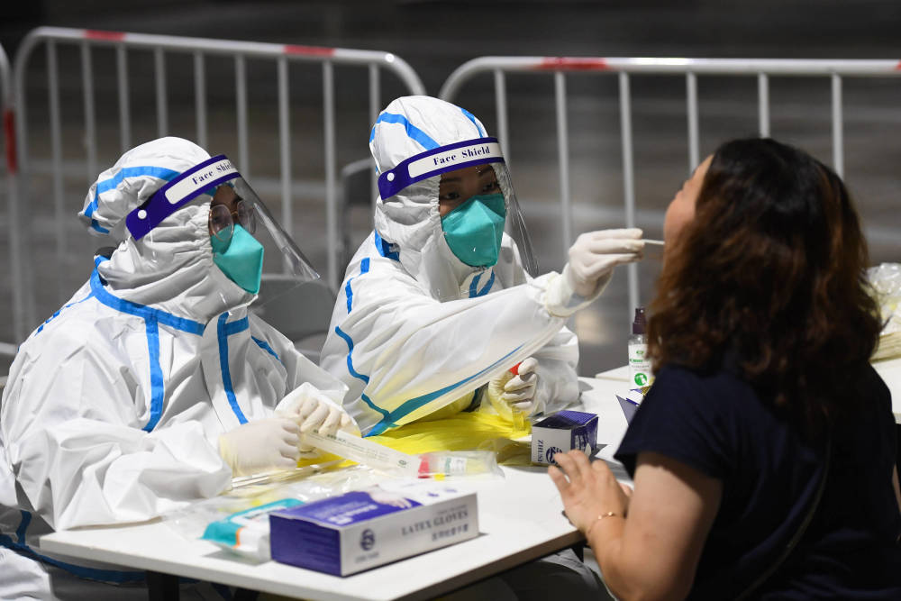
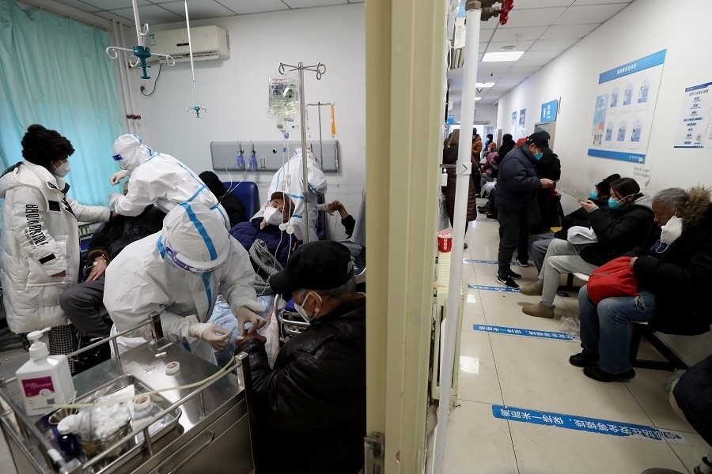
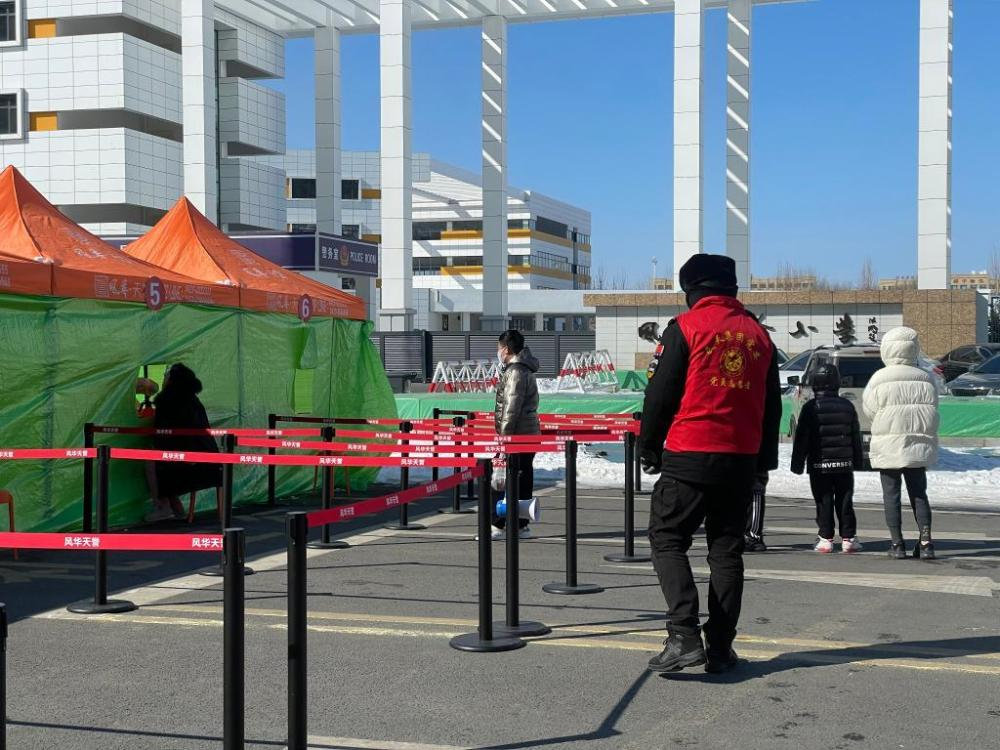

# 政治学者：“国家管了我们三年，现在不管了？”

随着新二十条、新十条的出台以及新冠病毒感染被调整为“乙类乙管”，国内疫情迎来一波高峰，也引发了舆论颇多争议。

开弓没有回头箭，如何认识近期的政策调整？面对如此规模的传染病，该如何理解政府的责任边界？回顾三年抗疫，可以总结哪些治理经验？随着新冠感染被划为“乙类乙管”，我们该如何统筹疫情防控和社会经济发展？

围绕相关问题，政治学者夫梓作出如下解读：

**观察者网：**
新冠疫情进入第三年，随着各方面形势变化，各地均对防控措施做出了调整。12月26日，国务院联防联控机制发布了《关于对新型冠状病毒感染实施“乙类乙管”的总体方案》，为平稳有序走出疫情指明了方向。而面对仍在肆虐的疫情，网络上也出现了不少担忧的声音，认为现在是不是要彻底“躺平”、“放任不管”。您觉得该如何认识近期的政策变化？

**夫梓：**
面对疫情，每个人由于个人立场、价值判断的差异，做出的选择不同，有人主张放开，有人主张清零，这是正常现象。在逐步放开之后，出现了一些超预期的情况，老年群体为这项政策付出了相对其他群体更高的风险成本。但是总的来看，各级地方政府并没有完全“躺平”，而是正在逐步提高应对能力，通过一切手段千方百计降低重症率和病亡率。

疫情防控政策的调整，是一个自然的和必然的过程，因为前期从全球情况来看，其致死率和引发的重症率确实已经发生重要变化，这对公共政策有直接影响，这种情况下不调整就变成刻舟求剑了；但另一方面政策调整也是抉择的结果，如此重大的决策关键时候需要有人拍板。对于国家来说，在决策的时候实际上只能以“功效原则”为依据，如果你身处决策位置就会发现其实很难被某种特定价值捆绑，更多的还是要看形势和成本。

国家的能力也是有限的——我们的制度资源和财政能力都是有限的，病毒是自然现象，它并不惧怕权力，如果所有防控力量加总都无法应对，这就已经是超负荷危机了，只能调整政策。当没有足够多的能力支付这个代价时，如何衡量眼下该干什么、不该干什么，如何保障并增加社会效益和人民幸福的总体程度，最后只能是权衡利弊，做出一个总体制度效能最大的决策。

中国的制度优势是善于“十个手指弹钢琴”，也就是说一个阶段性内可以有政策的优先和重点，但是你做不到持续数年坚持一项工作是压倒性的，而且不惜以其他一切领域的牺牲为代价。实际上，在12月份疫情政策调整之前，问题始终是存在的。地方经济的发展、财政的可持续性、社会的稳定、市场的繁荣、毕业生的就业、孩子的正常教育……等等因素实际上已经逐渐进入到令各级决策者焦虑的状态，决策者最终需要去权衡并做出一个选择。

抗疫三年，需要付出昂贵的代价。新华社资料图

现在总体的大趋势就是从国家强势主导的动态清零模式，逐步过渡到国家、社会、市场、社区、家庭和个人多方参与的常态化防护上来。当然目前主要的问题是，
**如何实现平稳有序的过渡，尽快缓解眼下“放开”带来的大规模感染的阵痛。**

当前工作的重点很清晰，就是千方百计全力降低重症率、病亡率。在这个问题上，中央和地方要一起努力，形成一些工作机制。不能像前期防控政策那样“从上到下”垂直指导，指导不宜过于具体，束缚住地方手脚，应该是中央提出一些原则性要求，让地方想方设法调动自己的资源各自解决自己的问题。

之所以这样，根本原因是不同地区之间有着不同的财政能力和医疗服务供给水平，不同地方解决问题的能力是不一致的。我注意到，北京、上海、天津和广州等地的救治政策模式还是有一些不同，体现了因地制宜动态调整的要求。

根据国家卫健委的报告，截止到目前为止，从全国范围内来看第一波感染最高峰未现大面积重症死亡。确实目前许多发达地区形势总体平稳，医疗服务供给总体有序，但是在一些欠发达地区，尤其是随着感染人群向广大农村地区蔓延，马上又要赶上年终岁末的返乡春运人口大流动的高峰，农村地区面临的挑战可想而知。而这里，医疗服务供给和救治能力下降的问题又十分突出，所以我们应该要有底线思维，尽量降低可能出现的更大社会风险和更高社会成本。

12月27日，北京中日友好医院发热门诊，医护人员为前来就诊的患者输液。中国日报记者 王敬 摄

目前在控制重症率、病亡率方面有几个工作是必须做的，一是持续加强对重症率、病亡率的监测，尤其是对患有基础性疾病的老年群体的健康监测和服务指导，始终绷紧这根弦；二是督促全国公立医院尤其是三级医院兜住医疗救治和生命保障底线；三是竭尽全力加强广大基层和乡村地区医疗卫生机构的发热门诊建设，提高基层接诊转诊能力；四是发挥好互联网医院及远程医疗平台开展线上服务的补充作用。

**观察者网：**
在此前的防疫过程中，某些地区出现的层层加码、过度防疫等问题一度成为舆论关注的焦点。而本轮防控政策调整也从回应这些问题开始，做出了一系列优化、调整。从国家能力和制度建设的角度，回顾三年抗疫，可以总结哪些经验？随着新冠感染被划为“乙类乙管”，我们该如何统筹疫情防控和社会经济发展的关系？

**夫梓：**
如果要立足于国家能力的角度讨论这次疫情的长期政治影响是什么，一个重要指标就是看它有没有破坏中国民主集中制的总体原则，其中最核心的是中央领导的大一统的制度。

疫情这三年，很多人认为国家的权力大幅增长，国家对公民信息的获取能力大幅提高，甚至也有人认为过去三年是一种极端管控状态，但实际上我觉得可能不能笼统地这么说。

因为这三年其实在很多时候属于一种紧急状态。国家宣布紧急状态后，其权力不一定是增长了，反而可能是被变相弱化了。

中国是中央集权的大一统体制，严格来说中国没有中央地方关系问题，所谓央地关系的许多问题其实大多是伪问题，因为在中国，所有的权力全部归属中央。疫情爆发以来，表面看我们国家的中央政府一直在围绕疫情防控颁布各种条例和指导，但是实际上由于疫情进入到了一种紧急状态，权力实际上被不断下沉到基层，表面看是层层加码，实际上是权力层层下沉，因为只有加码才有权。这是对国家政治生活和法制建设的损害，当然也是对社会良性运行的损害。

这次疫情尤其是最后一个阶段，广大群众对基层组织管控方式有较大意见，这是可以理解的。中国农村的村民委员会，还有我们城市的社区管理委员会，其实是中国的准第六级政府，中国从82宪法一直到现在，几次修改宪法，都没有把执法权交给他们，就是因为这一级政府的素质和能力相对比较层次不齐，执法权下沉之后会带来很多问题。

医护人员和志愿者们在凛冽的寒风中持续工作。新华社记者李昂 摄

现在，随着我们对防疫政策做出调整，这些问题目前来讲已经不存在了。我们需要关注的就是在正常的状态下，重塑国家正当的、常态化的权力运行，重点是恢复国家大一统权威和政治功能，彻底消除三年来部分领域权力下沉分散、各行其是、管理混乱的状态，促进中央地方关系、国家和市场社会关系以及国家法制建设良性健康发展。

具体来说有这样几个方面：

第一个在国家建设中间，以中央责任为主，以地方责任为辅，央地协同推动公共卫生兜底工作。成体量的发热门诊或发热医院的建设，医护人员整体力量的建设，分级诊疗的推进，公民健康观的培养等等工作，可能还是需要中央来牵头推进，提供指导。

第二个是经济恢复，所有市场经济国家的经济管理权都在中央政府，无一例外，现在中央通过各方面的手段出台了一些有效的激励措施，已经激发了非常好的市场反应和良好预期。地方政府当然对此也负有责任，但更多还是中央要拿出足够有效的宏观政策。

第三个就是继续推进全国大市场体系建设，实际上疫情过程中，由于权力下沉层层加码，实际上强化了地区自主性和地区壁垒。

《宪法》第六十七条、第八十九条以及第一百条都清楚写明，地方立法和地方各级国家行政机关的决定和命令都不得同宪法、法律和国务院行政法规相抵触，强调中央高于地方原则。过去三年，产生了大量地方性法规、决定和命令，这些东西破坏了大一统的原则，不利于全国市场。

尤其是通过这次疫情，地方掌握着大规模搜集到的基础数据、人员数据、交通数据，地方健康码之类的东西还造成了严重的“信息茧房”“各自为政”的问题。当然，我们也看到12月份以来，伴随疫情防控政策的调整，包括交通运输部在内的中央多个部门下达政令，消除跨区域人员查验核酸、健康码和“落地检”要求，推动全国交通运输一体化。

第四个是公共服务的恢复。过去三年疫情的冲击导致大量的公共服务事实上已经瘫痪了，我觉得现在已经是个时机有序地去恢复这些公共服务，比如学校教育就是一个重要的方面。例如许多城市地区的幼儿园，2022年以来基本就没有开过课。中学线上教育带来的问题也愈加显现。如果疫情再出现高峰期，学校如何来处理这个问题？这方面需要形成一些工作指导。另外还有许多城市的公园，到现在还在封闭不开。我觉得只有中央政府实现责任兜底，地方才能放开手脚承担责任，积极恢复一系列基本公共服务。

第五个是法治建设，紧急状态下对法治体系的破坏是惊人的。这不能完全理解为是人为造成的，而是因为这种状态本身必然会带来管治权下沉，管治权下沉就是政治上的“封建”状态，必然破坏统一的政令和法治。这一次疫情过后，实际上我觉得要对于地方做出的不符合中央要求的规章立法，进行集中的检讨和处理。这对于国家能力的建设也是非常重要的。

总之，我们不能说国家退出了新冠疫情防控工作，这不符合实际，应该说现在这个情况实际上是从国家一元化主导防控的紧急状态转入了一个全民防护的状态，中央政府、地方政府，还有群众的自治组织，再加上社区、单位、家庭，大家一起来转化到一种常态化的防护之中，多元主导，各尽其力。

**观察者网：**
全民防护的状态也就是我们所说的“自己是自己健康的第一责任人”。但对于普通民众来说，可能已经习惯了大政府的大包大揽。这是否意味着我们也要转变以往对大政府的思维模式，重新认识新冠疫情后的政府职责？现在，经常听到的说法是“国家管了我们三年，现在不管了”。其实“管”这种说法就特别有中国特色，政府就类似于一个大家长的角色。当然从政府职责的角度来讲，保护公民生命健康、提供基本的医疗救助也是其职责之一。面对大型传染病，政府职责有没有边界，边界在哪里？

**夫梓：**
我刚才已经说了，国家绝对没有“躺平”，从中央一直到地方，都在积极调整政策，因地制宜制定符合实际需求的政策。在功能方面，政府一直在监测重症率、病亡率情况并加强对特定老年群体的健康监测和服务指导，国家也在督促全国公立医院兜底，确保医疗救治和生命保障底线。最近对一些国际原研药的引入，虽然带来一定争议，但对特定群体救治肯定是有益无害的，这体现了实事求是的原则。

前段时间个别地区的医院内部有床位但是不敢收治病人，加剧了医疗救治资源的紧张，国家卫健委注意到这种情况及时进行了纠偏，例如规定不以基础病病亡人数评估问责医院，目的是让这些三级医院更好承担责任。

当然，对于个人来讲，大环境确实变了，这一轮疫情过后全社会大概率会恢复正常运行，但是疫情因素又不会彻底消失，因此只能走向全民防护状态，每个人“自己是自己健康的第一责任人”是一种不得不面对的现实选择。但是，“自己是自己健康的第一责任人”并不是说只有自己是唯一责任人，单位、社区、政府就不管了。

**观察者网：** 正如刚才提到的，放松管控后，一些民众比较担忧生命健康没有保障。面对当下舆论呈现的焦虑情绪，该如何做好引导？

**夫梓：**
这段时间以来，各大主流媒体的报道和专家的及时科普，使得公众对于奥密克戎的认识逐步加深，也逐渐了解了该如何去应对这一传染病。虽然这一波疫情大家有超出预期的体感，但是随着感染波峰的跨越，全国多省已经在逐渐恢复正常社会秩序了，像北京从这周开始堵车了。应该说，焦虑的情绪总体上在逐步缓和。

但不同区域、不同年龄群体甚至不同社会阶层对此的感知肯定是不同的。像大规模的灵活就业群体，他们这一感染就影响工作、影响生计，焦虑情绪可想而知。再比如一些有基础疾病的人群可能也会比较焦虑，还有对于幼儿感染的担忧也是普遍的。

缓解民众的焦虑，我觉得最重要的是两点：一是实事求是的信息源，国家要加强对疫情发展的及时监测，尤其是对国内毒株发展变异的情况给出令公众信服的信息，使公众对病毒传播重病率大概率转弱的趋势有稳定预期，如果有小概率情况，也要有心理准备；二是强化基础储备和兜底能力，利用当前窗口期加快感染病例分级分类救治，加强县级以下基层医疗救治能力，补齐各方面制度短板，优化救治的科学流程，针对欠发达地区加快建设基层发热门诊等。

**本文系观察者网独家稿件，文章内容纯属作者个人观点，不代表平台观点，未经授权，不得转载，否则将追究法律责任。关注观察者网微信guanchacn，每日阅读趣味文章。**

