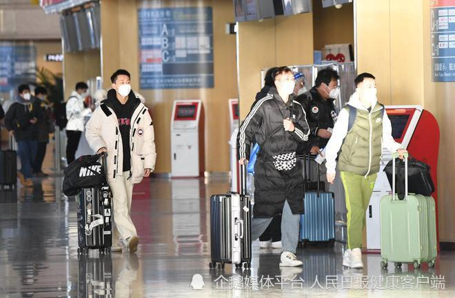

# 新冠调整为乙类乙管后，专家：健康码管理作用弱化，会适时退出

**健康时报 刘颖琪**

2023年1月8日开始，新型冠状病毒感染将被列为乙类乙管，相关防控措施也已逐渐调整，包括公共场所取消查验核酸、也不再划定密接等。多位专家表示，随着调整为乙类乙管后，健康码对于疫情的管理作用已大大弱化，在其适当的时候也会退出。

_12月18日，哈尔滨机场旅客出行不再落地检和查验健康码。黑龙江机场集团
图_

“疫情之下，从理论上来说对于脆弱人群的保护是必要的，这也是目前部分养老院、医院等地还需要查验健康码绿码的原因。但是这些场所的工作人员既是社会人群，也是脆弱人群密切接触人群，所以对于局部人群健康码的管控，从现实意义上来讲并不大。”12月30日晚，南开大学公共卫生与健康方向的一位教授在接受健康时报采访时指出，
**目前健康码对于疫情的管理作用已基本不存在了，在其适当的时候会退出历史舞台。**

在12月29日召开的“2022凤凰网财经峰会”上，中国疾病预防控制中心前流行病学首席专家曾光教授也指出，
**新型冠状病毒感染转移到乙类乙管以后，健康码就不存在了。**
“我觉得去有些地方需要核酸检测，抗原检测，比如说到医院去，甚至登国际航班，可能还需要查一下。其他健康码的话，实际上伴随着乙类甲管转移到乙类乙管以后，我认为健康码就不存在了。”曾光在上述活动中表示。

