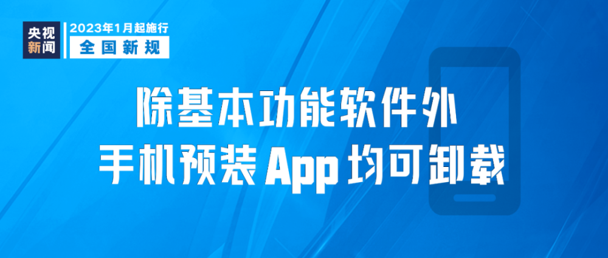

# 明天起，这些新规将影响你我生活

新修订的《铁路旅客运输规程》2023年1月1日起施行，明确实行车票实名制情况下，儿童旅客以年龄划分优惠标准。年满6周岁且未满14周岁的儿童应当购买儿童优惠票；年满14周岁的儿童，应当购买全价票。

2023年1月1日起，北京市、上海市、江苏省、浙江省、福建省、山东省、河南省、广东省、四川省、陕西省等10个省（市）将开展养老保险公司商业养老金业务试点，试点期限暂定一年。

2023年1月8日起，对新型冠状病毒感染实施“乙类乙管”。依据传染病防治法，对新冠病毒感染者不再实行隔离措施，不再判定密切接触者；不再划定高低风险区。依据国境卫生检疫法，不再对入境人员和货物等采取检疫传染病管理措施。

国务院联防联控机制发布中外人员往来暂行措施，2023年1月8日起，来华人员在行前48小时进行核酸检测，结果阴性者可来华；不再对入境人员实施全员核酸检测；分阶段增加国际客运航班数量，有序恢复中国公民出境旅游。

2023年1月8日起，国家移民管理局优化移民管理政策措施，有序恢复受理审批中国公民因出国旅游、访友申请普通护照，恢复办理内地居民旅游、商务赴港签注。

《基本医疗保险跨省异地就医直接结算经办规程》2023年1月1日起实施，明确参保人员完成异地就医备案后，在备案地开通的所有跨省联网定点医疗机构均可享受住院费用跨省直接结算服务。

《违法违规使用医疗保障基金举报奖励办法》2023年1月1日起施行，明确把针对所有违法违规使用医保基金行为的举报纳入奖励范围。同时将奖励金额上限由10万元提升至20万元，并设置了最低200元的奖励金额下限。

根据国家药监局关于实施药品注册申请电子申报的公告，自2023年1月1日起，申请人提交的国家药监局审评审批药品注册申请以及审评过程中补充资料等，调整为以电子形式提交申报资料，申请人无需提交纸质申报资料。

2023年1月1日起，我国将对咖啡机等1020项商品实施低于最惠国税率的进口暂定税率。2023年7月1日起，将对62项信息技术产品的最惠国税率实施第八步降税。

工信部、国家网信办进一步规范移动智能终端应用软件预置行为。2023年1月1日起，生产企业应确保移动智能终端中除基本功能软件外的预置应用软件均可卸载，并提供安全便捷的卸载方式供用户选择。

《上海市妇女权益保障条例》2023年1月1日起施行，明确禁止就业歧视，将性别歧视行为纳入劳动保障监察范围；明确对家庭暴力行为处置，把预防和制止家庭暴力工作纳入各地区、各单位平安建设工作范围。

修订后的《天津市全民健身条例》2023年1月1日起施行，明确天津市公共体育场地设施应当根据其功能、特点，按照国家和天津市有关规定向公众免费或者低收费开放。

《海西蒙古族藏族自治州冷湖天文观测环境保护条例》2023年1月1日起实施，明确在青海冷湖天文观测环境暗夜保护核心区内，严格控制光源种类和亮度，所有户外固定夜间照明设施的照射方向应当低于水平线向下30度。

新修订的《深圳经济特区医疗条例》在全国首次将患者“临终决定权”——“生前预嘱”写入地方性法规，于2023年1月1日施行，其中明确，医疗机构在患者不可治愈的伤病末期或者临终时实施医疗措施，应当尊重患者的“生前预嘱”。

