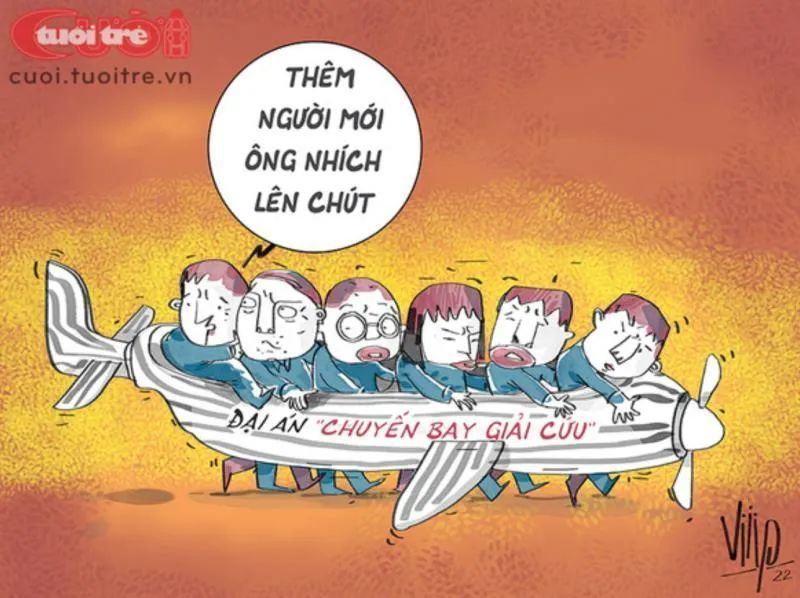

# 核酸腐败窝案之后，越南疫情包机也出事了，越共外交部长受处分

由官方指定和协调的一趟趟包机航班，将身处疫情危险中的海外越南公民送回祖国。这曾是越南对外高调宣传的人道主义行动，但随着越共中央总书记阮富仲亲自领导的反腐败运动深入调查，其“阴暗面”被全面揭开。

2022年12月27日，在阮富仲主持召开的中央政治局和书记处会议上，越共中央委员、外交部长裴青山及整个外交部党组受到纪律处分。自2022年1月越南警方带走外交部司局级官员开始，历时10个多月的“援助包机”腐败案，最终指向了涉案部门的最高层。

值得注意的是，裴青山也由此成为第三位在抗击新冠疫情期间因部门腐败问题遭处分的越共中央委员。此前，卫生部长阮青龙和河内市长朱玉英已因涉足核酸试剂腐败案，在2022年6月被捕并被开除党籍。

“这份（被处分）名单真的很震撼！就在人民最害怕、最担心生死之际，被告们却如此冷漠地迅速组织起来牟取暴利。”越南官方媒体《青年报》评论道，“原本的好政策被贪官玷污了。”

**“援助包机”的全链条腐败**

起初，这是一个模范的抗疫故事：全球新冠疫情爆发之初，越南政府就组织多部门协调安排航线和隔离措施，指定企业和航空公司承运包机，通过两年规划近2000架次“援助包机”，将来自60多个国家和地区的20多万越南公民接回国内。

直到2022年1月“援助包机”腐败案被揭开之初，越南外交部发言人仍表示，这是越南正确的人道主义政策，“世界上只有很少的国家做到这一点”。

在此过程中，不少搭乘“援助包机”的民众抱怨他们付出的机票价格超出平日的三四倍以上，后续隔离费用也比预想的更多。但运行“援助包机”的航空公司强调，他们并不看重利润，高票价是疫情背景下多方成本的总和。外交部官员则提醒民众“不要通过任何形式的中介”，直接乘坐政府安排的“援助包机”是最经济可靠的方式。

然而，腐败案揭开后的官方信息透露出，越南政府很早就发现有官员利用“援助包机”牟利。一起在2022年12月刚提起公诉的案件显示，早在2020年12月5日，越南海关缉私人员在金兰国际机场对一架来自俄罗斯的“援助包机”客机进行例行检查时，在货舱中发现700多瓶高档洋酒和400多箱电子烟。

_胡志明市官方报纸《少年报》就“援助航班”腐败案刊发的讽刺漫画：“援助航班”上的“腐败”乘客越来越多。_

调查人员介入后发现，这些总价值超过90亿越南盾（约合人民币264万元）的走私商品，是以数十件“托运行李”的名义分配在三名越南驻俄罗斯大使馆工作人员的名下。越南海关总署表示，有充分理由认定有外交部工作人员利用“援助”在俄越南公民回国之便，非法大量走私商品。

对“援助包机”的大规模官方调查在2021年底到2022年初开始。彼时，越南刚刚调整防疫政策，转向“与病毒共存”，并对国际开放。大规模核酸检测、大规模“援助包机”成为历史，并随即引发震惊朝野的两大反腐败案调查。

2022年1月，与越南核酸试剂腐败案调查同期，越南外交部领事司司长阮氏香兰及其副手成为因涉及“援助包机”腐败被捕的第一批政府官员。此后，多家航空服务公司、旅行社、投资咨询公司的高管接受调查。7月，公安部移民局多位负责官员被捕，“援助包机”腐败案的完整链条逐渐被揭开。

_越南媒体报道外交部领事司司长阮氏香兰（左）等人被捕。_

最初，“援助包机”腐败案的关注度不如核酸试剂腐败案，后者源自一家小型生物科技公司通过行贿垄断核酸官方购买市场，以抬高购买价格牟取暴利。该案已导致两名越共中央委员落马，40多位各省市疾控中心主要负责人被捕。

一些分析曾认为，核酸试剂腐败案主要涉及科技部、卫生部及各省疾控中心，是少数部门官员利用紧急状况下被赋予的特殊权力牟利。而“援助包机”由越南外交部、公安部、卫生部、交通部、国防部等多个部门及各地方政府协调完成，很难出现“全链条腐败”。

然而，历时约10个月的官方调查，结果惊人。截至2022年12月底，因在处理“援助包机”事务期间涉嫌受贿、滥用职权等罪名被逮捕的官员达30余人。这其中包括该行动的“中枢指挥”部门外交部的副部长苏英勇，越南副总理、前外交部部长范平明的助理阮光灵，以及外交部原副部长、侨务事务负责人、2018年到2022年任越南驻日本大使的武鸿南。

被捕的中层官员，包括外交部领事司、公安部移民局、交通部民航总局的相关负责人。他们决定了哪些企业有权参与到“援助包机”的运作中。涉嫌向他们行贿的旅行社和航空服务公司高管，也涉嫌向越南驻俄罗斯、日本、马来西亚、安哥拉等国使领馆的基层外交领事官员行贿。

在6月底的新闻发布会上，侦查人员表示，初步调查结果表明这些被告获得了“数百亿越南盾和数十万美元”的利益。这完成了从安排“援助包机”到设定“天价机票”、垄断越南公民“回家路”的过程。

当海外越南公民付出高额机票费用回到国内后，等待他们的还有另一条腐败链。2022年10月以来，越南政府已要求包括河内在内的多个省市政府，向“援助包机”腐败案的侦查人员提供入境越南公民隔离地点的选择和定价流程文件，提交所有参与选址、审查、签批工作的官员的名单。

官方媒体《青年报》指出，这意味着调查的扩大化阶段。12月22日，警方将河内人民委员会副主席（副市长）朱春栋（Chu Xuan
Dung）带走。在“援助包机”腐败案发生时，朱春栋是河内新冠防疫指导委员会主任。

_越南媒体报道河内市副市长朱春栋因涉“援助航班”腐败案被捕。_

越南媒体报道称，目前的调查显示，搭乘“援助包机”回国的越南公民在手续、机票、隔离上花费的费用是正常费用的5到8倍。公安部表示，扣除运营费用，腐败案的获利者每完成一次“援助包机”飞行就能收获超过十亿越南盾（约合人民币30万元），现有被告在整起事件中的获利估计将高达数万亿越南盾。

可以对比的是，越南核酸试剂腐败案涉及交易金额4万亿越南盾（约合人民币11亿元）、已确认的行贿受贿金额8000亿越南盾（约合人民币2.3亿元），被媒体称为“越南司法史上从未有过的巨额回扣”。

**打击防疫腐败需要“非常手段”**

核酸试剂腐败案和“援助包机”腐败案被先后揭开，越南官方媒体《少年报》评论称，人们之前对这些防疫行动的印象多美好，现在就有多心痛。

新南威尔士大学研究员阮海洪对《中国新闻周刊》指出，从腐败的形式上看，越南防疫腐败案件不仅牵涉到多名部长、涉案数额空前，更涉及多个部门、遍布多省，形成腐败链。“与以往的腐败窝案不同的是，这一次官员们不仅滥用自身职权，更滥用国家的紧急防疫政策，”他说，“这警示我们，在紧急状态下，由于难以及时得到适当的控制，腐败往往会系统地、大范围地发生。”

一些分析因而将此案称为“国家腐败”。“我能理解他们的逻辑，范围上这算得上‘全国性腐败’，但我认为在性质上并不是‘国家腐败’。”阮海洪说，“越南领导层不会容忍这种模式发生，但这确实展现出：未来腐败问题可能更加复杂、发生更加隐秘、更难被揭露。”

曾多次为越南各级政府提供顾问意见的国际越南事务专家、澳大利亚新南威尔士大学荣休教授凯雷·赛耶对《中国新闻周刊》指出，面对严峻的反腐形势，越南领导层在打击腐败的程序上也有颇多创新之处。

2021年12月20日，在核酸试剂腐败案被初步揭开后，阮富仲强调，公安力量需积极、主动、大力和有效参加打击消极腐败现象工作。值得注意的是，2021年9月，领导公安工作的越共中央政治局委员潘廷镯进入越共中央反腐败反消极工作指导委员会领导班子，担任常务副主任。此后，越南警方一直主导对核酸试剂腐败案和“援助包机”腐败案的调查。

此外，对阮青龙、朱玉英、裴青山的处分都没有等到越共中央全体会议召开再做出。阮青龙、朱玉英是在临时中央会议上被开除党籍。而在12月27日的政治局和书记处会议上，外交部原副部长、原驻日本大使武鸿南被开除党籍。

赛耶指出，过去的反腐运动中，开除高级官员党籍的决定往往集中等到越共中央召开全会时作出。越南公安部战略研究所原所长黎文强少将也对媒体解读称，通过临时中央会议开除中央委员的党籍，在越共的历史上还是第一次，是“前所未有的迅速、有力和果断的行动”。

在12月27日的会议上，越南前驻印度大使、驻马来西亚大使、驻日本大阪总领事和驻福冈总领事等外交领事官员，也受到从开除党籍到训诫的不同程度处分。

阮海洪说，越共中央自1994年“开始从决策层面重视反腐败斗争”，但2013年之前罕有高级官员因经济问题落马。阮富仲成为越共中央总书记后，于2013年兼任越共中央反腐败反消极指导委员会主任，就此开启以“熔炉”（Dot
Lo）为名的反腐运动。

截至2020年底，这场运动共查处经济犯罪案件1.17万余件，800多人被定罪，包括1名政治局委员和7名越共中央委员，另有多位政治局委员和中央委员受到不同程度处分。2021年，又有一名省委书记和一名副部长落马。同年，越南在“透明国际”的清廉指数排名中由104位上升到87位。

不过，黎文强指出，“当犯罪分子出现时，我们打击得很激烈。但对于如何限制腐败产生，我们做得还不足。加强预防才能根本地、长期地解决腐败问题，因此必须立刻改进预防腐败工作，让其和打击、处理已发现的腐败一样严厉。”

2022年11月，阮富仲再次公开批评处理贪污案件“进展缓慢”，要求各级部门采取更有力的行动。塞耶指出，当发现有政府官员利用应急防疫的空间谋取个人利益而无视公众健康，反腐可以让社会重拾对政府的信任。

记者：曹然

