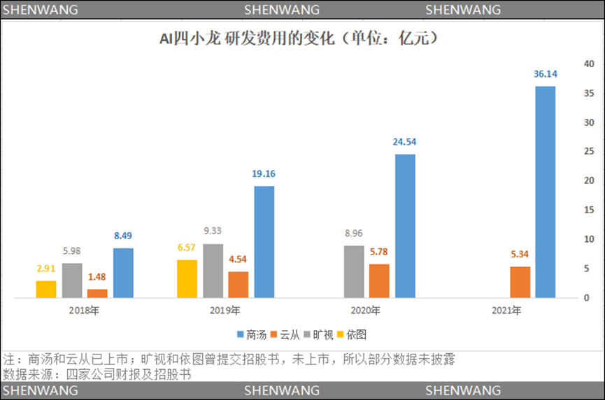

# 泡沫破灭，Ai四小龙烧了六百多亿后，如何熬过寒冬？

_来源：视觉中国_

作者丨叶蓁

编辑丨康晓

出品丨深网·腾讯新闻小满工作室

如今刷脸开门和刷脸支付在生活中已成为常态；流水线上的机器臂打孔和检测也成为一些工厂里的常规应用；而智慧安防使得一些多年的逃犯无处藏匿……诸多种种，当年关于AI的梦想似乎已经照进了现实。

产业维度，当下的AI产业已经经历了好几轮洗牌，一级市场的投资人也早已过了只看技术不谈商业落地的阶段，而在二级市场，大部分AI公司的招股书都宣告了其盈利遥遥无期，备受宠爱的AI独角兽们光环破灭。

AI独角兽企业曾经多受追捧，最典型的就是格灵深瞳的故事。当年的一个饭局上，真格基金的徐小平和红杉资本的沈南鹏、联创策源的冯波聊到格灵深瞳未来的估值。徐小平说，起码5000亿美元，沈南鹏说1000亿美元，争执中冯波给出了一个折中价格
3000 亿美元。

对估值的争论，也反映了投资人对AI抱有的极大期望，而技术赋能产业的广度和想象力也使得AI公司的估值水涨船高。

作为AI赛道中较为出圈的公司，商汤、云从、旷视、依图，被冠以“计算机视觉四小龙”的称号。他们赶上了AI的风口，也成为风口中资本的宠儿；资本退潮后一级市场的融资变得很难，二级市场推进也是极其不易，其招股书显示，财务上大幅亏损，商业模式存疑。

**整个2022年，AI四小龙饱受质疑——长期亏损、造血能力不足，都让曾经的资本宠儿们面临着诸多考验。**
商汤上市后蒸发了2000多亿港元，光环不再；而云从，上市后高开低走，创下历史新低。它们的表现也是二级市场对AI袪魅。

**《深网》梳理发现，这些明星独角兽大额度的亏损背后原因，其一，是研发费用的居高不下；其二，人工智能当下处于“弱人工智能阶段”，AI四小龙虽在安防领域大规模落地，但并不成熟；其三，商业落地场景仍需拓宽。**

纵观从2016年开启的人工智能元年，到现在6年时间，整个行业从风生水起到风平浪静再到当下回归到商业逻辑。曾经投资大佬的“饭局估值”看起来更像个梦想，当下，格林深瞳的市值只有47.74亿。关于未来，对AI四小龙来说，当下更多的考验是其造血能力。

**曾经的宠儿**

对AI四小龙来讲，他们的创始人基本都是出身名校，以技术见长，要么是知名实验室的负责人，而他们的履历都堪称“豪华”。

“半数英才在清华，清华半英在姚班”，旷视科技的三位创始人——印奇、唐文斌及杨沐，均出自姚班。2000年，
ACM将2000年度的图灵奖授予计算机科学家姚期智。2004年，姚期智归国加入清华大学任教授，于2005年创办了清华学堂计算机科学实验班，即“姚班”。

而依图科技的联合创始人朱珑是美国加州大学洛杉矶分校（UCLA）统计学博士。他先后在麻省理工学院人工智能实验室任博士后研究员、在纽约大学数学研究所担任研究员。

而商汤科技的CEO徐立，是香港中文大学的博士，也是香港中文大学多媒体实验室的骨干。云从科技的创始人周曦毕业于中国科学技术大学、美国伊利诺伊大学香槟分校，师承美国“计算机视觉之父”Thomas
S. Huang 黄煦涛教授。

2011年10月，在中国人工智能尚未觉醒的当下，印奇等三人共同出资成立了旷视科技。成立当年，旷视科技就获得来自联想之星和联想创投的数百万元天使轮融资。2012年，云从科技的创始人朱珑回国后很快就拿到了真格基金的天使轮融资。

2013年以后，人工智能在国内迅速发展，中国政府热情号召企业大力发展人工智能和智能机器人技术，资本加速涌入AI赛道。后来居上的“一哥”商汤科技就在这种背景下诞生了，它是含着金钥匙出生的。

2014年下半年，IDG
的牛奎光狂掷数千万美元，找到香港中文大学在计算机视觉领域已经颇有名气徐立。而徐立认为该年正是技术越过工业化红线时，商汤科技正式成立。周曦在 2015
年创办了云从科技公司，他回国后在中科院创立 AI 团队。

随之而来的融资热出现在人工智能领域，据 CB
Insights统计，2017年全球范围内AI领域共有152亿美元的投资，比2016年增加141%，其中中国公司吸引了约一半共计73亿美元的投资。

“在2014、2015年，如果你不提移动互联网，显得你特别low；2015年如果你不谈O2O，好像都不好意思去创投的所有场合；从2016年底到2017年初，如果你说话时口里不带着大数据，显得你多少有点不合群；2017年上半年，很多人连AI是什么都不知道，嘴里就挂着这个词到处讲。”这是猎聘网CEO戴科彬曾经关于各种创投泡沫的一线观察和体会。

2017年，创投界最热的是人工智能（Artificial Intelligence）。根据 CB
Insights统计，2017年全球范围内AI领域共有152亿美元的投资，比2016年增加141%，其中中国公司吸引了约一半共计73亿美元的投资。此时，AI成为投资人眼中的“香饽饽”。

2017年中国人工智能领域公开的融资案例就已经超过150起，其中商汤科技(B轮4.1亿美元+阿里15亿元投资)这样动辄上亿美元的大手笔，中国人工智能市场就在一片看好声中莫名其妙却又理所当然的成为了吸金大户。而AI四小龙，自然也是被资本追逐的独角兽。

亿欧智库《2018中国人工智能商业落地研究报告》显示，2017年中国AI创业公司累计获得超过500亿人民币融资，但其中商业落地前100强公司累计产生收入却不足100亿人民币。在整个产业链中，90%以上的AI企业依然处在亏损阶段，绝大多数企业年营业收不足两亿。

西南证券研报显示，自2019年以来，AI赛道投融资事件数下滑态势明显。AI四小龙也是从之所以从2019年开始冲击资本市场，一个很重要的原因是一级市场AI投资热的退潮；另外一个原因则是2019年10月以来，AI四小龙相继进入了美国商务部的“实体清单”。

**AI袪魅 跌下神坛**

往日呼风唤雨的AI四小龙们纷纷陷入窘境，亟待上市解渴，而二级市场又认为他们估值虚高。根据西南证券2020年的整理，商汤科技的估值达到100亿美元，旷视科技、云从科技、依图科技分别为50、42和40亿美元。

国金证券分析认为，投资方早期对于人工智能行业回报周期过于乐观，以及市场对当前创业型AI公司商业变现模式存疑，是近两年资本市场遇冷的主要原因。
**一级市场给AI四小龙的估值太高，这使得他们很难从一级市场继续获得融资，也导致了独角兽们的上市路的坎坷。**

2019年8月，旷视科技率先冲击港交所，次年9月转战科创板，科创板过会后，旷视科技在注册环节被问询，涉及数字安全和隐私伦理问题，接着又是财务资料失效，直到今年5月才重启上市程序。

几乎与旷视科技同时，云从科技与依图科技先后启动科创板上市辅导。2021年6月底，依图科技主动撤回A股上市申请。在那之前的8个月的IPO筹备期中，依图科技曾被两度中止IPO进程，分别与红筹架构和财务资料超过有效期有关。

而云从科技历经中止、多轮问询之后终于在今年4月获批注册。云从科技在2020年12月提交科创板招股说明书，期间频繁曝出裁员降薪，历经两轮问询，期间因科创板政策收紧，一度中止上市，而后柳暗花明。

AI四小龙中，IPO行动最晚的商汤科技最先上市。自2017年，关于商汤科技IPO的消息就有传出，而商汤科技在2021年12月14号被美国财务部列入黑名单，导致其港股上市的进程一度按下暂停键，商汤科技的上市从申请到挂牌仅用时4个月。

2021年12月30日商汤科技登陆港交所，商汤科技上市之初，也曾受到追捧，一度被打上“重振AI雄心”的标签。总市值最高3200亿港元，然而半年的解禁期一到，上市前的一些投资者和基石股份233亿股全部解禁，占公司总股本的70%。

当日商汤市值闪崩——一小时内跳水43%，收盘跌幅46.77%，收盘价3.13港元。此后的几个月一直震荡走低，10月中旬，盘中1.2港元/股的价格创上市以来的新低，总市值跌至405亿港币。

具体来说，商汤科技市值的暴跌击碎了许多投资者确立的技术信仰，他们渐渐看到了AI技术当前发展存有的局限；此外，上市之后的商汤科技没能向市场证明自己的盈利能力，股价跌跌不休，业内认为和商汤科技的盈利状况相关。

商汤科技披露招股书后，三年半（2018年到2021上半年）亏损243亿元登上微博热搜，而现在仅仅一年的时间，商汤科技这个亏损数据变成了409亿。

据半年报数据，2022上半年商汤营收为14.15亿元，同比降低14.3%，这是商汤上市以来营收首次出现下滑。利润方面，商汤依然亏损，2018-2021年，分别亏损34.3亿元、49.7亿元、121.6亿元、171.4亿元，2022上半年亏损32亿元，累计亏损高达409亿元。

不仅仅是商汤科技，招股书显示，2018年到2021上半年，旷视科技归母净亏损累计为146亿元；2017年到2020上半年，依图科技归母净亏损累计为73亿元；2018年到2020年，云从科技归母净亏损累计为22亿元。

商汤科技的亏损数据曾引发过“AI是不是一门好生意”的大讨论。

**AI四小龙早期的盈利模式趋同，主要是依靠国家安防。在这一领域，过往营收大头是大规模的摄像头的铺设，而当下，安防领域最初的红利已经消退。**

除了人脸安防，其它领域的落地还在探索期。旷视科技CEO印奇曾这样描述：“行业初期（AI企业）想要活下来，必须将所有的事情都做过，等到行业成熟，再退回来，选择最有价值的一环来做。”而这种早期，与整个人工智能的整个产业的发展相关。

**人工智能还处于早期**

1956年的夏天，一场主题为“如何用机器模拟人的智能？”的学术会议在美国达特茅斯大学召开。多年以后，这场会议被认定为全球人工智能研究的起点。现如今66年已经过去了，AI有两次引发了公众的关注。

1997年，IBM的超级计算机深蓝战胜国际象棋世界冠军卡斯帕罗夫，第二次则是2016年3月,AlphaGo在围棋人机大战中击败围棋世界冠军李世石，此后柯洁只能被称为“人类围棋世界第一”，AlphaGo是Google旗下AI创业公司DeepMind发布的人工智能围棋机器人。

AI再次焕发了新的活力，2016年被称为人工智能元年。但今天的AI系统是用大量的自动化试错训练出来的，每个阶段都需要通过一项称为反向传播的技术来反馈错误并调整系统，以减少将来的错误，从而逐步提高AI在特定任务上的表现。

目前可以大幅提升AI系统效率的方法，即所谓“深度学习”，主要就是以这种反向传播技术为基础，这项技术发明于20世纪60年代，并于20世纪80年代中期由Geoffrey
Hinton（被称为“神经网络之父”“深度学习鼻祖”）应用到神经网络。

有一个观点是：过去的30多年中人工智能并没有任何重大的概念进步——目前我们在人工智能研究和媒体上看到的大部分内容都是通过大量昂贵的计算硬件和复杂的公关活动渲染出来的。

因此，想要达到钢铁侠的智能管家“贾维斯”的效果，还有很长一段路要走。而“贾维斯”是一套集合了大数据分析、自动驾驶、语义分析、云计算等多种技术的智能平台。人工智能的产业链，分为基础层、技术层和应用层。

AI四小龙做的属于技术层的计算机视觉，在这一领域，中国要稍晚于全球，海外二十世纪90年代就出现了相关企业，在中国1999年才出现类似企业。计算机视觉企业让计算机拥有类似人类提取、处理、理解和分析图像以及图像序列的能力。

对计算机视觉企业来说，技术和数据缺一不可。从技术的维度来看，AI四小龙的创始人基本都是技术背景出身。而数据的获取过程中，图片识别在人工智能领域是非常困难的环节。

对于图片搜索引擎而言，多数图片都要由人工打标签，才能做进一步分析。以AI四小龙为代表的人工智能公司，在一些四五线城市里，有数以十万计的人们为AI打工。因此，一度人工智能公司被称为最费人工的公司。

“他们在人脸上标注几百个记号点，让计算机知道哪里是内眼角、外眼角，瞬间扩出大眼睛；他们录入的语音信息，被拆分标注后，能让智能音箱懂得“关机”和“十分钟后给我老公打电话”是什么意思，”GQ在一篇《那些给人工智能打工的人》的文章中描述。

此外，涉及到用户隐私的数据安全也是一个问题。2000年年初，人工智能初创公司Clearview
AI被黑，造成了美国最为轰动的AI公司数据泄露案——30亿人脸数据库。 **因为，仅靠一张脸部照片，就可以检索出全网所有的相关图片，包括照片的地址链接。**

**何去何从**

尚处于早期的技术，给人工智能企业的商业化落地带来了巨大的挑战。2020年，工信部赛迪研究院副总工程师、人工智能产业创新联盟秘书长安晖公布过一个数据，全球近90％的人工智能公司处于亏损状态，中国AI产业链中90％以上的企业也处于亏损阶段。

AI四小龙亦处于亏损阶段，且短期内无法扭亏为赢。这是因为当前人工智能应用转换路径长。AI应用的前提是构建反复训练的真实模型——编写精密算法、采集海量数据和花费大量时间去训练。因此，研发人员不断的增加。

而这点，体现在AI四小龙研发费用居高不下上。商汤财报显示，亏损的原因之一是研发费用占比高：根据招股书及业绩报告，商汤科技2019到2021年研发费用占营收的比重分别为63.3%、71.2%和76.9%，同期云从科技则分别为56.3%、76.6%和49.6%。

而旷视科技2018到2020年研发费用占营收比重分别为70%、74%和64.4%。依图科技营收相对不多，但研发费用占比最高，2017年到2019年分别达到146.4%、95.7%和91.6%。因此，对AI四小龙来说，一方面是研发占比高。

云从科技的招股书中表示，人工智能行业尚处于发展初期，相关技术及各应用场景的定制化解决方案迭代速度较快。这也解释了为什么AI企业研发费用一直居高不下，陷入了越亏损越投入的怪圈。

而这些都凸显了AI四小龙自身的造血能力不足。AI四小龙们在招股书的风险提示中也明确，公司营运资金仍在较大程度上依赖于外部融资，如未来经营发展所需开支超过可获得的外部融资，将会对公司的资金状况造成压力。

因此，当一级市场对独角兽热情不再的时候，进入2020年，只有依图科技进行过一轮融资。这种状况下，估值下降对独角兽而言就成了必然。

据胡润研究院发布的《2020胡润全球独角兽榜》：商汤科技、旷视科技、云从科技、依图科技依次排名，估值分别为500亿、300亿、200亿、140亿。四家公司中只有商汤科技的的估值相比于2019年都有所上升，估值从2019年的400亿上升到了2020年的500亿。

2020年7月，旷视科技印奇指出所有AI企业都已经步入到“死亡之谷”，也就是“泡沫破裂幻灭期”，“大家已经有很高的预期，当预期往下回落的时候，到底哪个AI企业能穿越死亡之谷，大家都很难预测。”

一年后，2021年6月，AI企业第四范式创始人兼首席执行官戴文渊在公司年度峰会上表示，“现在几乎没有企业不用到AI的技术，但是如果说哪个企业把AI拿掉后活不下去，这样的企业也很少。这是我们认为人工智能最大的挑战。”

中南财经政法大学数字经济研究院执行院长盘和林在接受媒体采访的时候表示：大多数硬件行业细分领域都存在强劲的竞争对手，徒有算法和AI平台优势，但却类似“拿着金饭碗讨饭”。

这也是当前AI全行业的窘境。无独有偶，工程院院士倪光南也曾公开表示：发展技术的同时要敬畏市场，要为产品构建一个良性循环的“生态”，就是“有人用，用的过程中改进，改进后有更多人用，然后用的过程中再促使它改进”。

现在整个行业的高光时期已过，整个赛道已进入冬天，资本把更多的热情投入到硬科技领域，冲击过IPO的AI的四小龙们，重新调整了定位。云从科技主打人机协同操作系统，旷视科技进军AI物联网，依图科技发力芯片，商汤则讲述平台化的故事。

今年一季度，商汤科技成立了智能汽车事业群，拓展AI技术落地的新场景，而该业务在2021年已经实现了1.84亿的营收；而云从科技，则讲起了元宇宙的故事。关于未来，资本退潮后，更多的考验的是AI四小龙们的商业化运营的能力。

**腾讯新闻出品内容，未经授权，不得复制和转载，否则将追究法律责任。**

