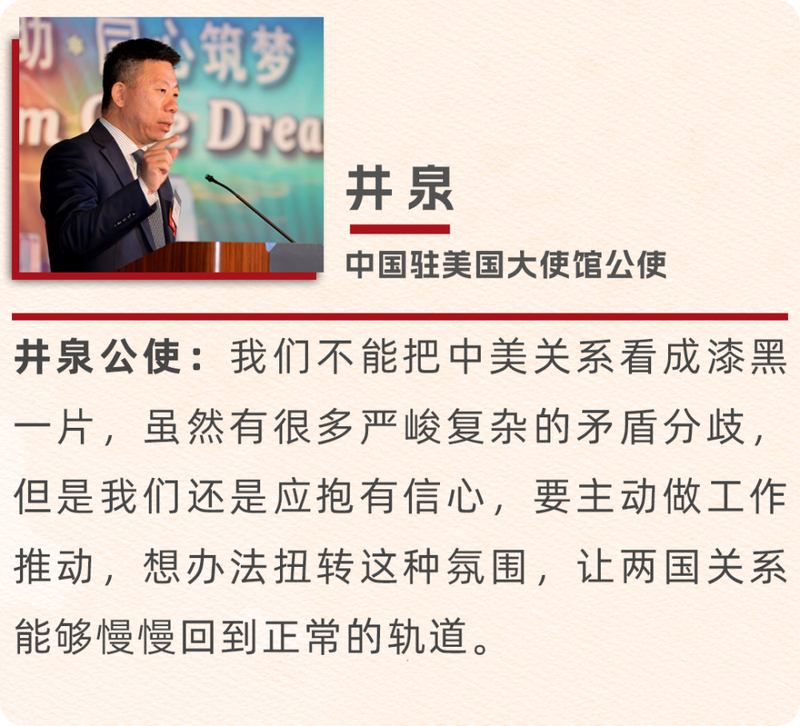
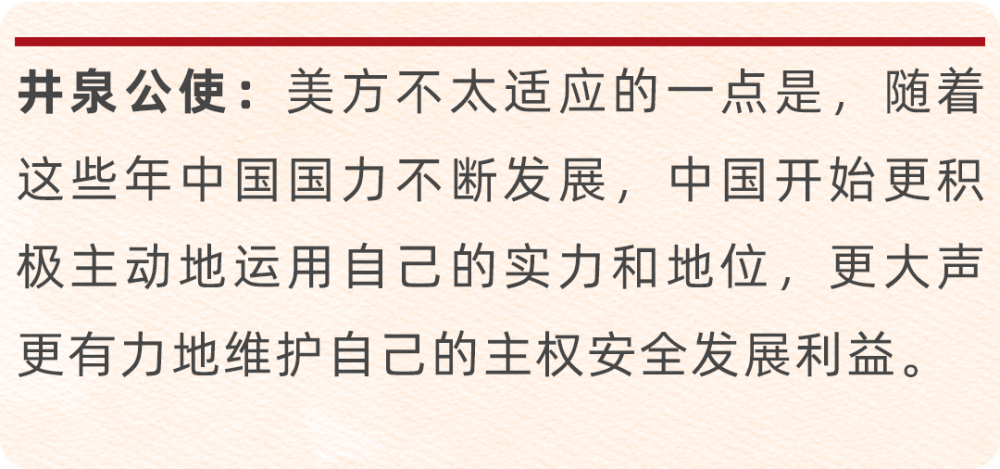
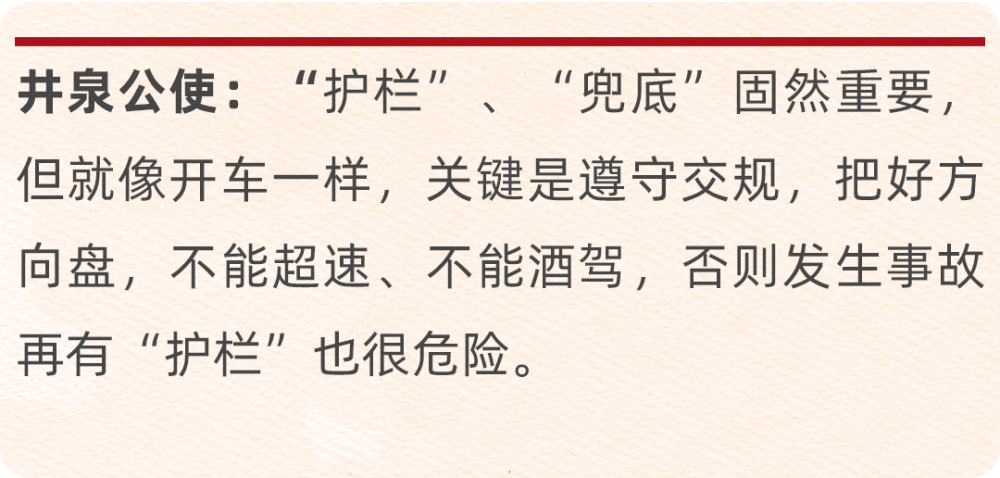

# 独家对话驻美国一线外交官：现在是滚石上山，不能松手

很快，我们就要告别2022年。回看这一年，大国关系的稳定，越发攸关全球命运，中美关系作为当今世界最重要的双边关系之一，亟需重回健康稳定发展的轨道。今年，中美关系不乏起伏变化，甚至还有试探红线后的针锋相对。但是，在元首引领之下，中美关系一些积极的变化也在出现，何去何从，事在人为。驻美国的一线外交官是最有发言权的当事人之一，谭主近日同中国驻美国大使馆公使井泉探讨究竟该怎样看待复杂的中美关系？又该如何与美国相处？他用了一个词，“滚石上山”。这四个字背后有什么意味？来看谭主与他的对话。

**谭主：我们看到本届美国政府对华战略竞争、遏制、打压在不断加剧，面对越来越多斗争的时候，或者是美国政府态度越来越恶劣的时候，外交官在一线是怎么克服困难的？**

这是我第三次在美国工作和生活。第一次是十八年前，2004年我作为访问学者，在这儿待了一年，那时美国各界都在讨论中国的发展，去参加研讨会，哪怕是在讨论日本、中东，讨论着讨论着就全来讨论中国了。

中国的发展对美国和世界意味着什么？美国对这一点非常关注，在某种程度上已经开始防范和疑虑了。

第二次是2009年我来美国常驻，那是奥巴马政府的第一个任期。特别是2010年中国第一次超过日本，成为第二大经济体，能明显感觉到美方对我们心理上的疑虑上升了，而且双方分歧真的是挺多。

我去年再来美国常驻，明显感觉到氛围变得僵冷，这边整个注意力转向怎么样去联合盟友，怎么样去找中国周边的国家谈，怎么样向中国施加压力，改变中国所谓的外部战略环境，怎么样通过制裁施压，来让中国就范，怎么样来防范中国的发展崛起、高科技的突飞猛进。重点已经发生变化了，美国从过去的心理思想上的疑虑转化为政策和行动了。

所以在这里工作很难。

我们有4个字叫“滚石上山”，感觉像推着大石头在上山，很难很累，想推上去但推不上去，还不能松手，这样至少还可以停在山腰，因为一松手石头就会滚下来，前功尽弃。

我们希望两国关系更稳定发展，给两国带来更多利益，而不是让中美发生战争、发生冲突，相互隔绝，相互对立，走向新冷战。

到美地方上去看，大家的态度千差万别，但总体上老百姓还是比较质朴友好的。

首先，他们希望加强对华经贸合作，这是实实在在的利益。第二，希望中国大使馆可以多介绍一些中国的老师，到美国教授汉语。这些都是很实际的需求。

不能把中美关系看成漆黑一片，虽然有很多严峻复杂的矛盾分歧，但是我们还是应抱有信心，要主动做工作推动，想办法扭转这种氛围，让两国关系能够慢慢回到正常的轨道。

正常轨道不是说双方没有分歧、一片大好，而是商人做生意，不用担心受到各种打压；学生到对方国家去学习，不用担心种族歧视和麻烦。

对于敏感的问题，可以坐下来谈，即便一时找不着解决办法，至少能管控起来。不是说什么问题都没有，那是不可能的。

中美关系永远是解决了老问题，又出来新问题，是在不断解决问题、克服困难中发展前行。所以不管怎么样，要努力，要保持信心。

**谭主：这几年我们经常听到美方攻击中方外交政策，您的感受是什么？**

我觉得美方不太适应的一点是，随着这些年中国国力不断发展，中国开始更积极主动地运用自己的实力和地位，更大声更有力地维护自己的主权安全发展利益，但这在本质上仍然是防御性的。我们不会去侵略、霸凌、胁迫、剥削他国，但别国无论大小，也不要想来欺负和胁迫中国。

二十大报告明确指出，中国发展的根本要义是让中国人民过上更好的日子，一个和平稳定的外部环境至关重要，我们致力于同世界各国发展友好关系。这就是我们真实的战略意图，我们是这么说这么想的，也会继续这么做下去。

我们希望在国际上把朋友搞得多多的，无意挑战、威胁、取代或主导他国。美方一方面说中国从现行国际体系中获益最多，一边又说中国要挑战重塑国际秩序，这是自相矛盾的。

中方对美政策没有变，相互尊重、和平共处、合作共赢，同时我们也会坚定维护自己的根本利益。美国把中国视为“最重大的地缘政治挑战”，渲染“民主对抗威权”，这是对中国战略意图的严重误判。

**谭主：美方经常拿人权、新疆、香港、防疫、网络安全、南海等说事，对我们进行各种指责抹黑。使馆在前方和美方接触交流中，这些问题会经常谈到吗？**

经常谈，甚至是激烈的交锋和争论。

说到人权，我有时向美方指出，美国一年4万多人死于枪击，包括校园里的孩子们，10万人死于芬太尼滥用，大街上无家可归的人越来越多，美最高法院剥夺了3600万育龄妇女堕胎权，美发动的“反恐战争”造成33.5万平民死亡。美方怎么那么有底气和我们大谈人权、民主、自由？

民主自由不能建立在别人的不自由不安全之上。

民主不在于谁能冗长性辩论，而是谁能更广泛更有效地解决问题。

各国发展道路、政治体制不同，中国从不当“教师爷”，也不提供“教科书”，但美国也不能总把自己当世界的“教师爷”。

我们在新疆所做的就是反对恐怖主义和分裂势力。我们在香港所做的与美方对待2021年1月6日占领国会山事件并无本质差别。我们在南海自己岛礁上建设防御设施，正当合理，每年约有10万艘船只在南海航行，有谁能举出哪怕一个例证说明南海航行自由受到干扰了吗？

至于网络安全，是谁在全球大规模实施网络攻击窃密监听，甚至连盟国领导人的手机都不放过？

中美都有自己的国情和现实问题，双方都应致力于把自己的事情办好，在此基础上可以向对方提出一些善意、建设性的建议，但注意不要插手、干涉别人的内政，甚至给对方出难题。

**谭主：我们总听到美方说要对华开展竞争，又说要负责任地管控竞争，避免冲突对抗，要为两国关系装上“护栏”、“兜底”，拜登总统最近在中美元首会晤中作出“五不四无意”的承诺，您是怎么看这些表态？**

竞争有时不可避免，但应该是基于规则的良性、健康竞争，就像田径比赛一样，在竞争中相互激励、共同提高，大家都变得更快更高更强。但不能拽胳膊、使绊子，更不能演变成你死我活的格斗赛。

竞争并不能定义全部的中美关系，两国关系的主流还是对话、协调与合作，而且良性竞争与恶性竞争乃至冲突对抗之间的界限也很模糊，很难把握操控。

“护栏”、“兜底”固然重要，但就像开车一样，关键是遵守交规，把好方向盘，不能超速、不能酒驾，否则发生事故再有“护栏”也很危险。我们重视美方作出的各项承诺，但要言行一致，希望这些承诺能真正体现在政策上，落实到行动中。

**谭主：几个月前，美众议长佩洛西窜访台湾引发了中美之间一场危机。但美方似乎并未吸取教训，最近还在说支持佩洛西窜台的权利，是中方反应过度了。新的美众议长候选人已公然声称他就任后也会率团窜台，届时中美关系是不是又会面临困难？**

台湾是中国的台湾，不是美国的台湾。台湾问题是中国核心利益中的核心。

维护国家统一和领土完整，我们会在所不惜。

我们当然希望尽最大努力实现和平统一，但也不会承诺放弃使用武力，保留采取一切必要措施的选项。

过去二十几年里，美众议长没有一个人访台，为什么？因为他们知道这是一条不能碰的红线。佩洛西众议长非要去，我们劝她要谨慎，不然会有后果，她不听劝还要去，那就出现后果了。我们说话算数。

美方说中方反应过度，这就太没道理了，要搞清楚谁在找事、挑衅、破坏台海和平稳定现状，谁在阻止、反制、维护台海和平稳定现状？换位思考，假如夏威夷要从美国分裂出去，中国通过“与夏威夷关系法”，出钱出枪出力支持夏威夷和美国对着干，派高官去夏威夷说：放心，我们站在你们一边。美方又会作何感想？

反恐是美国的首要关切，如果哪个国家袒护包藏杀害美国人民的恐怖分子，而且声称这就是他们的政策和权利，与美国无关，可能美方早就各种手段一起上了。

国与国关系和人与人关系一样，要有最基本的尊重。你非要在别人最关心最核心利益问题上采取挑衅言行，非要挑战、激怒对方，那冲突就很容易发生。

台湾问题是重大原则性问题，没有任何商量妥协退让的余地。这个问题也是最容易把中美引向冲突的燃爆点，事关战争与和平，要非常谨慎、负责任地管控和处理。

美方多次表示坚持一个中国政策、不支持“台独”，不支持“一中一台”、“两个中国”，也不会“以台制华”，我们希望这不仅仅是说说而已。

**谭主：我们看到这几年美方不断在高科技领域对华设限，继10月7日出台对华芯片限制措施后，最近又禁止华为、中兴、海康威视等产品在美销售，洛杉矶港扣留了6000多个集装箱的中国光伏产品。据说下步美还可能成立“国家关键能力委员会”，加紧对华投资审查，并在量子计算、人工智能、生物科技、生命科学等领域采取新的对华设限措施。与此同时，美方还不断指责中国侵犯知识产权，损害公平竞争环境，未落实加入WTO承诺。您怎么看中美经贸关系的前景？**

我们经常讲的有三句话：一是国家安全很重要，但不能泛化和夸大，不能什么都是国家安全，事事都与国家安全关联，要在国家安全、经济发展、外交政策等之间找到平衡点；二是中美经贸合作本质是互利共赢，要为双方企业营造公平良好的营商环境，不能把经贸问题政治化甚至武器化；三是人文交流是两国关系的根基和希望，不能被妖魔化仇视化。

这几年美国在对华政策某些领域走得太过，已经形成了“寒蝉效应”。

去年中国对美投资降了52%，2000多名学习STEM（科学、技术、工程和数学）专业的中国学生被拒签，“中国行动计划”导致1400多名华裔科学家被迫离美，今年1-10月中国来美留学生签证数量同比下降38%，已有1100多家中国企业被列入美各种制裁限制清单。

美方应该作一个冷静全面的反思，因为这些问题会对美自身利益造成反噬。

关于高科技领域对华设限。这基本已是美方既定战略，未来可能会有更多的收紧措施和限制措施。

美方当然也会为“脱钩”付出代价，据说芯片对华限制措施就会让美相关企业损失至少100亿美元，但美方认为即便付出些代价也是值得的，今后想付出代价可能都来不及。所以我们必须面对现实，自信自立，迎难而上，攻坚克难，立足于把自身做强做大。

中国有自力更生、自强不息的精神和传统，外部打压和遏制只会激发我们自主创新的意志和热情，倒逼中国在高科技领域实现更快更好的高质量发展。

同时我们也支持企业拿起法律武器捍卫自己的合法权益，此前三一重工、小米、微信等起诉美政府案均获胜。

我们会继续高度重视保护知识产权，去年中国共授权发明专利69.6万件。

在履行入世承诺方面，中国是做得最好的。当时我们承诺将关税水平降到9.8%，现已降至7.4%。我们会继续欢迎外商赴华投资，并为他们提供良好营商环境，国家发展改革委最近颁布的15项措施就是例证。

中国有4亿中等收入群体，未来可能扩大到8亿。

中国巨大的现实和潜在市场对美国而言是难得的机遇，美国不来，别的国家都会来，共同分享中国发展的红利。

**谭主：现在国内民间、各界对中美关系有很多不同声音，很多人认为美不能一边损害我们利益，一边又想和我们合作。您认为今后应该如何看待和处理中美关系，有什么特别需要注意的？**

首先，要保持开放、自信、淡然的心态。双方隔着巨大的太平洋，没有主权领土之争。美国经济好同样对中国也是机遇。

但如果我们的利益受到损害，内政受到干涉，制度受到挑战，形象受到抹黑，那也不能客气手软，该怎么办就怎么办，口头对口头，行动对行动。

第二，要想办法把合作做大，把利益联系拉紧，增加外界对中美关系的信心和正面预期。

我常问美国人，你们究竟是把中国视作朋友伙伴还是敌人对手？

如果是敌人对手，又如何解释7500亿美元贸易额、2400亿美元双向投资、284对友好省州和城市、疫情前每年500多万人员往来、7万家在华美企、3000多家在美中企以及各领域广泛合作这些基本事实？

中美建交之初，美国有技术和资金，中国有劳动力和市场，双方是天然合作伙伴。

近年来，情况是有些变化，比如中国劳动力成本也在上升，但双方优势互补的基本结构并未改变，互利合作的潜能仍然巨大。

中国正积极推进养老产业、抗癌研发、国家公园、公共卫生等民生领域发展，美国拥有丰富经验，双方完全可以找到新的合作增长点。

过去中美曾一同帮助非洲国家抗击埃博拉，向东帝汶提供粮援，在东南亚一些国家建立联合地震勘测项目。当前能源安全、供应链安全、粮食危机、气候变化、乌克兰危机、朝鲜半岛等问题非常突出，中美加强协调合作只会让世界更加安全。

当然合作也需要合适的大环境大氛围，中美可以争论激辩，也可以握手合作，但不能一边握手、一边背后捅刀，不能一边损害中方核心利益，一边要求中方在美方关心的问题上予以支持配合。

第三，要避免滑向“新冷战”。求同存异，和而不同。

中美人口占全球人口近四分之一，如果双方陷入“新冷战”甚至热战，中美关系演变为冷战时期的美苏关系，两国、地区和世界都会深受其害，没有人能从中获益。

**谭主：11月8日至16日，中国人民外交学会会长王超率团访问美国纽约，举行中美前政府官员和工商界人士对话、中美知名人士论坛第四次会议，与美国媒体记者座谈等活动。这好像是近几年中美之间首次举办类似的面对面交流活动。这样的线下交流对当前中美关系有怎样的特殊意义？**

我问过好些美国朋友，他们上次访华是什么时间。大多数人说是2019年。也就是有3年时间双方很多人没有进行过面对面交流。就算是朋友也会变得生疏。

有位美国大学教授告诉我，他曾在华学习生活过7年，自认为还是比较了解中国的，但近几年没有实地赴华考察，天天听着美国媒体、政客说中国这不好、那不好，之前多年形成的对华认知难免也会发生动摇。

这说明双方存在严重的沟通交往赤字，都渴望更深入直接地与对方了解互动。

你提到的外交学会代表团访问效果非常好，双方有激烈争辩，也形成一些基本共识。

中美在很多问题上有分歧，没有必要强迫对方接受自己的看法、价值观，也没有必要装作在某个问题上看法一致。我们就是两个不同的国家，有话好好说，有矛盾分歧就摊开了摆在桌面上谈，想办法搞清楚对方政策行为背后的真实逻辑动机，避免误解误判。

有人鼓吹“对话无用论”“接触失败论”，对话接触未必马上能解决问题，但如果连面都不见，谈都不谈，又怎么可能达成协议、解决问题？隔空喊话、制裁施压只会产生反效果。

中美元首最近在巴厘岛成功会晤，一致同意进一步加强两国沟通交往和在经贸、宏观经济政策、公共卫生、农业、气变等一些重要领域合作。

我们希望双方今后多一些交往，少一些隔阂；多一些沟通，少一些误解；多一些理解，少一些猜忌。

作为身处一线的外交官，我们的职责是让中美关系更加稳定，而不是不断恶化甚至螺旋式下滑。我们会继续努力，但这也不完全取决于中方的努力。

