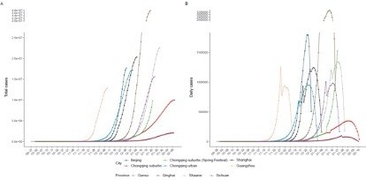

# 研究：上海有30个奥密克戎毒株，已收治患者中3.03%为重症危重症

为评估调整疫情防控措施之后奥密克戎毒株在境内的传播模式、有症状感染者中重症患者可能比例、以及此波疫情在大城市和中西部农村的走势，中国工程院院士、上海交通大学医学院附属瑞金医院、转化医学国家重大基础设施（上海）陈赛娟团队与上海市公共卫生临床中心范小红团队联合攻关，在Frontiers
of Medicine发表研究论文《初步分析我国2022年秋冬新冠疫情中奥密克戎亚型多样性与流行病学特征》（Primary assessment of
the diversity of Omicron sublineages and the epidemiologic features of
autumn/winter 2022 COVID-19 wave in Chinese mainland）。

研究团队对2022年秋冬期间上海公卫中心收治的患者中随机抽取的378例样本进行基因组测序，发现主要毒株包括BF.7、BA.5.2和近期欧美地区出现的BQ.1及XBB，尚未发现新的新冠病毒变异株。

研究团队对2022年9月1日至2022年12月26日期间上海公卫中心收治的5706名有症状新冠病毒感染患者临床演变进行了分析，3.03%的患者发展为重症/危重症。

_新冠病毒全基因组序列研究，95.95%的基因组序列集中在5个奥密克戎亚系。本文图片
交大医学院供图_

研究结果提示：随着疫情演变带来的病毒传播途径的变化，多个奥密克戎亚型在国内同时传播，近期出现新冠病毒感染症状的人群中，重症主要集中在有基础疾病的老年人群体。元旦之后到春节期间，新冠疫情将主要影响农村和中小城镇地区。值得特别关注的是，国内农村和中小城镇地区医疗资源相对匮乏，且有大量老年人和有基础疾病人群，春运期间城市和农村人口流动性将极大影响疫情走向。

**重症主要集中在有基础疾病的老年人群体**

在论文中，研究团队对2022年秋冬期间上海公卫中心收治的患者中随机抽取的378例样本进行基因组测序，获得369个高质量新冠病毒全基因组序列。

研究分析发现，这些病毒基因组中共包含全球共享所有流感数据倡议（GISAID）数据库里记录的30个奥密克戎亚型毒株，其中355个（95.95%）基因组序列集中在5个奥密克戎亚系，主要毒株包括已报道在北京和广州等地流行的BF.7和BA.5.2和近期欧美地区出现的BQ.1和XBB。

结合感染者的旅行史和感染接触史，证明有北京或广州疫情接触史者分别主要携带BF.7和BA.5.2亚株；从海外入境上海的感染者主要携带BQ.1和XBB；而上海本地感染者中除了BA.5.2以外，还有多个奥密克戎亚株相对占比较高。这些结果中尚未发现新的新冠病毒变异株。

由于抗击新冠感染的任务已经转为防治重症为主，研究团队依据公开信息，对此波疫情截止到2022年11月29日的重症/危重症患者数和感染者总数变化情况进行分析，发现重症/危重症人数随感染者人数增长而增加，比例达到0.035%。

根据一般规律，高危人群在入院2-3周后演变为重症/危重症患者。研究团队对2022年9月1日至2022年12月26日期间上海公卫中心收治的5706名有症状新冠病毒感染患者临床演变进行了分析。

经过综合医学观察和诊断，其中5533名患者表现为轻型和普通型（总占比96.97%），其余173名患者进展成重症/危重症（总占比3.03%），其中包括20名仅有新冠感染者（0.35%）和153名伴有由新冠感染而加重的基础疾病患者（总占比2.68%）。此外年龄偏高者（55-60岁以上）和男性患者发展为重症/危重症的风险显著增高。

_研究团队利用数学模型，初步预测奥密克戎疫情走向。_

**研究预计元旦后至春节期间疫情主要影响农村和中小城镇地区**

这一论文还利用数学模型，初步预测奥密克戎疫情走向。

基于此前北京、广州、上海、重庆等地常规核酸检测的感染者数据，这一研究建立模拟感染者数量变化曲线的数学模型，对近期疫情发展趋势进行评估和预测，初步判断此轮奥密克戎疫情感染人数于2023年元旦前后在上述主要城市趋于平缓。

然而，基于重庆市主城区和郊区数据的数学模拟分析，提示疫情峰值在郊区有所延后，且其感染峰值将在春运期间因疫情扩散加速而显著增强。

对于四川、陕西、甘肃、青海等省，在不计省会城市的地区对疫情进展情况进行预测，估计农村和中小城镇地区的感染峰值将于2023年1月中下旬出现，由于春运原因，这些峰值也可能提前到达。

研究团队分析结果提示：元旦之后到春节期间，新冠疫情将主要影响农村和中小城镇地区。值得特别关注的是，国内农村和中小城镇地区医疗资源相对匮乏，且有大量老年人和有基础疾病人群，春运期间城市和农村人口流动性将极大影响疫情走向。

因此，当前急需为奥密克戎疫情向农村地区扩散启动应急计划，将更多医疗资源配置到农村基层，做好有效药物和新型疫苗的应急使用许可，做好抗新冠病毒特异药物及辅助性药物、疗效确切的中药的生产储备、分配和临床合理使用。同时，要实施分类、分层治疗，加强中小城镇重症救治能力，继续精准用好非药物性公共卫生措施（在室内空间佩戴N95口罩、保持社交距离、公共交通工具适当增加班次以避免人群过于拥挤等），努力削减疫情峰值，缓解医疗系统和医务人员的沉重压力。

另外，研究团队认为，还要继续做好高危人群全程免疫接种，启动高风险人群的第四针免疫加强针接种；加强个人家庭防控知识技能普及，做好健康宣传和风险沟通，保护人民群众特别是困难群体的生命健康，确保我国平稳走出疫情，促进社会经济有序恢复发展。

