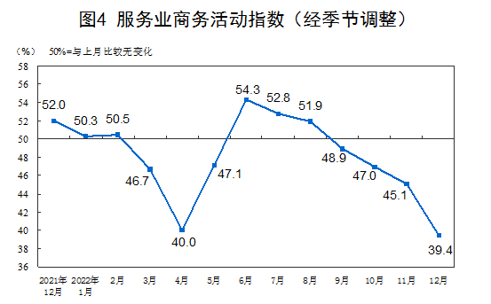
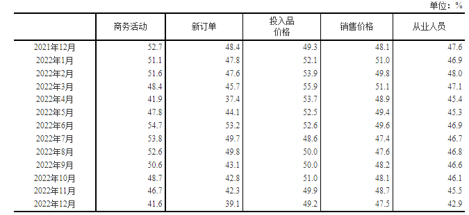
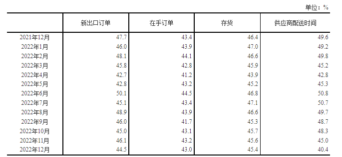
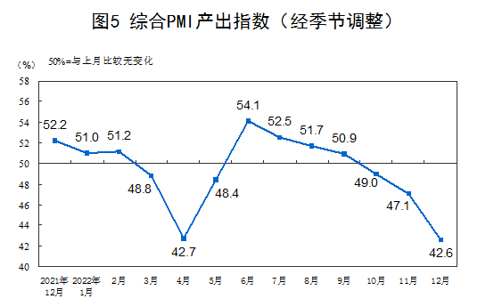

# 统计局：12月制造业PMI降至47.0% 企业员工到岗率明显不足

**【统计局解读】**

国家统计局：12月受疫情冲击等因素影响，中国采购经理指数比上月有所下降

**一、中国制造业采购经理指数运行情况**

12月份，制造业采购经理指数（PMI）为47.0%，比上月下降1.0个百分点，低于临界点，制造业生产经营景气水平较上月有所回落。

从企业规模看，大、中、小型企业PMI分别为48.3%、46.4%和44.7%，比上月下降0.8、1.7和0.9个百分点，均低于临界点。

从分类指数看，构成制造业PMI的5个分类指数均低于临界点。

生产指数为44.6%，比上月下降3.2个百分点，表明制造业生产继续回落。

新订单指数为43.9%，比上月下降2.5个百分点，表明制造业市场需求持续减少。

原材料库存指数为47.1%，比上月上升0.4个百分点，表明制造业主要原材料库存量降幅有所收窄。

从业人员指数为44.8%，比上月下降2.6个百分点，表明制造业企业用工景气度降低。

供应商配送时间指数为40.1%，比上月下降6.6个百分点，表明制造业原材料供应商交货时间有所延长。

表1 中国制造业PMI及构成指数（经季节调整）

表2 中国制造业PMI其他相关指标情况（经季节调整）

**二、中国非制造业采购经理指数运行情况**

12月份，非制造业商务活动指数为41.6%，比上月下降5.1个百分点，低于临界点，非制造业景气水平有所下降。

分行业看，建筑业商务活动指数为54.4%，比上月下降1.0个百分点。服务业商务活动指数为39.4%，比上月下降5.7个百分点。从行业情况看，航空运输、电信广播电视及卫星传输服务、货币金融服务等行业商务活动指数位于52.0%以上景气区间；零售、道路运输、住宿、餐饮、居民服务等行业商务活动指数低于35.0%。

新订单指数为39.1%，比上月下降3.2个百分点，低于临界点，表明非制造业市场需求有所减少。分行业看，建筑业新订单指数为48.8%，比上月上升1.9个百分点；服务业新订单指数为37.4%，比上月下降4.0个百分点。

投入品价格指数为49.2%，比上月下降0.7个百分点，低于临界点，表明非制造业企业用于经营活动的投入品价格总体水平有所下降。分行业看，建筑业投入品价格指数为51.2%，比上月上升2.5个百分点；服务业投入品价格指数为48.9%，比上月下降1.2个百分点。

销售价格指数为47.5%，比上月下降1.2个百分点，低于临界点，表明非制造业销售价格总体水平继续下降。分行业看，建筑业销售价格指数为50.0%，比上月下降0.9个百分点；服务业销售价格指数为47.0%，比上月下降1.3个百分点。

从业人员指数为42.9%，比上月下降2.6个百分点，表明非制造业企业用工景气度回落。分行业看，建筑业从业人员指数为45.7%，比上月下降1.4个百分点；服务业从业人员指数为42.4%，比上月下降2.8个百分点。

表3 中国非制造业主要分类指数（经季节调整）

表4 中国非制造业其他分类指数（经季节调整）

三、中国综合PMI产出指数运行情况

12月份，综合PMI产出指数为42.6%，比上月下降4.5个百分点，低于临界点，表明我国企业生产经营活动总体有所放缓。

**12月份中国采购经理指数回落**

****

**——国家统计局服务业调查中心高级统计师赵庆河解读2022年12月中国采购经理指数**

2022年12月31日国家统计局服务业调查中心和中国物流与采购联合会发布了中国采购经理指数。对此，国家统计局服务业调查中心高级统计师赵庆河进行了解读。

12月份，受疫情冲击等因素影响，中国采购经理指数比上月有所下降，其中制造业采购经理指数、非制造业商务活动指数和综合PMI产出指数分别为47.0%、41.6%和42.6%，我国经济景气水平总体有所回落。

**一、制造业采购经理指数低于上月**

12月份，制造业PMI降至47.0%，比上月回落1.0个百分点。

（一）产需两端有所下降。疫情对企业产需、人员到岗、物流配送带来较大影响。12月份，调查的制造业企业中反映受疫情影响较大的企业比重为56.3%，高于上月15.5个百分点。生产指数和新订单指数分别为44.6%和43.9%，低于上月3.2和2.5个百分点，制造业生产活动继续放缓，产品订货量有所下降。同时，供应商配送时间指数降至40.1%，部分调查企业反映受疫情影响，物流运输人力不足，配送时间有所延长。

（二）价格指数均有回升。主要原材料购进价格指数为51.6%，高于上月0.9个百分点，制造业原材料采购价格总体水平有所上涨；出厂价格指数为49.0%，高于上月1.6个百分点，产品出厂价格总体水平降幅有所收窄。本月不同行业价格走势差异明显，其中农副食品加工、石油煤炭及其他燃料加工等行业两个价格指数均低于45.0%，企业原材料采购及产品销售价格均较上月有所下降；黑色金属冶炼及压延加工、有色金属冶炼及压延加工等行业两个价格指数均位于55.0%以上高位，价格上涨明显。

（三）从业人员指数继续下降。受疫情短期影响，制造业企业员工到岗率明显不足。从业人员指数降至44.8%，低于上月2.6个百分点，下拉本月制造业PMI
0.5个百分点。同时，反映劳动力供应不足的企业比重高于上月6.5个百分点。

（四）民生相关行业PMI继续扩张。本月制造业PMI虽有所回落，但农副食品加工、医药等与民生密切相关的行业PMI继续保持在扩张区间，为经济社会恢复发展提供了有力保障。

同时，调查中多数企业认为，随着疫情形势逐步好转，后期市场走势有望回暖。

**二、非制造业商务活动指数回落**

12月份，非制造业商务活动指数为41.6%，比上月下降5.1个百分点，非制造业景气水平继续回落。

（一）服务业景气水平回落。12月份，调查的服务业企业中反映受疫情影响较大的企业比重升至61.3%，高于上月10.0个百分点。商务活动指数降至39.4%，低于上月5.7个百分点，服务业市场活跃度明显降低。在调查的21个行业中，有15个位于收缩区间，其中零售、道路运输、住宿、餐饮、居民服务等接触性聚集性行业商务活动指数均低于35.0%，行业业务总量明显回落。随着进一步优化落实新冠肺炎疫情防控十条措施等政策落地生效，加之春节临近，国内及国际客运航班执飞量均明显恢复，航空运输业商务活动指数升至60.0%以上高位景气区间；电信广播电视及卫星传输服务、互联网软件及信息技术服务、货币金融服务、保险等行业商务活动指数均继续位于景气区间，业务总量稳定增长。

（二）建筑业保持扩张。建筑业商务活动指数为54.4%，低于上月1.0个百分点，高于临界点，建筑业总体继续保持增长。其中，土木工程建筑业商务活动指数为57.1%，连续11个月位于较高景气区间，表明在推动重大项目建设等各项政策措施带动下，土木工程建筑业企业保持较快施工进度。

**三、综合PMI产出指数有所下降**

12月份，综合PMI产出指数为42.6%，比上月下降4.5个百分点，表明我国企业生产经营活动总体有所放缓。构成综合PMI产出指数的制造业生产指数和非制造业商务活动指数分别为44.6%和41.6%。

