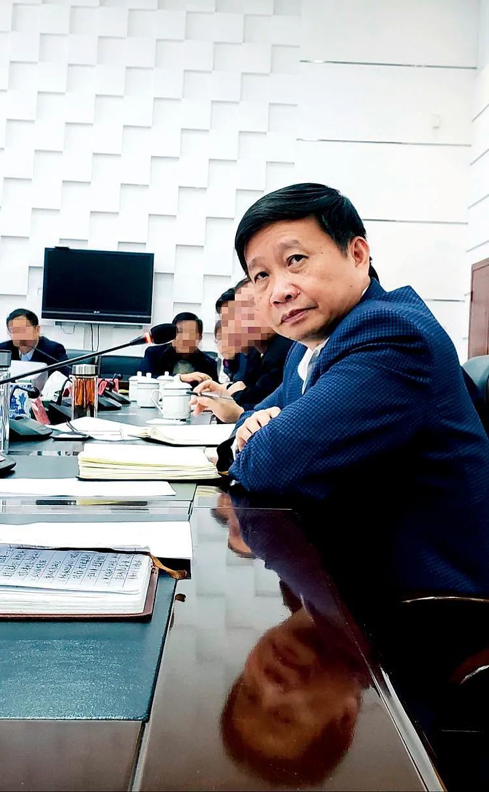
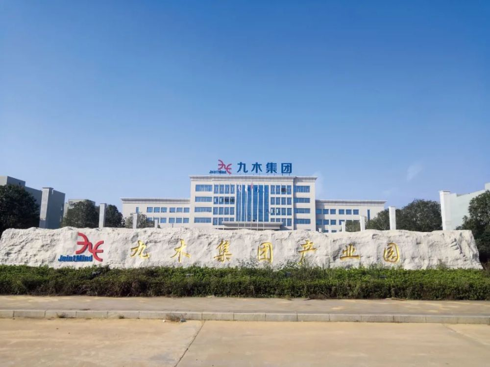

# 肖毅被控受贿1.25亿，曾与币圈老板交往密切，留下“挖矿”残局

12月29日，浙江省杭州市中级人民法院一审公开开庭审理了江西省政协原党组成员、副主席肖毅受贿、滥用职权一案。

杭州市人民检察院起诉指控：2008年至2021年，被告人肖毅先后利用担任江西省人民政府驻北京办事处主任、江西省抚州市委书记、江西省政协副主席等职务上的便利，为他人在工程承揽、项目开发、职务晋升等事项上提供帮助，非法收受财物共计折合人民币1.25亿余元；2017年至2021年，肖毅在担任抚州市委书记期间，违反国家规定，违背新发展理念，为从事虚拟货币计算生产业务的企业，在财政补贴、资金支持、电力保障等方面违规提供帮助，致使公共财产遭受重大损失，造成恶劣影响。

肖毅进行了最后陈述，并当庭表示认罪悔罪。最后法庭宣布休庭，择期宣判。

肖毅现年60岁，江西赣州人。2015年4月，他任抚州市委书记，2018年1月，任江西省政协副主席，继续兼任抚州市委书记，直到2021年3月卸任该职务。2021年5月，肖毅被查，同年11月被双开。通报中提到其“滥用职权引进和支持企业从事不符合国家产业政策要求的虚拟货币‘挖矿’活动”。据悉，这种表述是首次出现在被查官员的公开通报中。

《中国新闻周刊》从多个信息源证实，肖毅双开通报中提到的“挖矿”企业指向抚州市创世纪科技有限公司（简称“抚州创世纪”）。在肖毅被双开当月，本刊记者前往抚州采访调查，并进入抚州创世纪暗访，接触到了多名抚州创世纪及九木集团（抚州创世纪隶属于九木集团）内部高管，并采访到当地多名与肖毅打过交道的政商人士，对肖毅主政抚州期间，与币圈老板的“挖矿”故事等做了披露。以下为《中国新闻周刊》2021年11月对肖毅案的报道。

**“数字书记”落马留下的“挖矿”残局**

**本刊记者/周群峰**

**发于2021.11.29总第1022期《中国新闻周刊》**

被查约半年后，江西省政协原副主席肖毅被双开。

11月13日，中央纪委国家监委发出的这份双开通报措辞严厉，其中称肖毅违背新发展理念，滥用职权引进和支持企业从事不符合国家产业政策要求的虚拟货币“挖矿”活动；不重视家风建设，寡廉鲜耻、道德败坏。不当“挖矿”行为，也是首次出现在被查官员的公开通报中。

肖毅现年59岁，曾任江西省抚州市委书记6年之久，期间他大力推行数字经济，力图将其打造成为抚州的核心竞争力。他重点引进的抚州市创世纪科技有限公司（下称“抚州创世纪”），
号称要打造亚洲最大的单体数据中心，是抚州数字经济的龙头和名片。随着肖毅被查，该公司披着“数字经济”的外衣，从事虚拟货币“挖矿”的面目，也开始逐渐暴露。

《中国新闻周刊》近日调查了解到，在肖毅被查的同月，32岁的福建莆田老板、抚州创世纪的实控人林庆星也被留置，至今未归。目前，公司数亿元资金被冻结，相关项目停工。抚州市高新区管委会也已派出工作组进驻公司，与此同时，多家供应商也因资金问题走上了法律程序。

肖毅主政抚州期间，因何大力发展数字经济？在他的站台下，币圈老板“挖矿”的背后有怎样的故事？后续问题又会如何解决？

**饱受争议的“数字书记”**

1962年5月，肖毅出生于江西省赣州市。19岁时，从赣南师专中文科汉语言文学专业毕业后，他进入崇义县崇义中学任教，之后，担任过崇义县公安局干部、政府办副主任、瑞金市委书记、江西省政府驻京办主任等职务，2015年4月，出任抚州市委书记。2018年1月，他升任江西省政协副主席，成为一名副部级官员，同时兼任抚州市委书记。

瑞金是肖毅仕途中重要一站，从1996年6月~2006年11月，他在该市主政10年有余，其中历任代市长、市长、市委书记。据《廉政瞭望》报道，肖毅主政瑞金时，搞了一次领导干部家属“廉内助”评选，最后肖毅的夫人在瑞金得票第一。此事被不少人嘲笑，认为戏演得有点过。

2021年3月21日，抚州市委召开全市领导干部会议，宣布江西省委决定：肖毅不再担任抚州市委书记。

_（资料图片）肖毅。_

5月10日，即卸任抚州市委书记50天后，他在江西省政协副主席任上被查。他也成为今年江西省首位落马的省部级高官，也是十九大后，继江西省原副省长李贻煌、江西省人大常委会原副主任史文清后，该省被查的“第三虎”。

推广戏曲文化、力推BRT（快速公交系统）、大搞数字经济，是肖毅主政抚州的“三大标签”，但多项措施争议颇大。

抚州被誉为“才子之乡”，曾孕育出王安石、汤显祖、曾巩等文化名人。多位抚州文化圈人士称，肖毅为推广抚州本地戏曲文化作出了积极的贡献。与好评如潮的推广戏曲文化相比，肖毅在市区内罔顾民意，强行开通BRT的线路则争议颇大。《抚州日报》报道称，2019年3月21日，抚州市BRT线路正式通车，134辆新能源纯电动空调公交车在9条BRT公交线路上运营。

抚州市多位市民称，BRT公交线路是肖毅的政绩工程和面子工程，并不合适抚州这样的小城市，其专用通道导致本就不宽敞的道路，变得更加拥堵，还导致两侧车辆无法停车掉头，影响了店铺的生意。

肖毅在抚州留下的最具代表性标签是，他在主政抚州第一年时，就开始力推的“数字经济”。《江西日报》报道称，早在2015年，抚州市就瞄准数字产业“蓝海”，抢占数字经济新风口。2020年第一季度，数字经济对全市GDP增长贡献率达13.4％，拉高GDP增长1.3个百分点。

抚州是一个不沿边不靠海的内陆城市，传统工业基础也不突出，为何要大力发展数字经济？在新华社的一篇报道中，肖毅认为，数字经济对地域要求并不高，谁能提供产业发展最基础的算力，谁就能获得企业青睐。2020年4月16日，在抚州市召开的相关会议上，他强调，要推动数字经济成为抚州的核心竞争力，要时刻铭记“谁赢得数字经济，谁就赢得未来”的理念。

2020年8月25日，抚州市印发文件提出：到2022年，力争全市数字经济主营业务收入年均增速40％以上，达到2000亿元以上，将抚州建成全国区域性数据中心、全国区域性算力中心、全国重要的数字装备制造基地、全国数字经济示范基地。

然而，随着肖毅的被查，其力推数字经济背后的“挖矿”故事也浮出水面。

**“我们老板跟肖毅关系好是属实的”**

肖毅双开通报中提到的“挖矿”企业指向的是抚州创世纪。工商信息显示，抚州创世纪位于抚州市高新区，成立于2017年6月23日，与抚州高新区政府签约进驻森鸿科技产业园。注册资本1000万元，法定代表人为许志杰和林芳，二人分别持股95％和5％。该公司号称要打造亚洲最大的单体数据中心。

但福建莆田籍商人林庆星，才是抚州创世纪的实际控制人。2017年12月14日，抚州发布发文称，2017年6月与福建客商林庆星在抚州高新区投资40亿元人民币建设创世纪科技有限公司超级计算机运算服务中心，目前已完成两栋数据中心24000台服务器的安装并投入运营。

这位被抚州市奉为座上宾的林庆星究竟是何人？2019年4月29日，抚州工会在官网发布《江西省五一劳动奖章获得者——林庆星》一文称，林庆星出生于1989年，研究生学历，在分布式信息服务与集成技术、网格关键技术等方面取得了创新性成果。

林庆星的“数字经济”版图横跨闽赣两省。2017年11月，莆田创世纪科技有限公司成立，注册资金为10亿，林庆星占股95％。《湄洲日报》（莆田市委机关报）曾报道称，莆田创世纪超算数据中心项目占地约171亩，计划投放48万台超级计算服务器，总投资约200亿~260亿元人民币。同时，林庆星也是江西九木科技（集团）有限公司（成立于2021年4月8日，以下简称“九木集团”）的法定代表人，而抚州创世纪隶属于九木集团。九木集团官网称其主营业务包括：研究、开发、生产服务器及数据中心周边设备，投资建设数据中心基础设施等。

_莆田老板林庆星掌控的九木集团，现在公司数亿元资金被冻结。摄影/本刊记者
周群峰_

一名与林庆星有过生意往来的企业家告诉《中国新闻周刊》，林庆星性格有些奇特，经常白天休息，晚上工作，甚至凌晨两三点还要找人开会或谈生意。“5月20日左右，林庆星在九木木集团会议室被带走，至今未被放出。”

在肖毅主政期间，抚州创世纪是其重点引进的企业。据报道，2017年，抚州创世纪负责人考察选址之初，向抚州有关部门提出了两个落户条件：一是一次性提供15万平方米以上的标准厂房；二是一个月之内搭设好20万伏的双回路用电。该报道称，收到消息后，抚州市马上召集高新区、电力等部门负责人商议。时任抚州市市长张鸿星说：“经过认真评估，第二天一早就答应了企业条件，加班加点只用了28天就搭设好电力设备。”

九木集团一位负责人徐涛（化名）告诉《中国新闻周刊》：“我们老板（林庆星）是人大代表，官场上也有触角，跟肖毅关系比较好是属实的。企业家要想发展，必须跟政府领导一条心，顺着他们的战略走。”

不过，跟官员“走得很近”的林庆星也很快被带走调查。10月13日，抚州市人大常委会发布公告称，林庆星因涉嫌严重违法犯罪，请求辞去市四届人大代表职务，同日其代表资格依法终止。

多家币圈自媒体称，肖毅疑似收受抚州创世纪贿赂超过8000枚比特币。按照市值计算，超过22亿元人民币，而林庆星的全部身家已超过600亿元。徐涛否认了这些说法，称这些都是谣言，编造得非常离谱。“我们准备让律师查一下，追究造谣者责任。”

不过，为了推广数字经济，肖毅扮演起“媒人”角色，亲自出面促进抚州创世纪与国外企业的合作，却是事实。抚州发布曾发布消息称，2017年12月9日至12月11日，肖毅率代表团访问了德国，与慕尼黑GM基金会、弗莱堡经济促进署、法兰克福TB国际公司进行了公务会谈。会谈结束后，抚州高新区与GM基金会、抚州创世纪公司就建设超算产业中心项目签署了三方框架协议书。约定项目分二期建设，总投资不低于16.9亿美元，首期完成三栋机房的建设，安装4.5万台服务器并投入运营；二期建成总建筑面积30万平方米，安装50万台服务器的超算产业中心并投入运营。

公开报道显示，GM公司（Genesis Mining
Limited）号称“世界上最大的区块链技术企业之一”。GM公司在全球投资多个“矿场”，提供具有不同规模的加密货币挖矿能力，支持10种以上可挖矿的加密货币和6种主要的挖矿算法。

不过，抚州创世纪与GM公司的合作并不愉快。投资没多久，二者的纠纷不断加剧，不得不对簿公堂，该案经过一审、二审，一路打到了最高人民法院。

**设备纷争**

企查查显示， 2019年，GM公司以“返还原物纠纷”为案由向抚州市中级人民法院起诉抚州创世纪公司，要求对方返还5.75万台A2主机
（每台主机均包括八片显卡）及60580台S9蚂蚁矿机。

2021年6月23日，最高人民法院出具的民事裁定书（2021最高法民申3002号）显示，该案所涉抚州数据中心的建立以及设备的保管运营，实际是利用设备进行高性能计算以获得虚拟货币奖励的行为，系国家不予鼓励的高耗能产业，原审判令解除合同，双方法律关系终止，亦符合目前国家对案涉产业的调整方向。

至此，抚州创世纪以“数字经济”为名，从事虚拟货币“挖矿”传言被证实。

肖毅主政抚州期间，类似的企业并非抚州创世纪一家。星际联盟星驰（上海）网络科技有限公司是一家FIL币（一种虚拟货币，中文名为“文件币”）矿商。今年4月，星际联盟曾发文宣称，江西抚州高新区与其合作建立的星驰大数据产业园在筹建中，总投资85亿元，占地150亩地，在2020年12月获江西抚州高新区产业基金近亿投资。这家企业今年也被取缔，11月6日，江苏省徐州公安局发文称，徐州市丰县公安局先后在上海、武汉、深圳等地抓获星际联盟网络传销犯罪团伙成员31人，查获以太坊、泰达币、FIL币等虚拟币价值人民币约4亿元。

实际上，抚州创世纪和GM合作，“高举高打”建设超算中心之时，监管部门已经对虚拟数字货币亮起红灯。2017年，“虚火”过旺的比特币市场引发监管部门出手，当年9月4日中国人民银行等七部委发布了《关于防范代币发行融资风险的公告》，要求中国境内融资代币和虚拟货币的交易作出全面清理整顿工作。

此后，监管层层收紧，并延伸到数字货币的上游——挖矿。今年9月，国家发展改革委等11部门印发《关于整治虚拟货币“挖矿”活动的通知》，明确加强虚拟货币“挖矿”活动上下游全产业链监管，严禁新增虚拟货币“挖矿”项目，加快存量项目有序退出。

随着政策逐步收紧，虚拟货币挖矿和交易都被禁止，抚州创世纪和GM的矛盾也浮出水面。抚州市中级人民法院2019年的一份民事裁定书显示，由GM基金会100％持股的抚州市威瑞迪安科技有限公司，向法院申请诉前财产保全，称抚州创世纪“私自侵占申请人享有的托管设备算力”，要求其返还托管设备后，被抚州创世纪拒绝，甚至不顾阻拦擅自变卖GM托管在其场地的设备。也就是说，GM基金会指控抚州创世纪未能履行义务并恶意侵吞设备拒绝归还。

_九木集团内部的超级计算中心机房。摄影/本刊记者
周群峰_

江西省高院的终审裁定后，抚州创世纪公司不服判决，申请最高法再审，其主要理由是，“停止提供数据的行为系由于GM公司一方拖欠电费等运行费用”，并称“由于GM公司一方欠付电费等运行费用，抚州创世纪公司对案涉标的物享有留置权”。

针对“林庆星将GM公司的机器“白嫖”了近3年，依然不肯归还，GM公司走了大使馆的路子才扭转”的业内传言，徐涛对《中国新闻周刊》称，抚州创世纪跟GM公司的合作都是有合同的，产生合同有纠纷也正常，不存在白嫖三年多说法，更没有惊动大使馆。“GM公司是跨国公司，这个行业在国外很久了，在我国还是新兴产业，他们有那么傻吗？”

对于双方纠纷，最高法的裁定书认为，本案争议的焦点问题为：抚州创世纪应否返还涉案设备。GM公司作为合同委托方，享有法定任意解除权，GM公司有权主张返还设备，涉案设备现仍处于运行使用状态，具备返还条件。

关于抚州创世纪是否已按照最高法的裁定返还设备，徐涛告诉《中国新闻周刊》，跟德国公司的纠纷，后面应该也是按照折旧价格解决。“服务器更新换代很快，一般一年按折旧30％，用3年基本就接近报废”。

**后续问题复杂待解**

随着肖毅落马，林庆星被带走调查，抚州高新技术产业园区也深陷泥潭。

徐涛告诉《中国新闻周刊》，肖毅出事后，高新区管委会的一些领导也去自首了。江西省纪委监委发布消息称，2021年7月24日
抚州高新技术产业开发区党工委委员、管委会副主任骆顺泉主动投案。资料显示，2013年4月，骆顺泉出任抚州高新技术产业园区（现抚州高新技术产业开发区）党工委委员、管委会副主任，直至此次被查。

“我们的很多项目也都停了，老板被留置后，我们在莆田的公司也停了。”徐涛称，
三期项目的主体就投资了几个亿，共有9栋楼（8栋机房、1栋主楼），2020年有一栋机房楼已投入使用，现在三期项目已经停工。

近日，《中国新闻周刊》记者从九木集团办公楼张贴的宣传板上看到：九木集团一、二期超级计算机运营服务中心项目，于2018年7月全面投入运营，总投资额100亿元。2019年5月，九木集团数据中心三期项目正式开工建设。三期项目是抚州市重点打造的高新技术企业基地，占地面积约198亩，可容纳25万台功率为3kw的服务器。项目建成后将成为亚洲单体最大的数据中心。

伴随着三期项目的停工，多家为该项目建设提供水泵、冷却塔、风机等设备的供应商也出现了资金纠纷。广东省一家机电设备公司的业务主管告诉《中国新闻周刊》，公司2021年年初与抚州创世纪签订合同，成为其冷却设备供应商。后来，九木集团三期项目被叫停后，原来签订的合同没法继续履行。“抚州创世纪至今拖欠公司设备及安装款项，高达几千万元。目前，公司正在走法律程序维权。”另有供应商称，直到抚州创世纪出事后，“我们才知道该公司在做挖矿的事情”。

目前，九木集团的数亿元资金已被相关部门冻结。徐涛称，抚州市高新区先把账目冻结，可能是在查是否存在偷税漏税问题。“具体我们也不知道为什么冻结。”《中国新闻周刊》在九木集团看到，此前被政府相关部门查封的多辆豪车仍停在九木集团内，但已不见封条。徐涛称，对于一些供货商的欠款，九木集团也正在积极协商，计划通过变卖资产等方式偿还。“包括一些豪车被查封后又解封，也是为了变卖。”

肖毅与林庆星相继出事后，九木集团员工也多被公司遣散。徐涛称，最多的时候公司员工超过2000人，现在只有八九十人。九木集团研发部一位工作人员告诉《中国新闻周刊》，现在公司每个部门都还有人在，10月份公司很多员工都被遣返，他也离职了，最近又被公司返聘过来。“原来研发部有十多个人，现在只有两三个人了。”

关于公司目前的现状，徐涛称，目前公司的一些相关储存业务等还在继续进行。抚州市高新区一位政法系统内部人士告诉记者，原来只知道很多领导非常重视九木集团，但这些领导中，很多人也可能不清楚这家企业在做挖矿的事情。“目前高新区税务等部门组成工作组，进入九木集团处理后续问题了”。

抚州市委一位官员告诉《中国新闻周刊》，肖毅和九木集团的案情还不明朗，抚州很多相关部门也在等下一步处理动向。他认为，数字经济是个风口，不仅仅是抚州在做，许多城市也都在做，而且做得不错。“数字经济本身没问题，我们只是没想到有的企业，打着数字经济的旗号在挖矿。肖毅被查也不至于完全影响抚州的数字产业”。

记者：周群峰

