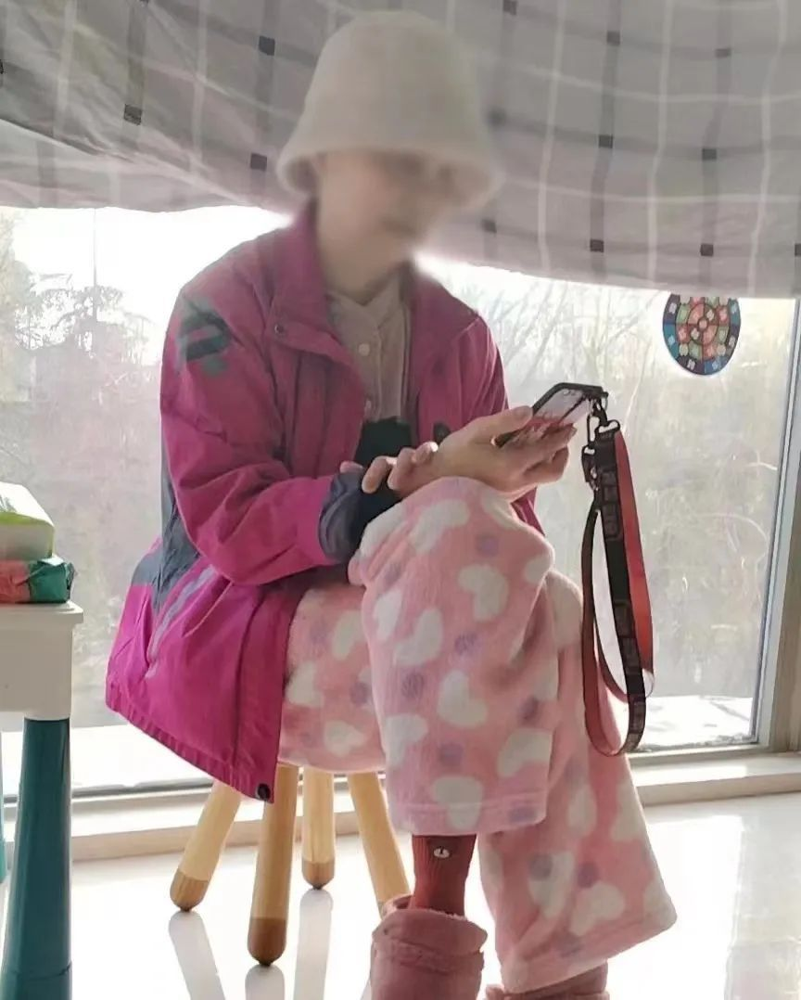
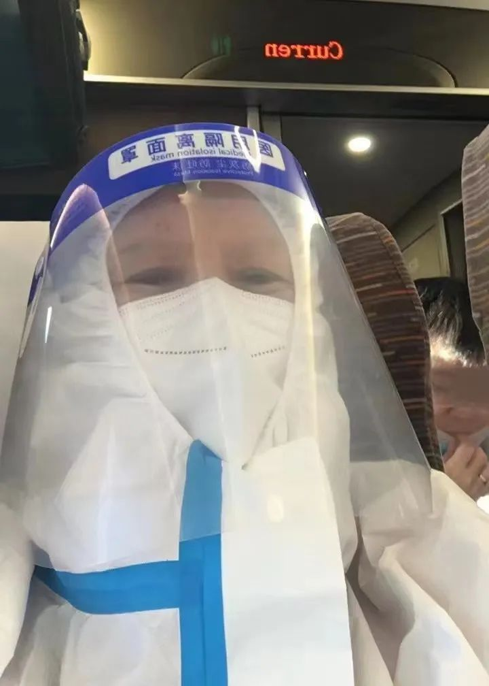
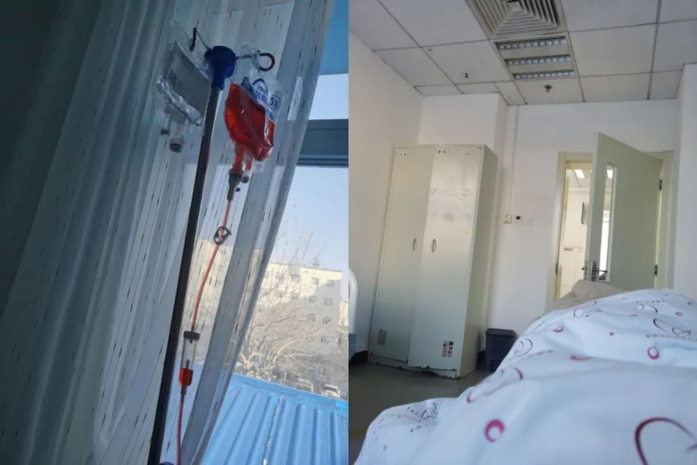

# 肿瘤患者的“新冠之战”：因为未知，所以焦虑

**疾病像一场战役，赵晨阳全家上下最担忧的就是感染新冠，“千万不能阳，特别还是肺癌，要是转成肺炎那不就完蛋了吗？”身为医生的姑姑也叮嘱赵晨阳，要仔细照顾母亲，“不能发烧”。**

_12月13日，赵晨阳的母亲退烧后，在家晒太阳。受访者供图_

**文丨新京报记者** **李聪**

**编辑丨陈晓舒‍‍‍**

**校对丨刘军‍‍‍‍‍‍‍**

**►** **本文7605** **字** **阅读13** **分钟**

乳腺癌患者王可可在化疗后的第二天，“阳了”。

在此之前，她对感染新冠充满不安：肿瘤患者是否更容易感染新冠？化疗期间发烧了怎么办？去医院检查感染了怎么办？哪家医院收治阳性肿瘤病人？疫苗到底要不要接种？

赵晨阳的母亲，为了定期完成肺癌晚期的化疗，“每次去医院心里都很忐忑”，又不得不经常去医院。在12月份，赵晨阳母亲也“阳了”。

这些肿瘤患者属于免疫力低下的脆弱人群。由中国抗癌协会肿瘤支持治疗专业委员会发布的《新型冠状病毒肺炎疫情期间实体肿瘤患者防护和诊治管理相关问题中国专家共识（2022版）》明确指出，实体恶性肿瘤患者新冠病毒感染风险、感染后的重症率及死亡率均高于正常人群。

感染新冠后的高烧及可能的并发症、医疗资源紧张无法按时治疗等，令肿瘤患者及家属面临着生理和心理的多重压力。

如何保证这些脆弱人群，12月17日，在2022年中美临床微生物学与感染病学高端论坛上，国家传染病医学中心、复旦大学附属华山医院感染科主任张文宏教授表示，对于脆弱人群，首先，一旦感染如有症状要给予充分的药物治疗；第二，建议他们充分地接种疫苗；第三，在大流行期间对他们形成一个反向的保护，避免病毒进入他们生活的空间。

**因为未知，所以焦虑**

今年9月初，45岁的王可可刚刚完成乳腺癌手术，开始进行为期8个疗程的化疗。她的指甲和皮肤在化疗药物的刺激下慢慢发黑，头发也不停地掉，口腔溃疡也时常发生。王可可知道自己的免疫力低于常人，可能更容易感染。因此，她尤其注意防护。

但在第四个疗程的化疗后第二天，王可可还是“阳了”，她把自己新冠阳性的经历记录在社交媒体上：

12月8日，化疗后的第二天，喉咙干痒、打喷嚏、流鼻涕，不发烧，有些头晕犯困，“大概率中招了”。

12月9日，抗原检测显示阳性，持续低烧，体温徘徊在37.4～38.4℃。这天喝了大约4L水，跟主治医生沟通后，喝了一袋感冒灵冲剂，又睡了一天。

12月10日，退烧了，稍微流鼻涕。喉咙能咳出黄色黏稠的痰。身上依旧没有力气，没食欲，没有再吃退烧药，继续多喝水。

12月11日，基本不难受了，除了没食欲，其他状态都恢复了。没有食欲可能是之前化疗结束后的正常反应。

12月7日，优化落实新冠肺炎疫情防控“新十条”出台，王可可算是“放开”之后最早发声的阳性肿瘤患者之一。在评论里，出现最多的声音是“看到问题不严重，也就放心了”。这是王可可最初没有想到的，好多人说从担心变成释然。

“因为未知，所以焦虑”。在王可可看来，虽然知道老年人、慢性基础性疾病患者、没有接种疫苗的人，是感染新冠病毒后可能引发重症的脆弱人群，但感染后身体会有哪些变化，日常可以做哪些监测，在过去三年，她都没有看到很明确的解释。过去，她总是非常担心自己阳了，去医院也是提心吊胆的。

_12月7日，王可可在大兴人民医院的日间病房。受访者供图_

同样的焦虑，也出现在作为患者家属的赵晨阳身上。

赵晨阳的母亲今年60岁，是一位肺癌晚期患者，经常会喘不上气儿。四年前确诊肺癌后，一直在持续治疗。2019年1月4日，赵晨阳的母亲完成了手术，摘除了一个肺，术后半年吃靶向药，再半年后开始化疗。

11月底，赵晨阳回湖南老家陪上幼儿园的儿子，预期是等母亲做完这个疗程最后一次化疗，也回老家，全家人一起在老家过年。

进入12月以来，母亲几乎没出门。起初，没有人觉得母亲“阳了”。12月11日，赵晨阳母亲出现了憋气的状况，这也是肺癌的常见症状，赵晨阳早就为家里购买了制氧机。头晕睡不着觉也是这一天出现的，以往睡不着觉，母亲会服用安眠药。最近药吃完了，也不敢去医院买。

12月12日，赵晨阳接到母亲的视频电话，说自己很不舒服，她猜母亲一定忍了几天了。在她询问后才知道，大概是从12月8日开始，母亲咳嗽开始加重。而咳嗽、说话嘶哑本身就是肺癌的常见症状，她们一开始并没引起重视。

也是在12日上午，医生通知有床位可以进行化疗了，但赵晨阳的母亲说自己出现了头晕头痛的症状，咨询是否需要延期治疗，医生判断这可能是新冠阳性了。这时候，赵晨阳母亲才反应过来，之前的不舒服可能是新冠阳性导致。

抗原检测显示两道杠。赵晨阳心急如焚，但相隔千里无计可施。“当时母亲的情况还没有糟糕到必须住院，家里也能吸氧。按照网上给的意见，如果你病得不重的话，你就不要去医院排队，在家里面待着就可以了。”

但她又担心作为癌症病人，如果血氧饱和度继续下跌，该怎么办，赵晨阳做好了“最坏情况的应急预案”——她确定了离家最近的发热门诊，又找了新冠康复的朋友帮忙，拜托他只要母亲情况恶化需要送医院，请他立刻帮忙把母亲和制氧机搬到车上。

**更加脆弱的群体**

在生病之前，王可可在一家影视公司负责IP运营，她觉得自己疫情三年来都处于工作焦虑的状态。2020年春节档前夕，王可可负责的一部电影在上映前一天宣布延期，紧接着她需要迅速解决预售退票、广告客户延期等一系列问题。

不确定的市场环境带来的直接后果就是工作时间紧张、工作要求高。由于突如其来的疫情，全国影院被迫“停摆”，压力也传递到王可可和她所在公司，于是他们转型开始做电商，“天天要去救火”。

今年8月，王可可在洗澡时无意间摸到乳房上有一个小疙瘩，不放心的她去医院做了检查，医生当即告诉她那是“不好的东西”。现在回忆起来，今年5月确诊的带状疱疹是在提醒她，该休息了。

王可可花了很长时间接受这个事实，她想不通，“为什么是我”。

世界卫生组织国际癌症研究机构（IARC）最新发布的全球癌症负担数据报告显示，2020年，中国新发恶性肿瘤患者457万例。数量庞大的肿瘤患者，是新冠中的高风险人群。

由中国抗癌协会肿瘤支持治疗专业委员会发布的《新型冠状病毒肺炎疫情期间实体肿瘤患者防护和诊治管理相关问题中国专家共识（2022版）》明确指出，实体恶性肿瘤患者新冠病毒感染风险、感染后的重症率及死亡率均高于正常人群。

疫情三年，除了定期来北京做治疗，赵晨阳的母亲都待在老家湖南岳阳，那里几乎没有疫情。而在北京，赵晨阳的母亲多数也待在家里，“我们把她保护得很好”。

2019年初，赵晨阳母亲确诊肺癌晚期，并且癌细胞已经转移到了其他脏器组织。家中也曾有亲戚得过肺癌并治愈，母亲并不觉得肺癌可怕，但“她认为转移了就没救了”。

_随着对恶性肿瘤认知度的逐渐提高，人们不再“谈癌色变”。图/IC
photo_

赵晨阳费尽心思瞒着母亲，还把诊断报告中“转移”的信息遮挡住了。直到母亲去保险公司做理赔，需要诊断证明，她才知道自己真实的病情。但那时候她已经开始靶向治疗，也就慢慢接受了生病的事实。

今年5月，北京暴发了一轮严重的社会面疫情。由于担心路途上的感染，赵晨阳的母亲在老家做了一个周期的化疗，各项检查指标均显示恶化，其他部分器官有不同程度的癌细胞转移，“老家的医生说可能没有更好的药治了”。

她马上接母亲到北京，换了一种新药，尽管药物的攻击性很强，但化疗后的指标显示这种新药是有效的，母女俩再次燃起了希望。

疾病像一场战役，赵晨阳全家上下最担忧的就是感染新冠，“千万不能阳，特别还是肺癌，要是转成肺炎那不就完蛋了吗？”身为医生的姑姑也叮嘱赵晨阳，要仔细照顾母亲，“不能发烧”。

酒精、消毒液，在家里囤得满满当当。赵晨阳很早就在网上购买了抗原，12月初，发烧类药物放开管控，她也紧急购买了发烧退热的药物。

赵晨阳知道母亲是一个心情很容易起伏的人，“隔几个月要交代一次遗嘱”。她发现母亲不知道自己得了新冠时，并不是很慌，知道了以后，开始紧张了起来。

赵晨阳很坚定地跟母亲说“你不要慌”，要是有问题，马上就安排人接你上医院。

保姆“半夜每隔一段时间就进去看看”。有一天晚上，保姆发现赵晨阳的母亲忽然就不咳嗽了，“吓坏了，就偷偷溜进去看，发现还在喘气”，这才放心。

所幸12月13日早上，保姆告诉赵晨阳，她母亲已经退烧了。

_12月23日，赵晨阳的母亲穿着全套防护服，坐高铁回湖南老家。受访者供图_

**“新十条后”**

每天做核酸、办理入院手续、抽血、查心电图、找医生开处方、注射化疗药物……作为一名乳腺癌患者，王可可每两周都要经历一次这样的流程。

12月5日本是王可可应该入院接受化疗的日子。但是当天早上7:20，当她拎着必备物品准备去医院时，收到医生的消息，“有阳性病例，医院封控了”。

这次化疗已经拖了一周。当天早上王可可打了北京数十家医院的电话，询问住院条件、是否能为肿瘤病人办理住院、是否有对应的化疗药物等。

而此时的北京正处于政策变化的过渡期，王可可所在的病友群里，也充满了疑问：医院是否还收治肿瘤化疗病人？阳性患者是否接收？需要核酸证明还是自测抗原即可？部分化疗期的病人每周需要做PICC护理（经外周插管的中心静脉导管，用于输注刺激性药物），哪里可以做？去的话会不会感染？

正确的、清晰的信息，对肿瘤患者来说也是珍贵的医疗资源。12月5日，王可可历经周折才找到一家医院的日间病房可以接收化疗患者，并且不需要核酸证明。她把这个信息分享在社交平台上，她建议一旦化疗的方案确定，平时去的医院没有床位，可以看看其他民营医院、二级医院等。之后，她收到了以同样的方式成功化疗的病友发来的感谢消息。

_12月7日，王可可在大兴人民医院的日间病房完成第四次化疗。受访者供图_

12月9日，国家卫健委在国务院联防联控机制新闻发布会上指示，所有的医疗机构都要接诊核酸阳性的患者，医疗机构不得以核酸阴性、阳性来区分来接诊，完全出于医疗的需要进行接诊。

政策下达后，不少医院开始收治阳性病人，但王可可看到群里的病友们并未因此松一口气，反而感到担忧——肿瘤病人本身免疫力就低下，更容易感染。但放化疗又有严格的周期，一旦因为自己阳性中断或延误治疗，或者医院不收治等，可能会影响治疗效果。

而在治疗以外，没有接种疫苗，让更脆弱的肿瘤患者，与普通人相比少了一层屏障。“到底打不打疫苗”成为放开后另一个肿瘤患者及家属普遍关心的问题。

深圳市第三人民医院院长、深圳市疫情防控公共卫生专家组组长卢洪洲在接受采访时提到，目前在癌症患者的新冠疫苗接种率方面还未有权威的数据公布，但可以推测的是要低于老年人的。较低的最重要原因是癌症患者对于疫苗接种的担心，其他原因可能还有在疫情早期对于癌症患者疫苗接种的宣传误导，以及在目前环境下医生主动推荐患者进行疫苗接种的动力不足。

2020年末的新冠疫苗接种初期，多地发布的疫苗接种禁忌和注意事项指引都不建议手术前后，正在进行化疗、放疗期间恶性肿瘤患者接种新冠疫苗。

赵晨阳的母亲并没有注射疫苗，因为处于化疗阶段，医生建议“不接种”。王可可则打完了前两针疫苗，在将要打第三针时开始准备手术。她更倾向于把目前的治疗做完以后，身体恢复了再去打，“可能效果会更好”。在王可可的理解中，疫苗是给免疫系统的刺激，在这个系统不行的时候，如何刺激都会有反应。

肿瘤患者们往往害怕疫苗对免疫系统的影响导致肿瘤发展，也担心因未接种疫苗而在感染后发展为重症。王宁的爷爷是名食道癌患者，今年74岁，王宁一直在纠结是否为爷爷注射疫苗，她在网上看到关于疫苗接种后出现的不良反应，更是不敢冒险。

2022年10月，由中国抗癌协会肿瘤支持治疗专业委员会发布的《新型冠状病毒肺炎疫情期间实体肿瘤患者防护和诊治管理相关问题中国专家共识（2022版）》也建议，实体恶性肿瘤患者新冠疫苗接种安全有效，在综合评价患者身体状态、免疫功能及病情后，应鼓励患者积极接种新冠疫苗，建议足量、足疗程、按照推荐剂量和剂次完成。

“癌症患者是新冠感染的高危人群，相比于普通人群，更应该优先接种疫苗。在能接种的情况下要尽快接种，并建议采取异源序贯方式进行加强针接种。”卢洪洲表示。

**将发现重症风险的关口往前推**

王可可和赵晨阳的母亲无疑是幸运的，但这并不代表脆弱人群都能依靠自身免疫力来抵御新冠病毒。

12月15日晚上快七点，在成都一家三甲医院的发热门诊，排号将近五个小时后，王宁和爷爷终于见到了医生。

_12月15日晚上七点，王宁带爷爷在成都一家三甲医院的发热门诊排队等待叫号。受访者供图_

爷爷有高血压、糖尿病、肝硬化等一系列基础病。今年2月份刚完成食道癌手术，从9月完成放疗后，正在接受一个月一次的免疫治疗。

当天下午，爷爷突然高烧39℃，一直咳嗽，但很难咳出痰，浑身没力气。王宁父母都已经新冠阳性，刚放寒假的她当即决定带着爷爷去医院。刚进医院时，王宁爷爷的状态还不错，血氧饱和度显示96%，还有精神跟她说话。

排到号后，医生为王宁爷爷安排了吸氧，输了葡萄糖、消炎药。而退烧针是在等了40分钟后才打上的，据说是临时从其他医院调来的药。医院人太多了，不同年龄段的人都有，王宁看到，当天的成人发热门诊中的3个医生，完成了四百多号人的诊断。

_12月15日晚上，王宁爷爷在留观室吸氧。受访者供图_

CT结果显示，王宁爷爷的肺部出现感染，片子上肺部有白色雾状阴影。

没有床位，12月16日到19日，王宁只能一直陪着爷爷住在医院留观室。这里可以吸氧，也有医生，王宁想着万一有什么紧急情况总比在家里好。

12月17日，王宁发现只要爷爷起床、上厕所，稍微动一下，血氧饱和度一下子就掉到70%，心率则上升到每分钟130、140次。医生说肺感染比较严重，输了头孢，还为他换面罩吸氧，血氧才勉强达到90%。

12月18日，医生下了病危通知书。12月19日，在医生的争取下，爷爷有了一张床位。但由于基础疾病太多，肺部合并了细菌感染，有一半的肺是几乎丧失了功能，王宁的爷爷转入ICU。

“脆弱人群应尽早在发病初期进行抗病毒药物治疗，并且准备指夹血氧仪进行重症监测，”12月21日晚，中日友好医院副院长、呼吸与危重症医学科主任、国家呼吸医学中心副主任曹彬曾介绍。他还提到，有的老人在严重低氧（甚至血氧饱和度低于70%）时仍没有明显的胸闷、呼吸困难，“这是非常危险的，需要立即吸氧。”

卢洪洲提到，老人、肿瘤患者以及孕妇或其他有基础病的重点人群，都有可能在感染后的第二、三个礼拜发展为重症，特别是有些年龄比较大，或者是肿瘤晚期的患者。这些重点人群确诊阳性以后，建议就不要等了，要第一时间有判断，尽可能入院治疗。

对于肿瘤患者，复旦大学附属肿瘤医院邱立新医生提示，出现以下任一症状时需要急诊就医：服用退烧药后仍发烧超过38.5℃，并持续超过2天；体温35℃及以下；抽搐；呼吸困难或气促；失语或不能行动；不能苏醒或不能保持清醒；胸部或腹部疼痛；头晕或意识混乱或精神状态明显转变；虚弱或脚步不稳；持续不能饮食，或腹泻/呕吐超过2天；原有基础疾病明显加重且无法控制。可直接拨打120急救电话，或者选择合适方式前往医疗机构救治。

12月22日，王宁的爷爷在ICU接受插管治疗，她一直在社交媒体上更新爷爷的状况，希望能为更多家中有基础病患者的网友提供一些经验。她提醒大家，有基础病的老年人感染新冠后，要随时监测血氧。其次是最好及时做CT，观察肺部感染情况。第三是几乎所有的医院床位都很紧张，做完检查后，如果指标异常，可以在留观室等待床位。第四，她建议退烧后也不能掉以轻心，继续随时观察。

警惕“沉默性缺氧”。复旦大学附属华山医院感染科主任、国家传染病医学中心主任张文宏在“呼吸界”直播间中提到，有的老年病人送医时为时已晚，是因为他们对缺氧反应迟钝，甚至完全感觉不到胸闷、呼吸困难等，这种现象可以称为“沉默性缺氧”。

一定要将发现重症风险的关口往前推。“如果缺氧短时间内不能得到纠正，病人很容易进展到危重症肺炎。”张文宏强调，他还建议居委会或企业可以给每个有老年人的家庭送一个脉搏血氧仪。

**如何保障脆弱病人就医？**

夜晚的留观室并不安静。王宁看到，20多张床位住得满满当当，每一个等待入院治疗的人，脸上都充满了疲惫，咳嗽声此起彼伏。

头两天，王宁要顾着给咳嗽到睡不着的爷爷喂水，每天只在陪护的椅子上眯了不到两个小时。睡不着的晚上，王宁会不断刷新社交媒体。在她分享的帖子下面，许许多多同样情况的网友都在互相分享经验、加油打气、祝福祈祷。即使等到床位，家属们也丝毫不敢放下心来。ICU门口挤着焦虑的人们，他们都在等着一个不确定的结果。

“现在全国的重症患者在逐渐地增加。”12月22日，国家卫生健康委医政司司长焦雅辉在接受采访时表示。

“99.5%的人可能不需要去医院。但是，我们的医疗体系必须保证0.5%的病人应该收治在医院。”在12月8日发布的《新冠居家康复手册》中，张文宏团队提到。

包括婴幼儿、孕妇、老年人、肿瘤患者等脆弱人群感染无疑是任何一座城市放开后应对感染高峰的难点。

12月18日，在上海市卫健委组织的新冠病毒感染医疗救治培训会上，张文宏曾认为，社区医疗机构是上级医院“护城河”，要实施分诊策略，及时救治危重症患者。

他提出，基层医院必须积极开展“就地救治”，基层医院应当具备提供基本的氧疗、小剂量激素、俯卧位通气治疗的能力，这将为新冠疫情分级诊疗打下好的基础，避免医疗资源挤兑，使得高级别医院能及时收治危重症病人，或者即使在上级医院被挤兑的情况下，病人也能回到基层医院解决问题。

有部分城市已经落地具体的措施。12月23日，山东省青岛市卫生健康委主任薄涛介绍，青岛已建立并完善分级分类诊疗体系，构筑了医疗救治三道防线。首先是社区诊疗点、发热诊室和医院发热门诊。轻症患者可在此诊治，社区医生判断为重症的患者会转至二级以上医疗机构开设的发热门诊。其次是二级以上医院普通病床，定点医院和三级医院分院（原亚定点医院）病床，并将原有方舱医院升级为三级医院的分院，共有11769张床位。第三道防线为重症病床。全市共有2309张重症床位，匹配1.2万名重症医护人员。另外全市26家互联网医院全部开设新冠咨询板块，可为市民提供远程免费咨询。

12月23日，北京市卫生健康委员会、北京市医疗保障局近日发布《关于进一步提升重症救治服务能力的通知》，在加强社区对居家隔离康复人员摸排的基础上，组织对老年人等高风险人群发放血氧夹，在家自测血氧，明确简明监测预警标准；并且鼓励各区在社区卫生服务机构为有需求的居民提供氧气灌装服务，方便居民居家氧疗。

“根据此前香港的经验和教训，内地最重要的是要做好分流分治，保障医疗系统。”香港呼吸系统专科医生梁子超此前在接受新京报采访时提到，香港的防疫方针调整是把疫情防线从社区退到了医疗系统，从严格的防止病毒传播转向尽可能减慢病毒的传播，为老年人及长期病患者争取接种疫苗的时间，加快防疫物资的供应，以及做好医疗系统的分流。

12月24日，王宁的爷爷出现器官衰竭。最后，全家人决定让爷爷没有痛苦地离开。

赵晨阳也不敢掉以轻心。尽管母亲第二天就退烧了，在家里泡泡脚晒晒太阳，但赵晨阳觉得“还不算是完全躲过这一劫，后续希望不会复烧”。12月23日，母亲穿着全套防护服，坐上了回湖南的高铁。

而王可可除了嗓子还有些干咳，其他基本已经恢复正常。12月16日下午，王可可去附近的医院做PICC护理，听到急诊大厅里四处响起的咳嗽声，她看到接诊医生的脖子上有刮痧过后的红痕，她自己也有。“因为嗓子不舒服时，掐一掐很舒服。”两人相视一笑，都是新冠痊愈的人了。

